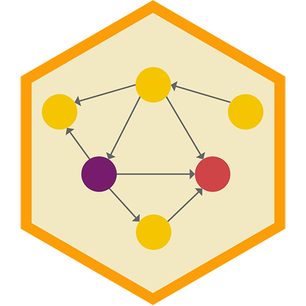

<!-- README.md is generated from README.Rmd. Please edit that file -->

```{r, include=FALSE}
knitr::opts_chunk$set(
  collapse = TRUE,
  comment = "#>"
)

withr::with_dir(here::here(), {
  targets::tar_load(workflow_graph)
})
```

# Program Evaluation for Public Service <a href='https://evalf22.classes.andrewheiss.com/'></a>

[PMAP 8521 • Fall 2022](https://evalf22.classes.andrewheiss.com/)  
[Andrew Heiss](https://www.andrewheiss.com/) • Andrew Young School of Policy Studies • Georgia State University

---

**[Quarto](https://quarto.org/) + [{targets}](https://docs.ropensci.org/targets/) + [{renv}](https://rstudio.github.io/renv/) + [{xaringan}](https://github.com/yihui/xaringan) = magic! `r emoji::emoji("magic")`**

---

## How to build the site

1. Install [RStudio](https://www.rstudio.com/products/rstudio/download/#download) version 2022.07.1 or later since it has a [Quarto](https://quarto.org/) installation embedded in it. Otherwise, download and install [Quarto](https://quarto.org/) separately.
2. Open `evalf22.Rproj` to open an [RStudio Project](https://r4ds.had.co.nz/workflow-projects.html).
3. If it's not installed already, R *should* try to install the [{renv} package](https://rstudio.github.io/renv/) when you open the RStudio Project for the first time. If you don't see a message about package installation, install it yourself by running `install.packages("renv")` in the R console.
4. Run `renv::restore()` in the R console to install all the required packages for this project.
5. Run `targets::tar_make()` in the R console to build everything.
6. `r emoji::emoji("tada")` All done! `r emoji::emoji("tada")` The complete website will be in a folder named `_site/`.


## {targets} pipeline

I use the [{targets} package](https://docs.ropensci.org/targets/) to build this site and all its supporting files. The complete pipeline is defined in [`_targets.R`](_targets.R) and can be run in the R console with:

```{r eval=FALSE}
targets::tar_make()
```

The pipeline does several major tasks:

- **Create supporting data files**: The problem sets and examples I use throughout the course use many different datasets that come prepackaged in R packages, I downloaded from sources online, or that I generated myself. To make sure I and my students are using the latest, most correct datasets, the functions in [`R/tar_data.R`](R/tar_data.R) save and/or generate these datasets prior to building the website.

- **Compress project folders**: To make it easier to distribute problem sets and in-class activities to students, I compress all the folders in the [`/projects/`](/projects/) folder so that students can download and unzip a self-contained RStudio Project as a `.zip` file. These targets are [dynamically generated](https://books.ropensci.org/targets/dynamic.html) so that any new folder that is added to `/projects/` will automatically be zipped up when running the pipeline.

- **Render xaringan slides to HTML and PDF**: Quarto supports HTML-based slideshows through [reveal.js](https://quarto.org/docs/presentations/revealjs/). However, I created all my slides using [{xaringan}](https://github.com/yihui/xaringan), which is based on [remark.js](https://remarkjs.com/) and doesn't work with Quarto. Since (1) I recorded all the class videos using my {xaringan} slides with a fancy template I made, and (2) I don't want to recreate my fancy template in reveal.js yet, I want to keep using {xaringan}. 
  
  The pipeline [dynamically generates targets](https://books.ropensci.org/targets/dynamic.html) for all the `.Rmd` files in [`/slides/`](/slides/) and renders them using R Markdown rather than Quarto.
  
  The pipeline then uses [{renderthis}](https://jhelvy.github.io/renderthis/) to convert each set of HTML slides into PDFs.

- **Build Quarto website**: This project is a [Quarto website](https://quarto.org/docs/websites/), which compiles and stitches together all the `.qmd` files in this project based on the settings in [`_quarto.yml`](_quarto.yml). See the [Quarto website documentation](https://quarto.org/docs/websites/) for more details.

- **Upload resulting `_site/` folder to my remote server**: Quarto places the compiled website in a folder named `/_site/`. The pipeline uses `rsync` to upload this folder to my personal remote server. This target will only run if the `UPLOAD_WEBSITES` environment variable is set to `TRUE`, and it will only work if you have an SSH key set up on my personal server, which only I do.


The complete pipeline looks like this:

<small>(This uses [`mermaid.js` syntax](https://mermaid-js.github.io/mermaid/) and should display as a graph on GitHub. You can also view it by pasting the code into <https://mermaid.live>.)</small>

```{r echo=FALSE, results="asis"}
# Make sure there are newlines between the code block boundaries and the output
# from `workflow`, which also needs to be separated by newlines
cat("``` mermaid\n")
cat(workflow_graph, sep = "\n")
cat("\n```")
```


## Licenses

**Text and figures:** All prose and images are licensed under Creative Commons ([CC-BY-NC 4.0](https://creativecommons.org/licenses/by-nc/4.0/))

**Code:** All code is licensed under the [MIT License](LICENSE.md).
