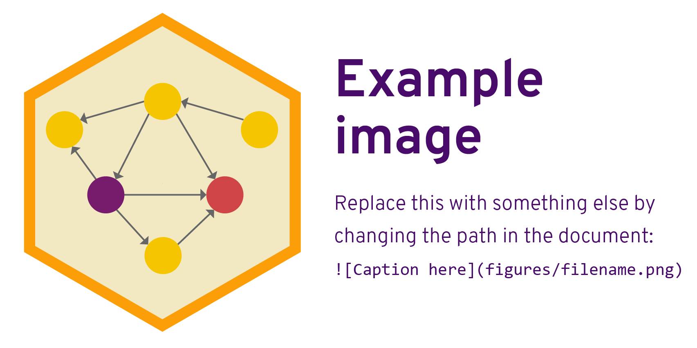

# 1: Program background and purpose

*(≈350 words)*
 
Provide in-depth background about the program. Include details about (1) when it was started, (2) why it was started, (3) what it was designed to address in society. If the program hasn’t started yet, explain why it’s under consideration. Make sure you cite your sources appropriately! (In the past, some students have just copied/pasted text from a program's website; don't do that! Describe and analyze the program's background!)

# 2: Program theory

*(≈400 words)*

Explain and explore the program’s underlying theory. Sometimes programs will explain why they exist in a mission statement, but often they don’t and you have to infer the theory from what the program looks like when implemented. What did the program designers plan on occurring? Was this theory based on existing research? If so, cite it.

Include a simple impact theory graph showing the program’s basic activities and outcomes. Recall from class and your reading that this is focused primarily on the theory and mechanisms, not on the implementation of the program.

# 3: Logic model

List every possible input, activity, output, and outcome for the program and provide a brief 1–2 sentence description of each.

## Inputs

- Something
- Something else

## Activities

- Something
- Something else

## Outputs

- Something
- Something else

## Outcomes

- Something
- Something else

## Diagram

Use flowchart software to connect the inputs, activities, outputs, and outcomes and create a complete logic model. Remember that inputs will always feed into activities, and that activities always produce outputs (that's the whole purpose of an activity: convert an input to an output). Include this as a figure.

# 4: Analysis

*(≈150 words)*

Evaluate how well the logic model relates to the program theory. Do the inputs, activities, and outputs have a logical, well-grounded connection to the intended outcomes? Under ideal conditions, would the components of the program lead to changes or lasting effects?
