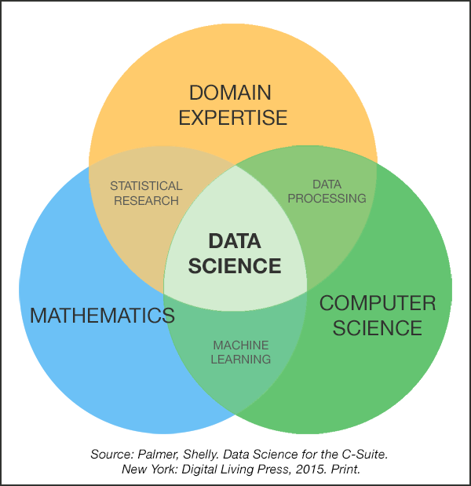
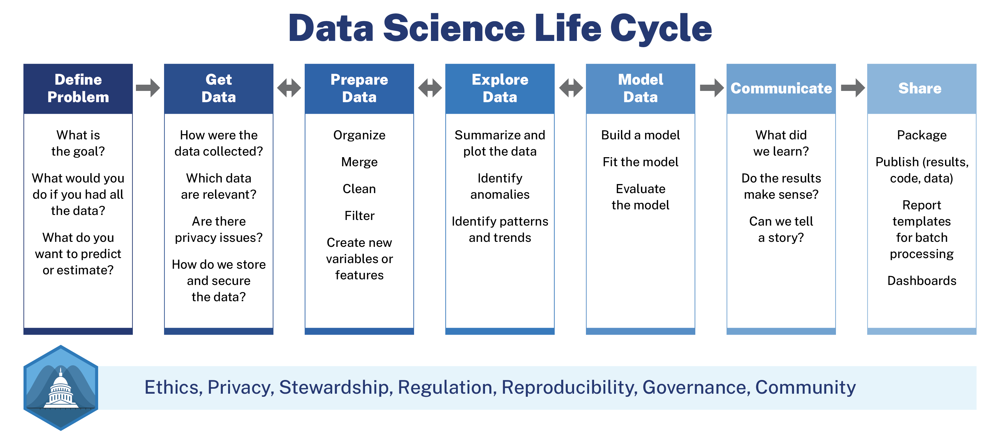

```{r setup, include=FALSE}
knitr::opts_chunk$set(warning = FALSE, message = FALSE, 
                      fig.retina = 3, fig.align = "center")
```

```{r xaringanExtra, echo=FALSE}
xaringanExtra::use_xaringan_extra(c("tile_view"))
```

class: middle

.box-5.large[Join the Slack workspace]

.center.large.sp-after[[andhs.co/slack](<https://andhs.co/slack>)]

.box-5.large[Join the RStudio.cloud workspace]

.center.large[[andhs.co/rstudio](https://andhs.co/rstudio)]

---

class: center middle main-title section-title-3

# In-person<br>session 1

.class-info[

**August 22, 2022**

.light[PMAP 8521: Program evaluation<br>
Andrew Young School of Policy Studies
]

]

---

name: outline
class: title title-inv-8

# Plan for today

--

.box-5.medium.sp-after-half[Data science and program evaluation]

--

.box-6.medium.sp-after-half[Community building and getting help]

--

.box-1.medium.sp-after-half[Navigating the course]

--

.box-2.medium.sp-after-half[R time!]

---

layout: false
name: ds-eval
class: center middle section-title section-title-5 animated fadeIn

# Data science and<br>program evaluation

---

class: middle

.box-5.huge[Who am I?]

---

class: middle

.box-5.huge[What is<br>“data science”?]

---

class: title title-5

# What is "data science"?

.box-inv-5.medium.sp-after[Turning raw data into<br>understanding, insight,<br>and knowledge]

--

.pull-left-3[
.box-5.medium[&emsp;Collect&emsp;]
]

.pull-middle-3[
.box-5.medium[&emsp;Analyze&emsp;]
]

.pull-right-3[
.box-5.medium[Communicate]
]

---

class: title title-5

# What's the difference?

.pull-left.center[
<figure>
  
</figure>
]

.pull-right[
.box-inv-5.medium[Collect]

.box-inv-5.medium[Analyze]

.box-5.medium[Communicate]
]

---

class: middle

.box-5.large[It's *not* scary/complex<br>machine learning,<br>artificial intelligence,<br>neural network stuff!]

---

class: middle

.center[
<figure>
  
</figure>
]

---

class: middle

.center[
<figure>
  
</figure>
]

---

layout: false
name: community-help
class: center middle section-title section-title-6 animated fadeIn

# Community building<br>and getting help

---

layout: true
class: title title-6

---

# Why is the R community special?

--

.box-inv-6.large[Intentionality]

--

.box-inv-6.large[\#rstats]

--

.box-inv-6.large[\#tidytuesday]

--

.box-inv-6.large[RStudio community forum]

???

- <https://www.rstudio.com/champion/community-building>
- <https://www.rstudio.com/conference/2022/talks/everything-learned-community-building-learned/>
- <https://community.rstudio.com/>

---

# Creating our own class community

--

.box-inv-6.large.sp-after-half[Work and ask questions in public]

--

.box-inv-6.large.sp-after-half[Be supportive]

--

.box-inv-6.large[**Don't suffer in silence**]

---

# Slack guidelines

--

.box-inv-6.large[Ask questions in #help]

.box-6.small[Avoid DMs with me!]

--

.box-inv-6.large.sp-before[Don't be shy or scared!]

--

.box-inv-6.large.sp-before[Respond in threads]

---

layout: false
class: middle

.box-6.huge[30 minute rule]


---

class: middle

.box-6.huge[How to<br>ask for help]

.center[[Guidelines](https://evalf22.classes.andrewheiss.com/news/2022-08-22_getting-help.html)]

---

layout: false
name: navigating
class: center middle section-title section-title-1 animated fadeIn

# Navigating the course

---

class: title title-1

# Navigating the course

--

.pull-left[
.box-inv-1.less-medium[What's on iCollege?]

- Assignment submission
- Grades
- Exams
- Answer keys
- Copyrighted materials
]

--

.pull-right[
.box-inv-1.less-medium[What's on the website?]

- Everything else!
- Forever!
]

???

- multiple links to assignments and content
- news
- links to Slack and RStudio Cloud
- zip files
- slides

---

layout: false
name: r-time
class: center middle section-title section-title-2 animated fadeIn

# R time!

---

class: title title-2

# Intro to R labs

.box-inv-2.less-medium[Lab 1: Markdown and universal writing]

.box-inv-2.less-medium[Lab 2: Getting started with R and RStudio]

.box-inv-2.less-medium[Lab 3: Data basics]

.box-inv-2.less-medium[Lab 4: Visualize data with ggplot2]

.box-inv-2.less-medium[Lab 5: Transform data with dplyr]
