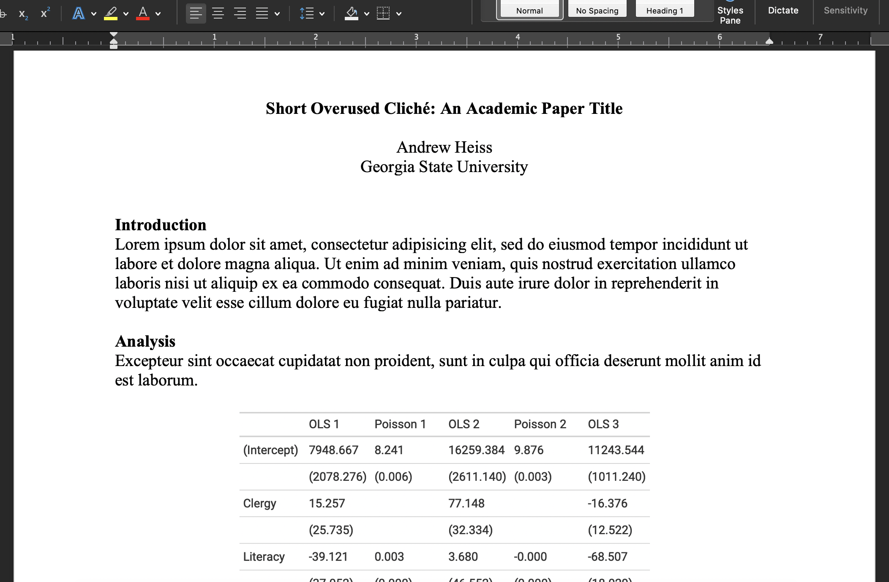
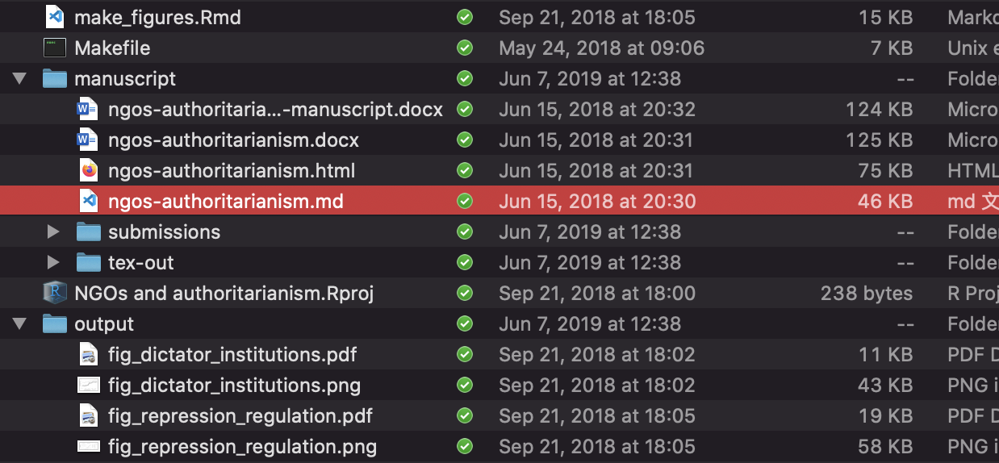
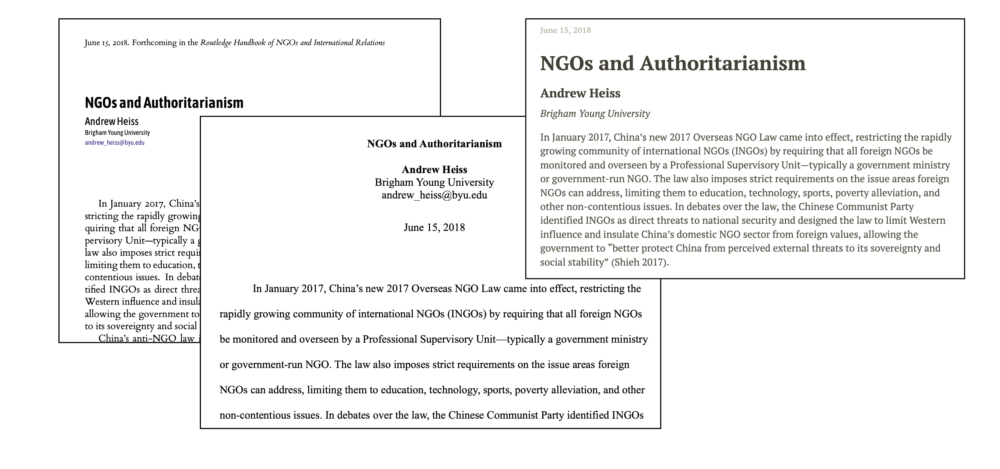
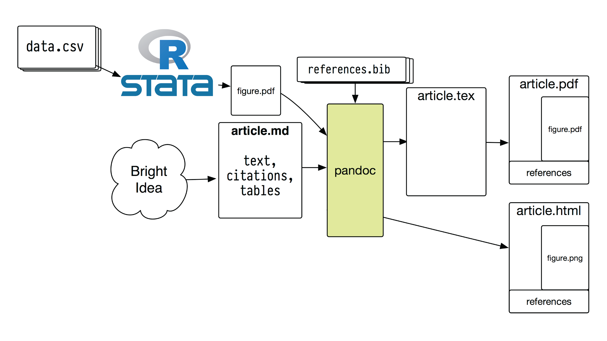
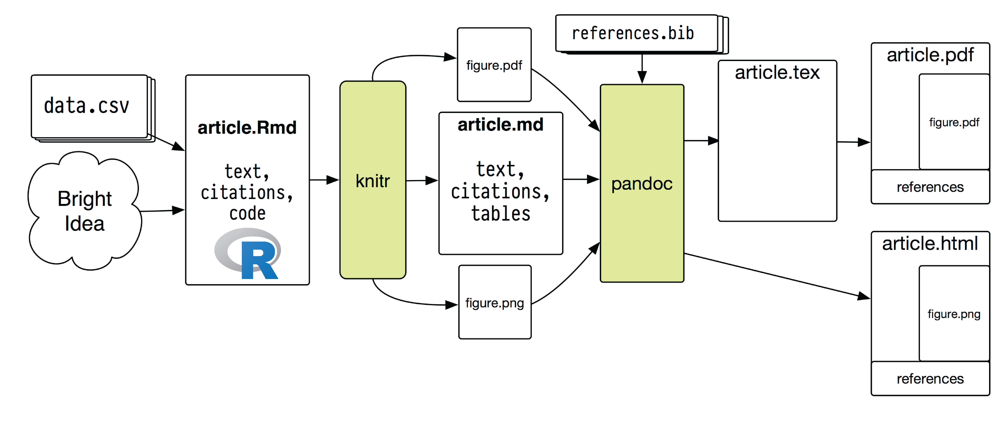
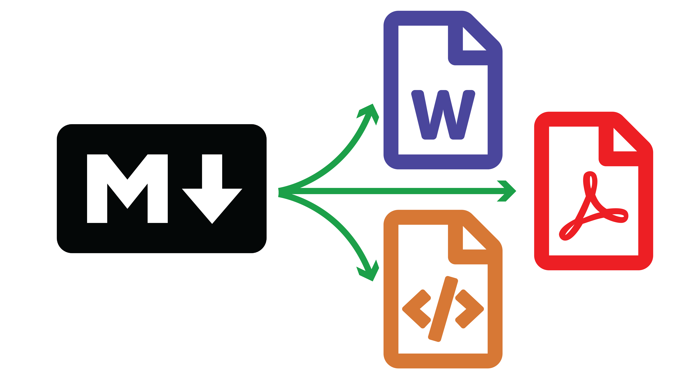

```{r setup, include=FALSE}
knitr::opts_chunk$set(warning = FALSE, message = FALSE, 
                      fig.retina = 3, fig.align = "center")
```

```{r packages-data, include=FALSE}
library(tidyverse)
library(kableExtra)
```

```{r xaringanExtra, echo=FALSE}
xaringanExtra::use_xaringan_extra(c("tile_view"))
xaringanExtra::use_share_again()
```

class: center middle main-title section-title-4

# Markdown and<br>universal writing

---

class: middle

.box-4.huge[Writing up research is a<br>complicated, messy process!]

---

layout: true
class: title title-4

---

# Itty bitty pieces

--

.center.float-left[.box-inv-4[Data] .box-inv-4[Statistical results]]

--

.center.float-left[.box-inv-4[Fieldwork] .box-inv-4[Interviews] .box-inv-4[Analysis]]

--

.center.float-left[.box-inv-4[Figures] .box-inv-4[Images] .box-inv-4[Tables]]

--

.box-inv-4[Citations]

--

.box-4.sp-after[Your actual words]

--

.box-inv-4.medium[Each of these comes from a different place!]

???

Spending a full day of writing in the mountains or the beach with a notebook sounds cool, but it's really infeasible with any sort of academic writing - too much going on!

---

# Two general approaches for this mess

--

.box-inv-4.medium[The **Office** model]

.box-4.sp-after[Put everything in one document]

--

.box-inv-4.medium.sp-before[The **Engineering** model]

.box-4[Embrace the bittiness and compile it all at the end]

???

https://plain-text.co/index.html#introduction

---

# The Office model

.pull-left[
.box-4[Everything lives in<br>one `.docx` file]

.box-inv-4.small[Drag images in]

.box-inv-4.small[Copy/paste stats from R or Stata]

.box-inv-4.small[Connect Word to Zotero or Endnote]

.box-inv-4.small[Track versions with filenames: `ms.docx`, `ms2_final.docx`, `ms2_final_final.docx`]

]

.pull-right[

.box-4[Final output = `.docx` file]

<figure>
  
</figure>

]

---

# The Engineering model

.pull-left[
.box-4[Everything lives separately and is combined in the end]

.box-inv-4.small[Type text in a plain text document]

.box-inv-4.small[Import images automatically]

.box-inv-4.small[Import stats automatically from<br>R scripts (`.R` or `.Rmd`) or `.do` files]

.box-inv-4.small[Store citations in reference manager]

.box-inv-4.small[Track versions with git]
]

.pull-right[

.box-4[Final output = whatever you want (Word, PDF, HTML)]

.center[
<figure>
  
</figure>

<figure>
  
</figure>
]
]

---

# No one right way!

--

.box-inv-4[The Office model can be clunky and you'll<br> inevitably forget to update figures, tables, results, etc.]

--

.box-inv-4.small[**BUT**]

--

.box-4.medium[The whole world runs on Word]

--

.box-inv-4.small[Even if you're a strict Engineering person,<br>you'll still collaborate with Office people!]

--

.box-inv-4.small[Coauthors will work in Word, advisers will give comments<br>and track changes in Word, journals will demand final Word files]

---

# Reproducibility

--

.box-inv-4[The Engineering model is definitely more fiddly]

--

.box-inv-4.small[**BUT**]

--

.box-4.medium[There's less cognitive load!]

--

.box-inv-4[No need to copy/paste new results,<br>add updated figures, reformat citation, etc.]

--

.box-inv-4[There's a record of everything you do!]

--

.box-inv-4[Your findings are reproducible by anyone (and yourself!)]

---

# Austerity and Excel

.pull-left[

<figure>
  
</figure>

.box-inv-4[Debt:GDP ratio<br>90%+ → −0.1% growth]

]

--

.pull-right.center[

<figure>
  
  <figcaption>Paul Ryan's 2013 House budget resolution</figcaption>
</figure>

]

???

[2013 House Budget Resolution](https://republicans-budget.house.gov/uploadedfiles/pathtoprosperity2013.pdf)

---

# Austerity and Excel

.pull-left.center[

<figure>
  
  <figcaption>Thomas Herndon</figcaption>
</figure>

]

--

.pull-right.center[

<figure>
  
  <figcaption>From <a href="https://www.nytimes.com/2013/04/19/opinion/krugman-the-excel-depression.html" target="_blank">Paul Krugman, "The Excel Depression"</a></figcaption>
</figure>

]

???

[Paul Krugman on the reproducibility crisis](https://www.nytimes.com/2013/04/19/opinion/krugman-the-excel-depression.html)

---

# Austerity and Excel

.center[
<figure>
  
</figure>
]

--

.box-inv-4[Debt:GDP ratio = 90%+ → 2.2% growth (!!)]

---

# Genes and Excel

.pull-left-3[
.box-inv-4[Septin 2]
]

.pull-middle-3[
.box-inv-4[Membrane-Associated Ring Finger (C3HC4) 1]
]

.pull-right-3[
.box-inv-4[2310009E13]
]

--

.center.sp-after[
<figure>
  
</figure>
]

--

.center[
.box-4[20% of genetics papers between 2005–2015 (!!!)]
]

---

# General guidelines

.box-inv-4.medium[Don't touch the raw data]

.box-4[If you do, explain what you did!]

--

.box-inv-4.medium[Use self-documenting, reproducible code]

.box-4[The whole point of this Engineering model! (R Markdown!)]

--

.box-inv-4.medium[Use open formats]

.box-4[Use .csv, not .xlsx]

---

# Engineering model in real life

.pull-left.center[

<figure>
  
  <figcaption><a href="https://peerj.com/preprints/3182.pdf" target="_blank">Airbnb, ggplot, and rmarkdown</a></figcaption>
</figure>

]

--

.pull-right.center[

&nbsp;

<figure>
  
</figure>

<figure>
  
  <figcaption><a href="https://dataingovernment.blog.gov.uk/2017/03/27/reproducible-analytical-pipeline/" target="_blank">The UK's reproducible analysis pipeline</a></figcaption>
</figure>

]

???

https://peerj.com/preprints/3182.pdf + https://gdsdata.blog.gov.uk/2017/03/27/reproducible-analytical-pipeline/ 

---

# Overview of the process

.center[
<figure>
  
</figure>
]

???

https://plain-text.co/pull-it-together.html#pull-it-together

---

# Can get more complicated!

.center[
<figure>
  
</figure>
]

???

https://plain-text.co/pull-it-together.html#pull-it-together

---

# Universal writing

$$
\LaTeX
$$

--

.box-inv-4[You might know LaTeX—it's a scientific typesetting language]

--

.box-inv-4[Great! It's a way to do the Engineering model]

--

.box-inv-4.small[Run `latexmk` from the terminal or click the "compile" button in your TeX editor and you'll stitch together all your separate writing, tables, images, and citations]

--

.box-4.sp-before[HOWEVER, the world runs on `.docx`]

--

.box-4.small[There are ways to convert from `.tex` to `.docx`, but they're a pain]

---

# Three syntaxes

.box-inv-4[If you want to be able to write in LaTeX, but also have HTML for a blog post later, and also have a Word file for a journal later, you have to learn (and write with!) all these!]

--

.small[
```{r syntax-table, echo=FALSE}
tribble(
  ~Format, ~LaTeX, ~HTML, ~Word,
  "Bold", "\\textbf{Something}", "<b>Something</b>", "Click on stuff",
  "Heading 2", "\\subsection{Something}", "<h2>Something</h2>", "Click on stuff",
  "Link", "\\href{google.com}{Link}", '<a href="google.com">Link</a>', "Click on stuff",
  "Citation", "\\cite{Heiss2020}", "lolz", "lolz",
  "Math", "y = \\beta_0 + \\beta_1 x_1", "lolz", "Equation editor"
) %>% 
  kbl() %>% 
  column_spec(1, width = "13%") %>% 
  column_spec(2, width = "30%") %>% 
  column_spec(3, width = "37%") %>% 
  column_spec(4, width = "20%")
```
]

???


---

# Markdown + pandoc

.box-inv-4.medium[Solution: Use a universal syntax]

--

.box-4[Write with one simplified syntax and<br>convert from that to whatever output you want.]

--

.pull-left[
.smaller[
```{r syntax-table-md, echo=FALSE}
tribble(
  ~Format, ~Markdown,
  "Bold", "**Something**",
  "Heading 2", "## Something",
  "Link text", "[Link](google.com)",
  "Citation", "@Heiss2020", 
  "Math", "y = \\beta_0 + \\beta_1 x_1",
) %>% 
  kbl()
```
]
]

--

.pull-right[
<figure>
  
</figure>
]

---

# pandoc

.box-inv-4[The magic glue that makes this all work]

--

```sh
# To HTML
pandoc manuscript.md -o manuscript.html

# To Word
pandoc manuscript.md -o manuscript.docx

# To PDF (through LaTeX)
pandoc manuscript.md -o manuscript.pdf
```

---

# Overview again

.center[
<figure>
  
</figure>
]

---

# The Universal Markdown-based model

--

.box-inv-4.medium[Text editor]

--

.box-inv-4.medium[(R) Markdown]

--

.box-inv-4.medium[`pandoc`]

--

.box-inv-4[(Not in this class: Automation with Makefiles)]

--

.box-inv-4[(Not in this class: Version control with git/GitHub)]

---

layout: false
class: middle

.box-4.huge[Let's play with<br>Markdown and pandoc!]
