```{r setup, include=FALSE}
knitr::opts_chunk$set(warning = FALSE, message = FALSE, 
                      fig.retina = 3, fig.align = "center")
```

```{r packages-data, include=FALSE}
library(tidyverse)
library(countdown)
library(flair)
```

```{r xaringanExtra, echo=FALSE}
xaringanExtra::use_xaringan_extra(c("tile_view"))
xaringanExtra::use_share_again()
```

class: center middle main-title section-title-5

# Getting started with<br>R and RStudio

.class-info[
<figure>
  
</figure>
]

---

class: middle

.pull-left.center[
<figure>
  
</figure>

.box-inv-5[The engine]
]

.pull-right.center[
<figure>
  
</figure>

.box-inv-5[The dashboard]
]

---

class: middle section-title-inv-5

.box-5.large[A tour of RStudio]

---

<figure>
  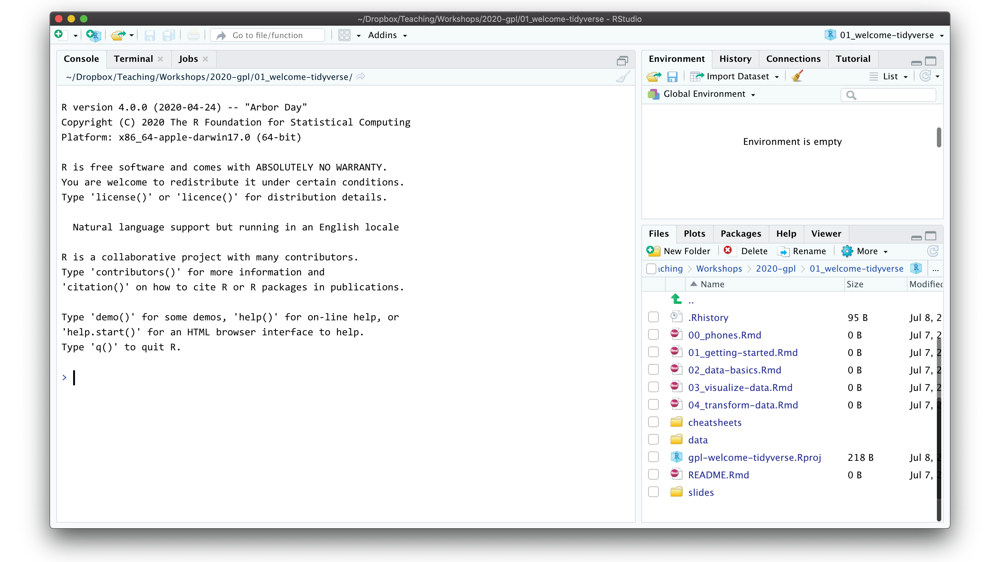
</figure>

---

class: title title-5

# Console 

.pull-left-wide[
<figure>
  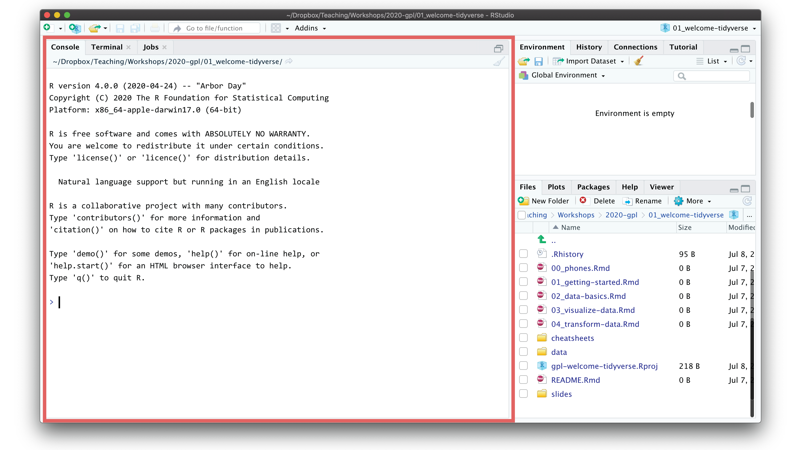
</figure>
]

.pull-right-narrow[
.box-inv-5[R is awaiting your instructions]

.box-inv-5[Type code here, press enter, and R will run it]
]

---

class: title title-5 section-title-inv-5

# Your turn

.pull-left-wide[
<figure>
  
</figure>
]

.pull-right-narrow[
.box-5[Type `2 + 2` in the console]

.box-5[Press enter]
]

---

```{r}
2 + 2
```

.box-5[This is ephemeral though.<br>If you want to run this again, you'll have to type it again.]

.box-5[Store R code in a document instead]

---

class: title title-5

# Files pane

.pull-left-wide[
<figure>
  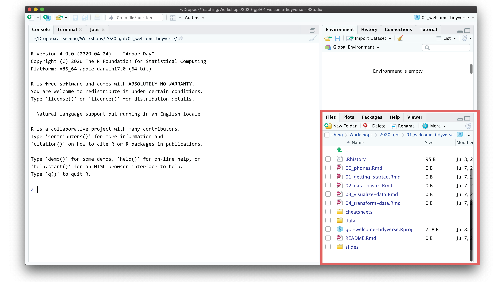
</figure>
]

.pull-right-narrow[
.box-inv-5[All the files in your current working directory]
]

---

class: title title-5 section-title-inv-5

# Your turn

.pull-left-wide[
<figure>
  
</figure>
]

.pull-right-narrow[
.box-5[Find `01_getting-started.Rmd`]

.box-5[Click on its name to open the file]
]

---

class: title title-5

# Source pane

.pull-left-wide.center[
<figure>
  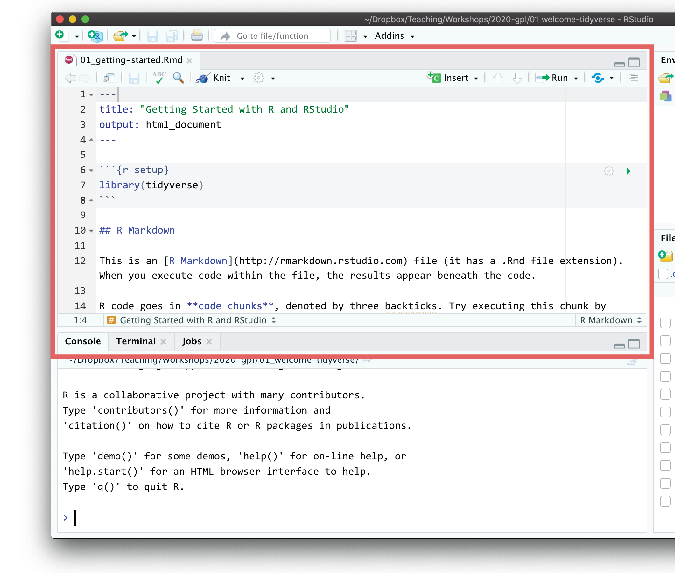
</figure>
]

.pull-right-narrow[
.box-inv-5[Documents<br>open here]
]

---

class: title title-5

# R Markdown

.pull-left.center[
<figure>
  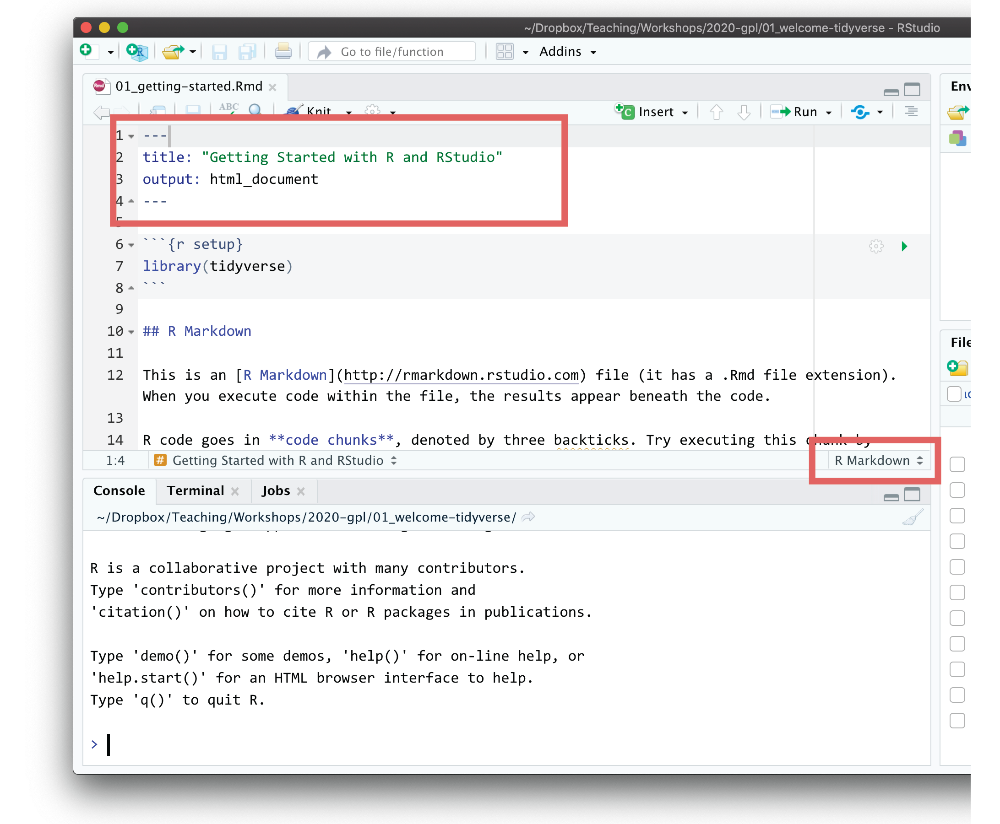
</figure>
]

.pull-right[
.box-inv-5[Document format that<br>combines text and code]

.box-inv-5[Acts like a notebook<br>for your analysis]
]

---

class: title title-5

# R Markdown

.pull-left[
<figure>
  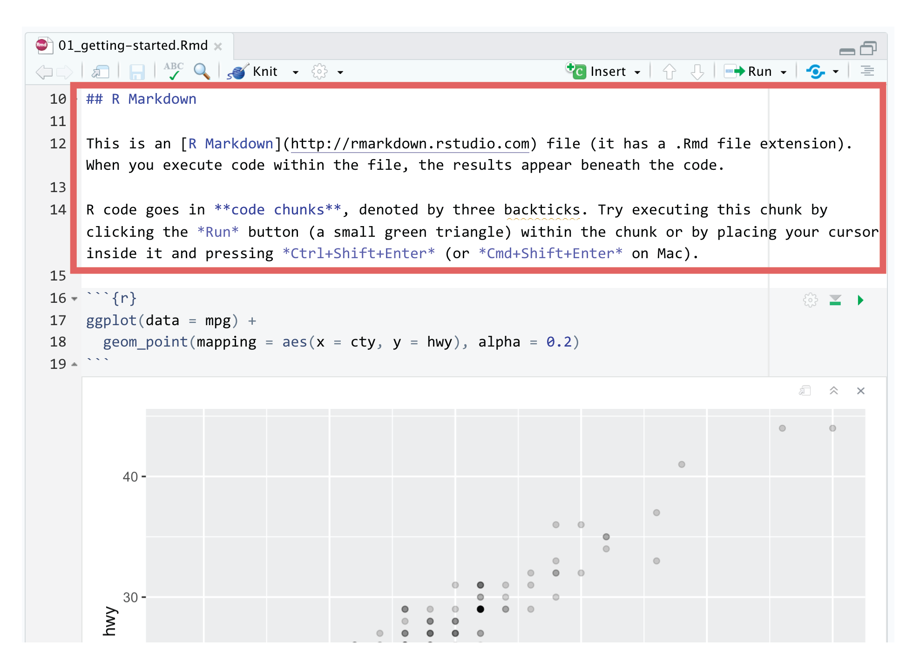
</figure>
]

.pull-right[
.box-inv-5.medium[Text]
]

---

class: title title-5

# R Markdown

.pull-left[
<figure>
  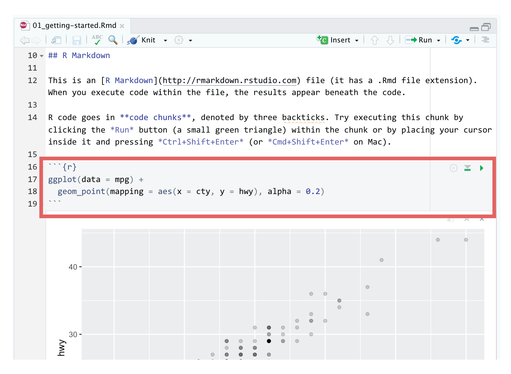
</figure>
]

.pull-right[
.box-inv-5.medium[Text]

.box-inv-5.medium[Code]
]

---

class: title title-5

# R Markdown

.pull-left[
<figure>
  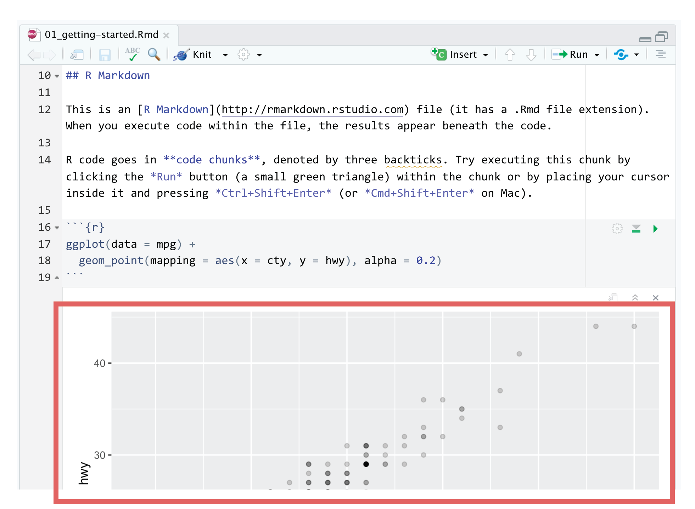
</figure>
]

.pull-right[
.box-inv-5.medium[Text]

.box-inv-5.medium[Code]

.box-inv-5.medium[Output]
]

---

class: title title-5 section-title-inv-5

# Your turn

.pull-left[
<figure>
  
</figure>
]

.pull-right[
.box-5[Read the instructions]

.box-5[Run the code chunk by<br>clicking the play button]
]

---

class: title title-5 section-title-inv-5

# Your turn

.box-5[Add a new chunk]

.box-5[Put `2 + 2` in the chunk and run it]

---

class: title title-5

# Knitting

.box-inv-5["Knit" an R Markdown document into a standalone sharable file]

.center[
<figure>
  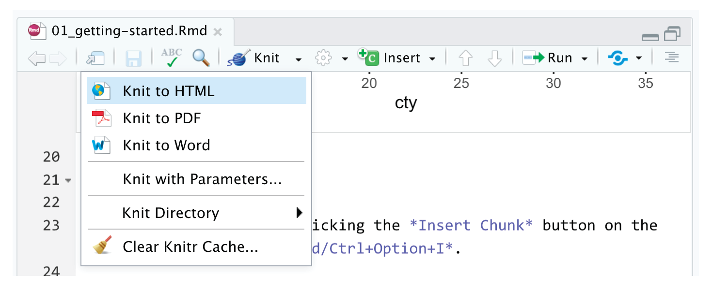
</figure>
]

---

class: title title-5

# R Markdown

.box-inv-5.sp-after[The best way to combine R code and narrative]

.box-5[We'll use it throughout the class:]

.box-5[I'll provide starter code]

.box-5[You'll complete "Your turns"]

.box-5[In the end, you'll have an annotated record for yourself]

---

class: title title-5 section-title-inv-5

# Your turn

.box-5[Spot the difference:]

```{r eval=FALSE}
filter(mtcars, cyl == 4)
```

```{r eval=FALSE}
four_cyls <- filter(mtcars, cyl == 4)
```

.box-5[Find these chunks in the notebook and run them.<br>What's different about what happens?]

---

class: title title-5

# Assignment

.box-inv-5[`<-` assigns the output from the righthand side to a variable with the name on the lefthand side]

```{r eval=FALSE}
four_cyls <- filter(mtcars, cyl == 4)
```

---

class: title title-5

# Environment pane

.pull-left[
<figure>
  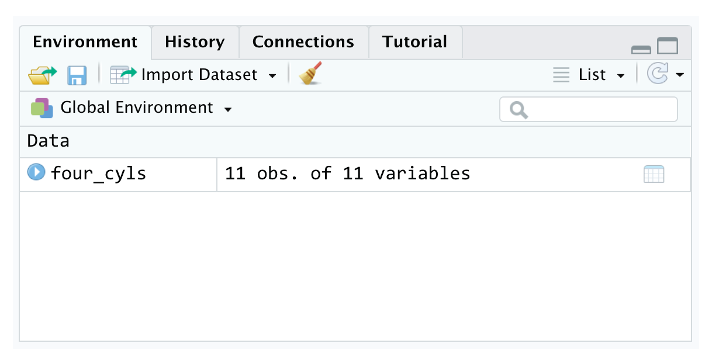
</figure>
]

.pull-right[
.box-5[List of all the<br>variables you've created]
]

---

class: title title-5 section-title-inv-5

# Your turn

.box-5[Find `four_cyls` in the environment pane.<br>Click on the name `four_cyls`]

.box-5[What happens?]

---

class: title title-5

# Viewer

.pull-left[
<figure>
  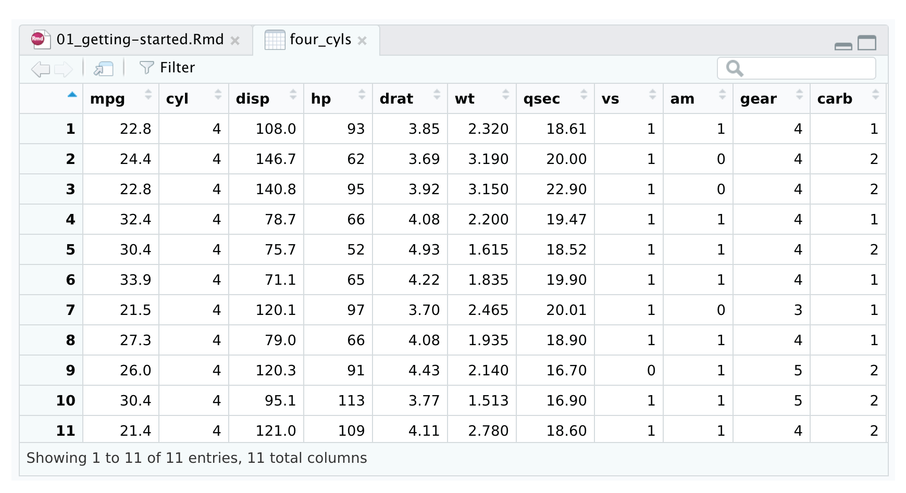
</figure>
]

.pull-right[
.box-5[Clicking on an object in the environment panel opens it an interactive viewer tab]
]

---

class: title title-5

# Functions

.center[
```{r echo=FALSE, tidy=FALSE}
decorate('
four_cyls <- filter(mtcars, cyl == 4)
', eval = FALSE) %>% 
  flair("filter", background = "#FFDFD1", before = "<b>", after = "</b>")
```
]

.box-inv-5[Functions do things]

--

.box-inv-5[Functions take arguments, output results]

--

.box-inv-5[If you want to keep the output, assign it to a variable]

---

class: title title-5

# Help

.box-inv-5[To look up the help page for an R function,<br>type this in the console:]

.center[
```{r eval=FALSE}
?function_name
```
]

.box-5.small[(Or google it!)]

---

class: title title-5

# Help pane

.pull-left[
<figure>
  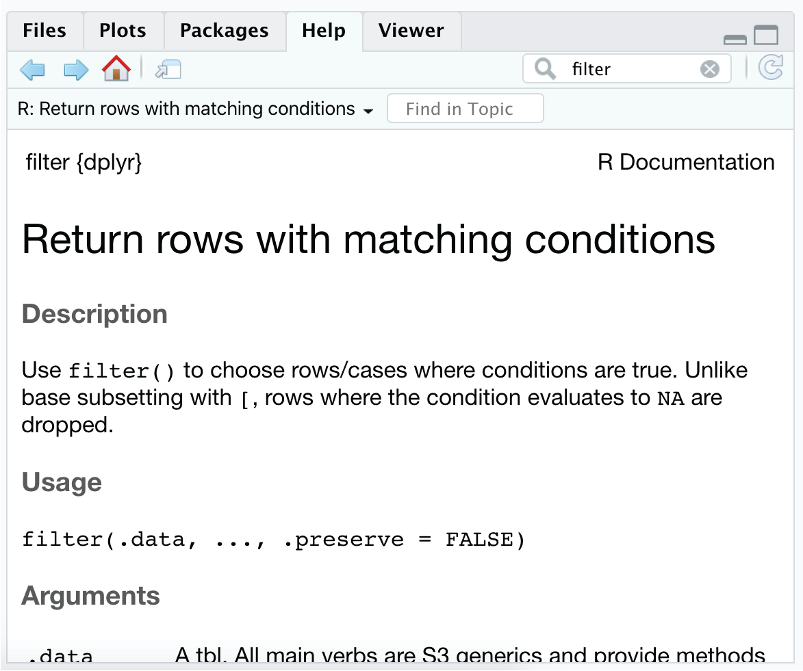
</figure>
]

.pull-right[
.box-5[These help pages prove details about the arguments you can supply a function]

.box-5[Often full of examples<br>at the bottom]
]

---

class: title title-5 section-title-inv-5

# Your turn

.box-5[Look at the help page for `seq`]

.box-5[Add a chunk that uses `seq()` to create a<br>list of numbers from 5 to 100, spaced by 5<br>.small[(so 5, 10, 15, 20, …)]]

```{r echo=FALSE}
countdown(minutes = 2, play_sound = TRUE, font_size = "1.5em")
```

---

```{r}
seq(from = 5, to = 100, by = 5)
```


---

class: title title-5

# Common syntax problem #1

.box-inv-5[Missing closing parentheses or quotes]

```{r eval=FALSE}
mean(mtcars
```

```{r eval=FALSE}
"Oops this is wrong
```

---

class: title title-5

# Common syntax problem #2

.box-inv-5[Surrounding something in quotes when it should be (or vice versa)]

```{r error=TRUE, warning=TRUE, message=TRUE}
mean("mtcars")
```

---

class: title title-5 section-title-inv-5

# Your turn

.box-5[There are three chunks under "Syntax gone wrong"]

.box-5[Run each, read the error message, and try to fix the syntax]

---

class: title title-5

# Cheatsheets

.box-inv-5[Go to Help > Cheatsheets to find quick<br>reference guides to different packages]

.center[
<figure>
  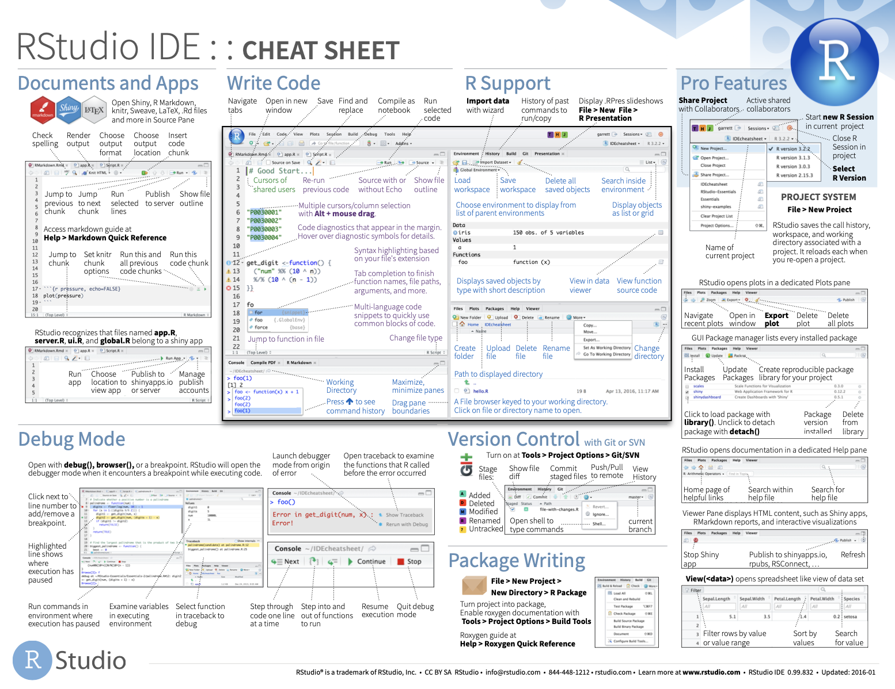
</figure>
]

---

class: title title-5

# Next up

.box-inv-5.medium[Data basics]
