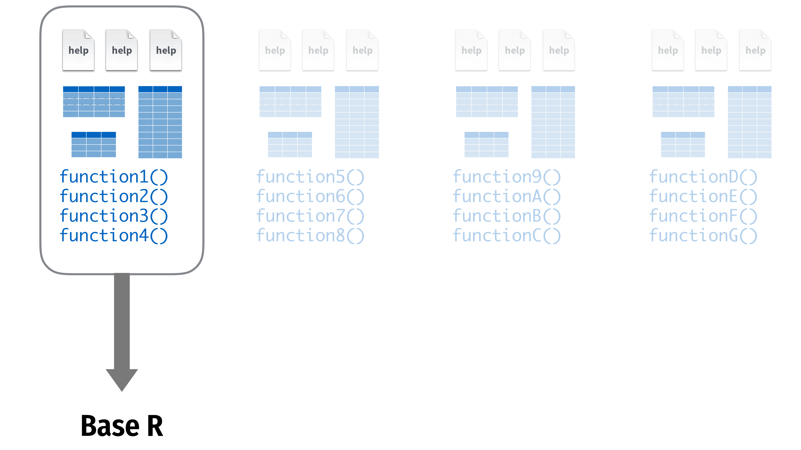
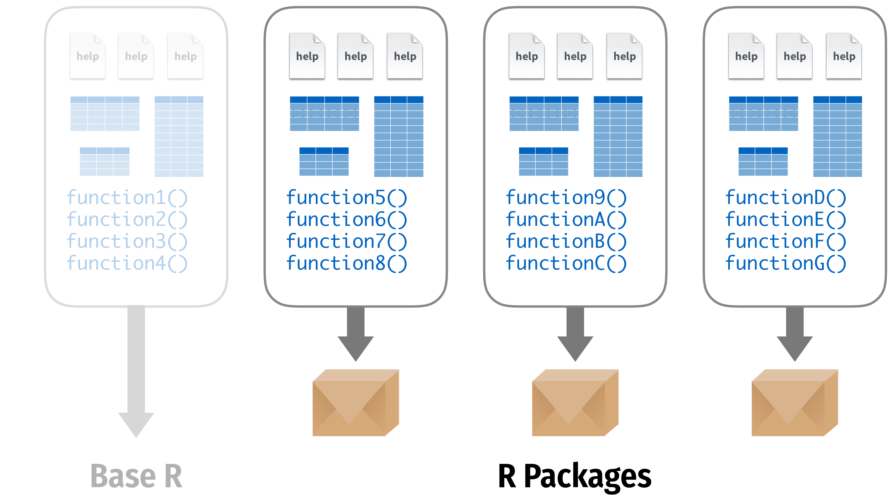

```{r setup, include=FALSE}
knitr::opts_chunk$set(warning = FALSE, message = FALSE, 
                      fig.retina = 3, fig.align = "center")
```

```{r packages-data, include=FALSE}
library(tidyverse)
library(gapminder)
library(countdown)
library(flair)
library(knitr)
library(kableExtra)
```

```{r xaringanExtra, echo=FALSE}
xaringanExtra::use_xaringan_extra(c("tile_view"))
```

class: center middle main-title section-title-6

# Data basics

---

class: middle section-title-inv-6

.box-6.large[Packages]

---

<figure>
  
</figure>

---

<figure>
  
</figure>

---

class: title title-6

# Using packages

.pull-left[
```{r eval=FALSE}
install.packages("name")
```

.box-inv-6[Downloads files<br>to your computer]

.box-inv-6[Do this once per computer]
]

--

.pull-right[
```{r eval=FALSE}
library("name")
```

.box-inv-6[Loads the package]

.box-inv-6[Do this once per R session]
]
---

class: title title-6

# The tidyverse

.pull-left[
.box-inv-6.small["The tidyverse is an opinionated collection of R packages designed for data science. All packages share an underlying design philosophy, grammar, and data structures."]

.box-inv-6[… the tidyverse makes data science faster, easier and more fun…]
]

.pull-right[
<figure>
  
</figure>
]

---

class: title title-6

# The tidyverse

<figure>
  
</figure>

???

From "Master the Tidyverse" by RStudio

---

class: title title-6

# The tidyverse package

.center[
```{r eval=FALSE}
library(tidyverse)
```
]

.box-inv-6[The tidyverse package is a shortcut for<br>installing and loading all the key tidyverse packages]

---

.pull-left[
```{r eval=FALSE}
install.packages("tidyverse")
```

.tiny[
```{r eval=FALSE}
install.packages("ggplot2")
install.packages("dplyr")
install.packages("tidyr")
install.packages("readr")
install.packages("purrr")
install.packages("tibble")
install.packages("stringr")
install.packages("forcats")
install.packages("lubridate")
install.packages("hms")
install.packages("DBI")
install.packages("haven")
install.packages("httr")
install.packages("jsonlite")
install.packages("readxl")
install.packages("rvest")
install.packages("xml2")
install.packages("modelr")
install.packages("broom")
```
]
]

--

.pull-right[
```{r eval=FALSE}
library("tidyverse")
```

.tiny[
```{r eval=FALSE}
library("ggplot2")
library("dplyr")
library("tidyr")
library("readr")
library("purrr")
library("tibble")
library("stringr")
library("forcats")
```
]
]

---

class: middle section-title-inv-6

.box-6.large[Rectangular data]

---

class: title title-6

# Data frames and tibbles

.box-inv-6.medium[Data frames are the most common kind of data objects; used for rectangular data (like spreadsheets)]

--

.box-6[Data frames: R's native data object]

--

.box-6[Tibbles (`tbl`): a fancier enhanced kind of data frame]

--

.box-6.small[(You really won't notice a difference today)]

---

class: middle section-title-inv-6

.box-6.large[Vectors and lists]

---

class: title title-6

# Vectors

.box-inv-6[Vectors are a list of values of the same time<br>(all text, or all numbers, etc.)]

.box-inv-6[Make them with `c()`:]

```{r eval=FALSE}
c(1, 4, 2, 5, 7)
```

--

.box-inv-6[You'll usually want to assign them to something:]

```{r eval=FALSE}
neat_numbers <- c(1, 4, 2, 5, 7)
```

---

class: title title-6

# Basic data types

<table>
  <tr>
    <td><b>Integer</b></td>
    <td>Whole numbers</td>
    <td><code class="remark-inline-code">c(1, 2, 3, 4)</code></td>
  </tr>
  <tr>
    <td><b>Double</b></td>
    <td>Numbers</td>
    <td><code class="remark-inline-code">c(1, 2.4, 3.14, 4)</code></td>
  </tr>
  <tr>
    <td><b>Character</b></td>
    <td>Text</td>
    <td><code class="remark-inline-code">c("1", "blue", "fun", "monster")</code></td>
  </tr>
  <tr>
    <td><b>Logical</b></td>
    <td>True or false</td>
    <td><code class="remark-inline-code">c(TRUE, FALSE, TRUE, FALSE)</code></td>
  </tr>
  <tr>
    <td><b>Factor</b></td>
    <td>Category</td>
    <td><code class="remark-inline-code">c("Strongly disagree", "Agree", "Neutral")</code></td>
  </tr>
</table>

---

class: middle section-title-inv-6

.box-6.large[Importing data]

---

class: title title-6

# Packages for importing data

<table>
  <tr>
    <td></td>
    <td>Work with plain text data</td>
    <td><code class="remark-inline-code">my_data <- read_csv("file.csv")</code></td>
  </tr>
  <tr>
    <td></td>
    <td>Work with Excel files</td>
    <td><code class="remark-inline-code">my_data <- read_excel("file.xlsx")</code></td>
  </tr>
  <tr>
    <td></td>
    <td>Work with Stata, SPSS, and SAS data</td>
    <td><code class="remark-inline-code">my_data <- read_stata("file.dta")</code></td>
  </tr>
</table>

---

class: title title-6

# Other types of data

<table>
  <tr>
    <th>Package</th>
    <th>Type of data</th>
  </tr>
  <tr>
    <td>jsonlite</td>
    <td>JSON data</td>
  </tr>
  <tr>
    <td>xml2</td>
    <td>XML data</td>
  </tr>
  <tr>
    <td>httr</td>
    <td>Web APIs</td>
  </tr>
  <tr>
    <td>rvest</td>
    <td>Web pages (web scraping)</td>
  </tr>
  <tr>
    <td>DBI</td>
    <td>Databases (SQL)</td>
  </tr>
</table>

---

class: title title-6

# Next up

.box-inv-6.medium[Data visualization]
