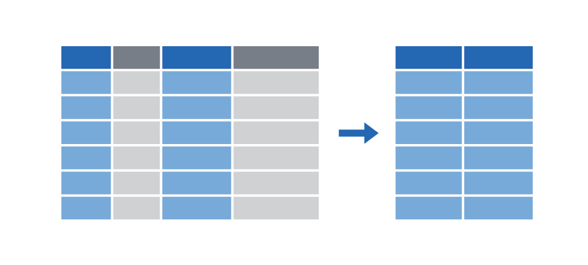
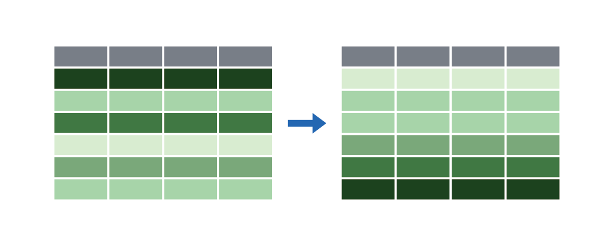
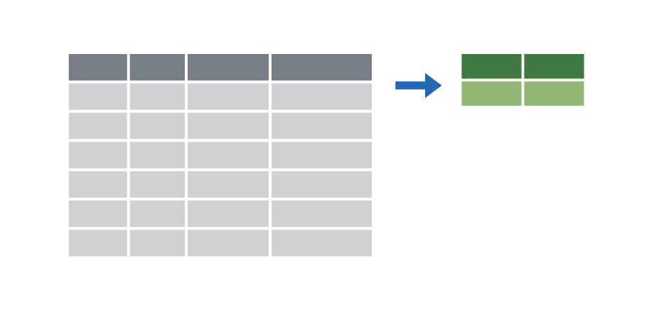

```{r setup, include=FALSE}
knitr::opts_chunk$set(warning = FALSE, message = FALSE, 
                      fig.retina = 3, fig.align = "center")
```

```{r packages-data, include=FALSE}
library(tidyverse)
library(gapminder)
library(countdown)
library(flair)
library(knitr)
library(kableExtra)
```

```{r xaringanExtra, echo=FALSE}
xaringanExtra::use_xaringan_extra(c("tile_view"))
```

class: center middle main-title section-title-2

# Transform data<br>with dplyr

.class-info[
<figure>
  
</figure>
]

---

layout: false
class: title title-2 section-title-inv-2

# Your turn #0: Load data

1. Run the setup chunk
2. Take a look at the `gapminder` data

```{r echo=FALSE}
countdown(minutes = 2, play_sound = TRUE, font_size = "1.5em")
```

---

.small[
```{r show-gapminder}
gapminder
```
]

---

class: title title-2

# The tidyverse

<figure>
  
</figure>

???

From "Master the Tidyverse" by RStudio

---

class: title title-2

# The tidyverse

.center[
<figure>
  
</figure>
]

---

class: title title-2

# dplyr: verbs for manipulating data

<table>
  <tr>
    <td>Extract rows with <code>filter()</code></td>
    <td></td>
  </tr>
  <tr>
    <td>Extract columns with <code>select()</code></td>
    <td></td>
  </tr>
  <tr>
    <td>Arrange/sort rows with <code>arrange()</code></td>
    <td></td>
  </tr>
  <tr>
    <td>Make new columns with <code>mutate()</code></td>
    <td></td>
  </tr>
  <tr>
    <td>Make group summaries with<br><code>group_by() %>% summarize()</code></td>
    <td></td>
  </tr>
</table>

---

class: center middle section-title section-title-2

# `filter()`

---

layout: false
class: title title-2

# `filter()`

.box-inv-2[Extract rows that meet some sort of test]

.pull-left[
```{r show-filter-template, echo=FALSE, tidy=FALSE}
decorate('
filter(.data = DATA, ...)
', eval = FALSE) %>% 
  flair("DATA", background = "#FFDFD1", before = "<b>", after = "</b>") %>% 
  flair("...", background = "#FFD0CF", before = "<b>", after = "</b>")
```
]

.pull-right[
- <b><span style="background: #FFDFD1">`DATA`</span></b> = Data frame to transform
- <b><span style="background: #FFD0CF">`...`</span></b> = One or more tests <br>.small[`filter()` returns each row for which the test is TRUE]
]

---

```{r echo=FALSE, tidy=FALSE}
decorate('
filter(.data = gapminder, country == "Denmark")
', eval = FALSE) %>% 
  flair("gapminder", background = "#FFDFD1", before = "<b>", after = "</b>") %>% 
  flair('country == "Denmark"', background = "#FFD0CF", before = "<b>", after = "</b>")
```

.pull-left[
```{r echo=FALSE}
gapminder %>% 
  select(country, continent, year) %>% 
  head(5) %>% 
  mutate(year = as.character(year)) %>% 
  bind_rows(tibble(country = "…", continent = "…", year = "…")) %>% 
  knitr::kable(format = "html")
```
]

--

.pull-right[
```{r echo=FALSE}
gapminder %>% 
  select(country, continent, year) %>% 
  filter(country == "Denmark") %>% 
  head(6) %>% 
  knitr::kable(format = "html")
```
]

---

class: title title-2

# `filter()`

.pull-left[
```{r echo=FALSE, tidy=FALSE}
decorate('
filter(.data = gapminder, 
       country == "Denmark")
', eval = FALSE) %>% 
  flair("gapminder", background = "#FFDFD1", before = "<b>", after = "</b>") %>% 
  flair('country == "Denmark"', background = "#FFD0CF", before = "<b>", after = "</b>")
```
]

.pull-right[
.box-inv-2[One `=` sets an argument]

.box-inv-2[Two `==` tests if equal<br>.small[returns TRUE or FALSE)]]
]

---

class: title title-2

# Logical tests

<table>
  <tr>
    <th class="cell-center">Test</th>
    <th class="cell-left">Meaning</th>
    <th class="cell-center">Test</th>
    <th class="cell-left">Meaning</th>
  </tr>
  <tr>
    <td class="cell-center"><code class="remark-inline-code">x < y</code></td>
    <td class="cell-left">Less than</td>
    <td class="cell-center"><code class="remark-inline-code">x %in% y</code></td>
    <td class="cell-left">In (group membership)</td>
  </tr>
  <tr>
    <td class="cell-center"><code class="remark-inline-code">x > y</code></td>
    <td class="cell-left">Greater than</td>
    <td class="cell-center"><code class="remark-inline-code">is.na(x)</code></td>
    <td class="cell-left">Is missing</td>
  </tr>
  <tr>
    <td class="cell-center"><code class="remark-inline-code">==</code></td>
    <td class="cell-left">Equal to</td>
    <td class="cell-center"><code class="remark-inline-code">!is.na(x)</code></td>
    <td class="cell-left">Is not missing</td>
  </tr>
  <tr>
    <td class="cell-center"><code class="remark-inline-code">x <= y</code></td>
    <td class="cell-left">Less than or equal to</td>
  </tr>
  <tr>
    <td class="cell-center"><code class="remark-inline-code">x >= y</code></td>
    <td class="cell-left">Greater than or equal to</td>
  </tr>
  <tr>
    <td class="cell-center"><code class="remark-inline-code">x != y</code></td>
    <td class="cell-left">Not equal to</td>
  </tr>
</table>

---

class: title title-2 section-title-inv-2

# Your turn #1: Filtering

.box-2[Use `filter()` and logical tests to show…]

1. The data for Canada
2. All data for countries in Oceania
3. Rows where the life expectancy is greater than 82

```{r echo=FALSE}
countdown(minutes = 4)
```

---

.medium[
```{r eval=FALSE}
filter(gapminder, country == "Canada")
```
]

--

.medium[
```{r eval=FALSE}
filter(gapminder, continent == "Oceania")
```
]

--

.medium[
```{r eval=FALSE}
filter(gapminder, lifeExp > 82)
```
]

---

class: title title-2

# Common mistakes

.pull-left[
.box-inv-2[Using `=` instead of `==`]

```{r echo=FALSE, tidy=FALSE}
decorate('
filter(gapminder, 
       country = "Canada")
', eval = FALSE) %>% 
  flair("=", color = "#FF4136", before = "<b>", after = "</b>")
```

```{r echo=FALSE, tidy=FALSE}
decorate('
filter(gapminder, 
       country == "Canada")
', eval = FALSE) %>% 
  flair("==", color = "#2ECC40", before = "<b>", after = "</b>")
```
]

--

.pull-right[
.box-inv-2[Quote use]

```{r echo=FALSE, tidy=FALSE}
decorate('
filter(gapminder, 
       country == Canada)
', eval = FALSE) %>% 
  flair("Canada", color = "#FF4136", before = "<b>", after = "</b>")
```

```{r echo=FALSE, tidy=FALSE}
decorate('
filter(gapminder, 
       country == "Canada")
', eval = FALSE) %>% 
  flair('"Canada"', color = "#2ECC40", before = "<b>", after = "</b>")
```
]

---

class: title title-2

# `filter()` with multiple conditions

.box-inv-2[Extract rows that meet *every* test]

```{r echo=FALSE, tidy=FALSE}
decorate('
filter(gapminder, country == "Denmark", year > 2000)
', eval = FALSE) %>% 
  flair("gapminder", background = "#FFDFD1", before = "<b>", after = "</b>") %>% 
  flair('country == "Denmark", year > 2000', background = "#FFD0CF", before = "<b>", after = "</b>")
```

---

```{r echo=FALSE, tidy=FALSE}
decorate('
filter(gapminder, country == "Denmark", year > 2000)
', eval = FALSE) %>% 
  flair("gapminder", background = "#FFDFD1", before = "<b>", after = "</b>") %>% 
  flair('country == "Denmark", year > 2000', background = "#FFD0CF", before = "<b>", after = "</b>")
```

.pull-left[
```{r echo=FALSE}
gapminder %>% 
  select(country, continent, year) %>% 
  head(5) %>% 
  mutate(year = as.character(year)) %>% 
  bind_rows(tibble(country = "…", continent = "…", year = "…")) %>% 
  knitr::kable(format = "html")
```
]

--

.pull-right[
```{r echo=FALSE}
gapminder %>% 
  select(country, continent, year) %>% 
  filter(country == "Denmark", year > 2000) %>% 
  head(6) %>% 
  knitr::kable(format = "html")
```
]

---

class: title title-2

# Boolean operators

<table>
  <tr>
    <th class="cell-center">Operator</th>
    <th class="cell-center">Meaning</th>
  </tr>
  <tr>
    <td class="cell-center"><code class="remark-inline-code">a & b</code></td>
    <td class="cell-center">and</td>
  </tr>
  <tr>
    <td class="cell-center"><code class="remark-inline-code">a | b</code></td>
    <td class="cell-center">or</td>
  </tr>
  <tr>
    <td class="cell-center"><code class="remark-inline-code">!a</code></td>
    <td class="cell-center">not</td>
  </tr>
</table>

---

class: title title-2

# Default is "and"

.box-inv-2[These do the same thing:]

```{r echo=FALSE, tidy=FALSE}
decorate('
filter(gapminder, country == "Denmark", year > 2000)
', eval = FALSE) %>% 
  flair("gapminder", background = "#FFDFD1", before = "<b>", after = "</b>") %>% 
  flair('country == "Denmark", year > 2000', background = "#FFD0CF", before = "<b>", after = "</b>")
```

```{r echo=FALSE, tidy=FALSE}
decorate('
filter(gapminder, country == "Denmark" & year > 2000)
', eval = FALSE) %>% 
  flair("gapminder", background = "#FFDFD1", before = "<b>", after = "</b>") %>% 
  flair('country == "Denmark" & year > 2000', background = "#FFD0CF", before = "<b>", after = "</b>")
```

---

class: title title-2 section-title-inv-2

# Your turn #2: Filtering

.box-2[Use `filter()` and Boolean logical tests to show…]

1. Canada before 1970
2. Countries where life expectancy in 2007 is below 50
3. Countries where life expectancy in 2007 is below 50 and are not in Africa

```{r echo=FALSE}
countdown(minutes = 4)
```

---

```{r eval=FALSE}
filter(gapminder, country == "Canada", year < 1970)
```

--

```{r eval=FALSE}
filter(gapminder, year == 2007, lifeExp < 50)
```

--

```{r eval=FALSE}
filter(gapminder, year == 2007, lifeExp < 50, 
       continent != "Africa")
```

---

class: title title-2

# Common mistakes

.pull-left[
.box-inv-2[Collapsing multiple tests<br>into one]

.small-code[
```{r echo=FALSE, tidy=FALSE}
decorate('
filter(gapminder, 1960 &lt; year &lt; 1980)
', eval = FALSE) %>% 
  flair("1960 &lt; year &lt; 1980", color = "#FF4136", before = "<b>", after = "</b>")
```
]

.small-code[
```{r echo=FALSE, tidy=FALSE}
decorate('
filter(gapminder, 
       year > 1960, year &lt; 1980)
', eval = FALSE) %>% 
  flair("year > 1960, year &lt; 1980", color = "#2ECC40", before = "<b>", after = "</b>")
```
]
]

--

.pull-right[
.box-inv-2[Using multiple tests<br>instead of `%in%`]

.small-code[
```{r echo=FALSE, tidy=FALSE}
decorate('
filter(gapminder, 
       country == "Mexico", 
       country == "Canada", 
       country == "United States")
', eval = FALSE) %>% 
  flair('country == "Mexico", 
       country == "Canada", 
       country == "United States"', color = "#FF4136", before = "<b>", after = "</b>")
```
]

.small-code[
```{r echo=FALSE, tidy=FALSE}
decorate('
filter(gapminder, 
       country %in% c("Mexico", "Canada", 
                      "United States"))
', eval = FALSE) %>% 
  flair('country %in% c("Mexico", "Canada", 
                      "United States")', color = "#2ECC40", before = "<b>", after = "</b>")
```
]
]

---

class: title title-2

# Common syntax

.box-inv-2[Every dplyr verb function follows the same pattern]

.box-inv-2[First argument is a data frame; returns a data frame]

.pull-left[
```{r echo=FALSE, tidy=FALSE}
decorate('
VERB(DATA, ...)
', eval = FALSE) %>% 
  flair("VERB", background = "#EFB3FF", before = "<b>", after = "</b>") %>% 
  flair("DATA", background = "#FFDFD1", before = "<b>", after = "</b>") %>% 
  flair("...", background = "#FFD0CF", before = "<b>", after = "</b>")
```
]

.pull-right[
- <b><span style="background: #EFB3FF">`VERB`</span></b> = dplyr function/verb
- <b><span style="background: #FFDFD1">`DATA`</span></b> = Data frame to transform
- <b><span style="background: #FFD0CF">`...`</span></b> = Stuff the verb does
]

---

class: title title-2

# `mutate()`

.box-inv-2[Create new columns]

.pull-left[
```{r echo=FALSE, tidy=FALSE}
decorate('
mutate(.data, ...)
', eval = FALSE) %>% 
  flair(".data", background = "#FFDFD1", before = "<b>", after = "</b>") %>% 
  flair("...", background = "#FFD0CF", before = "<b>", after = "</b>")
```
]

.pull-right[
- <b><span style="background: #FFDFD1">`DATA`</span></b> = Data frame to transform
- <b><span style="background: #FFD0CF">`...`</span></b> = Columns to make
]

---

```{r echo=FALSE, tidy=FALSE}
decorate('
mutate(gapminder, gdp = gdpPercap * pop)
', eval = FALSE) %>% 
  flair("gapminder", background = "#FFDFD1", before = "<b>", after = "</b>") %>% 
  flair('gdp = gdpPercap * pop', background = "#FFD0CF", before = "<b>", after = "</b>")
```

.pull-left.small[
```{r echo=FALSE}
gapminder %>% 
  select(country, year, gdpPercap, pop) %>% 
  head(5) %>% 
  mutate_at(vars(year, gdpPercap, pop), ~as.character(.)) %>% 
  bind_rows(tibble(country = "…", year = "…", gdpPercap = "…", pop = "…")) %>% 
  knitr::kable(format = "html")
```
]

--

.pull-right.small[
```{r echo=FALSE}
gapminder %>% 
  mutate(gdp = gdpPercap * pop) %>% 
  mutate(`…` = "…") %>% 
  select(country, year, `…`, gdp) %>% 
  head(6) %>% 
  knitr::kable(format = "html")
```
]

---

```{r echo=FALSE, tidy=FALSE}
decorate('
mutate(gapminder, gdp = gdpPercap * pop,
                  pop_mil = round(pop / 1000000))
', eval = FALSE) %>% 
  flair("gapminder", background = "#FFDFD1", before = "<b>", after = "</b>") %>% 
  flair('gdp = gdpPercap * pop,', background = "#FFD0CF", before = "<b>", after = "</b>") %>% 
  flair('pop_mil = round(pop / 1000000)', background = "#FFD0CF", before = "<b>", after = "</b>")
```

.pull-left.small[
```{r echo=FALSE}
gapminder %>% 
  select(country, year, gdpPercap, pop) %>% 
  head(5) %>% 
  mutate_at(vars(year, gdpPercap, pop), ~as.character(.)) %>% 
  bind_rows(tibble(country = "…", year = "…", gdpPercap = "…", pop = "…")) %>% 
  knitr::kable(format = "html")
```
]

--

.pull-right.small[
```{r echo=FALSE}
gapminder %>% 
  mutate(gdp = gdpPercap * pop,
         pop_mil = round(pop / 1000000)) %>% 
  mutate(`…` = "…") %>% 
  select(country, year, `…`, gdp, pop_mil) %>% 
  head(6) %>% 
  knitr::kable(format = "html")
```
]

---

class: title title-2

# `ifelse()`

.box-inv-2[Do conditional tests within `mutate()`]

.pull-left[
```{r echo=FALSE, tidy=FALSE}
decorate('
ifelse(TEST, 
       VALUE_IF_TRUE, 
       VALUE_IF_FALSE)
', eval = FALSE) %>% 
  flair("TEST", background = "#FFC0DC", before = "<b>", after = "</b>") %>% 
  flair("VALUE_IF_TRUE", background = "#FFDFD1", before = "<b>", after = "</b>") %>% 
  flair("VALUE_IF_FALSE", background = "#CBB5FF", before = "<b>", after = "</b>")
```
]

.pull-right[
- <b><span style="background: #FFC0DC">`TEST`</span></b> = A logical test
- <b><span style="background: #FFDFD1">`VALUE_IF_TRUE`</span></b> = What happens if test is true
- <b><span style="background: #CBB5FF">`VALUE_IF_FALSE`</span></b> = What happens if test is false
]

---

```{r echo=FALSE, tidy=FALSE}
decorate('
mutate(gapminder, 
       after_1960 = ifelse(year > 1960, TRUE, FALSE))
', eval = FALSE) %>% 
  flair("year > 1960", background = "#FFC0DC", before = "<b>", after = "</b>") %>% 
  flair("TRUE", background = "#FFDFD1", before = "<b>", after = "</b>") %>% 
  flair("FALSE", background = "#CBB5FF", before = "<b>", after = "</b>")
```

```{r echo=FALSE, tidy=FALSE}
decorate('
mutate(gapminder, 
       after_1960 = ifelse(year > 1960, 
                           "After 1960", 
                           "Before 1960"))
', eval = FALSE) %>% 
  flair("year > 1960", background = "#FFC0DC", before = "<b>", after = "</b>") %>% 
  flair('"After 1960"', background = "#FFDFD1", before = "<b>", after = "</b>") %>% 
  flair('"Before 1960"', background = "#CBB5FF", before = "<b>", after = "</b>")
```

---

class: title title-2 section-title-inv-2

# Your turn #3: Mutating

.box-2[Use `mutate()` to…]

1. Add an `africa` column that is TRUE if the country is on the African continent
2. Add a column for logged GDP per capita (hint: use `log()`)
3. Add an `africa_asia` column that says “Africa or Asia” if the country is in Africa or Asia, and “Not Africa or Asia” if it’s not

```{r echo=FALSE}
countdown(minutes = 5)
```

---

```{r eval=FALSE}
mutate(gapminder, africa = ifelse(continent == "Africa", 
                                  TRUE, FALSE))
```

--

```{r eval=FALSE}
mutate(gapminder, log_gdpPercap = log(gdpPercap))
```

--

```{r eval=FALSE}
mutate(gapminder, 
       africa_asia = 
         ifelse(continent %in% c("Africa", "Asia"), 
                "Africa or Asia", 
                "Not Africa or Asia"))
```

---

class: title title-2

# What if you have multiple verbs?

.box-inv-2.sp-after[Make a dataset for just 2002 *and* calculate logged GDP per capita]

--

.box-inv-2[Solution 1: Intermediate variables]

```{r echo=FALSE, tidy=FALSE}
decorate('
gapminder_2002 <- filter(gapminder, year == 2002)

gapminder_2002_log <- mutate(gapminder_2002,
                             log_gdpPercap = log(gdpPercap))
', eval = FALSE) %>% 
  flair("gapminder_2002", background = "#FFC0DC", before = "<b>", after = "</b>") %>% 
  flair("gapminder_2002_log", background = "#FFDFD1", before = "<b>", after = "</b>")
```

---

class: title title-2

# What if you have multiple verbs?

.box-inv-2.sp-after[Make a dataset for just 2002 *and* calculate logged GDP per capita]

.box-inv-2[Solution 2: Nested functions]

```{r echo=FALSE, tidy=FALSE}
decorate('
filter(mutate(gapminder_2002, 
              log_gdpPercap = log(gdpPercap)), 
       year == 2002)
', eval = FALSE) %>% 
  flair("filter(", background = "#FFC0DC", before = "<b>", after = "</b>") %>% 
  flair("year == 2002)", background = "#FFC0DC", before = "<b>", after = "</b>") %>% 
  flair("mutate(gapminder_2002,", background = "#FFDFD1", before = "<b>", after = "</b>") %>% 
  flair("log_gdpPercap = log(gdpPercap))", background = "#FFDFD1", before = "<b>", after = "</b>")
```

---

class: title title-2

# What if you have multiple verbs?

.box-inv-2.sp-after[Make a dataset for just 2002 *and* calculate logged GDP per capita]

.box-inv-2[Solution 3: Pipes!]

.box-inv-2[The `%>%` operator (pipe) takes an object on the left<br>and passes it as the first argument of the function on the right]

```{r echo=FALSE, tidy=FALSE}
decorate('
gapminder %>% filter(_____, country == "Canada")
', eval = FALSE) %>% 
  flair("gapminder", background = "#FFC0DC", before = "<b>", after = "</b>") %>% 
  flair("_____", background = "#FFC0DC", before = "<b>", after = "</b>")
```

---

class: title title-2

# What if you have multiple verbs?

.box-inv-2[These do the same thing!]

```{r echo=FALSE, tidy=FALSE}
decorate('
filter(gapminder, country == "Canada")
', eval = FALSE) %>% 
  flair("gapminder", background = "#FFC0DC", before = "<b>", after = "</b>")
```

```{r echo=FALSE, tidy=FALSE}
decorate('
gapminder %>% filter(country == "Canada")
', eval = FALSE) %>% 
  flair("gapminder", background = "#FFC0DC", before = "<b>", after = "</b>")
```

---

class: title title-2

# What if you have multiple verbs?

.box-inv-2.sp-after[Make a dataset for just 2002 *and* calculate logged GDP per capita]

.box-inv-2[Solution 3: Pipes!]

```{r echo=FALSE, tidy=FALSE}
decorate('
gapminder %>% 
  filter(year == 2002) %>% 
  mutate(log_gdpPercap = log(gdpPercap))
', eval = FALSE)
```

---

class: title title-2

# `%>%`

```{r echo=FALSE, tidy=FALSE}
decorate('
leave_house(get_dressed(get_out_of_bed(wake_up(me, time = "8:00"), side = "correct"), pants = TRUE, shirt = TRUE), car = TRUE, bike = FALSE)
', eval = FALSE) %>% 
  flair_args(color = "#0D0887") %>%
  flair_funs(background = "#FFC0DC", before = "<b>", after = "</b>") %>%
  flair_input_vals(color = "#E16462")
```

--

```{r echo=FALSE, tidy=FALSE}
decorate('
me %>% 
  wake_up(time = "8:00") %>% 
  get_out_of_bed(side = "correct") %>% 
  get_dressed(pants = TRUE, shirt = TRUE) %>% 
  leave_house(car = TRUE, bike = FALSE)
', eval = FALSE) %>% 
  flair_args(color = "#0D0887") %>%
  flair_funs(background = "#FFC0DC", before = "<b>", after = "</b>") %>%
  flair_input_vals(color = "#E16462")
```

---

class: title title-2

# `summarize()`

.box-inv-2[Compute a table of summaries]

```{r echo=FALSE, tidy=FALSE}
decorate('
gapminder %>% summarize(mean_life = mean(lifeExp))
', eval = FALSE) %>% 
  flair("gapminder", background = "#FFDFD1", before = "<b>", after = "</b>") %>% 
  flair("mean_life = mean(lifeExp)", background = "#FFD0CF", before = "<b>", after = "</b>")
```

.pull-left.small[
```{r echo=FALSE}
gapminder %>% 
  select(country, continent, year, lifeExp) %>% 
  head(4) %>% 
  mutate_at(vars(year, lifeExp), ~as.character(.)) %>% 
  bind_rows(tibble(country = "…", continent = "…", year = "…", lifeExp = "…")) %>% 
  knitr::kable(format = "html")
```
]

--

.pull-right.small[
```{r echo=FALSE}
gapminder %>% 
  summarize(mean_life = mean(lifeExp)) %>% 
  knitr::kable(format = "html")
```
]

---

class: title title-2

# `summarize()`

```{r echo=FALSE, tidy=FALSE}
decorate('
gapminder %>% summarize(mean_life = mean(lifeExp),
                        min_life = min(lifeExp))
', eval = FALSE) %>% 
  flair("gapminder", background = "#FFDFD1", before = "<b>", after = "</b>") %>% 
  flair("mean_life = mean(lifeExp),", background = "#FFD0CF", before = "<b>", after = "</b>") %>% 
  flair("min_life = min(lifeExp)", background = "#FFD0CF", before = "<b>", after = "</b>")
```

.pull-left.small[
```{r echo=FALSE}
gapminder %>% 
  select(country, continent, year, lifeExp) %>% 
  head(5) %>% 
  mutate_at(vars(year, lifeExp), ~as.character(.)) %>% 
  bind_rows(tibble(country = "…", continent = "…", year = "…", lifeExp = "…")) %>% 
  knitr::kable(format = "html")
```
]

--

.pull-right.small[
```{r echo=FALSE}
gapminder %>% 
  summarize(mean_life = mean(lifeExp),
            min_life = min(lifeExp)) %>% 
  knitr::kable(format = "html")
```
]

---

class: title title-2 section-title-inv-2

# Your turn #4: Summarizing

.box-2[Use `summarize()` to calculate…]

1. The first (minimum) year in the dataset
2. The last (maximum) year in the dataset
3. The number of rows in the dataset (use the cheatsheet)
4. The number of distinct countries in the dataset (use the cheatsheet)

```{r echo=FALSE}
countdown(minutes = 4)
```

---

```{r eval=FALSE}
gapminder %>% 
  summarize(first = min(year),
            last = max(year),
            num_rows = n(),
            num_unique = n_distinct(country))
```

.small[
```{r echo=FALSE}
gapminder %>% 
  summarize(first = min(year),
            last = max(year),
            num_rows = n(),
            num_unique = n_distinct(country)) %>% 
  knitr::kable(format = "html")
```
]

---

class: title title-2 section-title-inv-2

# Your turn #5: Summarizing

.box-2[Use `filter()` and `summarize()` to calculate<br>(1) the number of unique countries and<br>(2) the median life expectancy on the<br>African continent in 2007]

```{r echo=FALSE}
countdown(minutes = 4)
```

---

```{r eval=FALSE}
gapminder %>%
  filter(continent == "Africa", year == 2007) %>%
  summarise(n_countries = n_distinct(country), 
            med_le = median(lifeExp))
```

.small[
```{r echo=FALSE}
gapminder %>%
  filter(continent == "Africa", year == 2007) %>%
  summarise(n_countries = n_distinct(country), 
            med_le = median(lifeExp)) %>% 
  knitr::kable(format = "html")
```
]

---

class: title title-2

# `group_by()`

.box-inv-2[Put rows into groups based on values in a column]

```{r echo=FALSE, tidy=FALSE}
decorate('
gapminder %>% group_by(continent)
', eval = FALSE) %>% 
  flair("gapminder", background = "#FFDFD1", before = "<b>", after = "</b>") %>% 
  flair("continent", background = "#FFD0CF", before = "<b>", after = "</b>")
```

&nbsp;

--

.box-inv-2[Nothing happens by itself!]

--

.box-inv-2[Powerful when combined with `summarize()`]

---

```{r eval=FALSE}
gapminder %>% 
  group_by(continent) %>% 
  summarize(n_countries = n_distinct(country)) 
```

--

.small[
```{r echo=FALSE}
gapminder %>% 
  group_by(continent) %>% 
  summarize(n_countries = n_distinct(country)) %>% 
  knitr::kable(format = "html")
```
]

---

```{r echo=FALSE}
pollution <- tribble(
  ~city, ~particle_size, ~amount,
  "New York", "Large", 23,
  "New York", "Small", 14,
  "London", "Large", 22,
  "London", "Small", 16,
  "Beijing", "Large", 121,
  "Beijing", "Small", 56
)
```

```{r echo=FALSE, tidy=FALSE}
decorate('
pollution %>% 
  summarize(mean = mean(amount), sum = sum(amount), n = n())
', eval = FALSE) %>% 
  flair("pollution", background = "#FFDFD1", before = "<b>", after = "</b>") %>% 
  flair("mean = mean(amount), sum = sum(amount), n = n()", background = "#FFD0CF", before = "<b>", after = "</b>")
```

.pull-left.small[
```{r echo=FALSE}
pollution %>% 
  knitr::kable(format = "html")
```
]

--

.pull-right.small[
```{r echo=FALSE}
pollution %>% 
  summarize(mean = mean(amount), sum = sum(amount), n = n()) %>% 
  kable(format = "html")
```
]

---

```{r echo=FALSE, tidy=FALSE}
decorate('
pollution %>% 
  group_by(city) %>% 
  summarize(mean = mean(amount), sum = sum(amount), n = n())
', eval = FALSE) %>% 
  flair("pollution", background = "#FFDFD1", before = "<b>", after = "</b>") %>% 
  flair("mean = mean(amount), sum = sum(amount), n = n()", background = "#FFD0CF", before = "<b>", after = "</b>") %>% 
  flair("city", background = "#FFD0CF", before = "<b>", after = "</b>")
```

.pull-left.small[
```{r echo=FALSE}
pollution %>% 
  knitr::kable(format = "html") %>% 
  row_spec(1:2, background = "#B2B1F9") %>% 
  row_spec(3:4, background = "#EFB3FF") %>% 
  row_spec(5:6, background = "#FFD0CF")
```
]

--

.pull-right.small[
```{r echo=FALSE}
pollution %>% 
  group_by(city) %>% 
  summarize(mean = mean(amount), sum = sum(amount), n = n()) %>% 
  kable(format = "html") %>% 
  row_spec(3, background = "#B2B1F9") %>% 
  row_spec(2, background = "#EFB3FF") %>% 
  row_spec(1, background = "#FFD0CF")
```
]

---

```{r echo=FALSE, tidy=FALSE}
decorate('
pollution %>% 
  group_by(particle_size) %>% 
  summarize(mean = mean(amount), sum = sum(amount), n = n())
', eval = FALSE) %>% 
  flair("pollution", background = "#FFDFD1", before = "<b>", after = "</b>") %>% 
  flair("mean = mean(amount), sum = sum(amount), n = n()", background = "#FFD0CF", before = "<b>", after = "</b>") %>% 
  flair("particle_size", background = "#FFD0CF", before = "<b>", after = "</b>")
```

.pull-left.small[
```{r echo=FALSE}
pollution %>% 
  knitr::kable(format = "html") %>% 
  row_spec(c(1, 3, 5), background = "#FFDFD1") %>% 
  row_spec(c(2, 4, 6), background = "#FFF0D4")
```
]

--

.pull-right.small[
```{r echo=FALSE}
pollution %>% 
  group_by(particle_size) %>% 
  summarize(mean = mean(amount), sum = sum(amount), n = n()) %>% 
  kable(format = "html") %>% 
  row_spec(1, background = "#FFDFD1") %>% 
  row_spec(2, background = "#FFF0D4")
```
]

---

class: title title-2 section-title-inv-2

# Your turn #6: Grouping and summarizing

.box-2[Find the minimum, maximum, and median<br>life expectancy for each continent]

.box-2[Find the minimum, maximum, and median<br>life expectancy for each continent in 2007 only]

```{r echo=FALSE}
countdown(minutes = 5)
```

---

```{r eval=FALSE}
gapminder %>% 
  group_by(continent) %>% 
  summarize(min_le = min(lifeExp),
            max_le = max(lifeExp),
            med_le = median(lifeExp))
```

--

```{r eval=FALSE}
gapminder %>% 
  filter(year == 2007) %>% 
  group_by(continent) %>% 
  summarize(min_le = min(lifeExp),
            max_le = max(lifeExp),
            med_le = median(lifeExp))
```

---

class: title title-2

# dplyr: verbs for manipulating data

<table>
  <tr>
    <td>Extract rows with <code>filter()</code></td>
    <td></td>
  </tr>
  <tr>
    <td>Extract columns with <code>select()</code></td>
    <td></td>
  </tr>
  <tr>
    <td>Arrange/sort rows with <code>arrange()</code></td>
    <td></td>
  </tr>
  <tr>
    <td>Make new columns with <code>mutate()</code></td>
    <td></td>
  </tr>
  <tr>
    <td>Make group summaries with<br><code>group_by() %>% summarize()</code></td>
    <td></td>
  </tr>
</table>
