```{r setup, include=FALSE}
knitr::opts_chunk$set(warning = FALSE, message = FALSE, 
                      fig.retina = 3, fig.align = "center")
```

```{r packages-data, include=FALSE}
library(tidyverse)
library(ggdag)
```

```{r xaringanExtra, echo=FALSE}
xaringanExtra::use_xaringan_extra(c("tile_view"))
```

class: center middle main-title section-title-7

# Evaluation and the<br>causal revolution

.class-info[

**Session 1**

.light[PMAP 8521: Program evaluation<br>
Andrew Young School of Policy Studies
]

]

---

name: outline
class: title title-inv-8

# Plan for today

--

.box-5.medium.sp-after-half[Data science and public service]

--

.box-3.medium.sp-after-half[Evidence, evaluation, and causation]

--

.box-6.medium.sp-after-half[Class details]

---

layout: false
name: ds-ps
class: center middle section-title section-title-5 animated fadeIn

# Data science and<br>public service

---

class: title title-5

# Data and government

.pull-left-3.center[
<figure>
  
</figure>
]

--

.pull-middle-3.center[
<figure>
  
  <figcaption>DJ Patil</figcaption>
</figure>
]

--

.pull-right-3[
&nbsp;

.box-inv-5["To responsibly unleash the power of data to benefit all Americans"]
]

???

DJ Patil, ["What Makes a Radical and Revolutionary Technology?](https://www.youtube.com/watch?v=UOoMzaWOQJA)

---

.center[
<figure>
  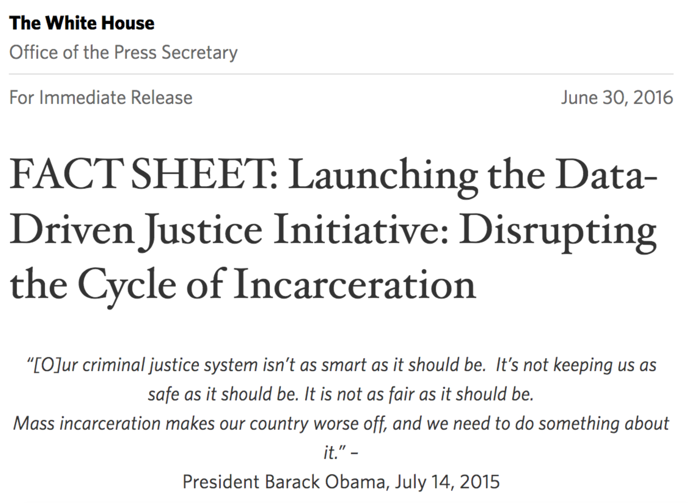
</figure>
]

???

11.4 million people + 23 days

Data shared between agencies - arresting officer checks database, sees if person has been cycling, sees if they need mental health services

Two jails in Florida closed after this

https://obamawhitehouse.archives.gov/the-press-office/2016/06/30/fact-sheet-launching-data-driven-justice-initiative-disrupting-cycle

---

.center[
<figure>
  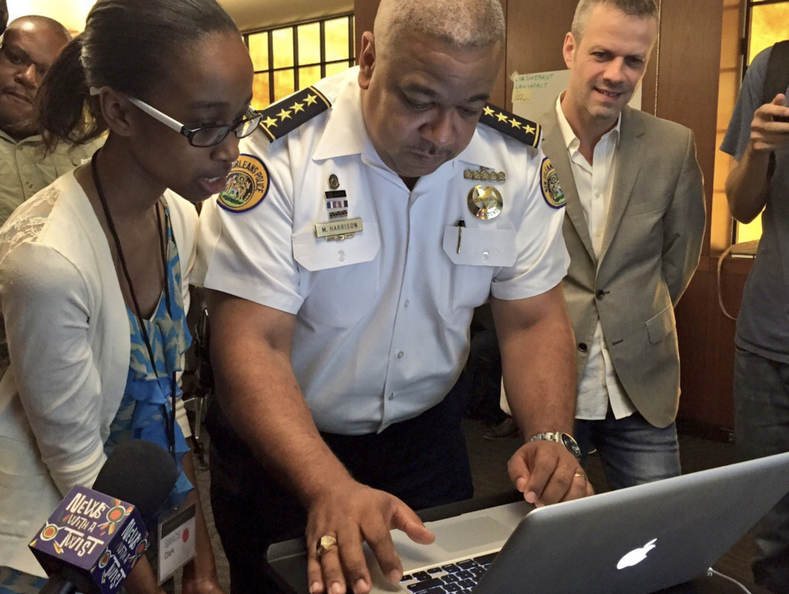
</figure>
]

---

class: bg-full
background-image: url("img/01/open-city-all.png")

???

http://us-cities.survey.okfn.org/

---

class: bg-full
background-image: url("img/01/open-city-atl.png")

???

http://us-cities.survey.okfn.org/place/atlanta

---

class: bg-full
background-image: url("img/01/dataset-search.png")

???

https://datasetsearch.research.google.com/

---

class: middle

.box-5.large[How do you use all this data<br>to make the world better?]

---

class: middle

.box-5.large[Analyze it and<br>uncover insights!]

.box-inv-5[(and take this class!)]

---

layout: true
class: title title-5

---

# What is "statistics"?

&nbsp;

.box-inv-5.medium[Collecting and analyzing data from a representative sample in order to make inferences about a whole population]

---

# What is "data science"?

.box-inv-5.medium.sp-after[Turning raw data into<br>understanding, insight,<br>and knowledge]

--

.pull-left-3[
.box-5.medium[&emsp;Collect&emsp;]
]

.pull-middle-3[
.box-5.medium[&emsp;Analyze&emsp;]
]

.pull-right-3[
.box-5.medium[Communicate]
]

---

# What's the difference?

.pull-left.center[
<figure>
  
</figure>
]

.pull-right[
.box-inv-5.medium[Collect]

.box-inv-5.medium[Analyze]

.box-5.medium[Communicate]
]

---

# What is "program evaluation"?

.box-inv-5.medium[Measuring the effect of<br>social programs on society]

.pull-left[
.box-5[.medium[**Data science**]<br>(data + statistics +<br>communication)]
]

.pull-right[
.box-5[.medium[**Causal inference**]<br>(DAGs + econometrics)]
]

---

layout: false
name: evidence-evaluation-causation
class: center middle section-title section-title-3 animated fadeIn

# Evidence, evaluation,<br>and causation

---

layout: true
class: title title-3

---

# Evidence-based medicine

.center[
<figure>
  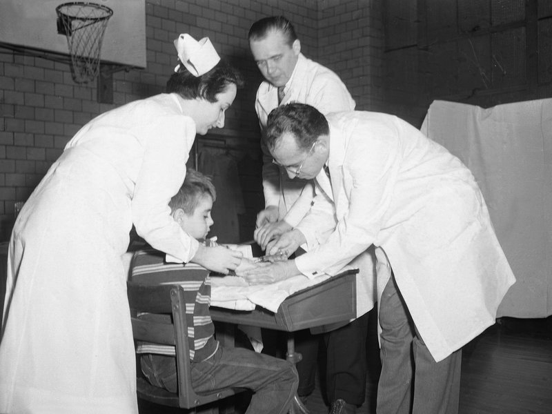
</figure>
]

???

Polio shots administered blindly with placebo - kids didn't know, doctor didn't know (double blind) - effect found

Why not just use those who didn't get a shot as the control group? Why placebo? Kids who opted out were poor (which actually had a lower incidence rate), so you can't compare them with the rich (which had higher incidence rate)

All drugs get the safety and efficacy requirement and double blind RCTs after that

https://www.npr.org/sections/health-shots/2020/05/22/860789014/the-race-for-a-polio-vaccine-differed-from-the-quest-to-prevent-coronavirus

---

# Modern evidence-based medicine

.box-inv-3.medium[Apply evidence to clinical<br>treatment decisions]

--

.box-inv-3.medium.sp-after[Move away from clinical judgment<br>and "craft knowledge"]

--

.box-3.medium[Is this good?]

???

No, this isn’t the greatest. Push for evidence-based practice can crowd out clinical judgment, which is valuable – we can’t ignore it or dismiss it

Doctors have seen things in the past. Lady Sybil in Downton Abbey and preeclampsia - family doctor knew more about the condition and Sybil—he had intuition and experience—but he was ignored

---

# Evidence-based policy

--

.box-inv-3.medium[RAND health insurance study]

--

.box-inv-3.medium[Oregon Medicaid expansion]

--

.box-inv-3.medium[HUD's Moving to Opportunity]

--

.box-inv-3.medium[Tennessee STAR]

???

- RAND: In a large-scale, multiyear experiment, participants who paid for a share of their health care used fewer health services than a comparison group given free care. It concluded that cost sharing reduced "inappropriate or unnecessary" medical care (overutilization), but also reduced "appropriate or needed" medical care.
- Oregon: ongoing
- MTO: Researchers found that voucher recipients lived in lower-crime neighborhoods and generally had better units than the control group families, but the experiment had no impact on earnings or educational attainment. It did, however, have unexpected results in health and happiness. Parents in families who moved to low-poverty areas had lower rates of obesity and depression, and positive impacts on behavior and outlook among young women (but not young men)
- STAR: smaller class sizes lead to better outcomes

---

# Policy evidence industry

--

.box-inv-3.medium[Jameel Poverty Action Lab (J-PAL)]

--

.box-inv-3.medium[Campbell Collaboration]

???

- https://www.povertyactionlab.org/
- https://campbellcollaboration.org/

---

layout: false

&nbsp;

.box-3.large[Should we have evidence for<br>every policy or program?]

--

.box-inv-3.medium[**No!**]

--

.box-inv-3[Science vs. art/craft/intuition]

---

.pull-left.center[
<figure>
  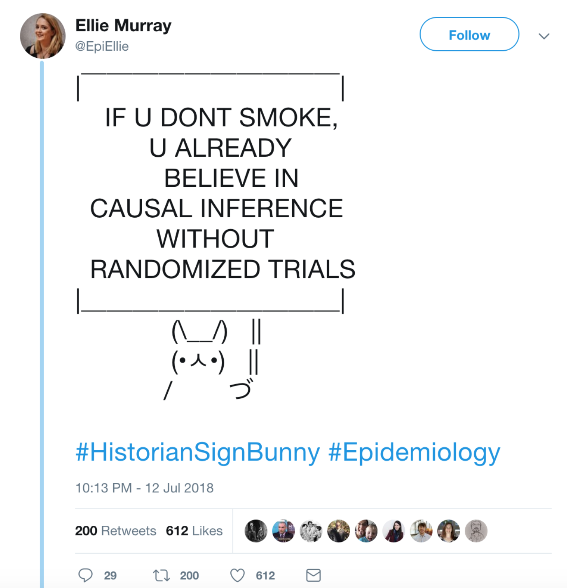
</figure>
]

--

.pull-right.center[
<figure>
  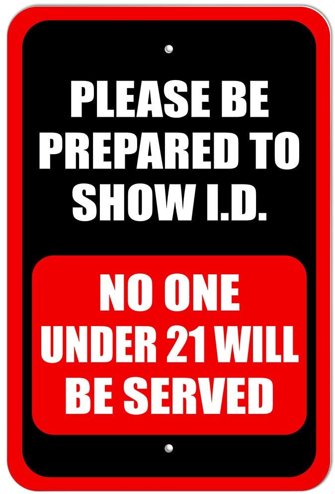
</figure>
]

???

https://twitter.com/epiellie/status/1017622949799571456?s=12

In the 1970s, experts were saying that reducing the drinking age would be fine - 26 states did - created a natural quasi-experiment for researchers - Cook then found that highway fatalities increase by 10% for 18–20-year-olds. That wouldn't have been possible without legislators inadvertently performing the experiment, paving the way for better science 

So knowledge flows between the two sides - use innovation from administrators as the basis for better science 


---

&nbsp;

.box-3.large[Where does program evaluation<br>fit with all this?]

--

.box-inv-3[It's a method for collecting evidence<br>for policies and programs]

---

layout: true
class: title title-3

---

# Types of evaluation

.pull-left.center[
<figure>
  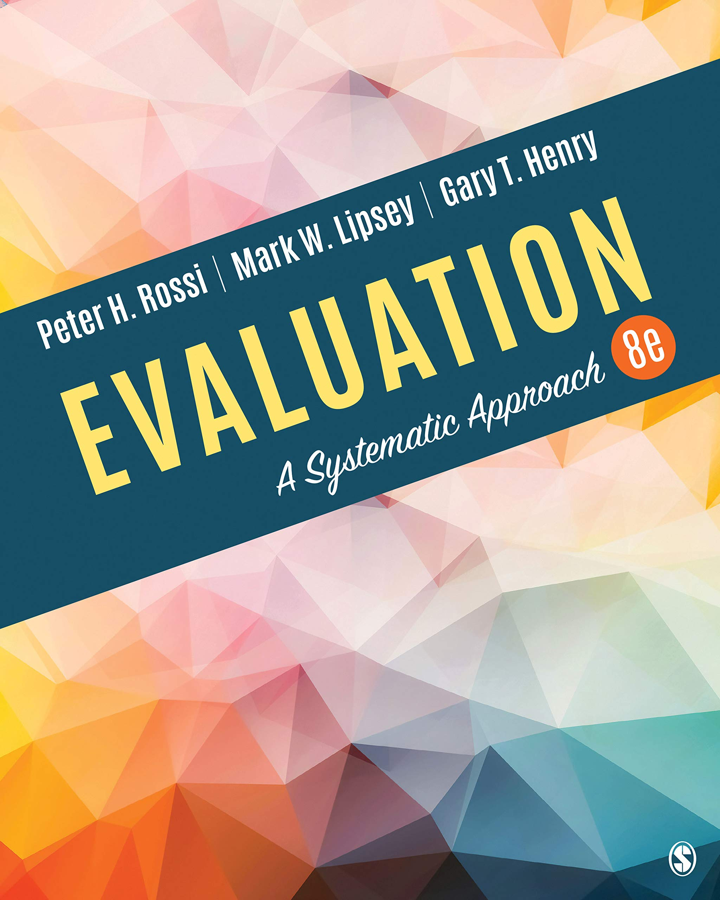
</figure>
]

.pull-right[
.box-inv-3[Needs assessment]

.box-inv-3[Design and<br>theory assessment]

.box-inv-3[Process evaluation<br>and monitoring]

.box-inv-3[Impact evaluation]

.box-inv-3[Efficiency evaluation (CBA)]
]

---

layout: false

.center[
<figure>
  
</figure>
]

---

layout: true
class: title title-3

---

# Theories of change

.center[
<figure>
  
</figure>
]

.box-inv-3[Impact evaluation!]

---

layout: false

.center[
<figure>
  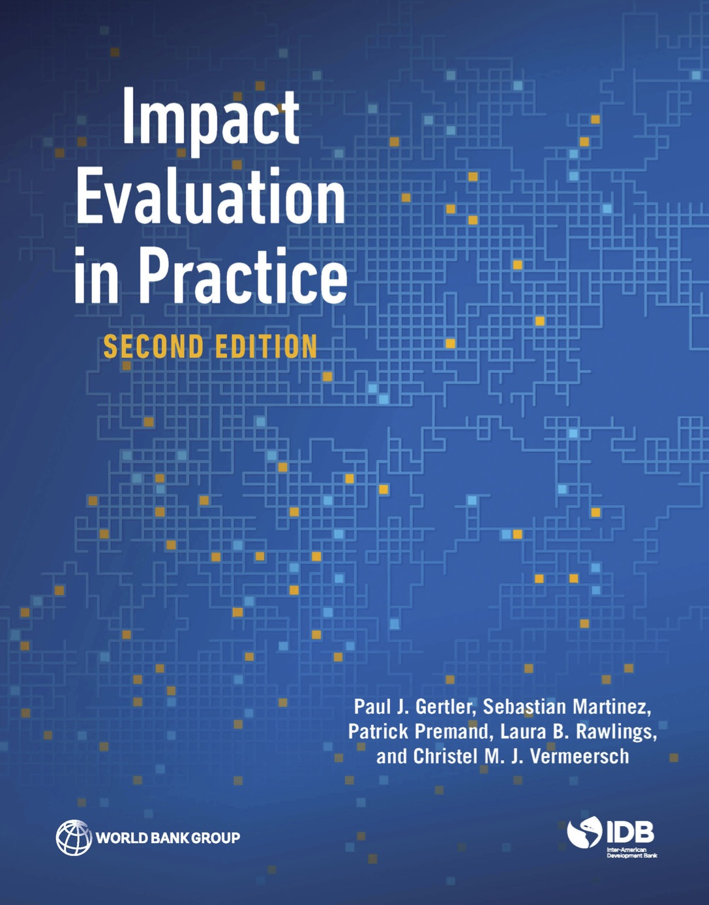
</figure>
]

---

class: title title-3

# Theory → impact

<figure>
  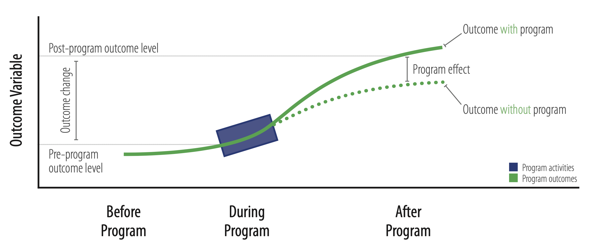
</figure>

---

class: middle

<figure>
  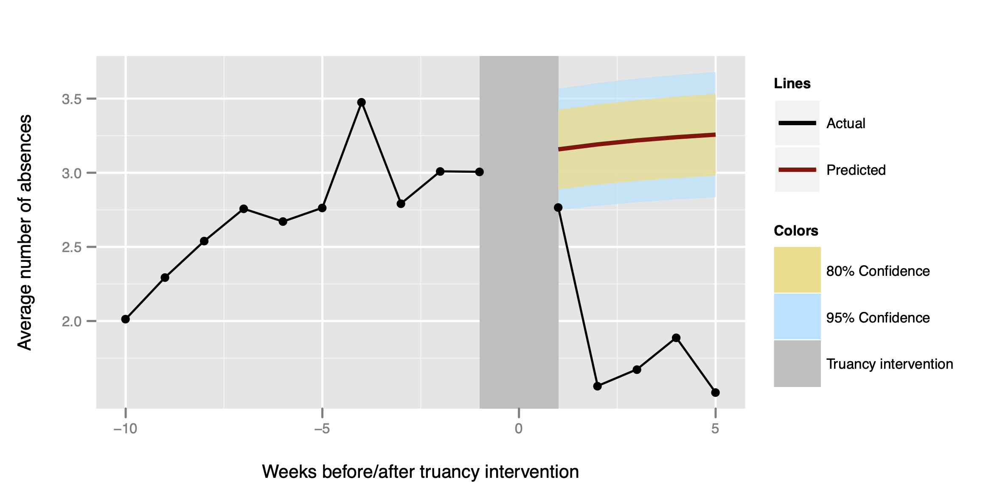
</figure>

---

name: evidence-evaluation-causation1

.center[
<figure>
  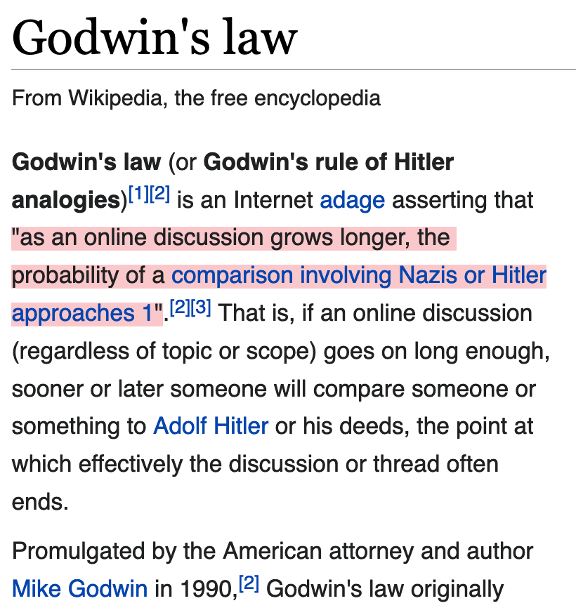
</figure>
]

???

https://en.wikipedia.org/wiki/Godwin%27s_law

---

class: title title-3

# Godwin's Law for statistics

--

.box-inv-3.medium[Correlation does not<br>imply causation]

--

.box-3[Except when it does]

--

.box-3[Even if it doesn't,<br>this phrase is useless<br>and kills discussion]

---

.center[
<figure>
  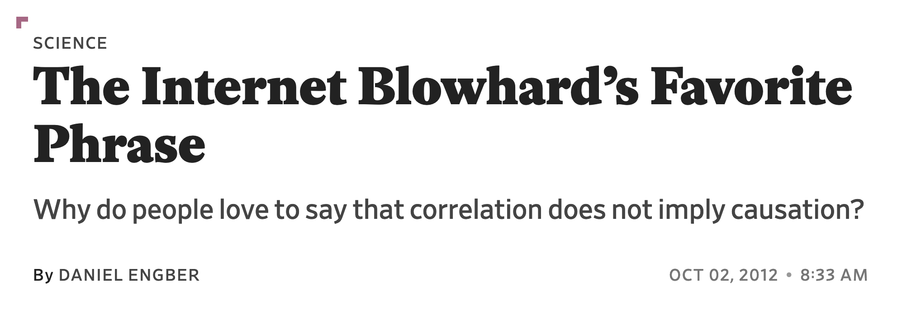
</figure>

<hr>

<figure>
  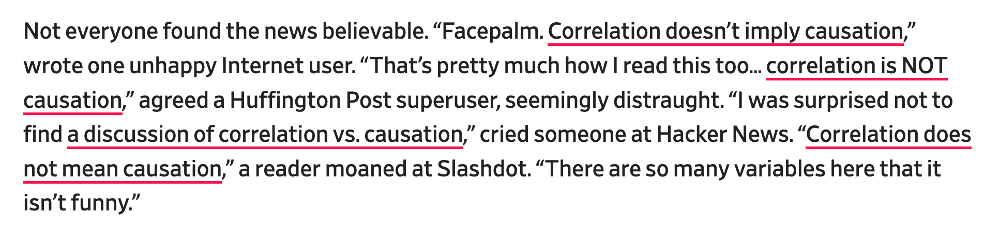
</figure>
]

???

https://slate.com/technology/2012/10/correlation-does-not-imply-causation-how-the-internet-fell-in-love-with-a-stats-class-cliche.html

---

layout: true
class: title title-3

---

# Correlation vs. causation

.pull-left[
.box-inv-3.medium[How do we figure out correlation?]
]

.pull-right[
.box-inv-3.medium[How do we figure out causation?]
]

---

# Correlation vs. causation

.pull-left[
.box-inv-3.medium[How do we figure out correlation?]

.box-3[Math and statistics]
]

.pull-right[
.box-inv-3.medium[How do we figure out causation?]
]

---

# Correlation vs. causation

.pull-left[
.box-inv-3.medium[How do we figure out correlation?]

.box-3[Math and statistics]
]

.pull-right[
.box-inv-3.medium[How do we figure out causation?]

.box-3[Philosophy. No math.]
]

---

layout: false
class: middle

.center[
<figure>
  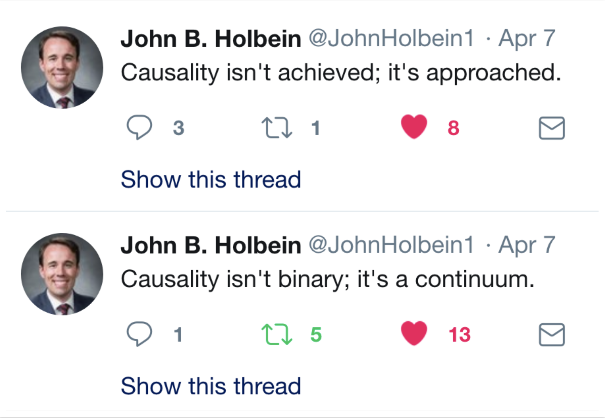
</figure>
]

---

layout: true
class: title title-3

---

# How does we know if **X** causes **Y**?

--

.box-inv-3.medium[**X** causes **Y** if…]

--

.box-inv-3.medium[…we intervene and change **X**<br>without changing anything else…]

--

.box-inv-3.medium[…and **Y** changes]

---

# **Y** "listens to" **X**

--

.box-inv-3["A variable **X** is a cause of a variable **Y** if **Y** in any way relies on **X** for its value.… **X** is a cause of **Y** if **Y** listens to **X** and decides its value in response to what it hears"<br>(Pearl, Glymour, and Jewell 2016, 5–6)]

--

.box-inv-3[**Y** doesn't necessarily listen only to **X**]

--

.box-inv-3[A light switch causes a light to go on, but not<br>if the bulb is burned out (no **Y** despite **X**), or if<br>the light was already on (**Y** without **X**)]

---

# Causal relationships?

--

.box-inv-3.medium[Lighting fireworks causes noise]

--

.box-inv-3.medium[Rooster crows cause the sunrise]

--

.box-inv-3.medium[Getting an MPA/MPP increases your earnings]

--

.box-inv-3.medium[Colds go away a few days<br>after you take vitamin C]

---

# Causation

.box-inv-3.medium[Causation =<br>Correlation + time order +<br>nonspuriousness]

--

.box-3[How do you know if you have it right?]

--

.box-3[You need a philosophical model]

--

.box-3[That's what this class is for!]

---

# The causal revolution

.pull-left-narrow[
<figure>
  
</figure>
]

.pull-right-wide.center[
<figure>
  
</figure>
]

---

# Causal diagrams

.box-inv-3.medium[Directed acyclic graphs (DAGs)]

.pull-left[

.box-3.SMALL[Graphical model of the process that generates the data]

.box-3.SMALL[Maps your philosophical model]

.box-3.SMALL[Fancy math ("*do*-calculus") tells you what to control for to isolate and identify causation]

]

.pull-right[

```{r simple-dag, echo=FALSE, fig.width=4.5, fig.height=3, out.width="100%"}
dagify(
  Y ~ X + Z,
  X ~ Z,
  coords = list(x = c(X = 1, Y = 3, Z = 2),
                y = c(X = 1, Y = 1, Z = 2))
) %>% 
  ggplot(aes(x = x, y = y, xend = xend, yend = yend)) +
  geom_dag_edges() +
  geom_dag_point(color = "grey80", size = 14) +
  geom_dag_text(color = "black", size = 5) +
  theme_dag()
```

]

---

layout: false

```{r edu-earn-simple, echo=FALSE, fig.width=9, fig.height=4.5, out.width="100%"}
edu_earn_coords <- list(x = c(Edu = 2, Earn = 4, Year = 2, Bkgd = 4, 
                              Loc = 3, JobCx = 3, Req = 1, U1 = 3),
                        y = c(Edu = 2, Earn = 2, Year = 3, Bkgd = 3, 
                              Loc = 3, JobCx = 1, Req = 2, U1 = 4))

dagify(
  Earn ~ Edu,
  exposure = "Edu",
  outcome = "Earn",
  coords = edu_earn_coords) %>% 
  tidy_dagitty() %>% 
  node_status() %>% 
  ggplot(aes(x = x, y = y, xend = xend, yend = yend)) +
  geom_dag_edges(start_cap = ggraph::circle(3, "lines"),
                 end_cap = ggraph::circle(3, "lines"),
                 edge_width = 1.5, 
                 arrow_directed = grid::arrow(length = grid::unit(0.75, "lines"), type = "closed")) +
  geom_dag_point(aes(color = status), size = 30) +
  geom_dag_text(color = "black", size = 7) +
  scale_color_manual(values = c("#FF4136", "#0074D9"),
                     na.value = "#7FDBFF") +
  guides(color = "none") +
  theme_dag()
```

---

```{r edu-earn-full, echo=FALSE, fig.width=9, fig.height=4.5, out.width="100%"}
dagify(
  Earn ~ Edu + Year + Bkgd + Loc + JobCx,
  Edu ~ Req + Loc + Bkgd + Year,
  JobCx ~ Edu,
  Bkgd ~ U1,
  Loc ~ U1,
  exposure = "Edu",
  outcome = "Earn",
  latent = "U1",
  labels = c("Earn" = "Earnings", "Edu" = "Education",
             "Year" = "Year", "Bkgd" = "Background",
             "Loc" = "Location", "JobCx" = "Job connections",
             "U1" = "Unobserved stuff"),
  coords = edu_earn_coords) %>% 
  tidy_dagitty() %>% 
  node_status() %>% 
  ggplot(aes(x = x, y = y, xend = xend, yend = yend)) +
  geom_dag_edges() +
  geom_dag_point(aes(color = status), size = 14) +
  geom_dag_text(color = "black", size = 5) +
  scale_color_manual(values = c("#FF4136", "grey60", "#0074D9"),
                     na.value = "#7FDBFF") +
  guides(color = "none") +
  theme_dag()
```

---

```{r smoking-dag, echo=FALSE, fig.width=9, fig.height=4.5, out.width="100%"}
set.seed(123)
dagify(cardiacarrest ~ cholesterol,
       cholesterol ~ smoking + weight,
       smoking ~ unhealthy,
       weight ~ unhealthy,
       labels = c("cardiacarrest" = "Cardiac\n Arrest", 
                  "smoking" = "Smoking",
                  "cholesterol" = "Cholesterol",
                  "unhealthy" = "Unhealthy\n Lifestyle",
                  "weight" = "Weight"),
       latent = "unhealthy",
       exposure = "smoking",
       outcome = "cardiacarrest") %>% 
  ggdag(text = FALSE, use_labels = "label") +
  theme_dag()
```


---

.center[
<figure>
  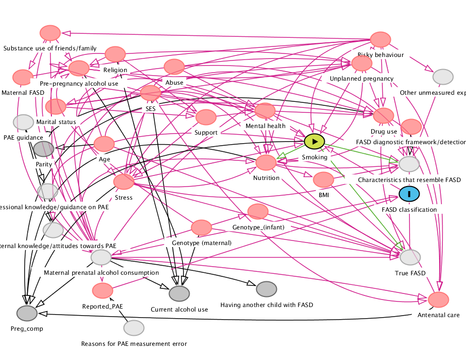
  <figcaption>Effect of smoking on fetal alcohol syndrome</figcaption>
</figure>
]

???

https://link.springer.com/article/10.1007/s00787-018-1264-3


---

class: bg-full
background-image: url("img/01/nyt-dag1.png")

???

https://twitter.com/andrewheiss/status/1208836534285340673

---

class: bg-full
background-image: url("img/01/nyt-dag2.png")

???

https://twitter.com/andrewheiss/status/1208836534285340673

---

layout: false
name: class-details
class: center middle section-title section-title-6 animated fadeIn

# Class details

---

layout: true
class: title title-6

---

# Plan for the class

.center[
<figure>
  
</figure>
]

---

# Textbooks

.pull-left.center[
<figure>
  
</figure>
]

.pull-right.center[
<figure>
  
</figure>
]

---

layout: false

class: bg-full
background-image: url("img/01/geordi.png")

---

layout: true
class: title title-6

---

# Class technology

.center[
<figure>
  
</figure>

<figure>
  
</figure>
]

---

# The tidyverse

.center[
<figure>
  
</figure>
] 

---

# The tidyverse

<figure>
  
</figure>

???

From "Master the Tidyverse" by RStudio

---

# R code, but reads like English!

.small-code[
```{r example-code, eval=FALSE}
strike_damages_month <- bird_strikes %>% 
  group_by(Month) %>% 
  summarize(total_damages = sum(Cost, na.rm = TRUE),
            average_damages = mean(Cost, na.rm = TRUE))

ggplot(data = strike_damages_month, 
       mapping = aes(x = Month, y = total_damages)) + 
  geom_col() + 
  scale_y_continuous(labels = dollar) +
  labs(x = "Month",
       y = "Total damages",
       title = "Really expensive collisions happen in the fall?",
       subtitle = "Don't fly in August or October?",
       caption = "Source: FAA Wildlife Strike Database")
```
]
---

# Sucking

.center[
.box-inv-6.medium[“There is no way of knowing nothing about a subject to knowing something about a subject without going through a period of much frustration and suckiness.”]

.box-inv-6.medium[**“Push through. You’ll suck less.”**]

.box-inv-6.tiny[Hadley Wickham, author of **ggplot2**]
]

???

[Source for quote](https://twitter.com/Akbaritabar/status/1022057084802748416)

---

# Sucking

&nbsp;

.pull-left[
<figure>
  
</figure>
]

--

.pull-right[
<figure>
  
  <figcaption><a href="https://www.nytimes.com/2017/04/28/opinion/its-great-to-suck-at-surfing.html" target="_blank">Karen Rinaldi, "(It's Great to) Suck at Something"</a></figcaption>
</figure>
]

---

# Am I making you computer scientists?

--

.box-inv-6.huge[**No!**]

--

.box-6[You don't need to be a mechanic to drive a car safely]

--

.box-6[You don't need to be a computer scientist<br>or developer to use R safely]

???

Words of wisdom from @allison_horst to her data analysis class this quarter: You don't need to be a mechanic to drive a car safely, and you don't need to be a computer scientist or developer to use R safely. #rstats #tidytuesday

https://twitter.com/ameliaritger/status/1214682596182904832?s=12

I always teach my students: there’s three levels of skill: driver, mechanic, engineer. You’re here to get your drivers license. But being able to change a tire can be helpful. Don’t worry not every one has to be an engineer. (I talk about R in social sciences)

https://twitter.com/Sumidu/status/1214695065387438083

---

# Learning R

.center[
<figure>
  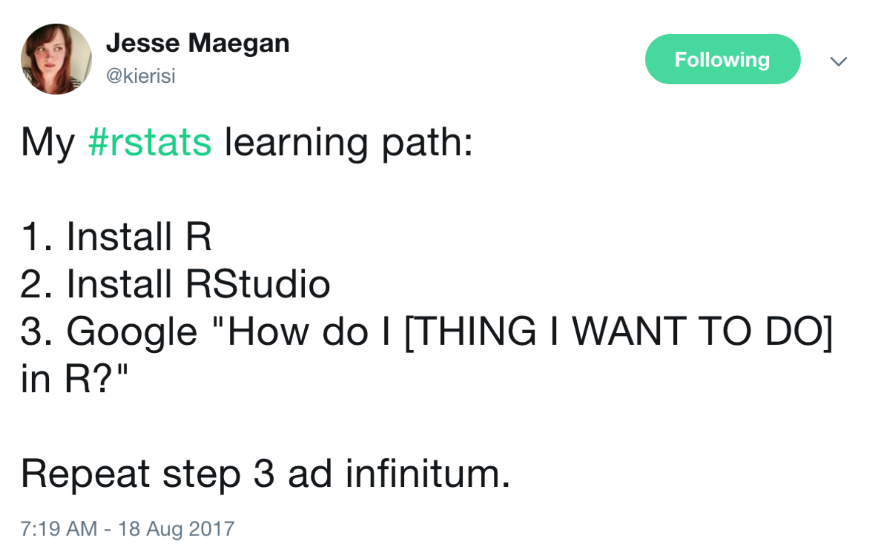
</figure>
]

???

https://twitter.com/kierisi/status/898534740051062785

---

layout: false
class: center middle

.box-6.huge[You can do this.]

---

layout: true
class: title title-6

---

# Goals for the class

--

.box-inv-6.medium[~~Become an expert with R~~]

--

.box-inv-6.medium[Speak and do causation]

--

.box-inv-6.medium[Design rigorous evaluations]

--

.box-6.medium[Change the world with data]

---

# Prerequisites

--

.box-inv-6.medium[**Math skills**]

.box-inv-6.small.sp-after[Basic algebra]

--

.box-inv-6.medium[**Computer science skills**]

.box-inv-6.small.sp-after[None]

--

.box-inv-6.medium[**Statistical skills**]

.box-inv-6.small[Regression, differences in means, and statistical significance]
