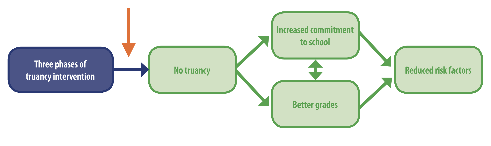
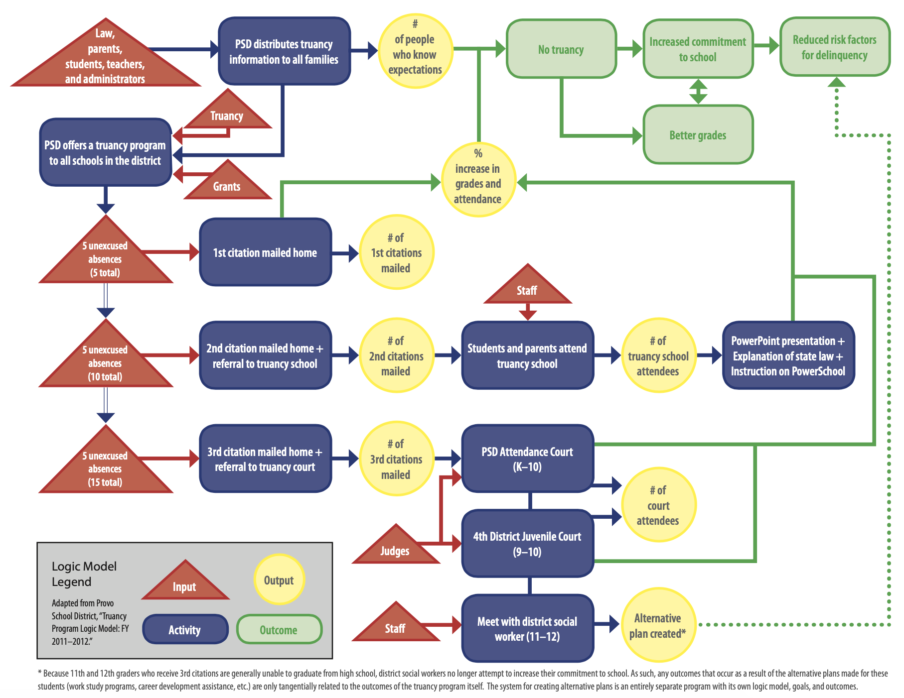
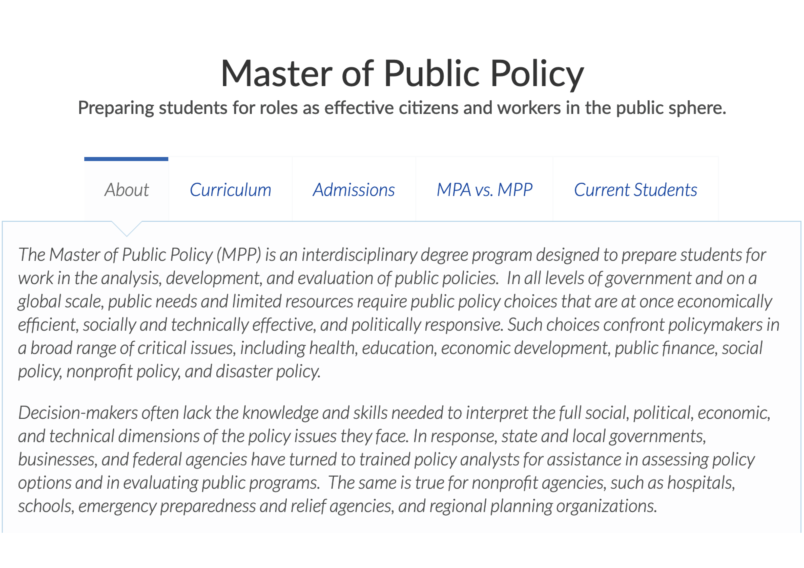

```{r setup, include=FALSE}
knitr::opts_chunk$set(warning = FALSE, message = FALSE, 
                      fig.retina = 3, fig.align = "center")
```

```{r packages-data, include=FALSE}
library(tidyverse)
library(ggdag)
library(palmerpenguins)
library(modelsummary)
```

```{r xaringanExtra, echo=FALSE}
xaringanExtra::use_xaringan_extra(c("tile_view"))
```

class: center middle main-title section-title-3

# In-person<br>session 3

.class-info[

**January 27, 2022**

.light[PMAP 8521: Program evaluation<br>
Andrew Young School of Policy Studies
]

]

---

name: outline
class: title title-inv-8

# Plan for today

--

.box-4.medium.sp-after-half[Regression and R stuff]

--

.box-1.medium.sp-after-half[Logic models]

---

layout: false
name: regression
class: center middle section-title section-title-4 animated fadeIn

# Regression and R stuff

---

class: middle

.box-4.large[Big ol' example of running,<br>interpreting, and exploring<br>some regression models]

---

class: middle

.box-4.huge[andhs.co/live]

---

class: middle

.box-4.large[Side-by-side regression tables]

---

```{r echo=FALSE, warning=FALSE}
model1 <- lm(body_mass_g ~ bill_length_mm, data = penguins)
model2 <- lm(body_mass_g ~ flipper_length_mm, data = penguins)
model3 <- lm(body_mass_g ~ bill_length_mm + flipper_length_mm, data = penguins)
model4 <- lm(body_mass_g ~ bill_length_mm + flipper_length_mm + sex, data = penguins)

modelsummary(list(model1, model2, model3, model4),
             table.attr = "style=\'font-size:0.5em;\'",
             stars = TRUE,
             output = "kableExtra")
```

---

```{r echo=FALSE}
modelsummary(list(model1, model2, model3, model4),
             stars = TRUE,
             output = "kableExtra")
```

---

class: middle

.box-4.large[See full documentation and<br>examples for `modelsummary()` [here](https://vincentarelbundock.github.io/modelsummary/articles/modelsummary.html)]

---

layout: true
class: middle

---

.box-4.large[Make nicer tables when<br>knitting with `kable()`]

.box-inv-4[(Or even fancier tables with [kableExtra](https://cran.r-project.org/web/packages/kableExtra/vignettes/awesome_table_in_html.html)!)]

---

.box-4.large[Style suggestions]

---

.box-4.large[Typing math]

---

.box-4.large[Cleaner chunk output]

---

.box-4.large[Figure resizing]

---

.box-4.large[Non-English characters in PDFs]

---

layout: false
name: logic-models
class: center middle section-title section-title-1 animated fadeIn

# Logic models

---

layout: true
class: middle

---

.box-1.large[Logic models as managerial tools]

---

.box-1.large[Inputs vs. Activities vs.<br>Outputs vs. Outcomes]

---

.box-1.large[Impact theory vs. logic model]

---

layout: false
class: title title-1

# Impact theory

.box-inv-1[Ensure that the theory linking activities to the outcomes is sound!]

.center[
<figure>
  
</figure>
]

---

.center[
<figure>
  
</figure>
]

---

layout: false
class: title title-1

# MPA/MPP at GSU

.pull-left[
<figure>
  
</figure>
]

.pull-right[
<figure>
  
</figure>
]

???

Inputs:

- Students
- Curriculum
- Money (grants, tuition)
- AYSPS itself
- Faculty, staff
- Technology (iCollege, PAWS)
- Infrastructure
- Transportation
- State regulations
- National accreditation standards
- Faculty research

Activities:

- Classes
- Group work
- Exams
- Internships
- Job fairs
- Commencement
- Studying
- Tutoring
- Office hours
- Advising
- Attendance

Outputs:

- Assignments and projects
- Grades
- Degree
- Jobs
- Awards
- Network
- Debt

Outcomes:

- Leadership
- AYS national ranking
- Public service motivation
- Critical thinking
- Efficient workforce
- Income
- Better society

---

layout: true
class: middle

---

.box-1.medium[Isn't it best to always<br>have an articulated theory?] 

.box-1.medium[Should implicit theory and articulated theory<br>be the same thing in most cases?]

---

.box-1.medium[How much does this evaluation stuff cost?] 

.box-1.medium[Can you do scaled-down versions<br>of these evaluations?]

---

.box-1.medium[What if a program exists already<br>and doesn't have a logic model?] 

.box-1.medium[What if a program exists already and doesn't have baseline data (or any data!)?]

---

.box-1.medium[How can programs evaluate their final<br>outcomes if they are not measurable?<br>Do they find a different outcome<br>that is easier to measure?]

.box-1.medium[Why would they pick final outcomes<br>that can't be measured?]

---

.box-1.medium[What should you do if you find that your theory of change (or logic model in general) is wrong in the middle of the program? Is it ethical to stop or readjust?]

---

layout: true
class: title title-1

---

# Outcomes and programs

.box-1.medium[Outcome variable]

.box-inv-1.sp-after-half.SMALL[Thing you're measuring]

--

.box-1.medium[Outcome change]

.box-inv-1.sp-after-half.SMALL[∆ in thing you're measuring over time]

--

.box-1.medium[Program effect]

.box-inv-1.SMALL[∆ in thing you're measuring over time *because of* the program]

---

# Outcomes and programs

<figure>
  
</figure>
