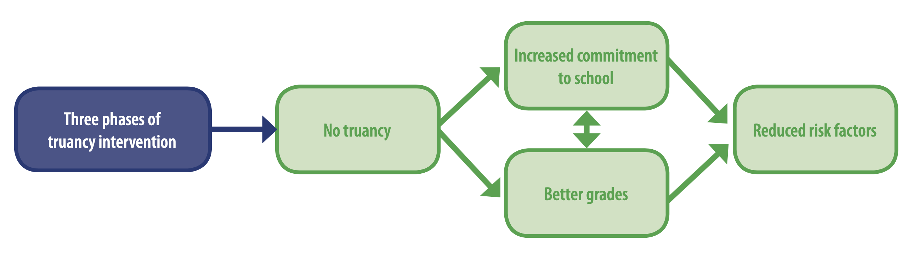
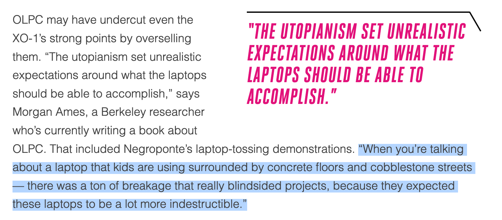
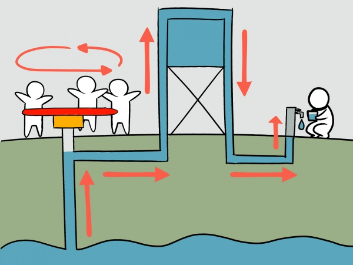
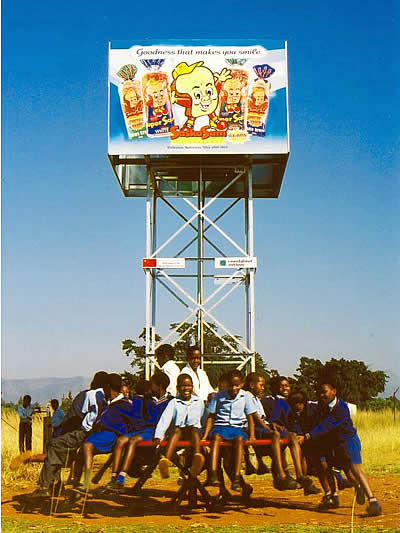
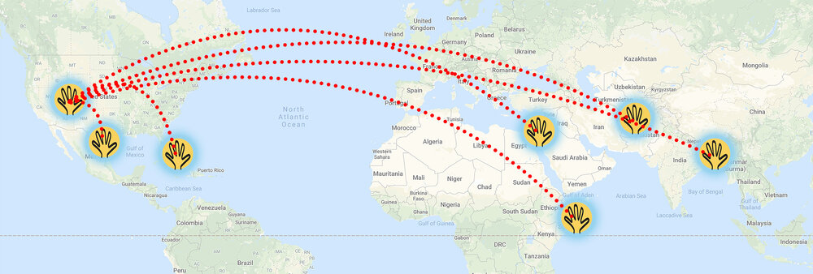
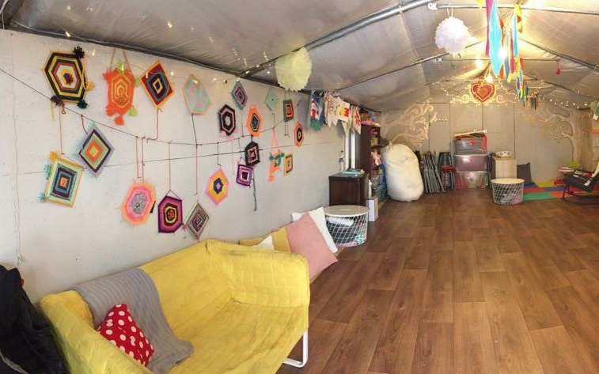
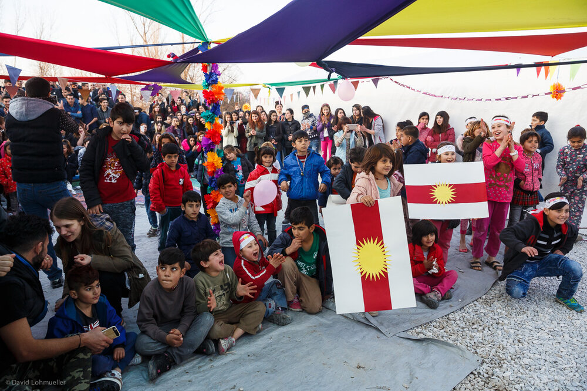
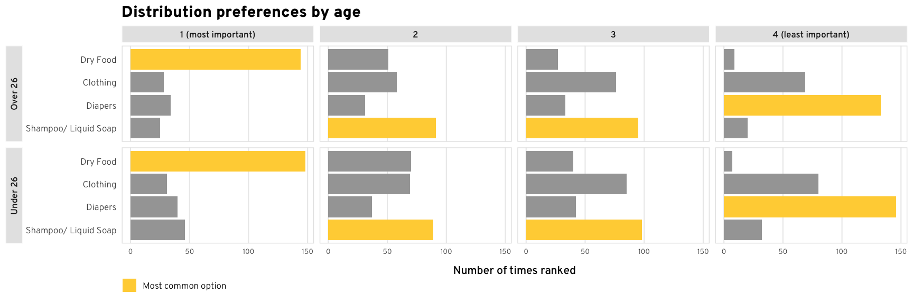
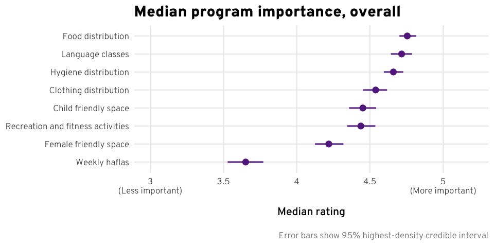

```{r setup, include=FALSE}
knitr::opts_chunk$set(warning = FALSE, message = FALSE, 
                      fig.retina = 3, fig.align = "center")
```

```{r packages-data, include=FALSE}
#
```

```{r xaringanExtra, echo=FALSE}
xaringanExtra::use_xaringan_extra(c("tile_view"))
```

class: center middle main-title section-title-7

# Theories<br>of change

.class-info[

**Session 3**

.light[PMAP 8521: Program evaluation<br>
Andrew Young School of Policy Studies
]

]

---

name: outline
class: title title-inv-8

# Plan for today

--

.box-1.medium.sp-after-half[Reproducibility]

--

.box-2.medium.sp-after-half[Program theories]

--

.box-6.medium[Logic models & results chains]

---

name: reproducibility
class: center middle section-title section-title-1 animated fadeIn

# Reproducibility

---

layout: true
class: title title-1

---

# Why am I making you learn R?

&nbsp;

--

.box-inv-1.medium[More powerful]

--

.box-inv-1.medium[Free and open source]

--

.box-inv-1.medium.sp-after[Reproducibility]

---

# Austerity and Excel

.pull-left[

<figure>
  
</figure>

.box-inv-1[Debt:GDP ratio<br>90%+ → −0.1% growth]

]

--

.pull-right.center[

<figure>
  
  <figcaption>Paul Ryan's 2013 House budget resolution</figcaption>
</figure>

]

???

[2013 House Budget Resolution](https://republicans-budget.house.gov/uploadedfiles/pathtoprosperity2013.pdf)

---

# Austerity and Excel

.pull-left.center[

<figure>
  
  <figcaption>Thomas Herndon</figcaption>
</figure>

]

--

.pull-right.center[

<figure>
  
  <figcaption>From <a href="https://www.nytimes.com/2013/04/19/opinion/krugman-the-excel-depression.html" target="_blank">Paul Krugman, "The Excel Depression"</a></figcaption>
</figure>

]

???

[Paul Krugman on the reproducibility crisis](https://www.nytimes.com/2013/04/19/opinion/krugman-the-excel-depression.html)

---

# Austerity and Excel

.center[
<figure>
  
</figure>
]

--

.box-inv-1[Debt:GDP ratio = 90%+ → 2.2% growth (!!)]

---

# Genes and Excel

.pull-left-3[
.box-inv-1[Septin 2]
]

.pull-middle-3[
.box-inv-1[Membrane-Associated Ring Finger (C3HC4) 1]
]

.pull-right-3[
.box-inv-1[2310009E13]
]

--

.center.sp-after[
<figure>
  
</figure>
]

--

.center[
.box-1[20% of genetics papers between 2005–2015 (!!!)]
]

---

# General guidelines

.box-inv-1.medium[Don't touch the raw data]

.box-1[If you do, explain what you did!]

--

.box-inv-1.medium[Use self-documenting, reproducible code]

.box-1[R Markdown!]

--

.box-inv-1.medium[Use open formats]

.box-1[Use .csv, not .xlsx]

---

# R Markdown in real life

.pull-left.center[

<figure>
  
  <figcaption><a href="https://peerj.com/preprints/3182.pdf" target="_blank">Airbnb, ggplot, and rmarkdown</a></figcaption>
</figure>

]

--

.pull-right.center[

&nbsp;

<figure>
  
</figure>

<figure>
  
  <figcaption><a href="https://dataingovernment.blog.gov.uk/2017/03/27/reproducible-analytical-pipeline/" target="_blank">The UK's reproducible analysis pipeline</a></figcaption>
</figure>

]

???

https://peerj.com/preprints/3182.pdf + https://gdsdata.blog.gov.uk/2017/03/27/reproducible-analytical-pipeline/ 

---

layout: false
name: program-theories
class: center middle section-title section-title-6 animated fadeIn

# Program theories

---

layout: true
class: title title-6

---

# Elements of a program

.pull-left[
.box-inv-6[Inputs]

.box-6.smaller.sp-after[Things that go into an activity; money, people, time, etc.]

.box-inv-6[Activities]

.box-6.smaller.sp-after[Actions that convert inputs to outputs; things that the program does]
]

--

.pull-right[
.box-inv-6[Outputs]

.box-6.smaller.sp-after[Tangible goods and services produced by activities; you have control over these]

.box-inv-6[Outcomes]

.box-6.smaller.sp-after[What happens when the target population uses the outputs; you don't have control over these]
]

--

.center[<br>**Inputs → Activities → Outputs → Outcomes**]


---

# Program theory

.box-inv-6.medium[How and why an<br>intervention causes change]

--

.box-6[A sequence of events that connects inputs to<br>activities to outputs to outcomes]

--

.box-6[Why you think inputs → activities → outputs → outcomes]

---

# Impact theory

.box-inv-6.medium.sp-after[Causes (activities) linked to effects (outcomes)]

--

.center[
<figure>
  
</figure>
]

---

# One Laptop Per Child (OLPC)

.center[
<figure>
  
</figure>
]

???

Nicholas Negroponte from MIT, started the Media Lab there

Draw impact theory: access to computers → 21st century skills, access to global marketplace, reduction of poverty, growth of local businesses

https://www.theverge.com/2018/4/16/17233946/olpcs-100-laptop-education-where-is-it-now

https://en.wikipedia.org/wiki/OLPC_XO#/media/File:XO-Beta1-mikemcgregor-2.jpg

---

# OLPC

&nbsp;

.pull-left-narrow[
<iframe width="560" height="315" src="https://www.youtube.com/embed/H4F_0sshG28?start=704" frameborder="0" allow="accelerometer; autoplay; encrypted-media; gyroscope; picture-in-picture" allowfullscreen></iframe>
]

--

.pull-right-wide[
<figure>
  
  <figcaption><small>Adi Robertson, <a href="https://www.theverge.com/2018/4/16/17233946/olpcs-100-laptop-education-where-is-it-now">"OLPC's $100 laptop was going to change the world—then it all went wrong"</a></small></figcaption>
</figure>
]

???

Everything fell apart though. It wasn’t ready—it had unrealistic expectations and was too utopian. It also didn’t take local conditions into account

https://www.youtube.com/watch?v=H4F_0sshG28

---

# PlayPumps

.pull-left[
<figure>
  
</figure>
]

.pull-right.center[
<figure>
  
</figure>
]

???

Improved access to water → better health, better education, reduction in poverty

> The Guardian calculated in 2009 that children would have to "play" for 27 hours every day to meet PlayPumps' stated targets of providing 2,500 people per pump with their daily water needs. (https://en.wikipedia.org/wiki/Roundabout_PlayPump)

Have kids play to get water out. Led to overuse – main problem in many areas isn’t access to water, but scarcity of water – only works in locations with lots of good water that’s not too deep and where infrastructure is lacking

Is children playing is an appropriate source of energy for water? The line between work and play isn’t as clear-cut as one would think. – can lead to exploitation

https://blogs.ei.columbia.edu/2010/07/01/the-playpump-what-went-wrong/

http://docan.jp/idea-source/playpumps/?lang=en

---

# Why theorize?

.pull-left[
.box-6[Implicit theory]

.box-inv-6.small[What program designers think or assume is going to happen, and why]

.box-inv-6[Assumed]
]

--

.pull-right[
.box-6[Articulated theory]

.box-inv-6.small[What program designers officially claim and predict, and why]

.box-inv-6.sp-after[Written down]

]

--

.box-inv-6.medium[Should all social programs be<br>rooted in explicit articulated theory?]


???

What difference does articulation make?

---

layout: false

.center[
<figure>
  
</figure>
]

.pull-left.center[
<figure>
  
</figure>
]

.pull-right.center[
<figure>
  
</figure>
]

---

.center[
<figure>
  
</figure>
]

--

.center[
<figure>
  
</figure>
]

---

class: title title-6

# Impact theory

.box-inv-6[Ensure that the theory linking activities to the outcomes is sound!]

.center[
<figure>
  
</figure>
]

---

layout: false
name: logic-models
class: center middle section-title section-title-2 animated fadeIn

# Logic models<br>& results chains

---

class: bg-full
background-image: url("img/03/wb-results-chain.png")

???

p. 39 in *Impact Evaluation in Practice*, The World Bank

---

.center[
<figure>
  
</figure>
]

---

layout: true
class: title title-2

---

# Impact theory vs. logic model

.pull-left[
&nbsp;

<figure>
  
</figure>
]

.pull-right[
<figure>
  
</figure>
]

---

# MPA/MPP at GSU

.pull-left[
<figure>
  
</figure>
]

.pull-right[
<figure>
  
</figure>
]

???

Inputs:

- Students
- Curriculum
- Money (grants, tuition)
- AYSPS itself
- Faculty, staff
- Technology (iCollege, PAWS)
- Infrastructure
- Transportation
- State regulations
- National accreditation standards
- Faculty research

Activities:

- Classes
- Group work
- Exams
- Internships
- Job fairs
- Commencement
- Studying
- Tutoring
- Office hours
- Advising
- Attendance

Outputs:

- Assignments and projects
- Grades
- Degree
- Jobs
- Awards
- Network
- Debt

Outcomes:

- Leadership
- AYS national ranking
- Public service motivation
- Critical thinking
- Efficient workforce
- Income
- Better society
