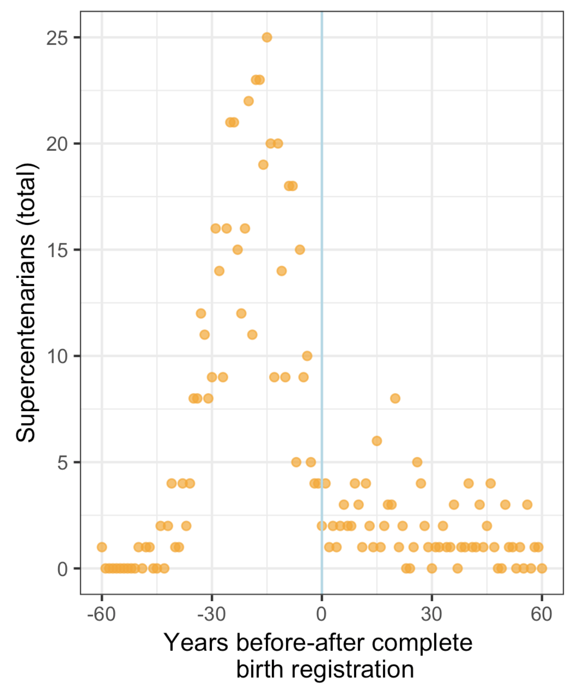
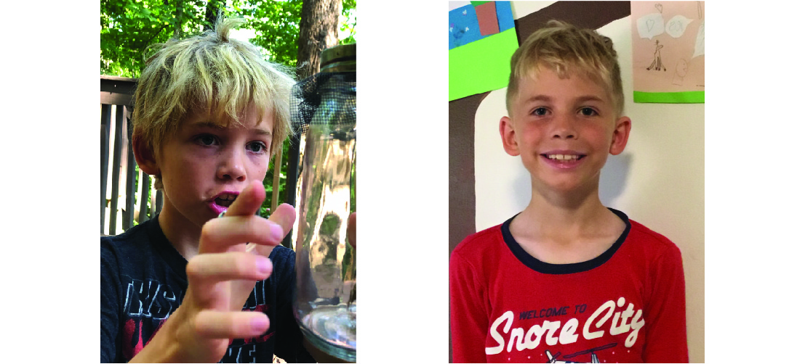
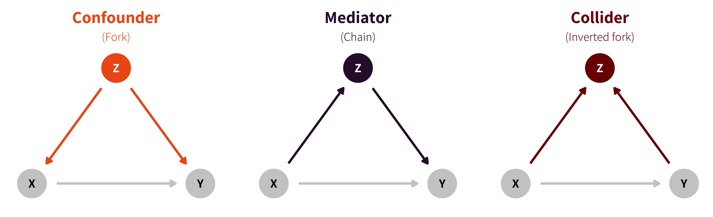

```{r setup, include=FALSE}
knitr::opts_chunk$set(warning = FALSE, message = FALSE, 
                      fig.retina = 3, fig.align = "center")
```

```{r packages-data, include=FALSE}
library(tidyverse)
library(ggdag)
library(palmerpenguins)
library(modelsummary)
```

```{r xaringanExtra, echo=FALSE}
xaringanExtra::use_xaringan_extra(c("tile_view"))
```

class: center middle main-title section-title-3

# In-person<br>session 4

.class-info[

**September 12, 2022**

.light[PMAP 8521: Program evaluation<br>
Andrew Young School of Policy Studies
]

]

---

name: outline
class: title title-inv-8

# Plan for today

--

.box-4.medium.sp-after-half[Quick useful R tips]

--

.box-1.medium.sp-after-half[Logic models]

--

.box-2.medium.sp-after-half[Measuring outcomes]

--

.box-5.medium[DAGs]

---

layout: false
name: final-project
class: center middle section-title section-title-6 animated fadeIn

# Final project details

---

layout: false
name: r-stuff
class: center middle section-title section-title-4 animated fadeIn

# Quick useful<br>R tips

---

layout: true
class: middle

---

.box-4.large[Visual markdown editor]

---

.box-4.large[Weird figure/table<br>placement in PDFs]

???

https://bookdown.org/yihui/rmarkdown-cookbook/figure-placement.html

---

.box-4.large[Figure and table<br>captions and numbers]

???

- <https://bookdown.org/yihui/rmarkdown-cookbook/figure-number.html>
- <https://rmd4sci.njtierney.com/figures-tables-captions-.html>
- <https://rmd4sci.njtierney.com/start.html>

---

class: middle

.box-4.large[Side-by-side regression tables]

---

```{r echo=FALSE, warning=FALSE}
model1 <- lm(body_mass_g ~ bill_length_mm, data = penguins)
model2 <- lm(body_mass_g ~ flipper_length_mm, data = penguins)
model3 <- lm(body_mass_g ~ bill_length_mm + flipper_length_mm, data = penguins)
model4 <- lm(body_mass_g ~ bill_length_mm + flipper_length_mm + sex, data = penguins)

modelsummary(list(model1, model2, model3, model4),
             table.attr = "style=\'font-size:0.5em;\'",
             stars = TRUE,
             output = "kableExtra")
```

---

```{r echo=FALSE}
modelsummary(list(model1, model2, model3, model4),
             stars = TRUE,
             output = "kableExtra")
```

---

class: middle

.box-4.large[See full documentation and<br>examples for `modelsummary()` [here](https://vincentarelbundock.github.io/modelsummary/articles/modelsummary.html)]

---

layout: true
class: middle

---

.box-4.large[Make nicer tables when<br>knitting with `kable()`]

.box-inv-4[(Or even fancier tables with [kableExtra](https://cran.r-project.org/web/packages/kableExtra/vignettes/awesome_table_in_html.html)!)]

---

layout: false
name: logic-models
class: center middle section-title section-title-1 animated fadeIn

# Logic models

---

layout: true
class: middle

---

.box-1.large[Logic models as managerial tools]

---

.box-1.large[Inputs vs. Activities vs.<br>Outputs vs. Outcomes]

---

.box-1.large[Impact theory vs. logic model]

---

layout: false
class: title title-1

# Impact theory

.box-inv-1[Ensure that the theory linking activities to the outcomes is sound!]

.center[
<figure>
  
</figure>
]

---

.center[
<figure>
  
</figure>
]

---

layout: false
class: title title-1

# MPA/MPP at GSU

.pull-left[
<figure>
  
</figure>
]

.pull-right[
<figure>
  
</figure>
]

???

Inputs:

- Students
- Curriculum
- Money (grants, tuition)
- AYSPS itself
- Faculty, staff
- Technology (iCollege, PAWS)
- Infrastructure
- Transportation
- State regulations
- National accreditation standards
- Faculty research

Activities:

- Classes
- Group work
- Exams
- Internships
- Job fairs
- Commencement
- Studying
- Tutoring
- Office hours
- Advising
- Attendance

Outputs:

- Assignments and projects
- Grades
- Degree
- Jobs
- Awards
- Network
- Debt

Outcomes:

- Leadership
- AYS national ranking
- Public service motivation
- Critical thinking
- Efficient workforce
- Income
- Better society

---

layout: true
class: middle

---

.box-1.medium[Isn't it best to always<br>have an articulated theory?] 

.box-1.medium[Should implicit theory and articulated theory<br>be the same thing in most cases?]

---

.box-1.medium[How much does this evaluation stuff cost?] 

.box-1.medium[Can you do scaled-down versions<br>of these evaluations?]

---

.box-1.medium[What if a program exists already<br>and doesn't have a logic model?] 

---

.box-1.medium[Why would a program aim for final outcomes<br>that can't be measured?]

---

.box-1.medium[What should you do if you find that your<br>theory of change (or logic model in general)<br>is wrong in the middle of the program?<br>Is it ethical to stop or readjust?]

---

layout: false
name: outcomes
class: center middle section-title section-title-2 animated fadeIn

# Measuring<br>outcomes

---

layout: true
class: title title-2

---

# Outcomes and programs

.box-2.medium[Outcome variable]

.box-inv-2.sp-after-half.SMALL[Thing you're measuring]

--

.box-2.medium[Outcome change]

.box-inv-2.sp-after-half.SMALL[∆ in thing you're measuring over time]

--

.box-2.medium[Program effect]

.box-inv-2.SMALL[∆ in thing you're measuring over time *because of* the program]

---

# Outcomes and programs

<figure>
  
</figure>

---

layout: false
class: middle

.box-2.large[Abstraction]

---

layout: false
name: dags
class: center middle section-title section-title-5 animated fadeIn

# DAGs

---

layout: true
class: middle

---

.box-5.large[Causal thinking is necessary—<br>even for descriptive work!]

---

.center[

<figure>
  
</figure>

]

???

Necessity of causal thinking: Mention the McElreath tweet on birth certificate introduction and death ages: <https://twitter.com/rlmcelreath/status/1427564280744976384>

<https://www.biorxiv.org/content/10.1101/704080v2>

---

layout: false

.box-5.less-medium["Every time I get a haircut, I become more mature!"]

<figure>
  
</figure>

---

.box-5.less-medium["Every time I get a haircut, I become more mature!"]

```{r echo=FALSE, fig.width=5, fig.height=2, out.width="70%", fig.align="center"}
set.seed(1234)
dagify(
  Y ~ X,
  coords = list(x = c(X = 1, Y = 3),
                y = c(X = 1, Y = 1)),
  exposure = "X",
  outcome = "Y",
  labels = c("X" = "Haircut", "Y" = "Maturity")
) %>% 
  tidy_dagitty() %>% 
  node_status() %>% 
  ggplot(aes(x = x, y = y, xend = xend, yend = yend)) +
  geom_dag_edges() +
  geom_dag_point(aes(color = status), size = 15) +
  geom_dag_text(color = "white", size = 5) +
  geom_dag_text(aes(label = label), nudge_y = 0.1, 
                size = 5, color = "black") +
  scale_color_manual(values = c("#FF4136", "#0074D9"),
                     na.value = "#7FDBFF") +
  coord_cartesian(ylim = c(0.9, 1.2)) +
  guides(color = "none") +
  theme_dag()
```

.center[$$E[\text{Maturity} \mid \operatorname{do} (\text{Get haircut})]$$]

---

.box-5.less-medium[Getting older opens a backdoor path]

```{r echo=FALSE, fig.width=5, fig.height=3, out.width="70%", fig.align="center"}
dagify(
  Y ~ X + Z,
  X ~ Z,
  coords = list(x = c(X = 1, Y = 3, Z = 2),
                y = c(X = 1, Y = 1, Z = 2)),
  exposure = "X",
  outcome = "Y",
  labels = c("X" = "Haircut", "Y" = "Maturity",
             "Z" = "Getting older")
) %>% 
  tidy_dagitty() %>% 
  node_status() %>% 
  ggplot(aes(x = x, y = y, xend = xend, yend = yend)) +
  geom_dag_edges() +
  geom_dag_point(aes(color = status), size = 15) +
  geom_dag_text(color = "white", size = 5) +
  geom_dag_text(aes(label = label), nudge_y = 0.25, 
                size = 5, color = "black") +
  scale_color_manual(values = c("#FF4136", "#0074D9"),
                     na.value = "#7FDBFF") +
  coord_cartesian(ylim = c(0.9, 2.2)) +
  guides(color = "none") +
  theme_dag()
```

---

class: middle

.box-5.medium[But what does that mean,<br>"opening a backdoor path"?]

.box-5.medium[How does statistical association<br>get passed through paths?]

---

.box-5.less-medium.sp-after[How do I know which of these is which?]

.center[
<figure>
  
</figure>
]

---

class: middle

.pull-left[
<figure>
  
</figure>
]

.pull-right[
```{r confounding-dag-alone, echo=FALSE, fig.width=4.5, fig.height=3.35, out.width="100%"}
dagify(
  Y ~ X + Z,
  X ~ Z,
  coords = list(x = c(X = 1, Y = 3, Z = 2),
                y = c(X = 1, Y = 1, Z = 2))
) %>% 
  ggplot(aes(x = x, y = y, xend = xend, yend = yend)) +
  geom_dag_edges() +
  geom_dag_point(color = "grey80", size = 17) +
  geom_dag_text(color = "black", size = 5) +
  theme_dag()
```
]

---

class: middle

.pull-left[
<figure>
  
</figure>
]

.pull-right[
```{r mediating-dag-alone, echo=FALSE, fig.width=4.5, fig.height=3.35, out.width="100%"}
dagify(
  Y ~ X + Z,
  Z ~ X,
  coords = list(x = c(X = 1, Y = 3, Z = 2),
                y = c(X = 1, Y = 1, Z = 2))
) %>% 
  ggplot(aes(x = x, y = y, xend = xend, yend = yend)) +
  geom_dag_edges() +
  geom_dag_point(color = "grey80", size = 17) +
  geom_dag_text(color = "black", size = 5) +
  theme_dag()
```
]

---

class: middle

.pull-left[
<figure>
  
</figure>
]

.pull-right[
```{r colliding-dag-alone, echo=FALSE, fig.width=4.5, fig.height=3.35, out.width="100%"}
dagify(
  Y ~ X,
  Z ~ Y,
  Z ~ X,
  coords = list(x = c(X = 1, Y = 3, Z = 2),
                y = c(X = 1, Y = 1, Z = 2))
) %>% 
  ggplot(aes(x = x, y = y, xend = xend, yend = yend)) +
  geom_dag_edges() +
  geom_dag_point(color = "grey80", size = 17) +
  geom_dag_text(color = "black", size = 5) +
  theme_dag()
```
]

---

layout: true
class: middle

---

.box-5.medium[d-separation]

.box-inv-5[Except for the one arrow between X and Y,<br>no statistical association can flow between X and Y]

.box-inv-5[This is **identification**—<br>all alternative stories are ruled out<br>and the relationship is isolated]

---

.box-5.large[How exactly do colliders<br>mess up your results?]

.box-5.medium[It looks like you can<br>still get the effect of X on Y]

---

```{r nba-dag, echo=FALSE, fig.width=5, fig.height=3, out.width="65%"}
set.seed(1234)
dagify(
  Y ~ X,
  Z ~ Y,
  Z ~ X,
  coords = list(x = c(X = 1, Y = 3, Z = 2),
                y = c(X = 1, Y = 1, Z = 2)),
  exposure = "X",
  outcome = "Y",
  labels = c("X" = "Height", "Y" = "Points",
             "Z" = "Being in the NBA")
) %>% 
  tidy_dagitty() %>% 
  node_status() %>% 
  ggplot(aes(x = x, y = y, xend = xend, yend = yend)) +
  geom_dag_edges() +
  geom_dag_point(aes(color = status), size = 15) +
  geom_dag_text(color = "white", size = 5) +
  geom_dag_text(aes(label = label), nudge_y = c(0.25, 0.25, -0.25), color = "black", size = 5) +
  scale_color_manual(values = c("#FF4136", "#0074D9"),
                     na.value = "#7FDBFF") +
  guides(color = "none") +
  theme_dag()
```

---

.center[
<figure>
  
</figure>
]

???

<https://www.businessinsider.com/facebook-sent-incomplete-misinformation-data-flawed-researchers-2021-9>

<https://www.nytimes.com/live/2020/2020-election-misinformation-distortions#facebook-sent-flawed-data-to-misinformation-researchers>

---

layout: false
class: title title-5

# Does niceness improve appearance?

```{r niceness-appearance-data, include=FALSE}
set.seed(1234)
nice_appearance_data <- tibble(niceness = rnorm(10000, mean = 0, sd = 1),
                               appearance = rnorm(10000, mean = 0, sd = 1))

plot_labels <- tribble(
  ~x, ~y, ~label, 
  -2, 2, "Mean and attractive",
  2, 2, "Nice and attractive",
  2, -2, "Nice and ugly",
  -2, -2, "Mean and ugly",
)

full_sample <- ggplot(nice_appearance_data, aes(x = niceness, y = appearance)) +
  geom_point(color = "grey40", size = 0.5, alpha = 0.8) +
  geom_smooth(size = 2, method = "lm") +
  labs(x = "Niceness", y = "Appearance") +
  theme_bw(base_family = "Fira Sans Condensed")

full_sample_annotated <- full_sample +
  geom_vline(xintercept = 0) +
  geom_hline(yintercept = 0) +
  geom_label(data = plot_labels, aes(label = label, x = x, y = y),
             fill = "#CF4446", color = "white",
             family = "Fira Sans Condensed", fontface = "bold")

collider_bias <- ggplot(filter(nice_appearance_data, 
                               !(niceness <= 0 & appearance <= 0)), 
       aes(x = niceness, y = appearance)) +
  geom_point(color = "grey40", size = 0.5, alpha = 0.8) +
  geom_vline(xintercept = 0) +
  geom_hline(yintercept = 0) +
  geom_smooth(size = 2, method = "lm") +
  geom_label(data = plot_labels, aes(label = label, x = x, y = y),
             fill = "#CF4446", color = "white",
             family = "Fira Sans Condensed", fontface = "bold") +
  labs(x = "Niceness", y = "Appearance") +
  theme_bw(base_family = "Fira Sans Condensed")
collider_bias

collider_dag <- dagify(
  Y ~ X,
  Z ~ X + Y,
  coords = list(x = c(X = 1, Y = 3, Z = 2),
                y = c(X = 1, Y = 1, Z = 2)),
  exposure = "X",
  outcome = "Y"
) %>% 
  tidy_dagitty() %>% 
  node_status() %>% 
  mutate(across(c(name, to), 
                ~recode(., X = "Niceness", Y = "Appearance", 
                        Z = "People you've dated"))) %>% 
  mutate(arrow_color = ifelse(to == "People you've dated", "#F012BE", "black"))

plot_dag <- ggplot(collider_dag, aes(x = x, y = y, xend = xend, yend = yend)) +
  geom_dag_edges(aes(edge_color = arrow_color)) +
  geom_dag_point(aes(color = status), size = 17) +
  geom_dag_text(data = filter(collider_dag, name != "People you've dated"),
                color = "black", size = 5, nudge_y = -0.2,
                family = "Fira Sans Condensed", fontface = "bold") +
  geom_dag_text(data = filter(collider_dag, name == "People you've dated"),
                color = "black", size = 5, nudge_y = 0.2,
                family = "Fira Sans Condensed", fontface = "bold") +
  scale_color_manual(values = c("#2ECC40", "#0074D9"), 
                     na.value = "grey80", guide = "none") +
  coord_cartesian(xlim = c(0.8, 3.2), ylim = c(0.8, 2.2)) +
  theme_dag()
```

.pull-left[

```{r echo=FALSE, fig.width=4.5, fig.height=3.35, out.width="100%"}
full_sample
```

]

--

.pull-right[

```{r echo=FALSE, fig.width=4.5, fig.height=3.35, out.width="100%"}
full_sample_annotated
```

]

---

class: title title-5

# Collider distorts the true effect!

.pull-left[

```{r echo=FALSE, fig.width=4.5, fig.height=3.35, out.width="100%"}
plot_dag
```

]

--

.pull-right[

```{r echo=FALSE, fig.width=4.5, fig.height=3.35, out.width="100%"}
collider_bias
```

]

---

.box-5.large[Effect of race on police use of force<br>using administrative data]

---

.box-5.medium[Effect of race on police use of force<br>using administrative data]

.pull-left[
<figure>
  
</figure>
]

.pull-right[
<figure>
  
</figure>
]

---

layout: true
class: middle

---

.box-5.large[Smoking → Cardiac arrest example]

???

| Person | Smoker | Cardiac arrest | Cholesterol | Weight | Lifestyle healthiness |
|--------|--------|----------------|-------------|--------|-----------------------|
| 1      | TRUE   | TRUE           | 150         | 170    | 6                     |
| 2      | TRUE   | FALSE          | 170         | 180    | 3                     |
| 3      | FALSE  | FALSE          | 130         | 110    | 9                     |
| 4      | FALSE  | TRUE           | 140         | 140    | 8                     |
| 5      | TRUE   | TRUE           | 120         | 150    | 2                     |
| 6      | TRUE   | FALSE          | 130         | 230    | 3                     |
| 7      | FALSE  | FALSE          | 140         | 250    | 10                    |

```text
dag {
bb="0,0,1,1"
"Cardiac arrest" [outcome,pos="0.599,0.432"]
Cholesterol [pos="0.415,0.440"]
Lifestyle [pos="0.156,0.317"]
Smoking [exposure,pos="0.243,0.428"]
Weight [adjusted,pos="0.297,0.255"]
Cholesterol -> "Cardiac arrest"
Lifestyle -> Smoking
Lifestyle -> Weight
Smoking -> Cholesterol
Weight -> Cholesterol
}
```

---

.box-5.medium[How can you be sure<br>you include everything in a DAG?]

.box-5.medium[How do you know when to stop?]

.box-5.medium[Is there a rule of thumb<br>for the number of nodes?]

---

.box-5.medium[Why can we combine nodes in a DAG if they<br>don't represent the same concept?]

.box-5.medium[Why include unmeasurable things in a DAG?]

---

.box-5.medium[Why do DAGs have to be acyclic?]

.box-5.medium[What if there really is reverse causation?]

---

.box-5.large[How do we actually<br>adjust for these things?]

---

.box-5.large[What's the difference between<br>logic models and DAGs?]

.box-inv-5[Can't I just remake my logic model in Dagitty and be done?]

---

layout: false
class: title title-5

# DAGs vs. Logic models

.box-5.large[DAGs are a *statistical* tool]

.box-inv-5[Describe a data-generating process<br>and isolate/identify relationships]

--

.box-5.large.sp-before[Logic models are a *managerial* tool]

.box-inv-5[Oversee the inner workings of a program and its theory]

---

class: middle

.pull-left[
<figure>
  
</figure>
]

.pull-right[
<figure>
  
</figure>
]

???

<https://theconversation.com/how-cities-can-add-accessible-green-space-in-a-post-coronavirus-world-139194>

<https://sf.eater.com/2020/5/14/21258980/berkeley-coronavirus-covid-19-jesse-arreguin-street-closures>
