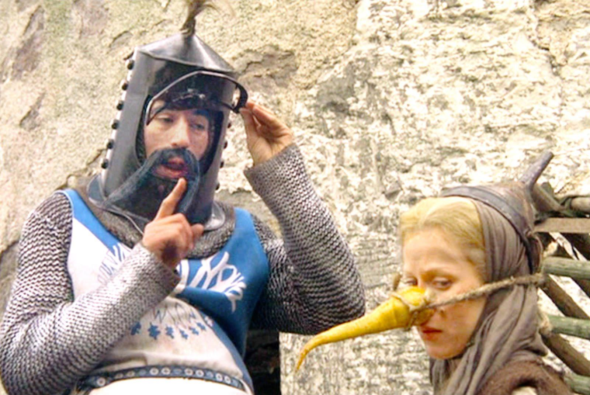
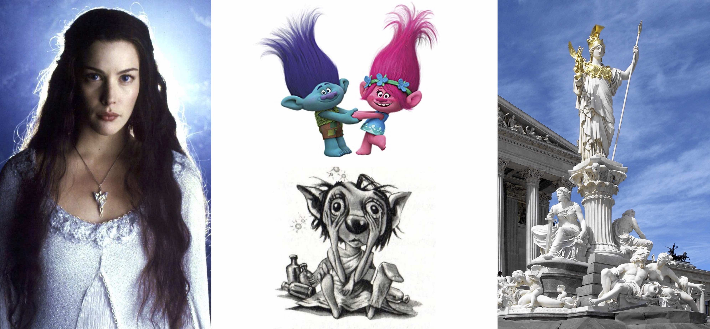
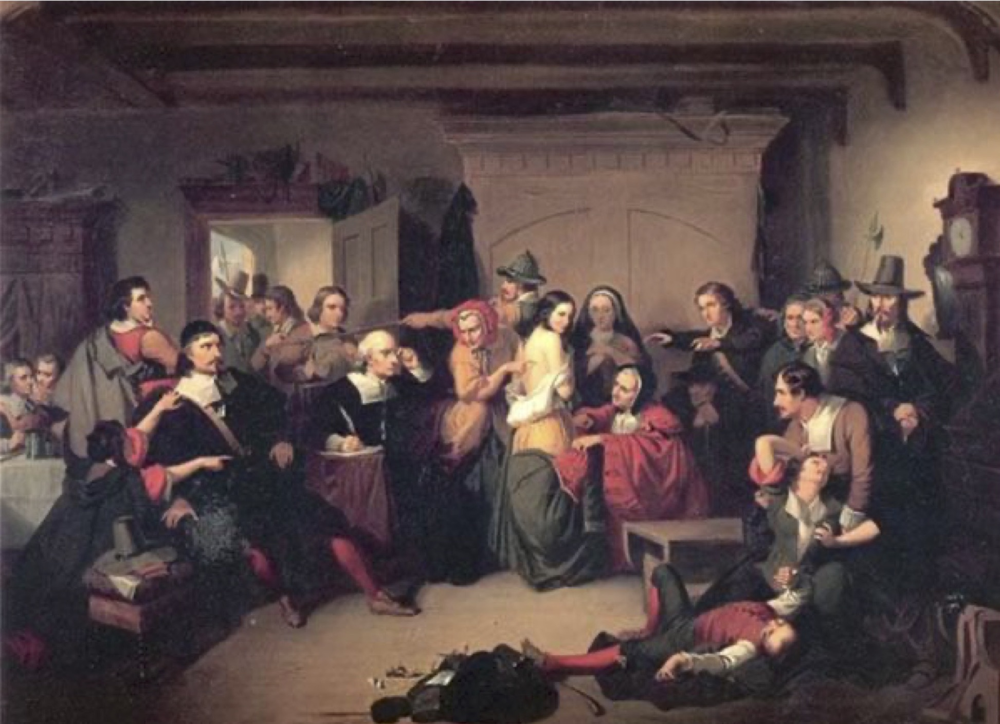
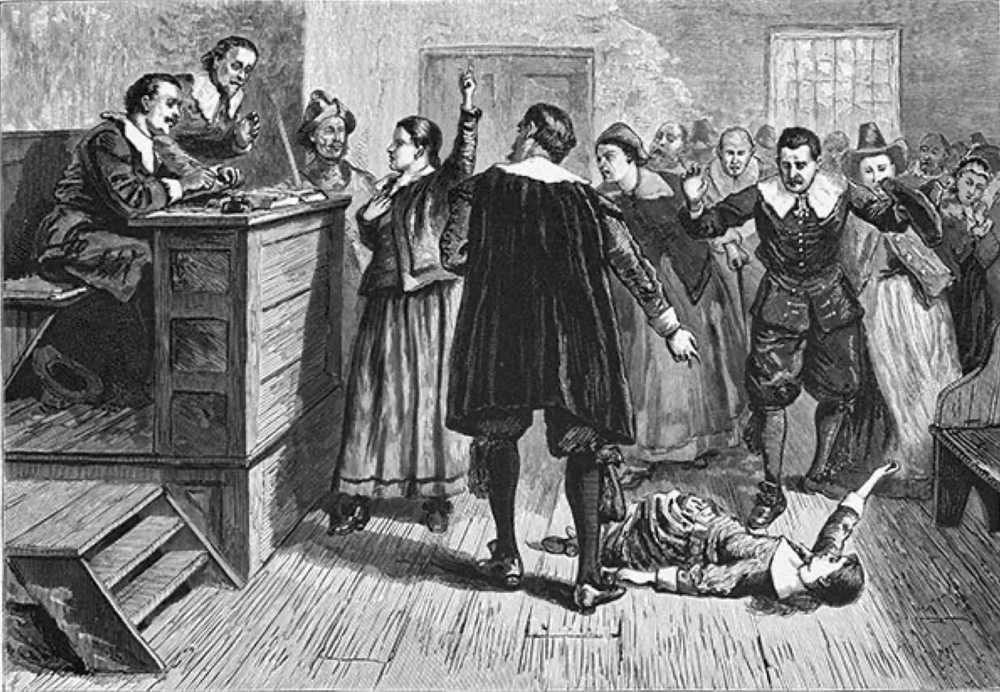
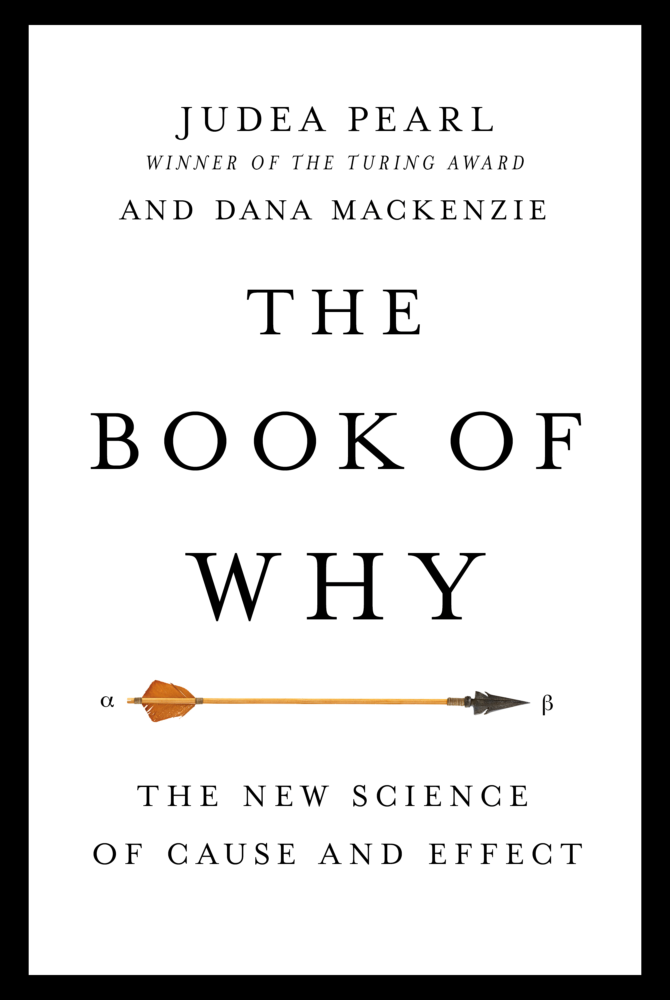
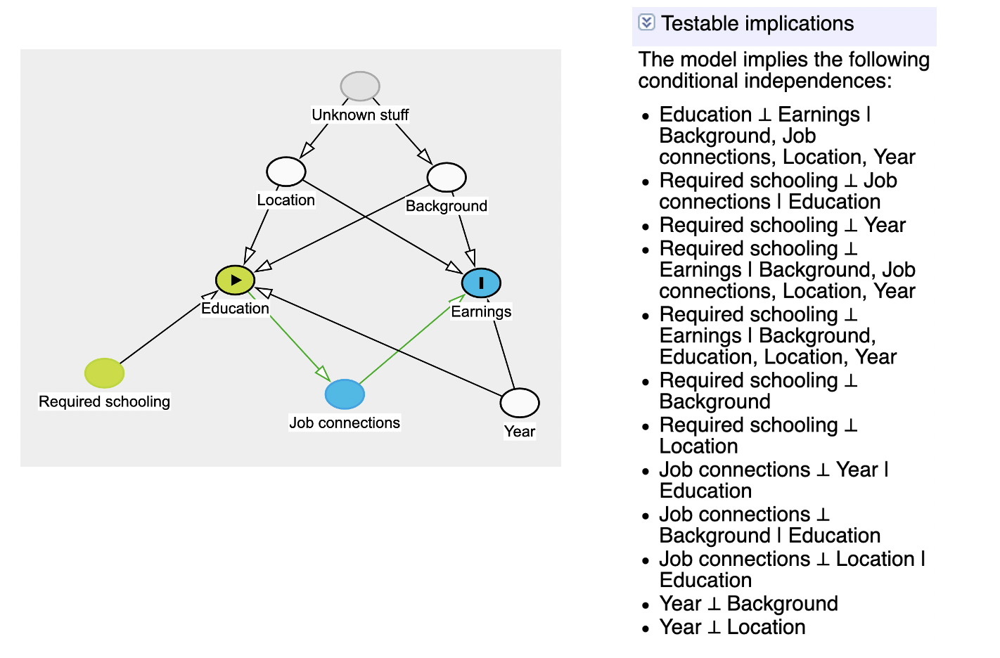

```{r setup, include=FALSE}
knitr::opts_chunk$set(warning = FALSE, message = FALSE, 
                      fig.retina = 3, fig.align = "center")
```

```{r packages-data, include=FALSE}
library(tidyverse)
library(ggdag)
```

```{r xaringanExtra, echo=FALSE}
xaringanExtra::use_xaringan_extra(c("tile_view"))
```

class: center middle main-title section-title-7

# Measurement<br>and DAGs

.class-info[

**Session 4**

.light[PMAP 8521: Program evaluation<br>
Andrew Young School of Policy Studies
]

]

---

name: outline
class: title title-inv-8

# Plan for today

--

.box-4.medium.sp-after-half[Abstraction, stretching,<br>and validity]

--

.box-6.medium.sp-after-half[Causal models]

--

.box-5.medium[Paths, doors, and adjustment]

---

name: abstraction
class: center middle section-title section-title-4 animated fadeIn

# Abstraction, stretching,<br>and validity

---

layout: true
class: title title-4

---

# Indicators

.pull-left[
.box-4.medium[Inputs, activities,<br>and outputs]

.box-inv-4[Generally directly measurable]

.box-inv-4[\# of citations mailed,<br>% increase in grades, etc.]
]

--

.pull-right[
.box-4.medium[Outcomes]

&nbsp;

.box-inv-4[Harder to measure directly]

.box-inv-4[Loftier and more abstract]

.box-inv-4[Commitment to school,<br>reduced risk factors]
]

---

layout: false

&nbsp;

.box-4.large.sp-after[How do you measure<br>abstract outcomes?]

--

.box-inv-4.large[Move up the ladder of abstraction.]

---

.center[
<figure>
  
</figure>
]

???

https://www.youtube.com/watch?v=yp_l5ntikaU

---

layout: false
class: bg-full
background-image: url("img/04/witches.jpg")

???

Here's a dataset of witches.

What are the common features across witches in general?

Are these criteria useful if certain cases don’t fit like Sabrina?

What are the most important elements here? Doing magic + being female – that’s good, probably – covers Hermione and HP world

---

layout: true
class: title title-4

---

# Conceptual stretching

.center[
<figure>
  
</figure>
]

???

But now the concept is stretched too far – this includes all magical female creatures, like trolls and goblins

Too much conceptual stretching

---

# Ladder of abstraction for witches

--

.box-inv-4.small[Mammal]

--

.box-inv-4.small[Enmagicked]

.box-4.tiny[Trolls, elves, gods/goddesses]

--

.box-inv-4.small[Female]

.box-4.tiny[Arwen, Winky, Athena]

--

.box-inv-4.small[Human]

--

.pull-left[
.pull-left[
.box-inv-4.small[Young]

.box-4.tiny[Salem witch trials]
]

.pull-right[
.box-inv-4.small[Student]

.box-4.tiny[Hermione Granger,<br>Sabrina Spellman]
]
]

--

.pull-right[
.box-inv-4.small[Old]

.box-4.tiny[Elphaba, Halloween decorations]
]

---

# Connection to theory

.pull-left[

<figure>
  
</figure>

]

.pull-right[
<figure>
  
</figure>
]

???

Accusations typically targeted successful women; women who worked with medicine; women who posed a threat to the patriarchy. In real life, it was a misogynistic tool for maintaining social order.

What went wrong? The theory was wrong, yes, but also the indicators weren’t connected to reality

---

# Outcomes and programs

.box-4.medium[Outcome variable]

.box-inv-4.sp-after-half.SMALL[Thing you're measuring]

--

.box-4.medium[Outcome change]

.box-inv-4.sp-after-half.SMALL[∆ in thing you're measuring over time]

--

.box-4.medium[Program effect]

.box-inv-4.SMALL[∆ in thing you're measuring over time *because of* the program]

---

# Outcomes and programs

<figure>
  
</figure>

---

# Connecting measurment to programs

.box-inv-4.medium.sp-after-half[Measurable definition of program effect]

--

.box-inv-4.medium.sp-after-half[Ideal measurement]

--

.box-inv-4.medium.sp-after-half[Feasible measurement]

--

.box-inv-4.medium[Connection to real world]

---

layout: false
name: causal-models
class: center middle section-title section-title-6 animated fadeIn

# Causal models

---

layout: true
class: title title-6

---

# Types of data

.pull-left[

.box-inv-6.medium[Experimental]

.box-6[You have control over which units get treatment]

]

--

.pull-right[

.box-inv-6.medium[Observational]

.box-6[You don't have control over which units get treatment]

]

--

.box-inv-6.medium.sp-before[Which kind lets you prove causation?]

---

# Causation with observational data

.box-inv-6.medium.sp-after[Can you prove causation<br>with observational data?]

--

.box-inv-6.medium[Why is it so controversial<br>to use observational data?]

---

layout: false
class: bg-full
background-image: url("img/04/too-much-rct.jpg")

---

layout: true
class: title title-6

---

# The causal revolution

.pull-left-narrow[
<figure>
  
</figure>
]

.pull-right-wide.center[
<figure>
  
</figure>
]

---

# Causal diagrams

.box-inv-6.medium[Directed acyclic graphs (DAGs)]

.pull-left[

.box-6.SMALL[**Directed**: Each node has an arrow that points to another node]

.box-6.SMALL[**Acyclic**: You can't cycle back to a node (and arrows only have one direction)]

.box-6.SMALL[**Graph**: It's… um… a graph]

]

.pull-right[

```{r simple-dag, echo=FALSE, fig.width=4.5, fig.height=3, out.width="100%"}
dagify(
  Y ~ X + Z,
  X ~ Z,
  coords = list(x = c(X = 1, Y = 3, Z = 2),
                y = c(X = 1, Y = 1, Z = 2))
) %>% 
  ggplot(aes(x = x, y = y, xend = xend, yend = yend)) +
  geom_dag_edges() +
  geom_dag_point(color = "grey80", size = 14) +
  geom_dag_text(color = "black", size = 5) +
  theme_dag()
```

]

---

# Causal diagrams

.box-inv-6.medium[Directed acyclic graphs (DAGs)]

.pull-left[

.box-6.SMALL[Graphical model of the process that generates the data]

.box-6.SMALL[Maps your philosophical model]

.box-6.SMALL[Fancy math ("*do*-calculus") tells you what to control for to isolate and identify causation]

]

.pull-right[

`)

]

---

# Acyclicalness

.box-inv-6[What if there's something that really is cyclical?]

--

.box-6[Wealth → Power → Wealth]

--

.box-6.sp-after[**This isn't acyclic!**<br>Wealth ↔ Power]

--

.box-inv-6[Split the node into different time periods]

--

.box-6[Wealth<sub>*t* - 1</sub> → Power<sub>*t*</sub> → Wealth<sub>*t*</sub>]

---

# How to draw a DAG

.box-inv-6.medium[What is the causal effect of an<br>additional year of education on earnings?]

--

.box-6[Step 1: List variables]

--

.box-6[Step 2: Simplify]

--

.box-6[Step 3: Connect arrows]

--

.box-6[Step 4: Use logic and math to determine<br>which nodes and arrows to measure]

---

# 1. List variables

.box-6.sp-after[Education (treatment) → Earnings (outcome)]

.center.float-left.sp-after-half[
.box-inv-6[Location]&ensp;.box-inv-6[Ability]&ensp;.box-inv-6[Demographics]
]

.center.float-left.sp-after-half[
.box-inv-6[Socioeonomic status]&ensp;.box-inv-6[Year of birth]
]

.center.float-left[
.box-inv-6[Compulsory schooling laws]&ensp;.box-inv-6[Job connections]
]

---

# 2. Simplify

.box-6.sp-after[Education (treatment) → Earnings (outcome)]

.center.float-left.sp-after-half[
.box-inv-6[Location]&ensp;.box-inv-3[Ability]&ensp;.box-inv-3[Demographics]
]

.center.float-left.sp-after-half[
.box-inv-3[Socioeonomic status]&ensp;.box-inv-6[Year of birth]
]

.center.float-left[
.box-inv-6[Compulsory schooling laws]&ensp;.box-inv-6[Job connections]
]

.box-inv-5[Background]

---

# 3. Draw arrows

.pull-left-narrow[

.box-inv-6[Education causes earnings]

]

.pull-right-wide[

```{r edu-earn-simple, echo=FALSE, fig.width=4.5, fig.height=3, out.width="100%"}
edu_earn_coords <- list(x = c(Edu = 2, Earn = 4, Year = 2, Bkgd = 4, 
                              Loc = 3, JobCx = 3, Req = 1, U1 = 3),
                        y = c(Edu = 2, Earn = 2, Year = 3, Bkgd = 3, 
                              Loc = 3, JobCx = 1, Req = 2, U1 = 4))

dagify(
  Earn ~ Edu,
  exposure = "Edu",
  outcome = "Earn",
  coords = edu_earn_coords) %>% 
  tidy_dagitty() %>% 
  node_status() %>% 
  ggplot(aes(x = x, y = y, xend = xend, yend = yend)) +
  geom_dag_edges() +
  geom_dag_point(aes(color = status), size = 14) +
  geom_dag_text(color = "black", size = 5) +
  scale_color_manual(values = c("#FF4136", "#0074D9"),
                     na.value = "#7FDBFF") +
  guides(color = FALSE) +
  theme_dag()
```

]

---

# 3. Draw arrows

.pull-left-narrow[

.box-inv-6[Background, year of birth, location, job connections, and school requirements all cause education]

]

.pull-right-wide[

```{r edu-earn-2, echo=FALSE, fig.width=4.5, fig.height=3, out.width="100%"}
dagify(
  Earn ~ Edu,
  Edu ~ Req + Loc + Bkgd + Year,
  exposure = "Edu",
  outcome = "Earn",
  coords = edu_earn_coords) %>% 
  tidy_dagitty() %>% 
  node_status() %>% 
  ggplot(aes(x = x, y = y, xend = xend, yend = yend)) +
  geom_dag_edges() +
  geom_dag_point(aes(color = status), size = 14) +
  geom_dag_text(color = "black", size = 5) +
  scale_color_manual(values = c("#FF4136", "#0074D9"),
                     na.value = "#7FDBFF") +
  guides(color = FALSE) +
  coord_cartesian(ylim = c(1, 3)) +
  theme_dag()
```

]

---

# 3. Draw arrows

.pull-left-narrow[

.box-inv-6[Background, year of birth, and location all cause earnings too]

]

.pull-right-wide[

```{r edu-earn-3, echo=FALSE, fig.width=4.5, fig.height=3, out.width="100%"}
dagify(
  Earn ~ Edu + Year + Bkgd + Loc + JobCx,
  Edu ~ Req + Loc + Bkgd + Year,
  exposure = "Edu",
  outcome = "Earn",
  coords = edu_earn_coords) %>% 
  tidy_dagitty() %>% 
  node_status() %>% 
  ggplot(aes(x = x, y = y, xend = xend, yend = yend)) +
  geom_dag_edges() +
  geom_dag_point(aes(color = status), size = 14) +
  geom_dag_text(color = "black", size = 5) +
  scale_color_manual(values = c("#FF4136", "#0074D9"),
                     na.value = "#7FDBFF") +
  guides(color = FALSE) +
  theme_dag()
```

]

---

# 3. Draw arrows

.pull-left-narrow[

.box-inv-6[Education causes job earnings]

]

.pull-right-wide[

```{r edu-earn-4, echo=FALSE, fig.width=4.5, fig.height=3, out.width="100%"}
dagify(
  Earn ~ Edu + Year + Bkgd + Loc + JobCx,
  Edu ~ Req + Loc + Bkgd + Year,
  JobCx ~ Edu,
  exposure = "Edu",
  outcome = "Earn",
  coords = edu_earn_coords) %>% 
  tidy_dagitty() %>% 
  node_status() %>% 
  ggplot(aes(x = x, y = y, xend = xend, yend = yend)) +
  geom_dag_edges() +
  geom_dag_point(aes(color = status), size = 14) +
  geom_dag_text(color = "black", size = 5) +
  scale_color_manual(values = c("#FF4136", "#0074D9"),
                     na.value = "#7FDBFF") +
  guides(color = FALSE) +
  theme_dag()
```

]

---

# 3. Draw arrows

.pull-left-narrow[

.box-inv-6[Location and background are probably related, but neither causes the other. Something unobservable (U1) does that.]

]

.pull-right-wide[

```{r edu-earn-full, echo=FALSE, fig.width=4.5, fig.height=3, out.width="100%"}
dagify(
  Earn ~ Edu + Year + Bkgd + Loc + JobCx,
  Edu ~ Req + Loc + Bkgd + Year,
  JobCx ~ Edu,
  Bkgd ~ U1,
  Loc ~ U1,
  exposure = "Edu",
  outcome = "Earn",
  latent = "U1",
  labels = c("Earn" = "Earnings", "Edu" = "Education",
             "Year" = "Year", "Bkgd" = "Background",
             "Loc" = "Location", "JobCx" = "Job connections",
             "U1" = "Unobserved stuff"),
  coords = edu_earn_coords) %>% 
  tidy_dagitty() %>% 
  node_status() %>% 
  ggplot(aes(x = x, y = y, xend = xend, yend = yend)) +
  geom_dag_edges() +
  geom_dag_point(aes(color = status), size = 14) +
  geom_dag_text(color = "black", size = 5) +
  scale_color_manual(values = c("#FF4136", "grey60", "#0074D9"),
                     na.value = "#7FDBFF") +
  guides(color = FALSE) +
  theme_dag()
```

]

---

# Let the computer do this!

.box-inv-6.large.sp-after-half[dagitty.net]

.box-inv-6.large[**ggdag** package in R]

---

layout: false
name: paths-doors-adjustment
class: center middle section-title section-title-5 animated fadeIn

# Paths, doors,<br>and adjustment

---

layout: true
class: title title-5

---

# Causal identification

.pull-left-narrow[

.box-inv-5[All these nodes are related; there's correlation between them all]

.box-inv-5[We care about Edu → Earn, but what do we do about all the other nodes?]

]

.pull-right-wide[

`)

]

---

# Causal identification

.box-inv-5.medium[A causal effect is *identified* if the association between treatment and outcome is propertly stripped and isolated]

---

# Paths and associations

.box-inv-5.medium[Arrows in a DAG transmit associations]

.box-inv-5.medium[You can redirect and control those paths by "adjusting" or "conditioning"]

---

# Three types of associations

.pull-left-3[
.box-5.medium[Confounding]

```{r confounding-dag, echo=FALSE, fig.width=4.5, fig.height=3.35, out.width="100%"}
dagify(
  Y ~ X + Z,
  X ~ Z,
  coords = list(x = c(X = 1, Y = 3, Z = 2),
                y = c(X = 1, Y = 1, Z = 2))
) %>% 
  ggplot(aes(x = x, y = y, xend = xend, yend = yend)) +
  geom_dag_edges() +
  geom_dag_point(color = "grey80", size = 17) +
  geom_dag_text(color = "black", size = 5) +
  theme_dag()
```

.box-inv-5.small[Common cause]
]

.pull-middle-3.center[
.box-5.medium[Causation]

```{r mediation-dag, echo=FALSE, fig.width=4.5, fig.height=3.35, out.width="100%"}
dagify(
  Y ~ X + Z,
  Z ~ X,
  coords = list(x = c(X = 1, Y = 3, Z = 2),
                y = c(X = 1, Y = 1, Z = 2))
) %>% 
  ggplot(aes(x = x, y = y, xend = xend, yend = yend)) +
  geom_dag_edges() +
  geom_dag_point(color = "grey80", size = 17) +
  geom_dag_text(color = "black", size = 5) +
  theme_dag()
```

.box-inv-5.small[Mediation]
]

.pull-right-3[
.box-5.medium[Collision]

```{r collision-dag, echo=FALSE, fig.width=4.5, fig.height=3.35, out.width="100%"}
dagify(
  Y ~ X,
  Z ~ Y,
  Z ~ X,
  coords = list(x = c(X = 1, Y = 3, Z = 2),
                y = c(X = 1, Y = 1, Z = 2))
) %>% 
  ggplot(aes(x = x, y = y, xend = xend, yend = yend)) +
  geom_dag_edges() +
  geom_dag_point(color = "grey80", size = 17) +
  geom_dag_text(color = "black", size = 5) +
  theme_dag()
```

.box-inv-5.small[Selection /<br>endogeneity]
]

---

# Confounding

.pull-left-wide[
```{r confounding-dag-big, echo=FALSE, fig.width=4.5, fig.height=3, out.width="100%"}
dagify(
  Y ~ X + Z,
  X ~ Z,
  coords = list(x = c(X = 1, Y = 3, Z = 2),
                y = c(X = 1, Y = 1, Z = 2))
) %>% 
  ggplot(aes(x = x, y = y, xend = xend, yend = yend)) +
  geom_dag_edges() +
  geom_dag_point(color = "grey80", size = 15) +
  geom_dag_text(color = "black", size = 5) +
  theme_dag()
```
]

.pull-right-narrow[
.box-inv-5.medium[**X** causes **Y**]

.box-inv-5.medium[But **Z** causes both **X** and **Y**]

.box-inv-5.medium[**Z** * confounds* the **X** → **Y** association]
]

---

# Paths

.pull-left-wide[
`)
]

.pull-right-narrow[
.box-inv-5[Paths between<br>**X** and **Y**?]

.box-5[**X** → **Y**]

.box-5[**X** ← **Z** → **Y**]

.box-inv-5.medium[**Z** is a *backdoor*]
]

---

# *d*-connection

.pull-left-wide[
`)
]

.pull-right-narrow[
.box-inv-5[**X** and **Y** are<br>"*d*-connected" because associations can pass through **Z**]

.box-5[The relationship between **X** and **Y** is not identified / isolated]
]

---

# Effect of money on elections

.box-inv-5.medium[What are the paths<br>between **money** and **win margin**?]

.pull-left[
```{r money-elections, echo=FALSE, fig.width=5, fig.height=3, out.width="100%"}
dagify(
  Y ~ X + Z,
  X ~ Z,
  coords = list(x = c(X = 1, Y = 3, Z = 2),
                y = c(X = 1, Y = 1, Z = 2)),
  exposure = "X",
  outcome = "Y",
  labels = c("X" = "Campaign money", "Y" = "Win margin",
             "Z" = "Candidate quality")
) %>% 
  tidy_dagitty() %>% 
  node_status() %>% 
  ggplot(aes(x = x, y = y, xend = xend, yend = yend)) +
  geom_dag_edges() +
  geom_dag_point(aes(color = status), size = 15) +
  geom_dag_text(color = "white", size = 5) +
  geom_dag_label_repel(aes(label = label), nudge_y = c(0.25, -0.25, 0.25)) +
  scale_color_manual(values = c("#FF4136", "#0074D9"),
                     na.value = "#7FDBFF") +
  guides(color = FALSE) +
  theme_dag()
```
]

--

.pull-right[
.box-5[Money → Margin]

.box-5[Money ← Quality → Margin]

.box-inv-5[Quality is a *backdoor*]
]

---

# Closing doors

.pull-left[
```{r confounding-dag-adjusted, echo=FALSE, fig.width=4.5, fig.height=3, out.width="100%"}
dagify(
  Y ~ X + Z,
  X ~ Z,
  coords = list(x = c(X = 1, Y = 3, Z = 2),
                y = c(X = 1, Y = 1, Z = 2))
) %>% 
  tidy_dagitty() %>% 
  adjust_for("Z") %>% 
  ggplot(aes(x = x, y = y, xend = xend, yend = yend)) +
  geom_dag_edges() +
  geom_dag_point(aes(shape = adjusted, color = adjusted), size = 15) +
  geom_dag_text(color = "black", size = 5) +
  scale_shape_manual(values = c(15, 19)) +
  scale_color_manual(values = c("#FFDC00", "grey80")) +
  guides(shape = FALSE, color = FALSE) +
  theme_dag()
```
]

.pull-right[
.box-inv-5.medium[Close the backdoor by adjusting for **Z**]
]

---

# Closing doors

.pull-left[
.box-inv-5.small[Find the part of campaign money that is explained by quality, remove it.<br>This is the residual part of money.]

.box-inv-5.small[Find the part of win margin that is explained by quality, remove it. This is the residual part of win margin.]

.box-inv-5.small[Find the relationship between the residual part of money and residual part of win margin.<br>**This is the causal effect**.]
]

.pull-right[
```{r money-elections-adjusted, echo=FALSE, fig.width=5, fig.height=3.3, out.width="100%"}
dagify(
  Y ~ X + Z,
  X ~ Z,
  coords = list(x = c(X = 1, Y = 3, Z = 2),
                y = c(X = 1, Y = 1, Z = 2)),
  exposure = "X",
  outcome = "Y",
  labels = c("X" = "Campaign money", "Y" = "Win margin",
             "Z" = "Candidate quality")
) %>% 
  tidy_dagitty() %>% 
  node_status() %>% 
  adjust_for("Z") %>% 
  ggplot(aes(x = x, y = y, xend = xend, yend = yend)) +
  geom_dag_edges() +
  geom_dag_point(aes(color = status, shape = adjusted), size = 15) +
  geom_dag_text(color = "white", size = 5) +
  geom_dag_label_repel(aes(label = label), nudge_y = c(0.25, -0.25, 0.25)) +
  scale_color_manual(values = c("#FF4136", "#0074D9"),
                     na.value = "#FFDC00") +
  scale_shape_manual(values = c(15, 19)) +
  guides(color = FALSE, shape = FALSE) +
  theme_dag()
```
]

---

# Closing doors

.pull-left[
.box-inv-5[Compare candidates as if they had the same quality]

.box-inv-5[Remove differences that are predicted by quality]

.box-inv-5[Hold quality constant]
]

.pull-right[
`)
]

---

# How to adjust

.box-inv-5.medium[Include term in regression]

$$
\begin{aligned}
\text{Win margin} =& \beta_0 + \beta_1 \text{Campaign money} +\\
& \beta_2 \text{Candidate quality} + \varepsilon
\end{aligned}
$$

.center.float-left[
.box-inv-5.medium[Matching]&ensp;.box-inv-5.medium[Stratifying]

.box-inv-5.medium.sp-before-half[Inverse probability weighting]
]

---

# *d*-separation

.pull-left[
`)
]

.pull-right[
.box-inv-5.medium[If we control for **Z**,<br>**X** and **Y** are now<br>"*d*-separated" and the association is isolated!]

]

---

# Closing backdoors

.pull-left-narrow[
.box-inv-5[Block all backdoor paths to identify the main pathway you care about]
]

.pull-right-wide[
`)
]

---

# All paths

.pull-left.left[
.box-5.smaller[Education → Earnings]

.box-5.smaller[Education → Job connections → Earnings]

.box-7.smaller[Education ← Background → Earnings]

.box-7.smaller[Education ← Background ← U1 → Location → Earnings]

.box-7.smaller[Education ← Location → Earnings]

.box-7.smaller[Education ← Location ← U1 → Background → Earnings]

.box-7.smaller[Education ← Year → Earnings]
]

.pull-right[
`)
]

---

# All paths

.pull-left-narrow[
.box-inv-5[Adjust for **Location**, **Background** and **Year** to isolate the **Education → Earnings** causal effect]
]

.pull-right-wide[
```{r edu-earn-adjust, echo=FALSE, fig.width=4.5, fig.height=3, out.width="100%"}
dagify(
  Earn ~ Edu + Year + Bkgd + Loc + JobCx,
  Edu ~ Req + Loc + Bkgd + Year,
  JobCx ~ Edu,
  Bkgd ~ U1,
  Loc ~ U1,
  exposure = "Edu",
  outcome = "Earn",
  latent = "U1",
  labels = c("Earn" = "Earnings", "Edu" = "Education",
             "Year" = "Year", "Bkgd" = "Background",
             "Loc" = "Location", "JobCx" = "Job connections",
             "U1" = "Unobserved stuff"),
  coords = edu_earn_coords) %>% 
  tidy_dagitty() %>% 
  node_status() %>% 
  adjust_for(c("Loc", "Bkgd", "Year")) %>% 
  ggplot(aes(x = x, y = y, xend = xend, yend = yend)) +
  geom_dag_edges() +
  geom_dag_point(aes(color = status, shape = adjusted), size = 14) +
  geom_dag_text(color = "black", size = 5) +
  scale_color_manual(values = c("#FF4136", "grey60", "#0074D9"),
                     na.value = "#7FDBFF") +
  scale_shape_manual(values = c(15, 19)) +
  guides(color = FALSE, shape = FALSE) +
  theme_dag()
```
]

---

# Let the computer do this!

.box-inv-5.large.sp-after-half[dagitty.net]

.box-inv-5.large[The **ggdag** and **dagitty**<br>packages in R]

---

# How do you know if this is right?

.pull-left-narrow[
.box-inv-5[You can test the implications of the model to see if they're right in your data]

$$
X \perp Y\ |\ Z
$$

.box-5.small[X is independent of Y, given Z]
]

.pull-right-wide[
<figure>
  
</figure>
]

---

# Causation

.pull-left-wide[
```{r causation-dag-big, echo=FALSE, fig.width=4.5, fig.height=3, out.width="100%"}
dagify(
  Y ~ X + Z,
  Z ~ X,
  coords = list(x = c(X = 1, Y = 3, Z = 2),
                y = c(X = 1, Y = 1, Z = 2))
) %>% 
  ggplot(aes(x = x, y = y, xend = xend, yend = yend)) +
  geom_dag_edges() +
  geom_dag_point(color = "grey80", size = 15) +
  geom_dag_text(color = "black", size = 5) +
  theme_dag()
```
]

.pull-right-narrow[
.box-inv-5.medium[**X** causes **Y**]

.box-inv-5.medium[**X** causes<br>**Z** which causes **Y**]

.box-5.medium[Should you control for **Z**?]
]

---

# Causation

.pull-left-wide[
`)
]

.pull-right-narrow[
.box-5.medium[Should you control for **Z**?]

.box-inv-5.medium[No!]

.box-inv-5[Overcontrolling]
]

---

# Causation and overcontrolling

.pull-left-wide[
`)
]

.pull-right-narrow[
.box-inv-5[Should you control for job connections?]
]

---

# Colliders

.pull-left-wide[
```{r collider-dag-big, echo=FALSE, fig.width=4.5, fig.height=3, out.width="100%"}
dagify(
  Y ~ X,
  Z ~ Y,
  Z ~ X,
  coords = list(x = c(X = 1, Y = 3, Z = 2),
                y = c(X = 1, Y = 1, Z = 2))
) %>% 
  ggplot(aes(x = x, y = y, xend = xend, yend = yend)) +
  geom_dag_edges() +
  geom_dag_point(color = "grey80", size = 15) +
  geom_dag_text(color = "black", size = 5) +
  theme_dag()
```
]

.pull-right-narrow[
.box-inv-5.medium[**X** causes **Z**]

.box-inv-5.medium[**Y** causes **Z**]

.box-5.medium[Should you control for **Z**?]
]

---

# Programming and social skills

.box-inv-5.medium[Do programming skills reduce social skills?]

.pull-left[
```{r programming-social-skills, echo=FALSE, fig.width=5, fig.height=3, out.width="100%"}
dagify(
  Y ~ X,
  Z ~ Y,
  Z ~ X,
  coords = list(x = c(X = 1, Y = 3, Z = 2),
                y = c(X = 1, Y = 1, Z = 2)),
  exposure = "X",
  outcome = "Y",
  labels = c("X" = "Programming skills", "Y" = "Social skills",
             "Z" = "Hired by a tech company")
) %>% 
  tidy_dagitty() %>% 
  node_status() %>% 
  ggplot(aes(x = x, y = y, xend = xend, yend = yend)) +
  geom_dag_edges() +
  geom_dag_point(aes(color = status), size = 15) +
  geom_dag_text(color = "white", size = 5) +
  geom_dag_label_repel(aes(label = label), nudge_y = c(0.25, 0.25, -0.25)) +
  scale_color_manual(values = c("#FF4136", "#0074D9"),
                     na.value = "#7FDBFF") +
  guides(color = FALSE) +
  theme_dag()
```
]

--

.pull-right[
.box-5[You go to a tech company and conduct a survey. You find a negative relationship!<br>Is it real?]
]

---

# Programming and social skills

.box-inv-5.medium[Do programming skills reduce social skills?]

.pull-left[
`)
]

.pull-right[
.box-5[No! **Hired by a tech company** is a collider and we controlled for it.]

.box-5[This inadvertently connected the two.]
]

---

layout: false

.pull-left[
.box-5.medium[Colliders can create<br>fake causal effects]
]

.pull-right[
.box-5.medium[Colliders can hide<br>real causal effects]
]

```{r bulls-scores, echo=FALSE, fig.width=6, fig.height=3.3, out.width="50%"}
basketball <- read.csv(text = 'PointsPerGame,HeightInches
                          20.8,75
                          17.6,81
                          12.7,78
                          10.9,76
                          10.7,83
                          10.1,75
                          9,81
                          8.8,82
                          8.8,84
                          8.7,81
                          5.5,75
                          5.5,73
                          3.9,81
                          2.3,84
                          2.1,81
                          1.8,77
                          1,74
                          0.5,80')

ggplot(basketball, aes(x = HeightInches, y = PointsPerGame)) +
  geom_point() +
  geom_smooth() +
  labs(x = "Height in Inches",
       y = "Points Per Game",
       title = "Chicago Bulls 2009-10")
# Data from Scott Andrews at StatCrunch
```

.center[
.box-inv-5[Height is unrelated to basketball skill… among NBA players]
]

---

layout: true
class: title title-5

---

# Colliders and selection bias

```{r nba-dag, echo=FALSE, fig.width=5, fig.height=3, out.width="65%"}
dagify(
  Y ~ X,
  Z ~ Y,
  Z ~ X,
  coords = list(x = c(X = 1, Y = 3, Z = 2),
                y = c(X = 1, Y = 1, Z = 2)),
  exposure = "X",
  outcome = "Y",
  labels = c("X" = "Height", "Y" = "Points scored",
             "Z" = "Being in the NBA")
) %>% 
  tidy_dagitty() %>% 
  node_status() %>% 
  ggplot(aes(x = x, y = y, xend = xend, yend = yend)) +
  geom_dag_edges() +
  geom_dag_point(aes(color = status), size = 15) +
  geom_dag_text(color = "white", size = 5) +
  geom_dag_label_repel(aes(label = label), nudge_y = c(0.25, 0.25, -0.25)) +
  scale_color_manual(values = c("#FF4136", "#0074D9"),
                     na.value = "#7FDBFF") +
  guides(color = FALSE) +
  theme_dag()
```

---

# Three types of associations

.pull-left-3[
.box-5.medium[Confounding]

`)

.box-inv-5.small[Common cause]
]

.pull-middle-3[
.box-5.medium[Causation]

`)

.box-inv-5.small[Mediation]
]

.pull-right-3[
.box-5.medium[Collision]

`)

.box-inv-5.small[Selection /<br>endogeneity]
]

