```{r setup, include=FALSE}
knitr::opts_chunk$set(warning = FALSE, message = FALSE, 
                      fig.retina = 3, fig.align = "center")
```

```{r packages-data, include=FALSE}
library(tidyverse)
library(ggdag)
library(palmerpenguins)
library(modelsummary)
```

```{r xaringanExtra, echo=FALSE}
xaringanExtra::use_xaringan_extra(c("tile_view"))
```

class: center middle main-title section-title-3

# In-person<br>session 5

.class-info[

**September 19, 2022**

.light[PMAP 8521: Program evaluation<br>
Andrew Young School of Policy Studies
]

]

---

name: outline
class: title title-inv-8

# Plan for today

--

.box-5.medium.sp-after-half[DAGs, continued]

--

.box-2.medium.sp-after-half[Potential outcomes vs. do() notation]

--

.box-4.medium.sp-after-half[do-calculus, adjustment, and CATEs]

--

.box-6.medium.sp-after-half[Logic models, DAGs, and measurement]

---

layout: false
name: dags
class: center middle section-title section-title-5 animated fadeIn

# DAGs, continued

---

layout: true
class: middle

---

.center[
<video controls loop>
  <source src="img/05-class/video-confounding-unblocked.mp4" type="video/mp4">
</video>
]

---

.center[
<video controls loop>
  <source src="img/05-class/video-confounding-blocked.mp4" type="video/mp4">
</video>
]

---

.center[
<video controls loop>
  <source src="img/05-class/video-mediation.mp4" type="video/mp4">
</video>
]

---

.box-5.large[Effect of race on police use of force<br>using administrative data]

---

.box-5.medium[Effect of race on police use of force<br>using administrative data]

.pull-left[
<figure>
  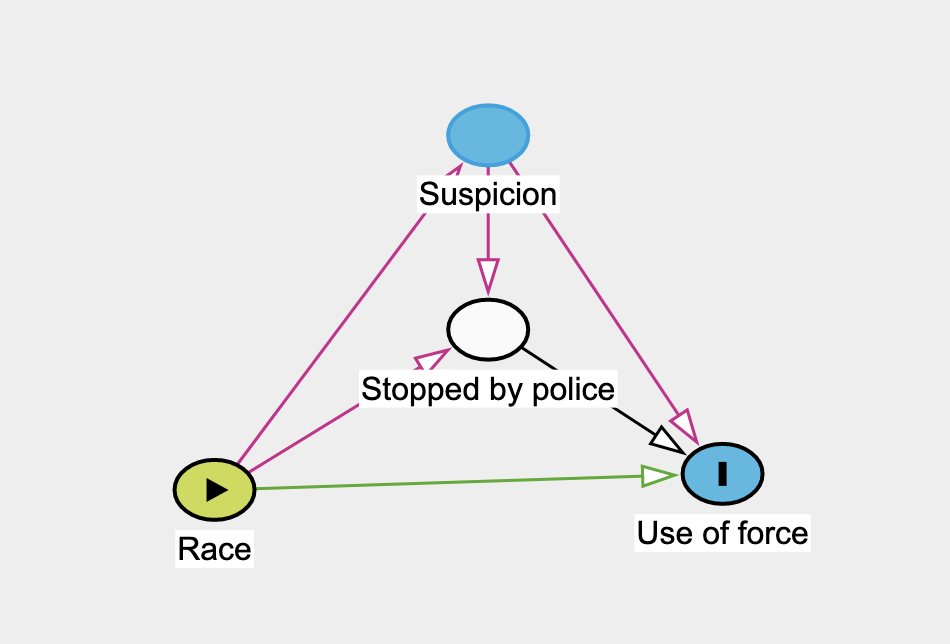
</figure>
]

.pull-right[
<figure>
  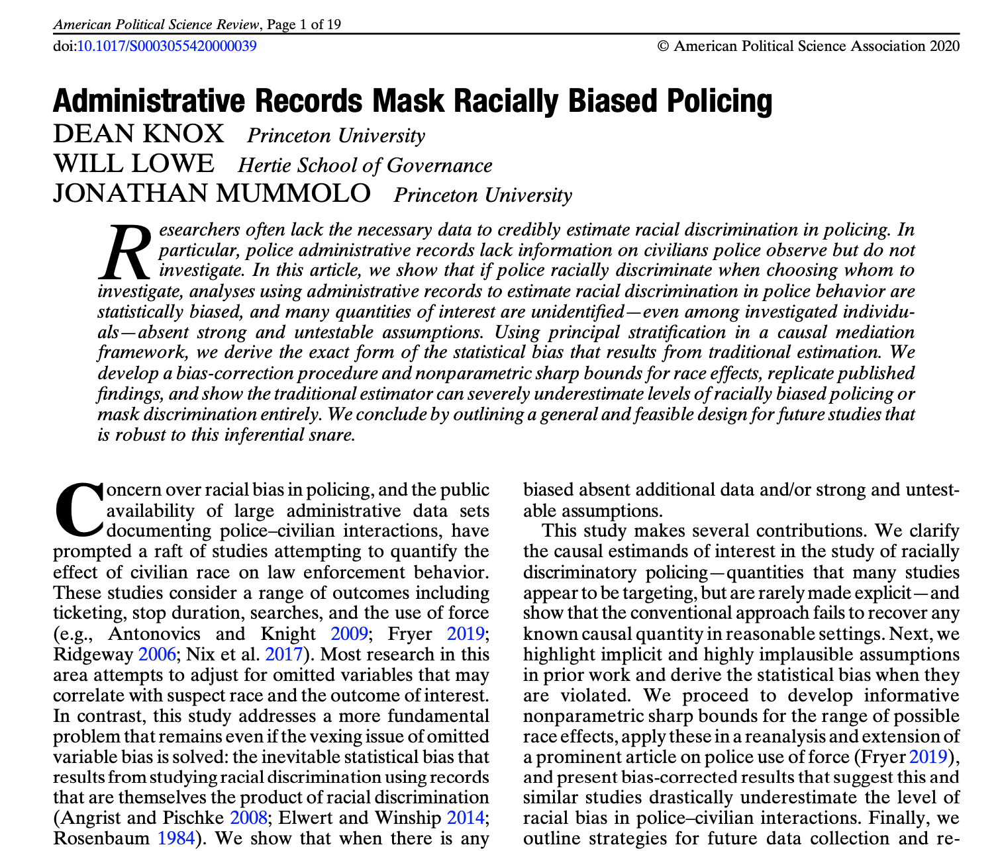
</figure>
]

---

layout: true
class: middle

---

.box-5.large[Smoking → Cardiac arrest example]

???

| Person | Smoker | Cardiac arrest | Cholesterol | Weight | Lifestyle healthiness |
|--------|--------|----------------|-------------|--------|-----------------------|
| 1      | TRUE   | TRUE           | 150         | 170    | 6                     |
| 2      | TRUE   | FALSE          | 170         | 180    | 3                     |
| 3      | FALSE  | FALSE          | 130         | 110    | 9                     |
| 4      | FALSE  | TRUE           | 140         | 140    | 8                     |
| 5      | TRUE   | TRUE           | 120         | 150    | 2                     |
| 6      | TRUE   | FALSE          | 130         | 230    | 3                     |
| 7      | FALSE  | FALSE          | 140         | 250    | 10                    |

```text
dag {
bb="0,0,1,1"
"Cardiac arrest" [outcome,pos="0.599,0.432"]
Cholesterol [pos="0.415,0.440"]
Lifestyle [pos="0.156,0.317"]
Smoking [exposure,pos="0.243,0.428"]
Weight [adjusted,pos="0.297,0.255"]
Cholesterol -> "Cardiac arrest"
Lifestyle -> Smoking
Lifestyle -> Weight
Smoking -> Cholesterol
Weight -> Cholesterol
}
```

---

.box-5.medium[How can you be sure<br>you include everything in a DAG?]

.box-5.medium[How do you know when to stop?]

.box-5.medium[Is there a rule of thumb<br>for the number of nodes?]

---

.box-5.medium[Why can we combine nodes in a DAG if they<br>don't represent the same concept?]

.box-5.medium[Why include unmeasurable things in a DAG?]

---

.box-5.medium[Why do DAGs have to be acyclic?]

.box-5.medium[What if there really is reverse causation?]

---

.box-5.large[How do we actually<br>adjust for these things?]

---

layout: false
name: po-do
class: center middle section-title section-title-2 animated fadeIn

# Potential outcomes<br>vs. do() notation

---

layout: true
class: title title-2

---

# Expectations

<br>

.large[
$$\operatorname{E}(\cdot), \mathbf{E}(\cdot), \mathbb{E}(\cdot) \quad \text{vs.}\quad \operatorname{P}(\cdot)$$
]

.box-inv-2.small[Basically a fancy way of saying "average"]

---

# Outcomes and programs

<figure>
  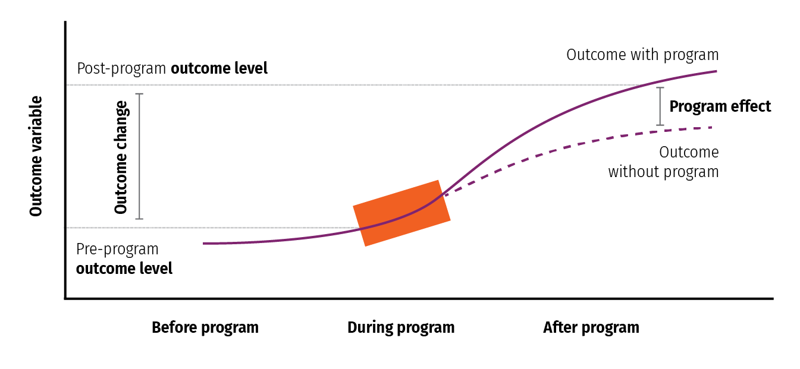
</figure>

---

# Causal effects with potential outcomes

$$
\begin{aligned}
& \textbf{Potential outcomes notation:} \\
\delta\ =&\ {\textstyle \frac{1}{n} \sum_{i=1}^n} Y_i (1) - Y_i (0) \\
& \\
& \text{or alternatively with } \textbf{E} \\
\delta\ =&\ \textbf{E} [Y_i (1) - Y_i (0)] \\
\end{aligned}
$$

---

# Causal effects with do()

$$
\begin{aligned}
& \textbf{Pearl notation:} \\
\delta\ =&\ \textbf{E}[Y_i \mid \operatorname{do}(X = 1) - Y_i \mid \operatorname{do}(X = 0)] \\
& \\
& \text{or more simply} \\
\delta\ =&\ \textbf{E} [Y_i \mid \operatorname{do}(X)] \\
\end{aligned}
$$

---

layout: false
class: middle

<br>

.large[
$$
\begin{aligned}
\textbf{E} [Y_i\ \mid\ &\operatorname{do}(X)] \quad  \\
&= \\
\quad \textbf{E} [Y_i (1&) - Y_i (0)]
\end{aligned}
$$
]

---

.box-2.medium[We can't see this]

$$\textbf{E} [Y_i \mid \operatorname{do}(X)] \quad \text{or} \quad \textbf{E} [Y_i (1) - Y_i (0)]$$

.box-2.medium[So we find the average causal effect (ACE)]

$$
\hat{\delta} = \textbf{E} [Y_i \mid X = 1] - \textbf{E} [Y_i \mid X = 0]
$$

---

.center[
<figure>
  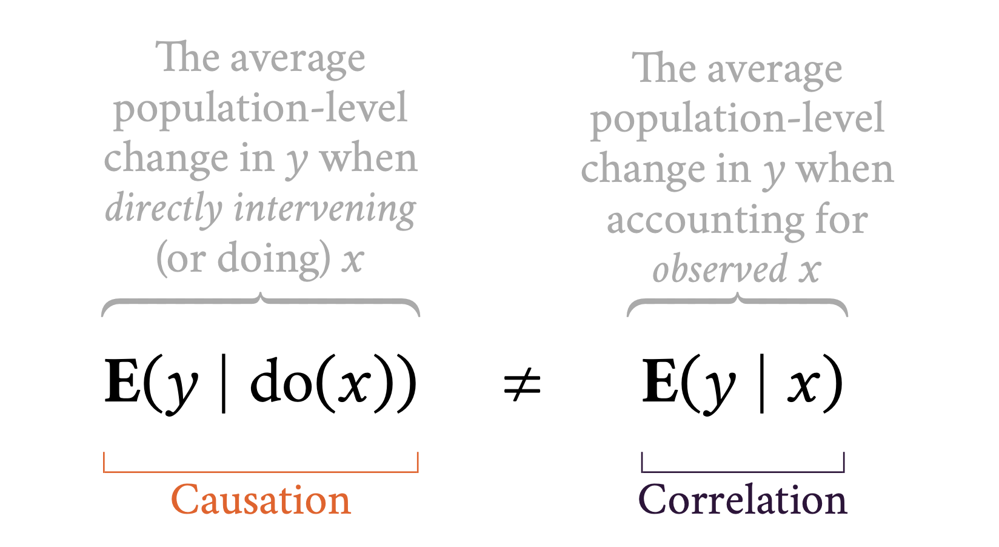
</figure>
]

---

layout: false
name: po-do
class: center middle section-title section-title-4 animated fadeIn

# do-calculus,<br>adjustment, and CATEs

---

layout: true
class: title title-4

---

# DAGs and identification

--

.box-inv-4.medium[DAGs are a statistical tool, but they don't<br>tell you what statistical method to use]

--

.box-inv-4.medium[DAGs help you with the **identification strategy**]

---

layout: false
class: middle

<figure>
  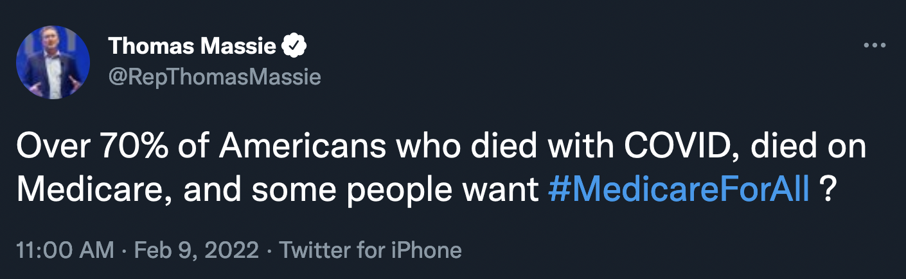
</figure>

???

<https://twitter.com/RepThomasMassie/status/1491441851748204546>

---

class: title title-4

# Easist identification

.box-inv-4.medium[Identification through research design]

.box-inv-4.sp-after[RCTs]

.box-4[When treatment is randomized, delete all arrows going into it]

.box-4.medium[No need for any do-calculus!]

---

class: title title-4

# Most other identification

.box-inv-4.medium[Identification through do-calculus]

.box-inv-4.sp-after[Rules for graph surgery]

.box-4[Backdoor adjustment and frontdoor adjustment<br>are special common patterns of do-calculus]

---

class: middle

.box-4.medium[Where can we learn more about *do*-calculus?]

.center[[Here!](https://www.andrewheiss.com/blog/2021/09/07/do-calculus-backdoors/)]

.center[
<figure>
  
</figure>
]

---

**Rule 1**: Decide if we can ignore an observation

.small[
$$P(y \mid z, \operatorname{do}(x), w) = P(y \mid \operatorname{do}(x), w) \qquad \text{ if } (Y \perp Z \mid W, X)_{G_{\overline{X}}}$$
]

<br>**Rule 2**: Decide if we can treat an intervention as an observation

.small[
$$P(y \mid \operatorname{do}(z), \operatorname{do}(x), w) = P(y \mid z, \operatorname{do}(x), w) \qquad \text{ if } (Y \perp Z \mid W, X)_{G_{\overline{X}, \underline{Z}}}$$
]

<br>**Rule 3**: Decide if we can ignore an intervention

.small[
$$P(y \mid \operatorname{do}(z), \operatorname{do}(x), w) = P(y \mid \operatorname{do}(x), w) \qquad \text{ if } (Y \perp Z \mid W, X)_{G_{\overline{X}, \overline{Z(W)}}}$$
]

---

class: middle

<figure>
  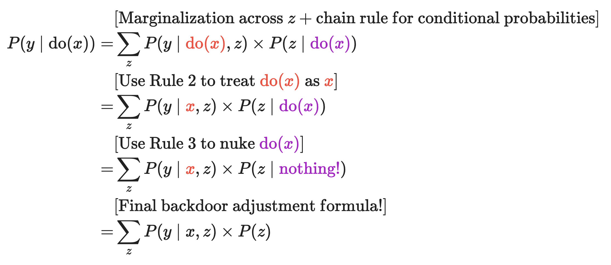
</figure>

---

.box-4.medium[Adjusting for backdoor confounding]

.center[
<figure>
  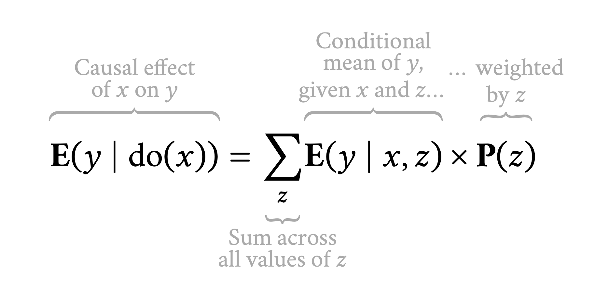
</figure>
]


---

layout: true
class: middle

---

.box-4.medium[Adjusting for frontdoor confounding]

???

Smoking/tar + Uber

Effect of shared rides on tips; use frontdoor magic

Like IV but in reverse:

- IV: instrument → treatment → outcome
- Frontdoor: treatment → instrumenty-mediator → outcome

```text
dag {
bb="0,0,1,1"
"Actually take shared ride" [pos="0.528,0.508"]
"Authorize shared ride" [exposure,pos="0.288,0.504"]
"Lots of unobserved stuff" [pos="0.521,0.342"]
"Tip driver" [outcome,pos="0.743,0.518"]
"Actually take shared ride" -> "Tip driver"
"Authorize shared ride" -> "Actually take shared ride"
"Lots of unobserved stuff" -> "Authorize shared ride"
"Lots of unobserved stuff" -> "Tip driver"
}
```

<https://twitter.com/andrewheiss/status/1361686426820222977>

---

.box-4.medium[More complex DAGs without<br>obvious backdoor or frontdoor solutions]

.box-4.sp-after[Chug through the rules of do-calculus<br>to see if the relationship is identifiable]

.center[[Causal Fusion](https://causalfusion.net/)]

---

.center[
<figure>
  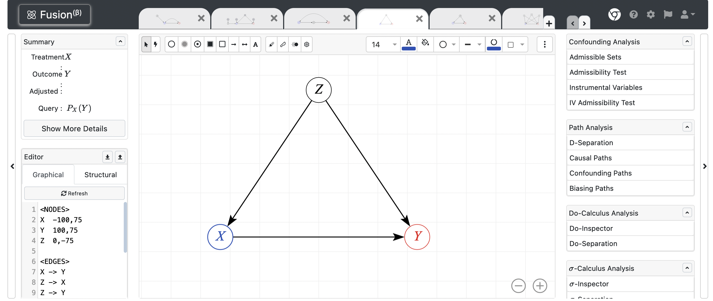
</figure>
]

---

.center[
<figure>
  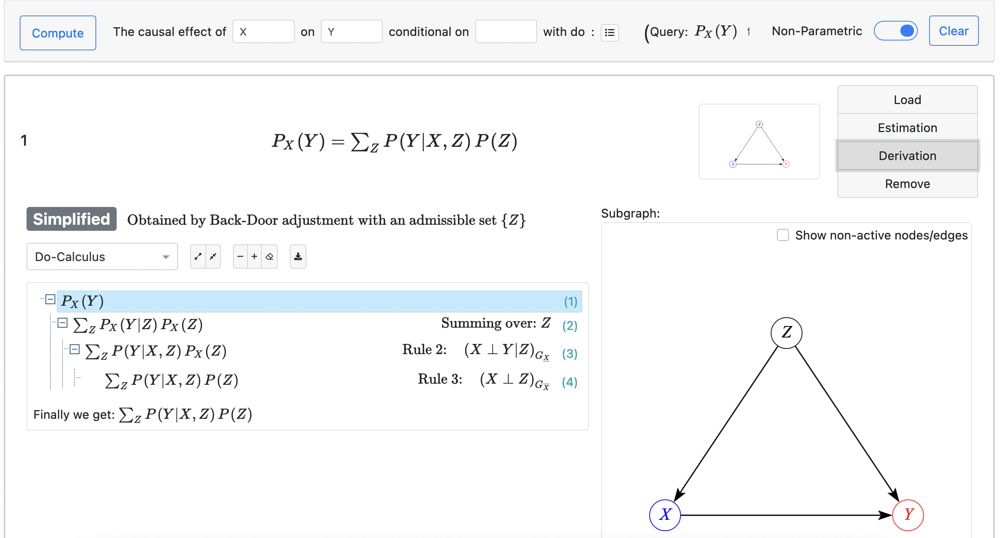
</figure>
]

---

.center[
<figure>
  
</figure>
]

---

.center[
<figure>
  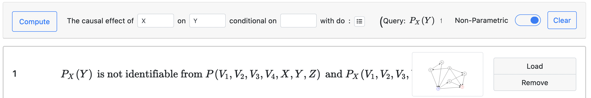
</figure>
]

---

.box-4.less-medium.sp-after[When things are identified, there are<br>still arrows leading into Y.<br>What do we do with those?<br>How do you explain those relationships?]

--

.box-4.less-medium[Outcomes have multiple causes.<br>How do you justify that your proposed<br>cause is the most causal factor?]

???

100% depends on your research question

---

.box-4.medium[Why can't we just subtract the averages<br>between treated and untreated groups?]

---

.box-4.medium[When you're making groups for CATE, how do<br>you decide what groups to put people in?]

<br>

.center[[Slides from lecture](https://evalf22.classes.andrewheiss.com/slides/05-slides.html#58)]

---

layout: false
class: title title-4

# Unconfoundedness assumption

.box-inv-4[How can we assume/pretend that treatment was<br>randomly assigned within each age?]

.box-inv-4[It seems unlikely. Wouldn't there be other factors within the older/younger group that make a person more/less likely to engage in treatment (e.g., health status)?]

<br>

.center[[Slides from lecture](https://evalf22.classes.andrewheiss.com/slides/05-slides.html#58)]

---

class: middle

.box-4.medium[Does every research question<br>need an identification strategy?]

--

.box-inv-4.huge.sp-after[No!]

.box-4[Correlation alone is okay!<br>Can lead to more focused causal questions later!]

---

class: middle

.center[
<figure>
  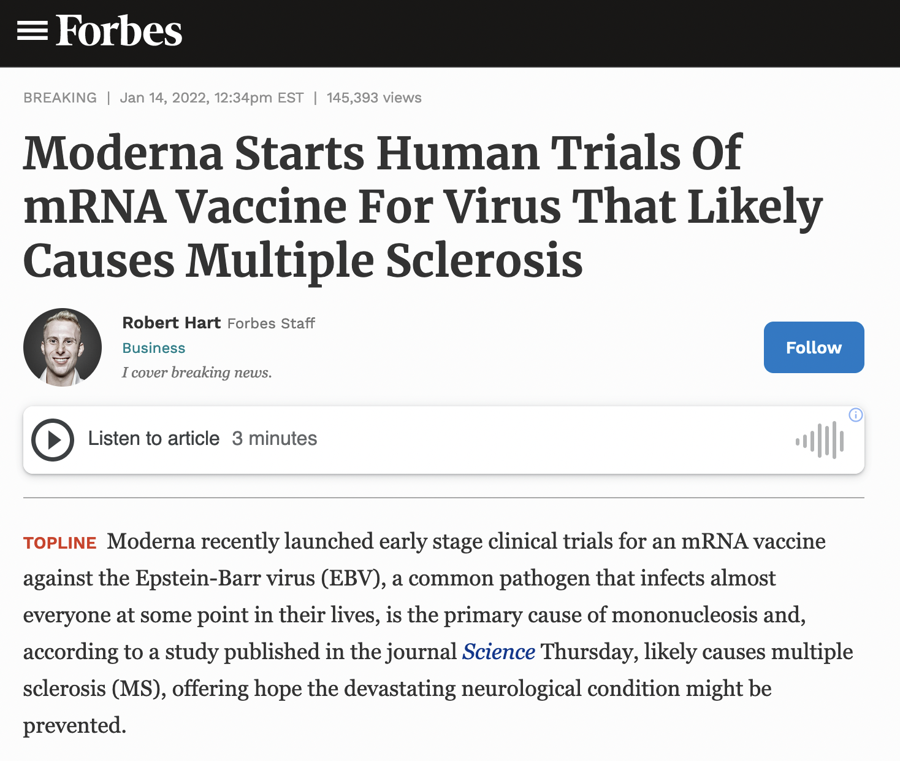
</figure>
]

???

A correlational study found that MS was strongly associated with Epstein-Barr virus (EBV) - they don't know the exact mechanism yet, but because of mRNA vaccine technology, they can develop vaccines against EBV and help stop MS. They'll figure out exact mechanisms later. For now, they've started clinical trials.

<https://www.forbes.com/sites/roberthart/2022/01/14/moderna-starts-human-trials-of-mrna-vaccine-for-virus-that-likely-causes-multiple-sclerosis/?sh=74f52ca51a04>

---

layout: false
name: logic-dag
class: center middle section-title section-title-6 animated fadeIn

# Logic models, DAGs,<br>and measurement

---

layout: true
class: middle

---

.box-6.large[What's the difference between<br>logic models and DAGs?]

.box-inv-6[Can't I just remake my logic model in Dagitty and be done?]

---

layout: false
class: title title-6

# DAGs vs. Logic models

.box-6.large[DAGs are a *statistical* tool]

.box-inv-6[Describe a data-generating process<br>and isolate/identify relationships]

--

.box-6.large.sp-before[Logic models are a *managerial* tool]

.box-inv-6[Oversee the inner workings of a program and its theory]

---

class: middle

.pull-left[
<figure>
  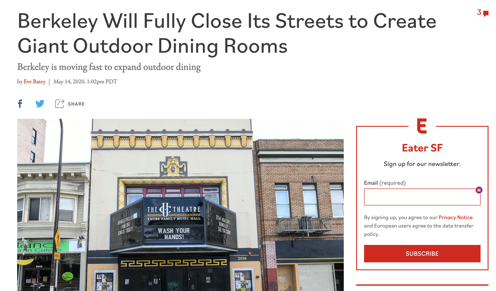
</figure>
]

.pull-right[
<figure>
  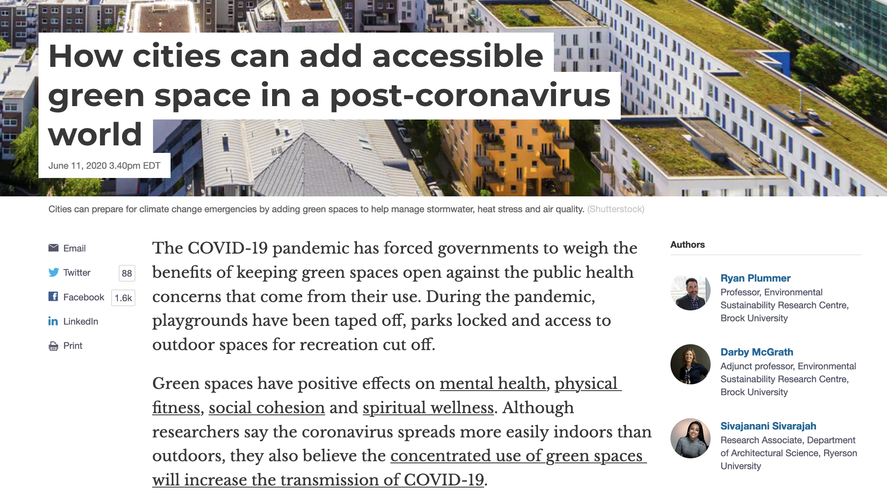
</figure>
]

???

<https://theconversation.com/how-cities-can-add-accessible-green-space-in-a-post-coronavirus-world-139194>

<https://sf.eater.com/2020/5/14/21258980/berkeley-coronavirus-covid-19-jesse-arreguin-street-closures>
