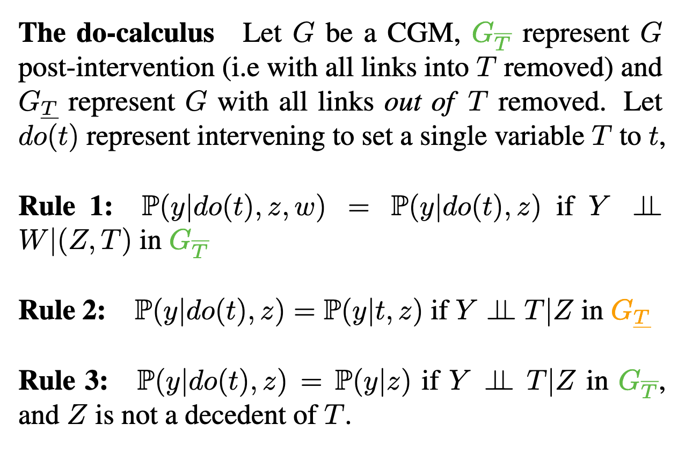
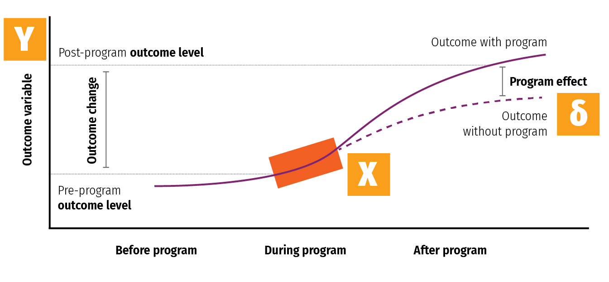
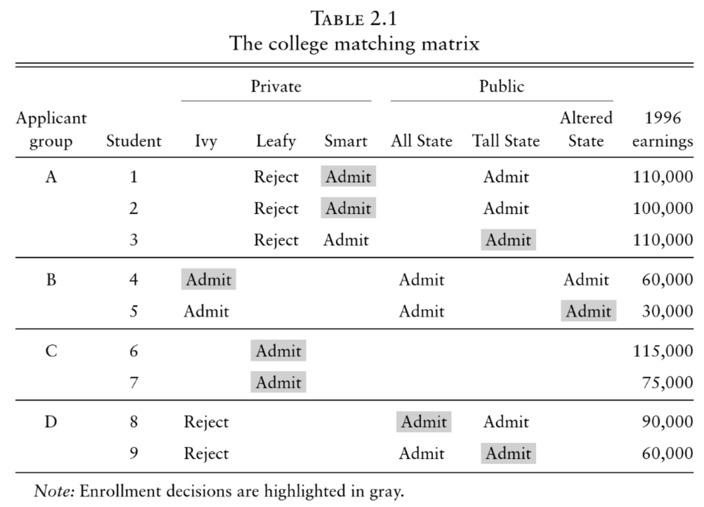

```{r setup, include=FALSE}
knitr::opts_chunk$set(warning = FALSE, message = FALSE, 
                      fig.retina = 3, fig.align = "center")
```

```{r packages-data, include=FALSE}
library(tidyverse)
library(ggdag)
library(broom)
```

```{r xaringanExtra, echo=FALSE}
xaringanExtra::use_xaringan_extra(c("tile_view"))
```

class: center middle main-title section-title-7

# DAGs and<br>potential outcomes

.class-info[

**Session 5**

.light[PMAP 8521: Program evaluation<br>
Andrew Young School of Policy Studies
]

]

---

name: outline
class: title title-inv-8

# Plan for today

--

.box-5.medium.sp-after-half[*do*()ing observational<br>causal inference]

--

.box-7.medium[Potential outcomes]

---

name: dag-adjustment
class: center middle section-title section-title-5 animated fadeIn

# *do*()ing observational<br>causal inference

---

layout: true
class: title title-5

---

# Structural models

.box-inv-5.small[The relationship between nodes can be described with equations]

.pull-left[

$$
\begin{aligned}
\text{Loc} &= f_\text{Loc}(\text{U1}) \\
\text{Bkgd} &= f_\text{Bkgd}(\text{U1}) \\
\text{JobCx} &= f_\text{JobCx}(\text{Edu}) \\
\text{Edu} &= f_\text{Edu}(\text{Req}, \text{Loc}, \text{Year}) \\
\text{Earn} &= f_\text{Earn}(\text{Edu}, \text{Year}, \text{Bkgd}, \\
& \quad\quad\quad\quad \text{Loc}, \text{JobCx}) \\
\end{aligned}
$$
]

.pull-right[
```{r structural-dag, echo=FALSE, fig.width=6, fig.height=4.5, out.width="90%"}
edu_earn_coords <- list(x = c(Edu = 2, Earn = 4, Year = 2, Bkgd = 4, 
                              Loc = 3, JobCx = 3, Req = 1, U1 = 3),
                        y = c(Edu = 2, Earn = 2, Year = 3, Bkgd = 3, 
                              Loc = 3, JobCx = 1, Req = 2, U1 = 4))

dagify(
  Earn ~ Edu + Year + Bkgd + Loc + JobCx,
  Edu ~ Req + Loc + Bkgd + Year,
  JobCx ~ Edu,
  Bkgd ~ U1,
  Loc ~ U1,
  exposure = "Edu",
  outcome = "Earn",
  latent = "U1",
  labels = c("Earn" = "Earnings", "Edu" = "Education",
             "Year" = "Year", "Bkgd" = "Background",
             "Loc" = "Location", "JobCx" = "Job connections",
             "U1" = "Unobserved stuff"),
  coords = edu_earn_coords) %>% 
  tidy_dagitty() %>% 
  node_status() %>% 
  ggplot(aes(x = x, y = y, xend = xend, yend = yend)) +
  geom_dag_edges() +
  geom_dag_point(aes(color = status), size = 14) +
  geom_dag_text(color = "black", size = 5) +
  scale_color_manual(values = c("#FF4136", "grey60", "#0074D9"),
                     na.value = "#7FDBFF") +
  guides(color = FALSE) +
  theme_dag()
```
]
---

# Structural models

.box-inv-5[`dagify()` in **ggdag** forces you to think this way]

.pull-left.small[
$$
\begin{aligned}
\text{Earn} &= f_\text{Earn}(\text{Edu}, \text{Year}, \text{Bkgd}, \\
& \quad\quad\quad\quad \text{Loc}, \text{JobCx}) \\
\text{Edu} &= f_\text{Edu}(\text{Req}, \text{Loc}, \text{Year}) \\
\text{JobCx} &= f_\text{JobCx}(\text{Edu}) \\
\text{Bkgd} &= f_\text{Bkgd}(\text{U1}) \\
\text{Loc} &= f_\text{Loc}(\text{U1})
\end{aligned}
$$
]

.pull-right.small-code[
```{r example-structural-model, eval=FALSE}
dagify(
  Earn ~ Edu + Year + Bkgd + Loc + JobCx,
  Edu ~ Req + Loc + Bkgd + Year,
  JobCx ~ Edu,
  Bkgd ~ U1,
  Loc ~ U1
)
```

]

---

# Causal identification

.pull-left-narrow[

.box-inv-5[All these nodes are related; there's correlation between them all]

.box-inv-5[We care about<br>**Edu → Earn**, but what do we do about all the other nodes?]

]

.pull-right-wide[

```{r edu-earn-full, echo=FALSE, fig.width=4.5, fig.height=3, out.width="100%"}
dagify(
  Earn ~ Edu + Year + Bkgd + Loc + JobCx,
  Edu ~ Req + Loc + Bkgd + Year,
  JobCx ~ Edu,
  Bkgd ~ U1,
  Loc ~ U1,
  exposure = "Edu",
  outcome = "Earn",
  latent = "U1",
  labels = c("Earn" = "Earnings", "Edu" = "Education",
             "Year" = "Year", "Bkgd" = "Background",
             "Loc" = "Location", "JobCx" = "Job connections",
             "U1" = "Unobserved stuff"),
  coords = edu_earn_coords) %>% 
  tidy_dagitty() %>% 
  node_status() %>% 
  ggplot(aes(x = x, y = y, xend = xend, yend = yend)) +
  geom_dag_edges() +
  geom_dag_point(aes(color = status), size = 14) +
  geom_dag_text(color = "black", size = 5) +
  scale_color_manual(values = c("#FF4136", "grey60", "#0074D9"),
                     na.value = "#7FDBFF") +
  guides(color = FALSE) +
  theme_dag()
```

]

---

# Causal identification

.box-inv-5.medium[A causal effect is *identified* if the association between treatment and outcome is propertly stripped and isolated]

---

# Paths and associations

.box-inv-5.medium[Arrows in a DAG transmit associations]

.box-inv-5.medium[You can redirect and control those paths by "adjusting" or "conditioning"]

---

# Three types of associations

.pull-left-3[
.box-5.medium[Confounding]

```{r confounding-dag, echo=FALSE, fig.width=4.5, fig.height=3.35, out.width="100%"}
dagify(
  Y ~ X + Z,
  X ~ Z,
  coords = list(x = c(X = 1, Y = 3, Z = 2),
                y = c(X = 1, Y = 1, Z = 2))
) %>% 
  ggplot(aes(x = x, y = y, xend = xend, yend = yend)) +
  geom_dag_edges() +
  geom_dag_point(color = "black", size = 17) +
  geom_dag_text(color = "white", size = 5) +
  theme_dag()
```

.box-inv-5.small[Common cause]
]

.pull-middle-3.center[
.box-5.medium[Causation]

```{r mediation-dag, echo=FALSE, fig.width=4.5, fig.height=3.35, out.width="100%"}
dagify(
  Y ~ X + Z,
  Z ~ X,
  coords = list(x = c(X = 1, Y = 3, Z = 2),
                y = c(X = 1, Y = 1, Z = 2))
) %>% 
  ggplot(aes(x = x, y = y, xend = xend, yend = yend)) +
  geom_dag_edges() +
  geom_dag_point(color = "black", size = 17) +
  geom_dag_text(color = "white", size = 5) +
  theme_dag()
```

.box-inv-5.small[Mediation]
]

.pull-right-3[
.box-5.medium[Collision]

```{r collision-dag, echo=FALSE, fig.width=4.5, fig.height=3.35, out.width="100%"}
dagify(
  Y ~ X,
  Z ~ Y,
  Z ~ X,
  coords = list(x = c(X = 1, Y = 3, Z = 2),
                y = c(X = 1, Y = 1, Z = 2))
) %>% 
  ggplot(aes(x = x, y = y, xend = xend, yend = yend)) +
  geom_dag_edges() +
  geom_dag_point(color = "black", size = 17) +
  geom_dag_text(color = "white", size = 5) +
  theme_dag()
```

.box-inv-5.small[Selection /<br>endogeneity]
]

---

# Interventions

.box-inv-5.medium[*do*-operator]

.box-5[Making an intervention in a DAG]

$$
P[Y\ |\ do(X = x)] \quad \text{or} \quad E[Y\ |\ do(X = x)]
$$

--

.box-5[P = probability distribution, or E = expectation/expected value]

--

.box-5[Y = outcome, X = treatment;<br>x = specific value of treatment]

---

# Interventions

$$
E[Y\ |\ do(X = x)]
$$

.box-5[E\[ Earnings | *do*(One year of college)\] ]

--

.box-5[E\[ Firm growth | *do*(Government R&D funding)\] ]

--

.box-5[E\[ Air quality | *do*(Carbon tax)\] ]

--

.box-5[E\[ Juvenile delinquency | *do*(Truancy program)\] ]

--

.box-5[E\[ Malaria infection rate | *do*(Mosquito net)\] ]

---

# Interventions

.box-inv-5[When you *do*() X, delete all arrows into it]

--

.pull-left[
.box-5.small[Observational DAG]
```{r observational-dag, echo=FALSE, fig.width=4, fig.height=3, out.width="90%"}
dagify(
  Y ~ X + A,
  X ~ A,
  coords = list(x = c(X = 1, Y = 2, A = 1.5),
                y = c(X = 1, Y = 1, A = 2))
) %>% 
  ggplot(aes(x = x, y = y, xend = xend, yend = yend)) +
  geom_dag_edges() +
  geom_dag_point(color = "black", size = 11) +
  geom_dag_text() +
  theme_dag()
```
]

--

.pull-right[
.box-5.small[Experimental DAG]
```{r experimental-dag, echo=FALSE, fig.width=4, fig.height=3, out.width="90%"}
dagify(
  Y ~ X + A,
  coords = list(x = c(X = 1, Y = 2, A = 1.5),
                y = c(X = 1, Y = 1, A = 2)),
  labels = c(X = "X = x")
) %>% 
  ggplot(aes(x = x, y = y, xend = xend, yend = yend)) +
  geom_dag_edges() +
  geom_dag_point(color = "black", size = 11) +
  geom_dag_text() +
  geom_dag_text_repel(aes(label = label),
                      nudge_x = 0, nudge_y = 0.25,
                      color = "black", 
                      fontface = "bold", lineheight = 0.95, seed = 1234) +
  theme_dag()
```
]

---

# Interventions

$$
E[\text{Earnings}\ |\ do(\text{College education})]
$$

--

.pull-left[
.box-5.small[Observational DAG]

```{r edu-earn-obs, echo=FALSE, fig.width=6, fig.height=4.5, out.width="90%"}
dagify(
  Earn ~ Edu + Year + Bkgd + Loc + JobCx,
  Edu ~ Req + Loc + Bkgd + Year,
  JobCx ~ Edu,
  Bkgd ~ U1,
  Loc ~ U1,
  exposure = "Edu",
  outcome = "Earn",
  latent = "U1",
  labels = c("Earn" = "Earnings", "Edu" = "Education",
             "Year" = "Year", "Bkgd" = "Background",
             "Loc" = "Location", "JobCx" = "Job connections",
             "U1" = "Unobserved stuff"),
  coords = edu_earn_coords) %>% 
  tidy_dagitty() %>% 
  node_status() %>% 
  ggplot(aes(x = x, y = y, xend = xend, yend = yend)) +
  geom_dag_edges() +
  geom_dag_point(aes(color = status), size = 14) +
  geom_dag_text(color = "black", size = 5) +
  scale_color_manual(values = c("#FF4136", "grey60", "#0074D9"),
                     na.value = "#7FDBFF") +
  guides(color = FALSE) +
  theme_dag()
```

]

--

.pull-right[
.box-5.small[Experimental DAG]

```{r edu-earn-experiment, warning=FALSE, echo=FALSE, fig.width=6, fig.height=4.5, out.width="90%"}
dagify(
  Earn ~ Edu + Year + Bkgd + Loc + JobCx,
  NULL ~ Req,
  JobCx ~ Edu,
  Bkgd ~ U1,
  Loc ~ U1,
  exposure = "Edu",
  outcome = "Earn",
  latent = "U1",
  labels = c("Earn" = "Earnings", "Edu" = "Education",
             "Year" = "Year", "Bkgd" = "Background",
             "Loc" = "Location", "JobCx" = "Job connections",
             "U1" = "Unobserved stuff"),
  coords = edu_earn_coords) %>% 
  tidy_dagitty() %>% 
  node_status() %>% 
  ggplot(aes(x = x, y = y, xend = xend, yend = yend)) +
  geom_dag_edges() +
  geom_dag_point(aes(color = status), size = 14) +
  geom_dag_text(color = "black", size = 5) +
  scale_color_manual(values = c("#FF4136", "grey60", "#0074D9"),
                     na.value = "#7FDBFF") +
  guides(color = FALSE) +
  theme_dag()
```
]

---

# Un*do*()ing things

.box-inv-5.medium[We want to know **P[Y | *do*(X)]**<br>but all we have is<br>observational data X, Y, and Z]

--

$$
P[Y\ |\ do(X)] \neq P(Y\ |\ X)
$$

--

.box-5[Correlation isn't causation!]

---

# Un*do*()ing things

.box-inv-5.medium[Our goal with observational data:<br>Rewrite **P[Y | *do*(X)]** so that it doesn't have a *do*() anymore (is "*do*-free")]

---

# *do*-calculus

.box-inv-5[A set of three rules that let you manipulate a DAG<br>in special ways to remove *do*() expressions]

.center[
<figure>
  
</figure>
]

.box-5.smaller[WAAAAAY beyond the score of this class!<br>Just know it exists and computer algorithms can do it for you!]

???

https://arxiv.org/abs/1906.07125

---

# Special cases of *do*-calculus

.box-inv-5.medium.sp-after[Backdoor adjustment]

.box-inv-5.medium[Frontdoor adjustment]

---

# Backdoor adjustment

$$
P[Y\ |\ do(X)] = \sum_Z P(Y\ |\ X, Z) \times P(Z)
$$

.pull-left[
```{r backdoor-dag, echo=FALSE, fig.width=5, fig.height=3.4, out.width="90%"}
dagify(Y ~ X + Z,
  X ~ Z,
  coords = list(x = c(X = 1, Y = 3, Z = 2),
                y = c(X = 1, Y = 1, Z = 2))) %>% 
  tidy_dagitty() %>% 
  ggplot(aes(x = x, y = y, xend = xend, yend = yend)) +
  geom_dag_edges() +
  geom_dag_point() +
  geom_dag_text() +
  theme_dag()
```
]

.pull-right[
.box-inv-5.small[↑ That's complicated!]

.box-inv-5[The right-hand side of the equation means "the effect of X on Y after adjusting for Z"]

.box-5[There's no *do*() on that side!]
]

---

# Frontdoor adjustment

```{r frontdoor, echo=FALSE, fig.width=5, fig.height=3.4, out.width="50%"}
dagify(C ~ T + G,
       T ~ S,
       S ~ G,
       coords = list(
         x = c(S = 1, T = 2, C = 3, G = 2),
         y = c(S = 1, T = 1, C = 1, G = 2)
       ),
       labels = c(S = "Smoking", 
                  T = "Tar", 
                  C = "Cancer",
                  G = "Genetics"),
       exposure = "S",
       outcome = "C") %>% 
  tidy_dagitty() %>% 
  ggplot(aes(x = x, y = y, xend = xend, yend = yend)) +
  geom_dag_edges() +
  geom_dag_point() +
  geom_dag_text() +
  geom_dag_label_repel(aes(label = label), nudge_y = 0.1, seed = 1234) +
  theme_dag()
```


.box-5.small[**S → T** is *d*-separated; **T → C** is *d*-separated<br>combine the effects to find **S → C**]

---

# Moral of the story

.box-inv-5.medium[If you can transform *do*() expressions to<br>*do*-free versions, you can legally make causal inferences from observational data]

--

.box-5[Backdoor adjustment is easiest to see +<br>dagitty and **ggdag** do this for you!]

--

.box-5.small[Fancy algorithms (found in the **causaleffect** package)<br>can do the official *do*-calculus for you too]

---

layout: false
name: potential-outcomes
class: center middle section-title section-title-7 animated fadeIn

# Potential outcomes

---

layout: true
class: title title-7

---

# Program effect

<figure>
  
</figure>

---

# Some equation translations

.box-inv-7.medium[Causal effect = δ (delta)]

$$
\delta = P[Y\ |\ do(X)]
$$

--

$$
\delta = E[Y\ |\ do(X)] - E[Y\ |\ \hat{do}(X)]
$$

--

$$
\delta = (Y\ |\ X = 1) - (Y\ |\ X = 0)
$$

--

$$
\delta = Y_1 - Y_0
$$

---

layout: false
class: bg-full
background-image: url("img/05/TAL.png")

???

https://www.thisamericanlife.org/691/gardens-of-branching-paths

---

layout: true
class: title title-7

---

layout: false

.box-7.large[Fundamental problem<br>of causal inference]

$$
\delta_i = Y_i^1 - Y_i^0 \quad \text{in real life is} \quad \delta_i = Y_i^1 - ???
$$

.box-inv-7[Individual-level effects are impossible to observe!]

.box-inv-7[There are no individual counterfactuals!]

---

layout: true
class: title title-7

---

# Average treatment effect (ATE)

.box-inv-7.medium[Solution: Use averages instead]

$$
\text{ATE} = E(Y_1 - Y_0) = E(Y_1) - E(Y_0)
$$

--

.box-7[Difference between average/expected value when<br>program is on vs. expected value when program is off]

$$
\delta = (\bar{Y}\ |\ P = 1) - (\bar{Y}\ |\ P = 0)
$$

---

layout: false

```{r po-table, echo=FALSE}
po <- tibble(
  Person = 1:8,
  Age = c("Old", "Old", "Old", "Old", "Young", "Young", "Young", "Young"),
  Treated = c(TRUE, TRUE, TRUE, FALSE, TRUE, FALSE, FALSE, FALSE),
  Y1 = c(80, 75, 85, 70, 75, 80, 90, 85),
  Y0 = c(60, 70, 80, 60, 70, 80, 100, 80)
) %>% 
  mutate(delta = Y1 - Y0) %>% 
  mutate(actual = ifelse(Treated, Y1, Y0)) %>% 
  mutate(`Outcome<br>with program` = ifelse(Treated, paste0("**", Y1, "**"), Y1),
         `Outcome<br>without program` = ifelse(!Treated, paste0("**", Y0, "**"), Y0),
         Effect = paste0("**", delta, "**"))
```

.small[
```{r basic-po, echo=FALSE}
po %>% 
  select(Person, Age, Treated, starts_with("Outcome"), Effect) %>% 
  knitr::kable(align = "cccccc")
```
]

---

.smaller.sp-after[
```{r basic-po1, echo=FALSE}
po %>% 
  select(Person, Age, Treated, starts_with("Outcome"), Effect) %>% 
  knitr::kable(align = "cccccc")
```
]

.pull-left.small[
$\delta = (\bar{Y}\ |\ P = 1) - (\bar{Y}\ |\ P = 0)$
]

.pull-right.small[
$\text{ATE} = \frac{20 + 5 + 5 + 5 + 10 + 0 + -10 + 5}{8} = 5$
]

---

class: title title-7

# CATE

.box-inv-7.sp-after[ATE in subgroups]

--

.box-7.medium[Is the program more<br>effective for specific age groups?]

---

.smaller.sp-after[
```{r basic-po-cate, echo=FALSE}
po %>% 
  select(Person, Age, Treated, starts_with("Outcome"), Effect) %>% 
  knitr::kable(align = "cccccc")
```
]

.pull-left.small[
$\delta = (\bar{Y}_\text{O}\ |\ P = 1) - (\bar{Y}_\text{O}\ |\ P = 0)$

$\delta = (\bar{Y}_\text{Y}\ |\ P = 1) - (\bar{Y}_\text{Y}\ |\ P = 0)$
]

.pull-right.small[
$\text{CATE}_\text{Old} = \frac{20 + 5 + 5 + 10}{4} = 10$

$\text{CATE}_\text{Young} = \frac{5 + 0 - 10 + 5}{4} = 0$
]

---

class: title title-7

# ATT and ATU

.box-inv-7.medium[Average treatment on the treated]

.box-7[ATT / TOT]

.box-7[Effect for those with treatment]

--

.box-inv-7.medium[Average treatment on the untreated]

.box-7[ATU / TUT]

.box-7[Effect for those without treatment]

---

.smaller.sp-after[
```{r basic-po-att, echo=FALSE}
po %>% 
  select(Person, Age, Treated, starts_with("Outcome"), Effect) %>% 
  knitr::kable(align = "cccccc")
```
]

.pull-left.small[
$\delta = (\bar{Y}_\text{T}\ |\ P = 1) - (\bar{Y}_\text{T}\ |\ P = 0)$

$\delta = (\bar{Y}_\text{U}\ |\ P = 1) - (\bar{Y}_\text{U}\ |\ P = 0)$
]

.pull-right.small[
$\text{CATE}_\text{Treated} = \frac{20 + 5 + 5 + 5}{4} = 8.75$

$\text{CATE}_\text{Untreated} = \frac{10 + 0 - 10 + 5}{4} = 1.25$
]

---

layout: true
class: title title-7

---

# ATE, ATT, and ATU

.box-inv-7.medium.sp-after[The ATE is the weighted average<br>of the ATT and ATU]

--

.center[
$\text{ATE} = (\pi_\text{Treated} \times \text{ATT}) + (\pi_\text{Untreated} \times \text{ATU})$

$(\frac{4}{8} \times 8.75) + (\frac{4}{8} \times 1.25)$

$4.375 + 0.625 = 5$
]

.box-7.smaller[**π** here means "proportion," not 3.1415]

---

# Selection bias

.box-inv-7.medium[ATE and ATT aren't always the same]

.box-inv-7.medium[ATE = ATT + Selection bias]

$$
\begin{aligned}
5 &= 8.75 + x \\
x &= -3.75
\end{aligned}
$$

.box-7[Randomization fixes this, makes x = 0]

---

# Actual data

.pull-left.smaller[
```{r po-actual, echo=FALSE}
po %>% 
  select(Person, Age, Treated, `Actual outcome` = actual) %>% 
  knitr::kable(align = "cccc")
```
]

.pull-right[
.box-inv-7[Treatment not<br>randomly assigned]

.box-inv-7[We can't see<br>unit-level causal effects]

.box-7[What do we do?!]
]

---

# Actual data

.pull-left.smaller[
```{r po-actual1, echo=FALSE}
po %>% 
  select(Person, Age, Treated, `Actual outcome` = actual) %>% 
  knitr::kable(align = "cccc")
```
]

.pull-right[
.box-inv-7[Treatment seems to be correlated with age]

```{r po-dag, echo=FALSE, fig.width=5, fig.height=3.2, out.width="100%"}
dagify(outcome ~ treatment + age,
       treatment ~ age,
       coords = list(
         x = c(outcome = 3, treatment = 1, age = 2),
         y = c(outcome = 1, treatment = 1, age = 2)
       ),
       labels = c(treatment = "Treatment", 
                  outcome = "Outcome", 
                  age = "Age"),
       exposure = "treatment",
       outcome = "outcome") %>% 
  tidy_dagitty() %>% 
  node_status() %>% 
  ggplot(aes(x = x, y = y, xend = xend, yend = yend)) +
  geom_dag_edges() +
  geom_dag_point(aes(color = status)) +
  geom_dag_label_repel(aes(label = label), nudge_y = 0.1, seed = 1234) +
  scale_color_manual(values = c("#F012BE", "#3D9970"), na.value = "grey80") +
  guides(color = FALSE) +
  theme_dag()
```
]

---

# Actual data

.pull-left.tiny[
```{r po-actual2, echo=FALSE}
po %>% 
  select(Person, Age, Treated, `Actual outcome` = actual) %>% 
  knitr::kable(align = "cccc")
```
]

.pull-right[
.box-inv-7[We can estimate the ATE by finding the weighted average of age-based CATEs]

.box-inv-7.tiny[As long as we assume/pretend treatment was randomly assigned within each age = unconfoundedness]

]

&nbsp;

.center[
$\widehat{\text{ATE}} = \pi_\text{Old} \widehat{\text{CATE}_\text{Old}} + \pi_\text{Young} \widehat{\text{CATE}_\text{Young}}$
]

---

# Actual data

.center.sp-after[
$\color{#FF851B}{\widehat{\text{ATE}}} = \pi_\text{Old} \color{#2ECC40}{\widehat{\text{CATE}_\text{Old}}} + \pi_\text{Young} \color{#0074D9}{\widehat{\text{CATE}_\text{Young}}}$
]

.pull-left-narrow.tiny[
```{r po-actual3, echo=FALSE}
po %>% 
  select(Person, Age, Treated, `Actual outcome` = actual) %>% 
  knitr::kable(align = "cccc")
```
]

.pull-right-wide.small[
&nbsp;

$\color{#2ECC40}{\widehat{\text{CATE}_\text{Old}}} = \frac{80 + 75 + 85}{3} - \frac{60}{1} = \color{#2ECC40}{20}$

$\color{#0074D9}{\widehat{\text{CATE}_\text{Young}}} = \frac{75}{1} - \frac{80 + 100 + 80}{3} = \color{#0074D9}{-11.667}$

$\color{#FF851B}{\widehat{\text{ATE}}} = (\frac{4}{8} \times \color{#2ECC40}{20}) + (\frac{4}{8} \times \color{#0074D9}{-11.667}) = \color{#FF851B}{4.1667}$
]

---

# ¡¡¡DON'T DO THIS!!!

.center.sp-after[
$\color{#FF851B}{\widehat{\text{ATE}}} = \color{#F012BE}{\widehat{\text{CATE}_\text{Treated}}} - \color{#AAAAAA}{\widehat{\text{CATE}_\text{Untreated}}}$
]

.pull-left-narrow.tiny[
```{r po-actual4, echo=FALSE}
po %>% 
  select(Person, Age, Treated, `Actual outcome` = actual) %>% 
  knitr::kable(align = "cccc")
```
]

.pull-right-wide.small.center[
$\color{#F012BE}{\widehat{\text{CATE}_\text{Treated}}} = \frac{80 + 75 + 85 + 75}{4} = \color{#F012BE}{78.75}$

$\color{#AAAAAA}{\widehat{\text{CATE}_\text{Untreated}}} = \frac{60 + 80 + 100 + 80}{4} = \color{#AAAAAA}{80}$

$\color{#FF851B}{\widehat{\text{ATE}}} = \color{#F012BE}{78.75} - \color{#AAAAAA}{80} = \color{#FF851B}{-1.25}$

&nbsp;

.box-7[You can only do this if treatment is random!]
]


---

# Matching and ATEs

.center[
$\widehat{\text{ATE}} = \pi_\text{Old} \widehat{\text{CATE}_\text{Old}} + \pi_\text{Young} \widehat{\text{CATE}_\text{Young}}$
]

.pull-left-wide[
.box-inv-7[We used age here because it correlates with (and confounds) the outcome]

.box-7.small[And we assumed unconfoundedness;<br>that treatment is<br>randomly assigned within the groups]
]

.pull-right-narrow[
`)
]

---

layout: false

.pull-left-narrow[
&nbsp;

&nbsp;

.box-7[Does attending a private university cause an increase in earnings?]
]

.pull-right-wide[
<figure>
  
</figure>
]

---

.pull-left-wide[
<figure>
  
</figure>
]

.pull-right-narrow[
.box-7[This is tempting!]

.box-inv-7[Average private − Average public]

.tiny[
$$
\begin{aligned}
\frac{110 + 100 + 60 + 115 + 75}{5} &= \color{#0074D9}{92} \\
\frac{110 + 30 + 90 + 60}{4} &= \color{#2ECC40}{72.5} \\
(\color{#0074D9}{92} \times \color{#7FDBFF}{\frac{5}{9}}) - (\color{#2ECC40}{72.5} \times \color{#01FF70}{\frac{4}{9}}) &= \color{#FF851B}{18,888}
\end{aligned}
$$
]

.box-7[**This is wrong!**]
]

.center[
$\color{#FF851B}{\widehat{\text{ATE}}} = \color{#7FDBFF}{\pi_\text{Private}} \color{#0074D9}{\widehat{\text{CATE}_\text{Private}}} + \color{#01FF70}{\pi_\text{Public}} \color{#2ECC40}{\widehat{\text{CATE}_\text{Public}}}$
]

---

class: title title-7

# Grouping and matching

.pull-left[
<figure>
  
</figure>
]

.pull-right[
.box-inv-7[These groups look like they have similar characteristics]

.box-inv-7.tiny[Unconfoundedness?]

```{r match-dag, echo=FALSE, fig.width=5, fig.height=3.2, out.width="80%"}
dagify(outcome ~ treatment + characteristics,
       treatment ~ characteristics,
       coords = list(
         x = c(outcome = 3, treatment = 1, characteristics = 2),
         y = c(outcome = 1, treatment = 1, characteristics = 2)
       ),
       labels = c(treatment = "Private university", 
                  outcome = "Income", 
                  characteristics = "Student characteristics (group)"),
       exposure = "treatment",
       outcome = "outcome") %>% 
  tidy_dagitty() %>% 
  node_status() %>% 
  ggplot(aes(x = x, y = y, xend = xend, yend = yend)) +
  geom_dag_edges() +
  geom_dag_point(aes(color = status)) +
  geom_dag_label_repel(aes(label = label), nudge_y = 0.1, seed = 1234) +
  scale_color_manual(values = c("#F012BE", "#3D9970"), na.value = "grey80") +
  guides(color = FALSE) +
  theme_dag()
```
]

---

.pull-left-wide[
<figure>
  
</figure>
]

.pull-right-narrow[
.box-inv-7[CATE Group A + CATE Group B]

.tiny[
$$
\begin{aligned}
\frac{110 + 100}{2} - 110 &= \color{#0074D9}{-5,000} \\
60 - 30 &= \color{#2ECC40}{30,000} \\
(\color{#0074D9}{-5} \times \color{#7FDBFF}{\frac{3}{5}}) + (\color{#2ECC40}{30} \times \color{#01FF70}{\frac{2}{5}}) &= \color{#FF851B}{9,000}
\end{aligned}
$$
]

.box-7[**This is less wrong!**]
]

.center[
$\color{#FF851B}{\widehat{\text{ATE}}} = \color{#7FDBFF}{\pi_\text{Group A}} \color{#0074D9}{\widehat{\text{CATE}_\text{Group A}}} + \color{#01FF70}{\pi_\text{Group B}} \color{#2ECC40}{\widehat{\text{CATE}_\text{Group B}}}$
]

---

class: title title-7

# Matching with regression

```{r schools-earnings, echo=FALSE, warning=FALSE, message=FALSE}
schools <- read_csv("data/public_private_earnings.csv") %>% 
  mutate(private = ifelse(str_detect(enrolled, "ivy"), TRUE, FALSE)) %>% 
  mutate(group_A = ifelse(group == "A", TRUE, FALSE))

# Only look at groups A and B, since C and D don't have people in both public
# and private schools. | means "or"
schools_small <- schools %>% 
  filter(group == "A" | group == "B")
```


$$
\text{Earnings} = \alpha + \beta_1 \text{Private} + \beta_2 \text{Group} + \epsilon
$$

--

.small-code.center[
```{r model-earnings-fake, eval=FALSE}
model_earnings <- lm(earnings ~ private + group_A, data = schools_small)
```
]

--

.small[
```{r model-earnings-results, echo=FALSE}
lm(earnings ~ private + group_A, data = schools_small) %>% 
  tidy() %>% 
  mutate(across(where(is.numeric), ~round(., 2))) %>% 
  knitr::kable()
```
]

--

.center.float-left[
.box-7[β<sub>1</sub> = $10,000]&emsp;.box-7[This is less wrong!]&emsp;.box-7[Significance details!]
]
