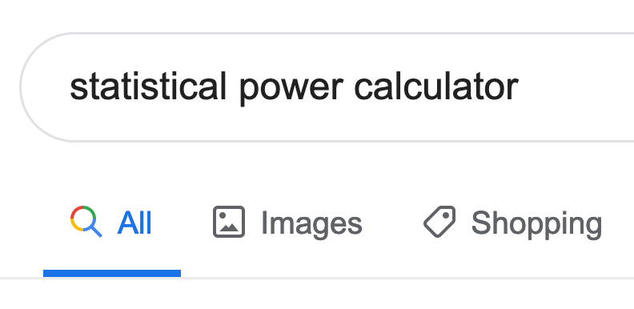
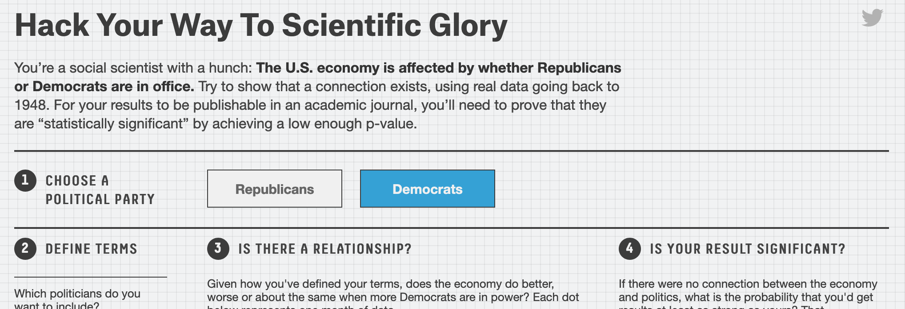
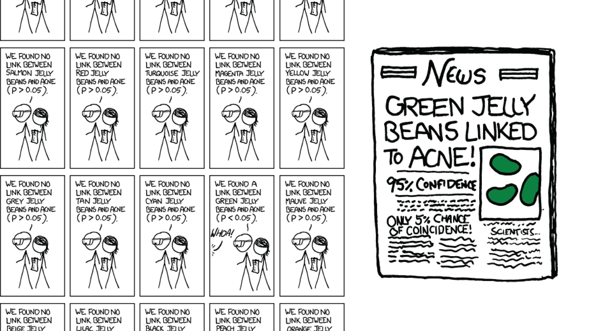
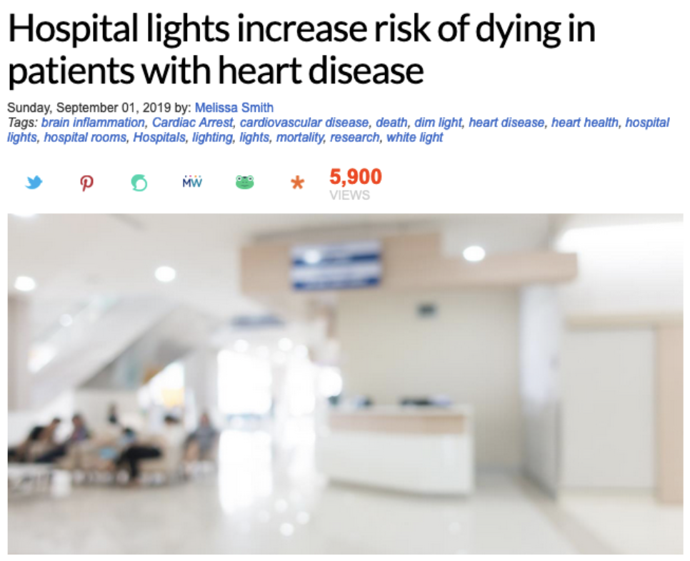
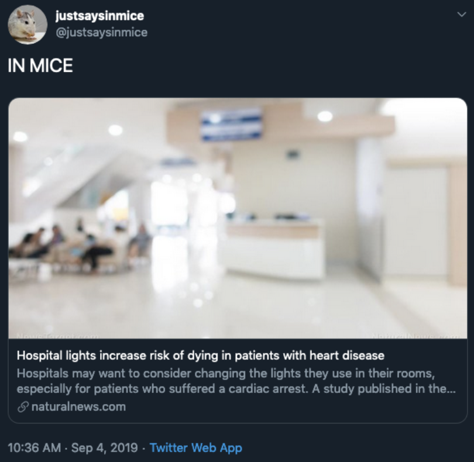

```{r setup, include=FALSE}
knitr::opts_chunk$set(warning = FALSE, message = FALSE, 
                      fig.retina = 3, fig.align = "center")
```

```{r packages-data, include=FALSE}
library(tidyverse)
library(infer)
```

```{r xaringanExtra, echo=FALSE}
xaringanExtra::use_xaringan_extra(c("tile_view"))
```

class: center middle main-title section-title-7

# The Four Horsemen<br>of Validity

.class-info[

**Session 6**

.light[PMAP 8521: Program evaluation<br>
Andrew Young School of Policy Studies
]

]

---

name: outline
class: title title-inv-8

# Plan for today

--

.box-3.medium.sp-after-half[Construct validity]

--

.box-1.medium.sp-after-half[Statistical conclusion validity]

--

.box-5.medium.sp-after-half[Internal validity]

--

.box-6.medium.sp-after-half[External validity]

---

name: construct-validity
class: center middle section-title section-title-3 animated fadeIn

# Construct validity

---


.box-inv-3.medium[A new program hopes to<br>improve student commitment to school]

--

.box-inv-3.medium.sp-after[Participants score 200 points higher on the SAT and have a 0.3 higher GPA, on average]

--

.center.float-left[
.box-3.medium[Success!]&ensp;&ensp;.box-3.medium[Success?]
]

---

layout: true
class: title title-3

---

# The Streetlight Effect

.center[
<figure>
  
</figure>
]

???

Drunk guy looking for keys in the light of the lamppost instead of over in the bushes where they lost them

Source: <https://pxhere.com/en/photo/488829>

---

# Construct validity

.box-inv-3.medium[Are you measuring what you want to measure?]

--

.box-3[Do test scores measure commitment to school?<br>Teacher performance? Principal skill?]

--

.box-3.sp-after[Test scores measure how good kids are at taking tests]

--

.box-inv-3.medium[This is why we spend so much time<br>on outcome measurement construction!]

---

layout: false
name: statistical-conclusion-validity
class: center middle section-title section-title-1 animated fadeIn

# Statistical conclusion<br>validity

---

layout: true
class: title title-1

---

# Statistical conclusion validity

--

.box-inv-1.medium[Are your statistics correct?]

--

.box-1[Statistical power]

--

.box-1[Violated assumptions of statistical tests]

--

.box-1[Fishing and p-hacking]

--

.box-1[Spurious statistical significance]

---

# Power

```{r fake-income-program, include=FALSE}
set.seed(1234)
fake_income_t <- tibble(Person = 1:200, 
                        Group = "Treatment",
                        Before = rnorm(200, mean = 200, sd = 70),
                        After = rnorm(200, mean = 250, sd = 70))

fake_income_c <- tibble(Person = 201:400, 
                        Group = "Control",
                        Before = rnorm(200, mean = 200, sd = 70),
                        After = rnorm(200, mean = 220, sd = 70))

fake_income <- bind_rows(fake_income_t, fake_income_c) %>% 
  mutate(Difference = After - Before) %>% 
  sample_frac(1)

fake_income_small <- fake_income %>% 
  group_by(Group) %>% 
  sample_n(5) %>% 
  ungroup()

diff_small <- fake_income_small %>% 
  specify(Difference ~ Group) %>% 
  calculate("diff in means", order = c("Treatment", "Control"))

boot_small <- fake_income_small %>% 
  specify(Difference ~ Group) %>% 
  hypothesize(null = "independence") %>% 
  generate(reps = 1000, type = "permute") %>% 
  calculate("diff in means", order = c("Treatment", "Control"))

p_small <- boot_small %>% 
  get_p_value(obs_stat = diff_small$stat, direction = "both") %>% 
  mutate(p_value_clean = scales::pvalue(p_value))

diff_big <- fake_income %>% 
  specify(Difference ~ Group) %>% 
  calculate("diff in means", order = c("Treatment", "Control"))

boot_big <- fake_income %>% 
  specify(Difference ~ Group) %>% 
  hypothesize(null = "independence") %>% 
  generate(reps = 1000, type = "permute") %>% 
  calculate("diff in means", order = c("Treatment", "Control"))

p_big <- boot_big %>% 
  get_p_value(obs_stat = diff_big$stat, direction = "both") %>% 
  mutate(p_value_clean = scales::pvalue(p_value))
```


.box-inv-1[A training program causes incomes to rise by $40]

.center.small[
```{r fake-income-example, echo=FALSE}
fake_income %>% 
  head(6) %>% 
  mutate(across(where(is.numeric), ~round(., 2))) %>% 
  knitr::kable(align = "llccc")
```
]

---

# Power

.pull-left[
.box-1.small[Survey 10 participants]

```{r power-small, echo=FALSE, fig.width=6, fig.height=4.5, out.width="100%"}
boot_small %>% 
  visualize() +
  geom_vline(xintercept = diff_big$stat, color = "#FF4136", size = 1) +
  labs(x = "Average treatment − Average control",
       y = "Count",
       title = "Simulated world with no difference",
       subtitle = paste0("N = 10; p = ", p_small$p_value_clean)) +
  theme_light(base_size = 13, base_family = "Fira Sans Condensed")
```

]

--

.pull-right[
.box-1.small[Survey 200 participants]

```{r power-big, echo=FALSE, fig.width=6, fig.height=4.5, out.width="100%"}
boot_big %>% 
  visualize() +
  geom_vline(xintercept = diff_big$stat, color = "#FF4136", size = 1) +
  labs(x = "Average treatment − Average control",
       y = "Count",
       title = "Simulated world with no difference",
       subtitle = paste0("N = 200; p = ", p_big$p_value_clean)) +
  theme_light(base_size = 13, base_family = "Fira Sans Condensed")
```

]

---

# What's the right sample size?

.box-inv-1[Use a statistical power calculator to<br>make sure you can potentially detect an effect]

.center[
<figure>
  
</figure>
]

---

# Test assumptions

.box-inv-1[Every statistical test has certain assumptions]

--

.box-1.smaller[For instance, for OLS:]

.center.float-left.smaller[
.box-1[Linearity]&ensp;.box-1[Homoscedasticity]&ensp;.box-1[Independence]&ensp;.box-1[Normality]
]

--

.box-inv-1.medium.sp-before[Make sure you're doing the stats correctly]

---

# Fishing and p-hacking

.box-inv-1[Wouldn't it be awesome to run thousands of models<br>with different combinations of variables<br>until you find coefficients that are statistically significant?]

--

.box-1.large[Don't!]

--

.center[
<figure>
  
</figure>
]

???

<https://projects.fivethirtyeight.com/p-hacking/>

---

# Spurious statistical significance

.box-inv-1.sp-after[If *p* threshold is 0.05 and you measure 20 outcomes,<br>1 will likely show correlation by chance]

--

.center[
<figure>
  
</figure>
]

???

<https://xkcd.com/882/>

---

layout: false
name: internal-validity
class: center middle section-title section-title-5 animated fadeIn

# Internal validity

---

layout: true
class: title title-5

---

# Internal validity

--

.box-5[Omitted variable bias]

.center.float-left[
.box-inv-5[Selection] .box-inv-5[Attrition]
]

--

.box-5[Trends]

.center.float-left[
.box-inv-5[Maturation] .box-inv-5[Secular trends] .box-inv-5[Seasonality] .box-inv-5[Testing] .box-inv-5[Regression]
]

--

.pull-left-narrow[
.box-5[Study calibration]

.center.float-left[
.box-inv-5[Measurement error]

.box-inv-5[Time frame]
]
]

--

.pull-right-wide[
.box-5[Contamination]

.center.float-left[
.box-inv-5[Hawthorne] .box-inv-5[John Henry]
]

.center.float-left[
.box-inv-5[Spillovers] .box-inv-5[Intervening events]
]
]

---

# Selection

.box-inv-5.less-medium.sp-after[If people can choose to enroll in a<br>program, those who enroll will be<br>different from those who do not]

--

.box-7.medium[How to fix]

.box-inv-5.less-medium[Randomization into<br>treatment and control groups]

---

# Selection

.box-inv-5.less-medium.sp-after[If people can choose when to<br>enroll in a program, time might<br>influence the result]

--

.box-7.medium[How to fix]

.box-inv-5.less-medium[Shift time around]

---

layout: false
class: bg-full
background-image: url("img/06/marriage-title.png")

???

(happier people more likely to get married, so without randomly assigning marriage how would you study the impact of marriage on happiness?). They use a simple approach - since happiness varies over time set marriage equal to time zero and build a pre-post design around it. You essentially leverage the within-group variance and iron out across-age differences because of the varying ages of marriage. The whole insight it to change the time-line from calendar years to program years.

<https://doi.org/10.1016/j.socec.2005.11.043>

---

class: bg-full
background-image: url("img/06/marriage-graph1.png")

---

class: bg-full
background-image: url("img/06/marriage-graph2.png")

---

class: bg-full
background-image: url("img/06/marriage-graph3.png")

---

layout: true
class: title title-5

---

# Attrition

.box-inv-5.less-medium.sp-after[If the people who leave a program or<br>study are different than those who stay,<br>the effects will be biased]

--

.box-7.medium[How to fix]

.box-inv-5.less-medium[Check characteristics of those<br>who stay and those who leave]

---

# Fake microfinance program results

.small.sp-after[
```{r fake-microfinance, echo=FALSE}
microfinance <- tribble(
  ~ID, ~`Increase in income`, ~`Remained in program`,
  1, 3, "Yes",
  2, 3.5, "Yes",
  3, 2, "Yes",
  4, 1.5, "No",
  5, 1, "No"
)

ate_with <- scales::dollar(mean(microfinance$`Increase in income`))
ate_without <- scales::dollar(mean(filter(microfinance, `Remained in program` == "Yes")$`Increase in income`))

microfinance %>% 
  mutate(`Increase in income` = scales::dollar(`Increase in income`)) %>% 
  knitr::kable(align = "ccc")
```
]

.pull-left[
.box-inv-5[ATE with<br>attriters = `r ate_with`]
]

--

.pull-right[
.box-inv-5[ATE without<br>attriters = `r ate_without`]
]

---

# Maturation

.box-inv-5.less-medium[Growth is expected naturally]

.box-inv-5.sp-after[e.g. programs targeted at childhood development<br>contend with the fact that children develop on their own too]

--

.box-7.medium[How to fix]

.box-inv-5.less-medium[Use a comparison group to remove the trend]

---

layout: false
class: bg-full
background-image: url("img/06/sesame-street.png")

???

https://www.wellesley.edu/sites/default/files/assets/dailyshot/2015/wellesleystudy_sesamestreet.pdf

https://umdrightnow.umd.edu/news/new-study-finds-sesame-street-improves-school-readiness

---

layout: true
class: title title-5

---

# Secular trends

.box-inv-5.less-medium[Patterns in data happen<br>because of larger global processes]

.center.float-left.sp-after[
.box-5[Recessions]&ensp;.box-5[Cultural shifts]&ensp;.box-5[Marriage equality]
]

--

.box-7.medium.sp-before[How to fix]

.box-inv-5.less-medium[Use a comparison group to remove the trend]

---

# Seasonal trends

.box-inv-5.less-medium.sp-after[Patterns in data happen because of<br>regular time-based trends]

--

.box-7.medium[How to fix]

.box-inv-5.less-medium[Compare observations from same time period<br>or use yearly/monthly averages]

---

layout: false

.center[
```{r giving-2017, echo=FALSE, fig.width=7, fig.asp=0.618, out.width="80%"}
giving_2017 <- tibble(Month = month.name,
                      Percent = c(0.072, 0.059, 0.076, 0.063, 0.076, 0.089, 
                                  0.068, 0.071, 0.083, 0.082, 0.079, 0.182)) %>% 
  mutate(Month = fct_inorder(Month))

ggplot(giving_2017, aes(x = Month, y = Percent)) +
  geom_col(fill = "#CF4446") +
  labs(x = NULL, y = NULL, title = "Charitable giving by month, 2017") +
  scale_y_continuous(labels = scales::percent_format(accuracy = 1)) +
  scale_x_discrete(guide = guide_axis(n.dodge = 2)) +
  coord_cartesian(ylim = c(0, 0.2)) +
  theme_light(base_size = 13, base_family = "Fira Sans Condensed") +
  theme(panel.grid.major.x = element_blank(),
        plot.title = element_text(face = "bold", size = rel(1.5)))
```
]

---

layout: true
class: title title-5

---

# Testing

.box-inv-5.less-medium.sp-after[Repeated exposure to questions or tasks<br>will make people improve naturally]

--

.box-7.medium[How to fix]

.box-inv-5.less-medium[Change tests, maybe don't offer pre-tests,<br>use a control group that receives the test]

---

# Regression to the mean

.box-inv-5.less-medium[People in the extreme have a tendency to<br>become less extreme over time]

.center.float-left.sp-after[
.box-5[Luck]&ensp;.box-5[Crime and terrorism]&ensp;.box-5[Hot hand effect]
]

--

.box-7.medium.sp-before[How to fix]

.box-inv-5.less-medium[Don't select super high or<br>super low performers]

???

This isn’t because the universe trends toward some average; an extreme value is because of systematic and random extremes, which are rare. Luck goes away

---

# Measurement error

.box-inv-5.less-medium.sp-after[Measuring the outcome incorrectly<br>will bias the effect]

--

.box-7.medium[How to fix]

.box-inv-5.less-medium[Measure the outcome well]

---

# Time frame

.box-inv-5.less-medium.sp-after[If the study is too short, the effect might not<br>be detectable yet; if the study is too long,<br>attrition becomes a problem]

--

.box-7.medium[How to fix]

.box-inv-5.less-medium[Use prior knowledge about the thing<br>you're studying to choose the right length]

---

# Hawthorne effect

.box-inv-5.less-medium.sp-after[Observing people makes them behave differently]

--

.box-7.medium[How to fix]

.box-inv-5.less-medium[Hide? Use completely unobserved control groups]

???

Experiments in 1924-1932 at Hawthorne Works

---

# John Henry effect

.box-inv-5.less-medium.sp-after[Control group works hard to prove<br>they're as good as the treatment group]

--

.box-7.medium[How to fix]

.box-inv-5.less-medium[Keep two groups separate]

---

# Spillover effect

.box-inv-5.less-medium[Control groups naturally pick up<br>what the treatment group is getting]

.center.float-left.sp-after[
.box-5[Externalities]&ensp;.box-5[Social interaction]&ensp;.box-5[Equilibrium effects]
]

--

.box-7.medium.sp-before[How to fix]

.box-inv-5.less-medium[Keep two groups separate;<br>use distant control groups]

---

# Intervening events

.box-inv-5.less-medium.sp-after[Something happens that affects one of<br>the groups and not the other]

--

.box-7.medium[How to fix]

.center.huge[🤷‍♂️]

---

# Internal validity

.box-5[Omitted variable bias]

.center.float-left[
.box-inv-5[Selection] .box-inv-5[Attrition]
]

.box-5[Trends]

.center.float-left[
.box-inv-5[Maturation] .box-inv-5[Secular trends] .box-inv-5[Seasonality] .box-inv-5[Testing] .box-inv-5[Regression]
]

.pull-left-narrow[
.box-5[Study calibration]

.center.float-left[
.box-inv-5[Measurement error]

.box-inv-5[Time frame]
]
]

.pull-right-wide[
.box-5[Contamination]

.center.float-left[
.box-inv-5[Hawthorne] .box-inv-5[John Henry]
]

.center.float-left[
.box-inv-5[Spillovers] .box-inv-5[Intervening events]
]
]

---

# Fixing internal validity

.box-inv-5.medium[Randomization fixes a host of issues]

.center.float-left.sp-after[
.box-5[Selection]&ensp;.box-5[Maturation]&ensp;.box-5[Regression to the mean]
]

--

.box-inv-5.medium.sp-before[Randomization doesn't fix everything!]

.center.float-left[
.box-5[Attrition]&ensp;.box-5[Contamination]&ensp;.box-5[Measurement]
]

---

layout: false
name: external-validity
class: center middle section-title section-title-6 animated fadeIn

# External validity

---

layout: true
class: title title-6

---

# Generalizability

.box-inv-6.less-medium[Are your findings generalizable<br>to the whole population?]

--

.pull-left.right[
<figure>
  
</figure>
]

--

.pull-right.left[
<figure>
  
</figure>
]

---

# Lab conditions vs. real world

.box-inv-6.medium[Study volunteers are weird]

--

.box-6[<span style="color: #F6D645">W</span>estern, <span style="color: #F6D645">e</span>ducated, from <span style="color: #F6D645">i</span>ndustrialized,<br><span style="color: #F6D645">r</span>ich, and <span style="color: #F6D645">d</span>emocratic countries]

--

.box-inv-6.medium.sp-before[Not everyone takes surveys]

--

.float-left.center[
.box-6[Online surveys]&ensp;.box-6[Amazon Mechanical Turk]&ensp;.box-6[Random digit dialing]
]

---

# Different settings and circumstances

--

.box-inv-6.medium.sp-after[Does a study in one state<br>apply to other states?]

--

.box-inv-6.medium[Does the effect from a mosquito net trial<br>in Eritrea transfer to Bolivia?]
