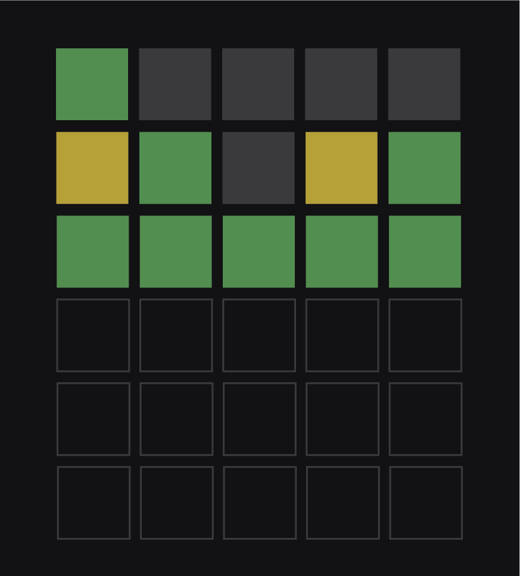
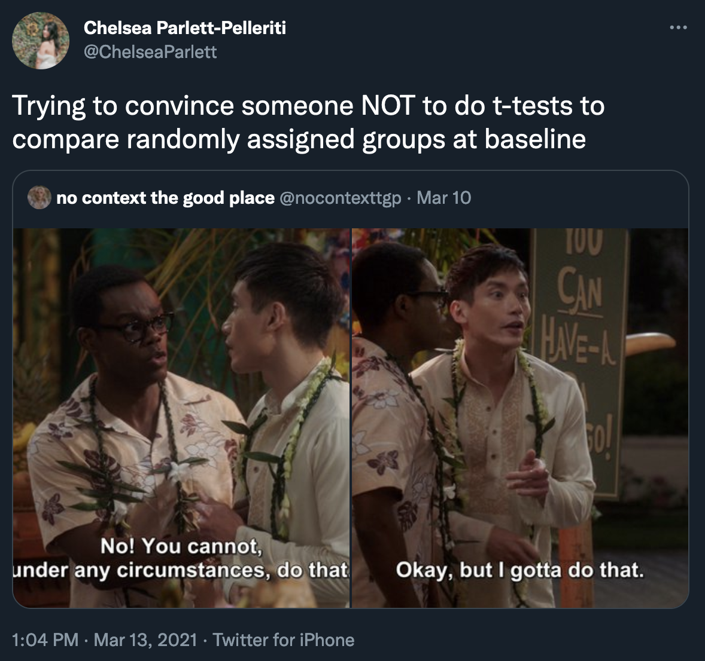
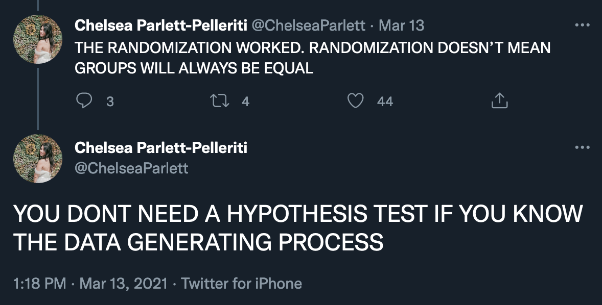

```{r setup, include=FALSE}
knitr::opts_chunk$set(warning = FALSE, message = FALSE, 
                      fig.retina = 3, fig.align = "center")
```

```{r packages-data, include=FALSE}
library(tidyverse)
library(ggdag)
library(palmerpenguins)
library(modelsummary)
```

```{r xaringanExtra, echo=FALSE}
xaringanExtra::use_xaringan_extra(c("tile_view"))
```

class: center middle main-title section-title-3

# In-person<br>session 7

.class-info[

**October 3, 2022**

.light[PMAP 8521: Program evaluation<br>
Andrew Young School of Policy Studies
]

]

---

name: outline
class: title title-inv-8

# Plan for today

--

.box-3.medium.sp-after-half[FAQs]

--

.box-2.medium.sp-after-half[RCTs]

--

.box-4.medium.sp-after-half[Matching and IPW]

---

layout: false
name: faqs
class: center middle section-title section-title-3 animated fadeIn

# FAQs

---

layout: true
class: middle

---

.box-3.large[Randomness]

.box-3.medium[How do we use random.org for things in R?]

---

.box-3.medium[Do researchers actually check<br>all of the assumptions of OLS?<br>(or any statistical test?)]

.box-inv-3.small[[Sometimes](https://stats.andrewheiss.com/donors-crackdowns-aid/03_h1-total-aid.html)]

---

layout: false
name: rcts
class: center middle section-title section-title-2 animated fadeIn

# RCTs

---

layout: true
class: middle

---

.box-2.large[Do we really not control<br>for things in an RCT?]

---

.box-2.large[Randomness and arrow deletion]

???

> Since every arrow should reflect a causal relationship, it’s not possible for there to be an arrow pointing from a covariate to the allocation, since it is done at random. With no arrow pointing to the exposure, there can be no unblocked backdoor path, and thus no confounding. Voilà. <https://statsepi.substack.com/p/out-of-balance>

---

.center[
<figure>
  
</figure>
]

???

[Coins](http://www.freestockphotos.biz/stockphoto/8215)

---

.box-2.medium[Wordle!]

.center[
<figure>
  
</figure>
]

???

<https://twitter.com/dave_andersen/status/1495530221096873993>
<https://twitter.com/johnlray/status/1495421626074214402?s=21>

---

.center[
```text
Feb 10 2022 Day 236 PAUSE
Feb 11 2022 Day 237 ULCER
Feb 12 2022 Day 238 ULTRA
Feb 13 2022 Day 239 ROBIN
 -----NYT TAKES OVER-----
Feb 14 2022 Day 240 CYNIC
Feb 15 2022 Day 241 AGORA
Feb 16 2022 Day 242 AROMA
Feb 17 2022 Day 243 CAULK
Feb 18 2022 Day 244 SHAKE
```
]

???

<https://medium.com/@owenyin/here-lies-wordle-2021-2027-full-answer-list-52017ee99e86>

---

.box-2.large[Balance tests]

???

Stratified randomization is okay

<https://twitter.com/ChelseaParlett/status/1370798053691514882>

---

.center[
<figure>
  
</figure>
]

---

.center[
<figure>
  
</figure>
]

---

.box-2.large[Can you walk through an example of<br>RCTs in class?]

---

layout: false
name: matching-ipw
class: center middle section-title section-title-4 animated fadeIn

# Matching and IPW

---

layout: true
class: middle

---

.box-4.large[Can you walk through an example of<br>IPW and matching in class?]

---

.box-4.large[Why not just control for confounders<br>instead of doing the whole matching/IPW dance?]

---

.box-4.large[Which should we use?<br>Matching or IPW?]
