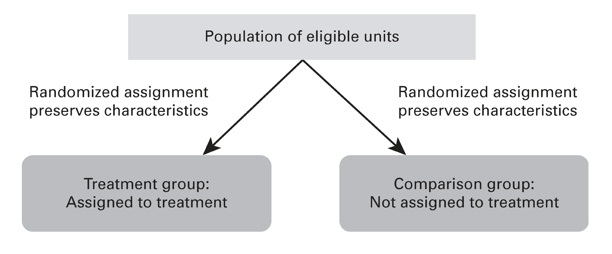

```{r setup, include=FALSE}
knitr::opts_chunk$set(warning = FALSE, message = FALSE, 
                      fig.retina = 3, fig.align = "center")
```

```{r packages-data, include=FALSE}
library(tidyverse)
library(infer)
library(broom)
library(ggdag)
library(MatchIt)
```

```{r xaringanExtra, echo=FALSE}
xaringanExtra::use_xaringan_extra(c("tile_view"))
```

class: center middle main-title section-title-7

# Randomization<br>and matching

.class-info[

**Session 7**

.light[PMAP 8521: Program evaluation<br>
Andrew Young School of Policy Studies
]

]

---

name: outline
class: title title-inv-8

# Plan for today

--

.box-4.medium.sp-after-half[The magic of randomization]

--

.box-5.medium.sp-after-half[How to analyze RCTs]

--

.box-6.medium.sp-after-half[The "gold" standard]

--

.box-1.medium.sp-after-half[Adjustment with matching]

---

name: magic-randomization
class: center middle section-title section-title-4 animated fadeIn

# The magic<br>of randomization

---

layout: true
class: title title-4

---

# Why randomize?

.box-4.large[Fundamental problem<br>of causal inference]

$$
\delta_i = Y_i^1 - Y_i^0 \quad \text{in real life is} \quad \delta_i = Y_i^1 - ???
$$

.box-inv-4[Individual-level effects are impossible to observe!]

.box-inv-4[There are no individual counterfactuals!]

---

# Why randomize?

.medium[
$$
\delta = (\bar{Y}\ |\ P = 1) - (\bar{Y}\ |\ P = 0)
$$
]

--

.box-inv-4.medium[Comparing average outcomes only works<br>if groups that received/didn't receive<br>treatment look the same]

---

# Why randomize?

.box-inv-4[With big enough samples, the magic of randomization<br>helps make comparison groups comparable]

.center[
<figure>
  
</figure>
]

---

# RCTs and DAGs

$$
E[\text{Malaria infection rate}\ |\ do(\text{Mosquito net})]
$$

--

.pull-left[
.box-4.smaller[Observational DAG]
```{r observational-dag, echo=FALSE, fig.width=4, fig.height=2.4, out.width="90%"}
dagify(
  Y ~ X + Z,
  X ~ Z,
  coords = list(x = c(X = 1, Y = 2, Z = 1.5),
                y = c(X = 1, Y = 1, Z = 2)),
  labels = c(X = "Mosquito nets", Y = "Malaria infection rate", Z = "Income")
) %>% 
  ggplot(aes(x = x, y = y, xend = xend, yend = yend)) +
  geom_dag_edges() +
  geom_dag_point(color = "black", size = 11) +
  geom_dag_label_repel(aes(label = label),
                      nudge_x = 0, nudge_y = 0.25,
                      color = "black", 
                      fontface = "bold", lineheight = 0.95, seed = 1234) +
  theme_dag()
```
]

--

.pull-right[
.box-4.smaller[Experimental DAG]
```{r experimental-dag, echo=FALSE, fig.width=4, fig.height=2.4, out.width="90%"}
dagify(
  Y ~ X + Z,
  coords = list(x = c(X = 1, Y = 2, Z = 1.5),
                y = c(X = 1, Y = 1, Z = 2)),
  labels = c(X = "Mosquito nets", Y = "Malaria infection rate", Z = "Income")
) %>% 
  ggplot(aes(x = x, y = y, xend = xend, yend = yend)) +
  geom_dag_edges() +
  geom_dag_point(color = "black", size = 11) +
  geom_dag_label_repel(aes(label = label),
                      nudge_x = 0, nudge_y = 0.25,
                      color = "black", 
                      fontface = "bold", lineheight = 0.95, seed = 1234) +
  theme_dag()
```
]

--

.box-inv-4.small[When you *do*() X, delete all arrows into X; **confounders don't influence treatment!**]

---

# How to randomize?

.center[
<figure>
  
</figure>
]

---

# Random assignment

.box-inv-4.medium[Coins]

--

.box-inv-4.medium[Dice]

--

.box-inv-4.medium[Unbiased lottery]

--

.box-inv-4.medium[Random numbers + threshold]

--

.box-inv-4.medium[Atmospheric noise]

.box-4.tiny[random.org]

---

# How big of a sample?

```{r fake-income-program, include=FALSE}
set.seed(1234)
fake_income_t <- tibble(Person = 1:200, 
                        Group = "Treatment",
                        Before = rnorm(200, mean = 200, sd = 70),
                        After = rnorm(200, mean = 250, sd = 70))

fake_income_c <- tibble(Person = 201:400, 
                        Group = "Control",
                        Before = rnorm(200, mean = 200, sd = 70),
                        After = rnorm(200, mean = 220, sd = 70))

fake_income <- bind_rows(fake_income_t, fake_income_c) %>% 
  mutate(Difference = After - Before) %>% 
  sample_frac(1)

fake_income_small <- fake_income %>% 
  group_by(Group) %>% 
  sample_n(5) %>% 
  ungroup()

diff_small <- fake_income_small %>% 
  specify(Difference ~ Group) %>% 
  calculate("diff in means", order = c("Treatment", "Control"))

boot_small <- fake_income_small %>% 
  specify(Difference ~ Group) %>% 
  hypothesize(null = "independence") %>% 
  generate(reps = 1000, type = "permute") %>% 
  calculate("diff in means", order = c("Treatment", "Control"))

p_small <- boot_small %>% 
  get_p_value(obs_stat = diff_small$stat, direction = "both") %>% 
  mutate(p_value_clean = scales::pvalue(p_value))

diff_big <- fake_income %>% 
  specify(Difference ~ Group) %>% 
  calculate("diff in means", order = c("Treatment", "Control"))

boot_big <- fake_income %>% 
  specify(Difference ~ Group) %>% 
  hypothesize(null = "independence") %>% 
  generate(reps = 1000, type = "permute") %>% 
  calculate("diff in means", order = c("Treatment", "Control"))

p_big <- boot_big %>% 
  get_p_value(obs_stat = diff_big$stat, direction = "both") %>% 
  mutate(p_value_clean = scales::pvalue(p_value))
```


.box-inv-4[A training program causes incomes to rise by $40]

.center.small[
```{r fake-income-example, echo=FALSE}
fake_income %>% 
  head(6) %>% 
  mutate(across(where(is.numeric), ~round(., 2))) %>% 
  knitr::kable(align = "llccc")
```
]

---

# Power

.pull-left[
.box-4.small[Enroll 10 participants]

```{r power-small, echo=FALSE, fig.width=6, fig.height=4.5, out.width="100%"}
boot_small %>% 
  visualize() +
  geom_vline(xintercept = diff_big$stat, color = "#FF4136", size = 1) +
  labs(x = "Average treatment − Average control",
       y = "Count",
       title = "Simulated world with no difference",
       subtitle = paste0("N = 10; p = ", p_small$p_value_clean)) +
  theme_light(base_size = 13, base_family = "Fira Sans Condensed")
```

]

--

.pull-right[
.box-4.small[Enroll 200 participants]

```{r power-big, echo=FALSE, fig.width=6, fig.height=4.5, out.width="100%"}
boot_big %>% 
  visualize() +
  geom_vline(xintercept = diff_big$stat, color = "#FF4136", size = 1) +
  labs(x = "Average treatment − Average control",
       y = "Count",
       title = "Simulated world with no difference",
       subtitle = paste0("N = 200; p = ", p_big$p_value_clean)) +
  theme_light(base_size = 13, base_family = "Fira Sans Condensed")
```

]

---

# What's the right sample size?

.box-inv-4[Use a statistical power calculator to<br>make sure you can potentially detect an effect]

.center[
<figure>
  
</figure>
]

---

layout: false
name: rct-how
class: center middle section-title section-title-5 animated fadeIn

# How to analyze RCTs

---

layout: true
class: title title-5

---

# How to analyze RCTs

.box-inv-5.sp-after[Surprisingly easy, statistically!]

--

.box-5[Step 1: Check that key demographics<br>and other confounders are balanced]

--

.box-5[Step 2: Find difference in average outcome<br>in treatment and control groups]

---

# Example RCT

```{r imaginary-program, echo=FALSE}
set.seed(123)
fake_program_t <- tibble(person = 1:400, 
                         treatment = "Treatment",
                         age = round(rnorm(400, mean = 35, sd = 10), 0),
                         sex = sample(c("Male", "Female"), 400, replace = TRUE),
                         income_after = rnorm(400, mean = 250, sd = 70))

fake_program_c <- tibble(person = 401:800, 
                         treatment = "Control",
                         age = round(rnorm(400, mean = 35, sd = 10), 0),
                         sex = sample(c("Male", "Female"), 400, replace = TRUE),
                         income_after = rnorm(400, mean = 200, sd = 70))

imaginary_program <- bind_rows(fake_program_t, fake_program_c) %>% 
  sample_frac(1) %>% 
  mutate(male_num = ifelse(sex == "Male", 1, 0))
```

.small-code[
```{r show-imaginary-program}
imaginary_program
```
]

---

# 1. Check balance

```{r balance-table}
imaginary_program %>% 
  group_by(treatment) %>% 
  summarize(avg_age = mean(age),
            prop_male = mean(sex == "Male"))
```

---

# 1. Check balance

.left-code[
```{r balance-age, tidy=FALSE, message=FALSE, fig.show="hide", fig.dim=c(4.8, 4.2), out.width="100%"}
ggplot(imaginary_program, 
       aes(x = treatment, y = age, 
           color = treatment)) +
  stat_summary(geom = "pointrange", 
               fun.data = "mean_se", 
               fun.args = list(mult=1.96)) +
  guides(color = FALSE) +
  labs(x = NULL, y = "Age")
```
]

.right-plot[
`)
]

---

# 1. Check balance

.left-code[
```{r balance-sex, tidy=FALSE, message=FALSE, fig.show="hide", fig.dim=c(4.8, 4.2), out.width="100%"}
ggplot(imaginary_program, 
       aes(x = treatment, y = male_num, 
           color = treatment)) +
  stat_summary(geom = "pointrange", 
               fun.data = "mean_se", 
               fun.args = list(mult=1.96)) +
  guides(color = FALSE) +
  labs(x = NULL, y = "Proportion male")
```
]

.right-plot[
`)
]

---

# 2. Calculate difference


.left-code[
.box-inv-5.small[Group means]

```{r program-group-means}
imaginary_program %>% 
  group_by(treatment) %>% 
  summarize(avg_outcome = mean(income_after))

251 - 205
```
]

--

.right-code[
.box-inv-5.small[Regression]

```{r program-regression-fake, eval=FALSE}
rct_model <- lm(income_after ~ treatment, 
                data = imaginary_program)
tidy(rct_model)
```

```{r program-regression-real, echo=FALSE}
rct_model <- lm(income_after ~ treatment, 
                data = imaginary_program)
tidy(rct_model) %>% select(term, estimate, std.error)
```
]

---

# 2a. Show difference

.left-code[
```{r rct-diff, tidy=FALSE, message=FALSE, fig.show="hide", fig.dim=c(4.8, 4.2), out.width="100%"}
ggplot(imaginary_program, 
       aes(x = treatment, 
           y = income_after, 
           color = treatment)) +
  stat_summary(geom = "pointrange", 
               fun.data = "mean_se", 
               fun.args = list(mult=1.96)) +
  guides(color = FALSE) +
  labs(x = NULL, y = "Income")
```
]

.right-plot[
`)
]

---

# Should you control for stuff?

--

.box-inv-5.large[No!]

--

.box-inv-5[All arrows into the treatment node are removed;<br>there's theoretically no confounding!]

---

layout: false
name: gold-standard
class: center middle section-title section-title-6 animated fadeIn

# The "gold" standard

---

layout: true
class: title title-6

---

# Types of research

.box-inv-6.medium.sp-after[Experimental studies vs.<br>observational studies]

.box-inv-6.medium[Which is better?]

---

layout: false

.center[
<figure>
  
</figure>
]

???

https://www.nytimes.com/2018/08/06/upshot/employer-wellness-programs-randomized-trials.html

---

class: bg-full
background-image: url("img/07/gold-standard.png")

---

class: bg-full
background-image: url("img/07/jpal-nobel.png")

???

https://twitter.com/MIT/status/1183752282988564480

---

&nbsp;

.box-6.large.sp-after[RCTs are great!]

--

.box-6.large[Super impractical to do<br>all the time though!]

---

layout: true
class: title title-6

---

# "Gold standard"

.box-inv-6.medium.sp-after["Gold standard" implies that all<br>causal inferences will be valid it<br>you do the experiment right]

--

.box-6[We don't care if studies are experimental or not]

--

.box-6[We care if our causal inferences are valid]

--

.box-6[RCTs are a helpful baseline/rubric for other methods]

---

# Moving to Opportunity

.center[
<figure>
  
</figure>
]

???

**MTO** - main question = does your neighborhood matter?

Subtext = kids who grow up in poor neighborhood do worse - lots of theories about that. Problems reside in the family vs. something inherent in the neighborhood / social capital or other benefits inherent in the community (be in the network of people who know where the jobs for people with low education are)

Alternative explanations:

- Poor parents don't do well in the labor market, so they live in cheap neighborhoods, where they're surrounded by the same type of people
- Racism and discrimination

Randomly assign people to where they live - ideally from birth or even pre-birth - but families that we can possibly randomly assign already have kids (required for receiving public housing assistance)

So they randomly assign families in public housing who are willing to move and accept risk of having that move controlled - no other way to really do this - you'd have to pay middle-class and higher people a ton of money to get them to move

Then randomly assign them to (1) stay, (2) move to anywhere that would take voucher, (3) anywhere with less than 10% poverty rate + get relocation counseling

People were hoping to get option 2, since people already weren't choosing 3 - it's uncomfortable to move to a neighborhood where you don't fit in


https://commons.wikimedia.org/wiki/File:Housing_and_Urban_Development_headquarters.jpg

---

# RCTs and validity

.box-inv-6.medium[Randomization fixes a ton of<br>internal validity issues]

--

.pull-left[
.box-6[**Selection**<br>Treatment and control<br>groups are comparable;<br>people don't self-select]
]

--

.pull-right[
.box-6[**Trends**<br>Maturation, secular<br>trends, seasonality,<br>regression to the mean<br>all generally average out]
]

---

# RCTs and validity

--

.box-inv-6.medium[RCTs don't fix attrition!]

.box-6[Worst threat to internal validity for RCTs]

--

.box-inv-6.medium.sp-before[If attrition is correlated<br>with treatment, that's bad]

--

.box-6[People might drop out because of the treatment,<br>or because they got/didn't get into the control group]

???

You don't have data on them. NA values. Even if people don't comply (like move to a private school), you can still get data on them, so that's okay. People might drop out randomly, and that would be fine. But if attrition is correlated with the treatment, then it's bad. People might drop because of the treatment, or because they didn't get the control group. Impossible to sign the bias—could be tons of different reasons.

---

# Addressing attrition

--

.box-inv-6.less-medium[Recruit as effectively as possible]

.box-6.sp-after[You don't just want weird/WEIRD participants]

--

.box-inv-6.less-medium[Get people on board]

.box-6.sp-after[Get participants invested in the experiment]

--

.box-inv-6.less-medium[Collect as much baseline information as possible]

.box-6[Check for randomization of attrition]

???

- Recruit as effectively as possible (so you don't get volunteers that routinely sign up for randomized experiments). Use money for recruitment

- Get people on board. Treatment might be less/more enjoyable than the control group, so people will feel lucky or unlucky to be in the treatment group - explain why the experiment itself is important. Make them invested in getting the experiment to work. Science! Why you want the right answer beyond whether or not the treatment works

- Collect as much baseline information as possible before assigning to treatment and control groups - doesn't help reduce attrition like getting people on board, but it lets us see if attrition is random with respect to preexisting characteristics - checks for randomization failures. Don't rerandomize. Randomize and then suck it up.


---

# RCTs and validity

.box-inv-6.less-medium[Randomization failures]

.box-6[Check baseline pre-data]

--

.box-inv-6.less-medium[Noncompliance]

.box-6[Some people assigned to treatment won't take it;<br>some people assigned to control will take it]

.box-6[Intent-to-treat (ITT) vs. Treatment-on-the-treated (TTE)]

???

ITT is probably the most policy-related measure - if there's a low compliance rate but a good ITT effect, you can try to make the program nicer, better

---

# Other limitations

.box-inv-6.medium.sp-after[RCTs don't magically fix construct validity<br>or statistical conclusion validity]

--

.box-inv-6.medium.sp-after[RCTs **definitely** don't<br>magically fix external validity]

???

MTO varied income, not race, since it's illegal to tell people they can only move to a white neighborhood. So they used income instead of race. Keys under the light issue, since the original issue was about race

Scalability issue with STAR. It wasn't hard to hire 40 more teachers in TN. California couldn't find enough teachers, so they emergency certified "a bunch of morons," which messed up the program effect

---

layout: false
class: bg-full
background-image: url("img/07/vox-nobel.png")

???

https://www.vox.com/future-perfect/2019/10/14/20913928/nobel-prize-economics-duflo-banerjee-kremer

---

layout: true
class: title title-6

---

# When to randomly assign

--

.box-inv-6[Demand for treatment exceeds supply]

--

.box-inv-6[Treatment will be phased in over time]

--

.box-inv-6[Treatment is in equipoise (genuine uncertainty)]

--

.box-inv-6[Local culture open to randomization]

--

.box-inv-6[When you're a nondemocratic monopolist]

--

.box-inv-6[When people won't know (and it's ethical!)]

--

.box-inv-6[When lotteries are going to happen anyway]

???

- When demand for treatment exceeds supply or treatment must be phased in over time (instead of doing the closest place first, etc.)
- When people don't know what they want to do = equipoise (medical trials have to be in equipoise - unethical to use a treatment that's clearly beneficial)
- When the local culture is favorable to random assignment - prime people to be more comfortable with it
- When you are a nondemocratic monopoly provider - if you're the only one with the treatment, you decide who gets it - like Google and Facebook and A/B testing
- When people won't know (as long as it's ethical) - resume name experiments, e-mails to politicians
- When lotteries are going to happen anyway


---

# When to <span style="color: #F6D645;">not</span> randomly assign

--

.box-inv-6[When you need immediate results]

--

.box-inv-6[When it's unethical or illegal]

--

.box-inv-6[When it's something that happened in the past]

--

.box-inv-6[When it involves universal ongoing phenomena]


???

Past: effects of city segregation or political regime type

Universal phenomena: climate change, social norms

---

layout: false
name: matching
class: center middle section-title section-title-1 animated fadeIn

# Adjustment<br>with matching

---

.center[
<figure>
  
</figure>
]

---

class: title title-1

# Why match?

--

.box-inv-1.medium[Reduce model dependence]

.box-1.sp-after[Imbalance → model dependence → researcher discretion → bias]

--

.box-inv-1.medium.sp-after[Compare apples to apples]

--

.box-inv-1.medium[It's a way to adjust for backdoors!]

---

```{r simulated-matching-data, echo=FALSE}
set.seed(1234)
matched_stuff <- tibble(education = rnorm(50, 20, 3)) %>% 
  mutate(outcome = 15 + education * rnorm(n(), -0.2, 0.05)) %>% 
  mutate(treatment = as.logical(rbinom(n(), 1, 0.5)),
         type = "Matched")

unmatched_stuff <- tibble(education = rnorm(20, 12, 2),
                          outcome = rnorm(20, 5, 2),
                          treatment = FALSE, 
                          type = "Unmatched")

more_unmatched_stuff <- tibble(education = rnorm(5, 28, 1),
                               outcome = rnorm(5, 5, 0.5),
                               treatment = FALSE,
                               type = "Unmatched")

all_data <- bind_rows(matched_stuff, unmatched_stuff, more_unmatched_stuff) %>% 
  mutate(treatment = factor(treatment, labels = c("Untreated", "Treated")))

matched_stuff_real <- filter(all_data, type == "Matched")

model_wrong <- lm(outcome ~ education + treatment, data = all_data) %>% 
  tidy()

model_wrong1 <- lm(outcome ~ education + treatment + I(education^2), data = all_data)

model_wrong1_fitted <- expand_grid(education = seq(8, 30, 0.1),
                                   treatment = c("Treated", "Untreated")) %>% 
  augment(model_wrong1, newdata = .)

model_better <- lm(outcome ~ education + treatment, data = matched_stuff_real) %>% 
  tidy()

model_better1 <- lm(outcome ~ education + treatment + I(education^2), data = matched_stuff_real)

model_better1_fitted <- expand_grid(education = seq(8, 30, 0.1),
                                    treatment = c("Treated", "Untreated")) %>% 
  augment(model_better1, newdata = .)
```

.smaller[
$$
\color{white}{\beta_0 \text{E}^2}
$$
]

```{r matching-general, echo=FALSE, fig.width=12, fig.height=5.75, out.width="100%"}
ggplot(all_data, aes(x = education, y = outcome, fill = treatment)) +
  geom_point(size = 5, pch = 21, color = "white") +
  scale_fill_manual(values = c("#0074D9", "#FF4136"), name = NULL) +
  labs(x = "Education", y = "Outcome") +
  coord_cartesian(xlim = c(8, 30), ylim = c(0, 15)) +
  theme_bw(base_size = 20, base_family = "Fira Sans Condensed") +
  theme(legend.position = "bottom",
        legend.margin = margin(t = 0, b = 0))
```

---

.smaller[
$$
\color{white}{\beta_0 \text{E}^2} \text{Outcome} = \beta_0 + \beta_1 \text{Education} + \beta_2 \text{Treatment} \color{white}{\beta_0 \text{E}^2}
$$
]

```{r matching-dependency1, echo=FALSE, fig.width=12, fig.height=5.75, out.width="100%"}
ggplot(all_data, aes(x = education, y = outcome, fill = treatment, color = treatment)) +
  geom_point(size = 5, pch = 21, color = "white") +
  geom_abline(slope = filter(model_wrong, term == "education")$estimate, 
              intercept = filter(model_wrong, term == "(Intercept)")$estimate,
              color = "#0074D9", size = 0.75) +
  geom_abline(slope = filter(model_wrong, term == "education")$estimate, 
              intercept = filter(model_wrong, term == "(Intercept)")$estimate +
                filter(model_wrong, term == "treatmentTreated")$estimate,
              color = "#FF4136", size = 0.75) +
  scale_fill_manual(values = c("#0074D9", "#FF4136"), name = NULL) +
  labs(x = "Education", y = "Outcome") +
  coord_cartesian(xlim = c(8, 30), ylim = c(0, 15)) +
  theme_bw(base_size = 20, base_family = "Fira Sans Condensed") +
  theme(legend.position = "bottom",
        legend.margin = margin(t = 0, b = 0))
```

---

.smaller[
$$
\text{Outcome} = \beta_0 + \beta_1 \text{Education} + \beta_2 \text{Education}^2 + \beta_3 \text{Treatment}
$$
]

```{r dependency2, echo=FALSE, fig.width=12, fig.height=5.75, out.width="100%"}
ggplot(all_data, aes(x = education, y = outcome, fill = treatment, color = treatment)) +
  geom_point(size = 5, pch = 21, color = "white") +
  geom_abline(slope = filter(model_wrong, term == "education")$estimate, 
              intercept = filter(model_wrong, term == "(Intercept)")$estimate,
              color = "#0074D9", size = 0.75) +
  geom_abline(slope = filter(model_wrong, term == "education")$estimate, 
              intercept = filter(model_wrong, term == "(Intercept)")$estimate +
                filter(model_wrong, term == "treatmentTreated")$estimate,
              color = "#FF4136", size = 0.75) +
  geom_line(data = model_wrong1_fitted, 
            aes(x = education, y = .fitted, color = treatment),
            size = 0.75) +
  scale_fill_manual(values = c("#0074D9", "#FF4136"), name = NULL) +
  scale_color_manual(values = c("#0074D9", "#FF4136"), guide = FALSE) +
  labs(x = "Education", y = "Outcome") +
  coord_cartesian(xlim = c(8, 30), ylim = c(0, 15)) +
  theme_bw(base_size = 20, base_family = "Fira Sans Condensed") +
  theme(legend.position = "bottom",
        legend.margin = margin(t = 0, b = 0))
```

---

.smaller[
$$
\color{white}{\beta_0 \text{E}^2}
$$
]

```{r reduced, echo=FALSE, fig.width=12, fig.height=5.75, out.width="100%"}
ggplot(all_data, aes(x = education, y = outcome, fill = treatment)) +
  geom_point(aes(alpha = type), size = 5, pch = 21, color = "white") +
  scale_fill_manual(values = c("#0074D9", "#FF4136"), name = NULL) +
  scale_alpha_manual(values = c(1, 0.4), name = NULL) +
  guides(alpha = FALSE, color = FALSE) +
  labs(x = "Education", y = "Outcome") +
  coord_cartesian(xlim = c(8, 30), ylim = c(0, 15)) +
  theme_bw(base_size = 20, base_family = "Fira Sans Condensed") +
  theme(legend.position = "bottom",
        legend.margin = margin(t = 0, b = 0))
```

---

.smaller[
$$
\color{white}{\beta_0 \text{E}^2} \text{Outcome} = \beta_0 + \beta_1 \text{Education} + \beta_2 \text{Treatment} \color{white}{\beta_0 \text{E}^2}
$$
]

```{r reduced-dependency1, echo=FALSE, fig.width=12, fig.height=5.75, out.width="100%"}
ggplot(all_data, aes(x = education, y = outcome, fill = treatment)) +
  geom_point(aes(alpha = type), size = 5, pch = 21, color = "white") +
  geom_abline(slope = filter(model_better, term == "education")$estimate, 
              intercept = filter(model_better, term == "(Intercept)")$estimate,
              color = "#0074D9", size = 0.75) +
  geom_abline(slope = filter(model_better, term == "education")$estimate, 
              intercept = filter(model_better, term == "(Intercept)")$estimate +
                filter(model_better, term == "treatmentTreated")$estimate,
              color = "#FF4136", size = 0.75) +
  scale_fill_manual(values = c("#0074D9", "#FF4136"), name = NULL) +
  scale_alpha_manual(values = c(1, 0.4), guide = FALSE) +
  labs(x = "Education", y = "Outcome") +
  coord_cartesian(xlim = c(8, 30), ylim = c(0, 15)) +
  theme_bw(base_size = 20, base_family = "Fira Sans Condensed") +
  theme(legend.position = "bottom",
        legend.margin = margin(t = 0, b = 0))
```

---

.smaller[
$$
\text{Outcome} = \beta_0 + \beta_1 \text{Education} + \beta_2 \text{Education}^2 + \beta_3 \text{Treatment}
$$
]

```{r reduced-dependency2, echo=FALSE, fig.width=12, fig.height=5.75, out.width="100%"}
ggplot(all_data, aes(x = education, y = outcome, fill = treatment)) +
  geom_point(aes(alpha = type), size = 5, pch = 21, color = "white") +
  geom_abline(slope = filter(model_better, term == "education")$estimate, 
              intercept = filter(model_better, term == "(Intercept)")$estimate,
              color = "#0074D9", size = 0.75) +
  geom_abline(slope = filter(model_better, term == "education")$estimate, 
              intercept = filter(model_better, term == "(Intercept)")$estimate +
                filter(model_better, term == "treatmentTreated")$estimate,
              color = "#FF4136", size = 0.75) +
  geom_line(data = model_better1_fitted, 
            aes(x = education, y = .fitted, color = treatment),
            size = 0.75) +
  scale_fill_manual(values = c("#0074D9", "#FF4136"), name = NULL) +
  scale_color_manual(values = c("#0074D9", "#FF4136"), guide = FALSE) +
  scale_alpha_manual(values = c(1, 0.4), guide = FALSE) +
  labs(x = "Education", y = "Outcome") +
  coord_cartesian(xlim = c(8, 30), ylim = c(0, 15)) +
  theme_bw(base_size = 20, base_family = "Fira Sans Condensed") +
  theme(legend.position = "bottom",
        legend.margin = margin(t = 0, b = 0))
```

---

.box-1[How do we know that we can remove these points?]

```{r reduced-again, echo=FALSE, fig.width=12, fig.height=5.75, out.width="100%"}
ggplot(all_data, aes(x = education, y = outcome, fill = treatment)) +
  geom_point(aes(alpha = type), size = 5, pch = 21, color = "white") +
  scale_fill_manual(values = c("#0074D9", "#FF4136"), name = NULL) +
  scale_alpha_manual(values = c(1, 0.4), name = NULL) +
  guides(alpha = FALSE, color = FALSE) +
  labs(x = "Education", y = "Outcome") +
  coord_cartesian(xlim = c(8, 30), ylim = c(0, 15)) +
  theme_bw(base_size = 20, base_family = "Fira Sans Condensed") +
  theme(legend.position = "bottom",
        legend.margin = margin(t = 0, b = 0))
```

---

class: title title-1

# General process for matching

--

.box-inv-1.medium[Step 1. Preprocessing]

.box-1[Do something to guess or model the assignment to treatment]

.box-1.sp-after[Use what you know about the DAG to inform this guessing!]

--

.box-inv-1.medium[Step 2. Estimation]

.box-1[Use the new trimmed/preprocessed data to build a model,<br>calculate difference in means, etc.]

---

```{r reduced-dependency-taller, echo=FALSE, fig.width=12, fig.height=6.5, out.width="100%"}
ggplot(all_data, aes(x = education, y = outcome, fill = treatment)) +
  geom_point(aes(alpha = type), size = 5, pch = 21, color = "white") +
  geom_abline(slope = filter(model_better, term == "education")$estimate, 
              intercept = filter(model_better, term == "(Intercept)")$estimate,
              color = "#0074D9", size = 0.75) +
  geom_abline(slope = filter(model_better, term == "education")$estimate, 
              intercept = filter(model_better, term == "(Intercept)")$estimate +
                filter(model_better, term == "treatmentTreated")$estimate,
              color = "#FF4136", size = 0.75) +
  scale_fill_manual(values = c("#0074D9", "#FF4136"), name = NULL) +
  scale_alpha_manual(values = c(1, 0.4), guide = FALSE) +
  labs(x = "Education", y = "Outcome") +
  coord_cartesian(xlim = c(8, 30), ylim = c(0, 15)) +
  theme_bw(base_size = 20, base_family = "Fira Sans Condensed") +
  theme(legend.position = "bottom",
        legend.margin = margin(t = 0, b = 0))
```

---

class: title title-1

# Different methods

.box-inv-1.medium[Nearest neighbor matching (NN)]

.box-1.small.sp-after[Mahalanobis distance / Euclidean distance]

--

.box-inv-1.medium.sp-after-half[~~Propensity score matching (PSM)~~]

--

.box-inv-1.medium.sp-after-half[Inverse probability weighting (IPW)]

--

.box-inv-1.small[(and lots of other methods we're not covering!)]

---

class: title title-1

# Nearest neighbor matching

.box-inv-1.medium.sp-after[Find untreated observations that are<br>very close/similar to treated<br>observations based on confounders]

--

.box-inv-1.medium[Lots of mathy ways to measure distance]

.box-1[Mahalanobis and Euclidean distance are fairly common]

---

class: bg-full
background-image: url("img/07/recession1.png")

???

https://www.cnbc.com/2020/02/05/70percent-chance-of-recession-in-next-six-months-study-from-mit-and-state-street-finds.html

---

class: bg-full
background-image: url("img/07/recession2.png")

---

class: title title-1

# Matching and eugenics

.box-inv-1.medium[Prasanta Chandra Mahalanobis]

.pull-left.center[
<figure>
  
</figure>
]

.pull-right[
.box-1[Tried to prove brain size differences between castes; low-key eugenicist]
]

???

https://en.wikipedia.org/wiki/Prasanta_Chandra_Mahalanobis#/media/File:PCMahalanobis.png

---

```{r edu-age-dag, echo=FALSE, fig.width=12, fig.height=6.5, out.width="100%"}
node_details <- tribble(
  ~name, ~label, ~x, ~y,
  "treatment", "Treatment", 1, 1,
  "outcome", "Outcome", 4, 1,
  "age", "Age", 2, 2,
  "education", "Education", 3, 2
)

node_labels <- node_details$label
names(node_labels) <- node_details$name

my_dag <- dagify(outcome ~ treatment + age + education,
                 treatment ~ age + education,
                 exposure = "treatment",
                 outcome = "outcome",
                 coords = node_details,
                 labels = node_labels) %>% 
  tidy_dagitty() %>%
  node_status()   # Add column for exposure/outcome/latent

status_colors <- c(exposure = "#FF4136", outcome = "#FF851B", latent = "grey50")

ggplot(my_dag, aes(x = x, y = y, xend = xend, yend = yend)) +
  geom_dag_edges(start_cap = ggraph::circle(3, "lines"),
                 end_cap = ggraph::circle(3, "lines"),
                 edge_width = 1.5, 
                 arrow_directed = grid::arrow(length = grid::unit(0.75, "lines"), type = "closed")) +
  geom_dag_point(aes(color = status), size = 30) +
  geom_dag_label_repel(aes(label = label, fill = status), seed = 1234,
                       color = "white", fontface = "bold", size = 10,
                       label.padding = grid::unit(0.75, "lines"),
                       box.padding = grid::unit(2.5, "lines")) +
  scale_color_manual(values = status_colors, na.value = "grey20") +
  scale_fill_manual(values = status_colors, na.value = "grey20") +
  guides(color = FALSE, fill = FALSE) + 
  theme_dag(base_size = 20)
```

---

```{r edu-age, echo=FALSE}
set.seed(1234)
edu_age_treated <- tibble(education = rnorm(30, 20, 3),
                          age = rnorm(30, 50, 8),
                          treatment = "Treated")

edu_age_untreated <- tibble(education = runif(70, 
                                              min(edu_age_treated$education) - 2, 
                                              max(edu_age_treated$education) + 2),
                            age = runif(70,
                                        min(edu_age_treated$age) - 5, 
                                        max(edu_age_treated$age) + 5),
                            treatment = "Untreated")

edu_age <- bind_rows(edu_age_treated, edu_age_untreated) %>% 
  mutate(treat_bin = recode(treatment, Treated = 1, Untreated = 0)) %>% 
  mutate(id = 1:n()) %>% 
  mutate(treatment = factor(treatment, levels = c("Untreated", "Treated")))

matched <- matchit(treat_bin ~ education + age, data = edu_age,
                   method = "nearest", distance = "mahalanobis")

matched_pairs <- tibble(trt = rownames(matched$match.matrix),
                        ctrl = matched$match.matrix) %>% 
  mutate_all(as.numeric)

edu_age_filtered <- edu_age %>% 
  filter(id %in% c(matched_pairs$trt, matched_pairs$ctrl)) %>% 
  left_join(matched_pairs, by = c("id" = "trt")) %>% 
  left_join(select(edu_age, id, education_ctrl = education, age_ctrl = age),
            by = c("ctrl" = "id"))

edu_age_matched <- edu_age %>% 
  left_join(matched_pairs, by = c("id" = "trt")) %>% 
  left_join(select(edu_age, id, education_ctrl = education, age_ctrl = age),
            by = c("ctrl" = "id")) %>% 
  filter(treatment == "Treated")
```

```{r edu-age-unmatched, echo=FALSE, fig.width=12, fig.height=6.5, out.width="100%"}
ggplot(edu_age, aes(x = education, y = age, fill = treatment)) +
  geom_point(size = 5, pch = 21, color = "white") +
  scale_fill_manual(values = c("#0074D9", "#FF4136"), name = NULL) +
  guides(color = FALSE)  +
  labs(x = "Education", y = "Age") +
  theme_bw(base_size = 20, base_family = "Fira Sans Condensed") +
  theme(legend.position = "bottom",
        legend.margin = margin(t = 0, b = 0))
```

---

```{r edu-age-matched, echo=FALSE, fig.width=12, fig.height=6.5, out.width="100%"}
ggplot(edu_age, aes(x = education, y = age, fill = treatment)) +
  geom_point(size = 5, pch = 21, color = "white", alpha = 0.4) +
  geom_point(data = edu_age_filtered, size = 5, pch = 21, color = "white") +
  geom_segment(data = edu_age_matched, 
               aes(x = education, xend = education_ctrl,
                   y = age, yend = age_ctrl),
               linetype = "11", color = "grey50", size = 1) +
  scale_fill_manual(values = c("#0074D9", "#FF4136"), name = NULL) +
  scale_color_manual(values = c("#0074D9", "#FF4136"), name = NULL) +
  guides(color = FALSE)  +
  labs(x = "Education", y = "Age") +
  theme_bw(base_size = 20, base_family = "Fira Sans Condensed") +
  theme(legend.position = "bottom",
        legend.margin = margin(t = 0, b = 0))
```

---

```{r edu-age-trimmed, echo=FALSE, fig.width=12, fig.height=6.5, out.width="100%"}
ggplot(edu_age, aes(x = education, y = age, fill = treatment)) +
  geom_point(data = edu_age_filtered, size = 5, pch = 21, color = "white") +
  scale_fill_manual(values = c("#0074D9", "#FF4136"), name = NULL) +
  scale_color_manual(values = c("#0074D9", "#FF4136"), name = NULL) +
  guides(color = FALSE) +
  labs(x = "Education", y = "Age") +
  coord_cartesian(xlim = c(min(edu_age$education), max(edu_age$education)),
                  ylim = c(min(edu_age$age), max(edu_age$age)))  +
  theme_bw(base_size = 20, base_family = "Fira Sans Condensed") +
  theme(legend.position = "bottom",
        legend.margin = margin(t = 0, b = 0))
```

---

class: title title-1

# Potential problems with matching

.box-inv-1[Nearest neighbor matching can be greedy!]

.center[
<figure>
  
</figure>
]

--

.box-1[Solution: Don't throw everything away!]

---

class: title title-1

# Propensity scores

.box-inv-1.medium[Predict the probability of<br>assignment to treatment using a model]

.box-1.sp-after[Logistic regression, probit regression, machine learning, etc.]

--

.box-1.smaller[Here's logistic regression:]

$$\operatorname{log} \frac{p_\text{Treated}}{1 - p_\text{Treated}} = \beta_0 + \beta_1 \text{Education} + \beta_2 \text{Age}$$

---

```{r logit-graph, echo=FALSE, fig.width=6, fig.height=4.2, out.width="50%"}
ggplot(mtcars, aes(x = mpg, y = am)) + 
  geom_point(size = 3) + 
  stat_smooth(method = "glm", method.args = list(family = "binomial"), se = TRUE) +
  labs(x = "Miles per gallon", y = "Probability of having\nmanual transmission") +
  theme_bw(base_size = 16, base_family = "Fira Sans Condensed")
```

.smaller[
$$\operatorname{log} \frac{p_\text{Manual}}{1 - p_\text{Manual}} = \beta_0 + \beta_1 \text{MPG}$$
]

.small-code[
```{r logit-example}
model_transmission <- glm(am ~ mpg, data = mtcars, family = binomial(link = "logit"))
```
]

---

.box-1[Log odds .tiny[(default coefficient unit of measurement; fairly uninterpretable)]]

.box-1[Odds ratios .tiny[(e<sup>β</sup>; centered around 1: 1.5 means 50% more likely; 0.75 means 25% less likely)]]

.pull-left-narrow.small-code[
```{r logit-tidied-fake, eval=FALSE}
tidy(model_transmission)


tidy(model_transmission, 
     exponentiate = TRUE)
```
]

.pull-right-wide.small-code[
```{r logit-tidied, echo=FALSE}
tidy(model_transmission)

tidy(model_transmission, exponentiate = TRUE)
```
]

---

.box-inv-1.smaller[Plug all the values of MPG into the model and find the predicted probability of manual transmission]

.small-code[
```{r logit-augment-fake, eval=FALSE}
augment(model_transmission, data = mtcars, type.predict = "response")
```
]

.pull-left.small-code[
```{r logit-augment-real, include=FALSE}
augment(model_transmission, data = mtcars, type.predict = "response") %>% 
  select(mpg, am, .fitted)
```

```{r logit-augment-manual, eval=FALSE}
## # A tibble: 32 x 3
##      mpg    am .fitted
##    <dbl> <dbl>   <dbl>
##  1  21       1  0.461 
##  2  21       1  0.461 
##  3  22.8     1  0.598 
##  4  21.4     0  0.492 
##  5  18.7     0  0.297 
##  6  18.1     0  0.260 
*##  7  14.3     0  0.0986
*##  8  24.4     0  0.708
##  9  22.8     0  0.598 
## 10  19.2     0  0.330 
## # … with 22 more rows
```

]

.pull-right[
&nbsp;

&nbsp;

&nbsp;

.box-1.smaller[Row 7 is highly unlikely to be manual (1)]

.box-1.smaller[Row 8 is highly likely to be manual]
]


---

class: title title-1

# Propensity score matching

.box-inv-1.medium.sp-after-half[Super popular method]

--

.box-inv-1.medium.sp-after-half[There are mathy reasons why it's not great<br>for matching *for identification purposes*]

--

.box-inv-1.medium.sp-after-half[Propensity scores are fine!<br>Using them for matching isn't!]

---

class: bg-full
background-image: url("img/07/gary-king.png")

???

https://gking.harvard.edu/files/gking/files/pan1900011_rev.pdf

---

layout: true
class: title title-1

---

# Weighting

.box-inv-1[Make some observations more important than others]

--

```{r weighting-table, echo=FALSE}
wts <- tribble(
  ~` `, ~Young, ~Middle, ~Old,
  "Population", "30%", "40%", "30%",
  "Sample", "60%", "30%", "10%"
) 

wts %>% knitr::kable(align = "lccc")
```

---

# Weighting

.box-inv-1[Make some observations more important than others]

```{r weighting-table-with-weights, echo=FALSE}
wts %>% 
  add_row(` ` = "Weight",
          Young = "&ensp;30 / 60&ensp;<br>**0.5**",
          Middle = "&ensp;40 / 30&ensp;<br>**1.333**",
          Old = "&ensp;30 / 10&ensp;<br>**3**") %>% 
  knitr::kable(align = "lccc")
```

--

.box-1[Multiply weights by average values<br>(or us in regression) to adjust for importance]

---

# Inverse probability weighting

.box-inv-1.medium[Use propensity scores to weight<br>observations by how "weird" they are]

.box-1.small[Observations with high probability of treatment<br>who don't get it (and vice versa) have higher weight]

$$
\frac{\text{Treatment}}{\text{Propensity}} + \frac{1 - \text{Treatment}}{1 - \text{Propensity}}
$$

---

layout: false

.small-code[
```{r ipw-fake, eval=FALSE}
augment(model_transmission, data = mtcars, type.predict = "response") %>%
  select(mpg, am, propensity = .fitted) %>%
  {{mutate(ip_weight = (am / propensity) + ((1 - am) / (1 - propensity)))}}
```
]

.pull-left.small-code[
```{r ipw-augment-manual, eval=FALSE}
## # A tibble: 32 x 4
##      mpg    am propensity ip_weight
##    <dbl> <dbl>      <dbl>     <dbl>
##  1  21       1     0.461       2.17
##  2  21       1     0.461       2.17
##  3  22.8     1     0.598       1.67
##  4  21.4     0     0.492       1.97
##  5  18.7     0     0.297       1.42
##  6  18.1     0     0.260       1.35
*##  7  14.3     0     0.0986      1.11
*##  8  24.4     0     0.708       3.43
##  9  22.8     0     0.598       2.49
## 10  19.2     0     0.330       1.49
### … with 22 more rows
```

]

.pull-right[
&nbsp;

&nbsp;

.box-1.smaller[Row 7 is highly unlikely to be manual and isn't.<br>**Boring! Low IPW.**]

.box-1.smaller[Row 8 is highly likely to be manual, but isn't.<br>**That's weird! High IPW.**]
]


---

```{r edu-age-ipw, echo=FALSE, fig.width=12, fig.height=6.5, out.width="100%"}
logit_edu_age <- glm(treatment ~ education + age, data = edu_age,
                     family = binomial(link = "logit"))

edu_age_ipw <- augment(logit_edu_age, edu_age, type.predict = "response") %>%
  mutate(p_treatment = .fitted) %>% 
  mutate(w_ate = (treat_bin / p_treatment) + ((1 - treat_bin) / (1 - p_treatment)))

ggplot(edu_age_ipw, aes(x = education, y = age, fill = treatment, size = w_ate)) +
  geom_point(pch = 21, color = "white") +
  scale_fill_manual(values = c("#0074D9", "#FF4136"), name = NULL) +
  scale_size_continuous(range = c(1, 7)) +
  guides(color = FALSE, size = FALSE) +
  labs(x = "Education", y = "Age") +
  guides(fill = guide_legend(override.aes = list(size = 5))) +
  theme_bw(base_size = 20, base_family = "Fira Sans Condensed") +
  theme(legend.position = "bottom",
        legend.margin = margin(t = 0, b = 0))
```

---

class: middle

.box-1.huge[Examples!]
