```{r setup, include=FALSE}
knitr::opts_chunk$set(warning = FALSE, message = FALSE, 
                      fig.retina = 3, fig.align = "center")
```

```{r packages-data, include=FALSE}
library(tidyverse)
library(ggdag)
library(palmerpenguins)
library(modelsummary)
```

```{r xaringanExtra, echo=FALSE}
xaringanExtra::use_xaringan_extra(c("tile_view"))
```

class: center middle main-title section-title-3

# In-person<br>session 8

.class-info[

**October 10, 2022**

.light[PMAP 8521: Program evaluation<br>
Andrew Young School of Policy Studies
]

]

---

name: outline
class: title title-inv-8

# Plan for today

--

.box-5.medium.sp-after-half[Models vs. designs]

--

.box-3.medium.sp-after-half[Interactions and regression]

--

.box-1.medium.sp-after-half[Simple diff-in-diff]

--

.box-6.medium.sp-after-half[Two-way fixed effects]

---

layout: false
name: models-designs
class: center middle section-title section-title-5 animated fadeIn

# Models vs. designs

---

layout: true
class: middle

---

.center[
<figure>
  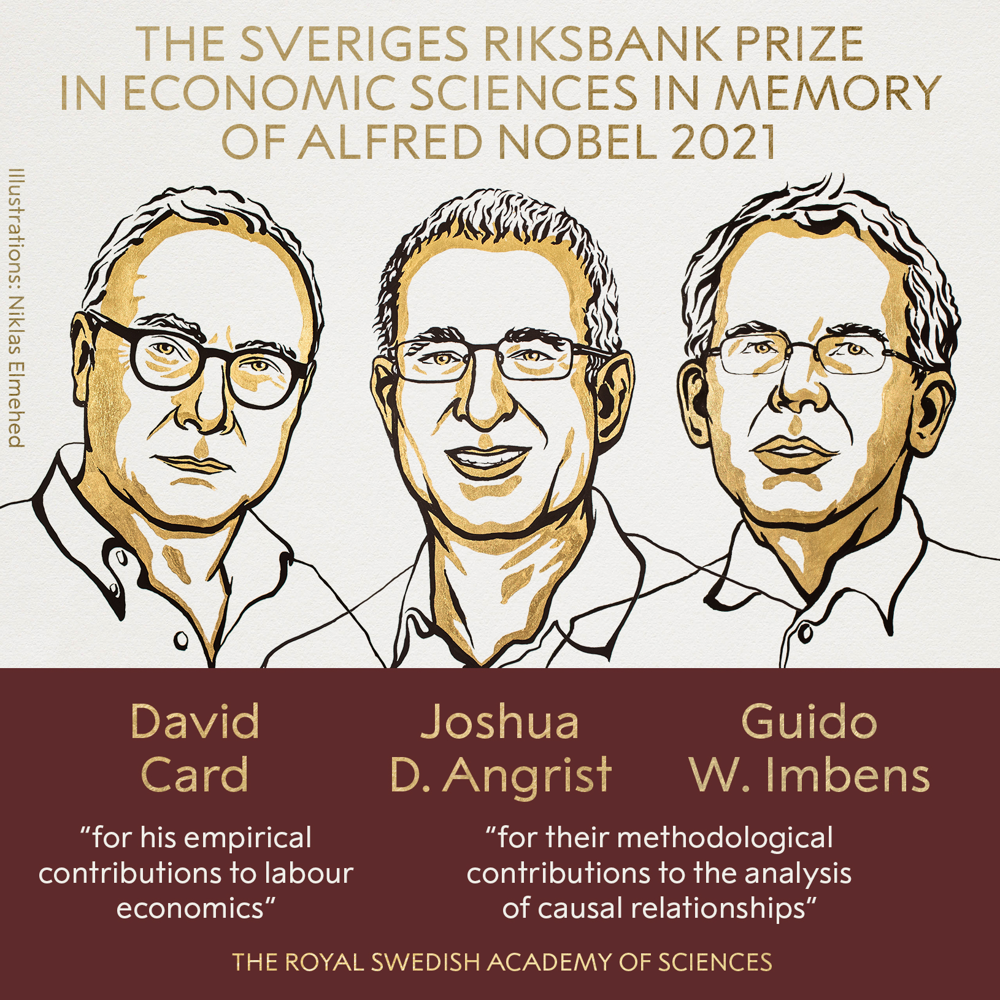
</figure>
]

???

- Card (and Krueger): NJ/PA minimum wage + the beginning of this whole credibility revolution thing
- Angrist: MHE and MM and making causal inference accessible
- Imbens: A ton of CI stuff + attempting to bridge DAG world with situation-based world

- https://twitter.com/NobelPrize/status/1447502627114205187 - PA/NJ
- https://twitter.com/MaxCRoser/status/1447505582450151431
- https://twitter.com/Stanford/status/1447549033539637248

---

.center[
<figure>
  
</figure>
]

???

Alan Krueger died by suicide in 2019

---

.center[
<figure>
  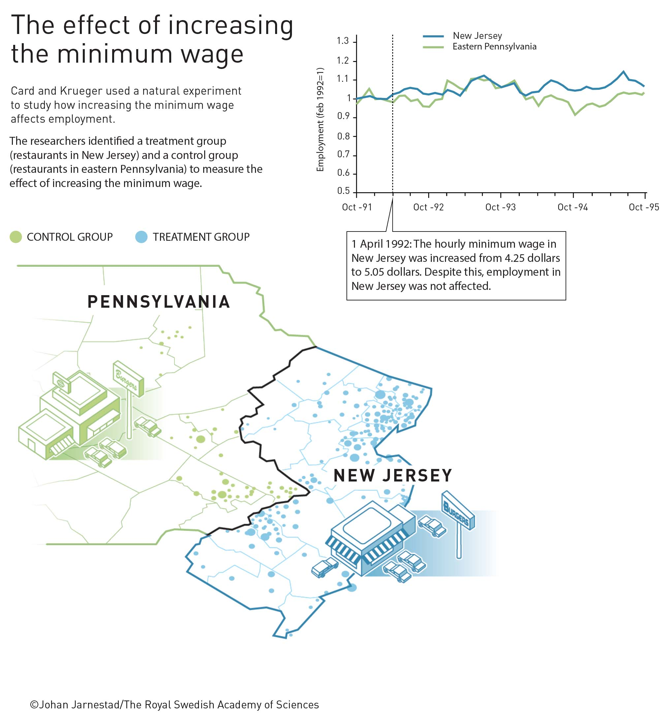
</figure>
]

---

.center[
<figure>
  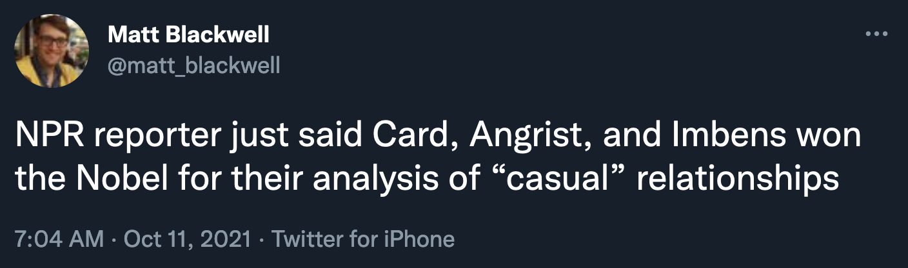
</figure>
]

???

https://twitter.com/matt_blackwell/status/1447518447882096642

---

layout: true
class: middle

---

.box-5.large[Design-based vs.<br>model-based inference]

.box-inv-5[Special situations vs. controlling for stuff]

---

.box-5.medium[How would you know when it is appropriate to use a quasi-experiment over an RCT?]

---

layout: true
class: title title-5

---

# Identification strategies

.box-inv-5.small.sp-after[The goal of *all* these methods is to isolate<br>(or **identify**) the arrow between treatment → outcome]

--

.box-inv-5.less-medium[Model-based identification]

.float-left.center[.box-5[DAGs] .box-5[Matching] .box-5[Inverse probability weighting]]

--

.box-inv-5.less-medium.sp-before[Design-based identification]

.float-left.center[.box-5[Randomized controlled trials] .box-5[Difference-in-differences]]

.float-left.center[.box-5[Regression discontinuity] .box-5[Instrumental variables]]

---

# Model-based identification

.box-inv-5[Use a DAG and *do*-calculus to isolate arrow]

.pull-left[
<figure>
  
</figure>
]

.pull-right[
.box-5[Core assumption:<br>selection on observables]

.box-inv-5.small[Everything that needs to<br>be adjusted is measurable;<br>no unobserved confounding]

.box-inv-5.small[**Big assumption!**]

.box-inv-5.tiny[This is why lots of people don't like DAG-based adjustment]
]

---

# Design-based identification

.box-inv-5[Use a special situation to isolate arrow]

.pull-left[
.box-5[RCTs]

.box-inv-5.small[Use randomization<br>to remove confounding]

.center[
<figure>
  
</figure>
]
]

--

.pull-right[
.box-5[Difference-in-differences]

.box-inv-5.small[Use before/after & treatment/control<br>differences to remove confounding]

.center[
<figure>
  
</figure>
]
]

---

layout: true
class: middle

---

.box-5.large[Which is better or more credible?<br>RCTs, quasi experiments,<br>or DAG-based models?]

---

.center[
<figure>
  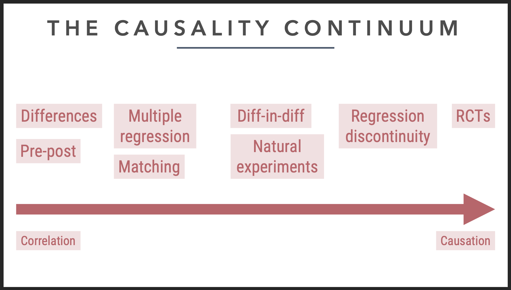
</figure>
]

---

.box-5.huge[There's no hierarchy!]

---

layout: false
name: interactions
class: center middle section-title section-title-3 animated fadeIn

# Interactions and regression

---

class: middle

.box-3.large[Can we talk more about interaction terms and how to interpret them?]

.box-3[Are interaction effects in regression always more accurate of a difference than running a "regular" regression without them?]

---

class: middle

.box-3.large[Regression is just fancy averages!]

---

layout: false
name: diff-in-diff
class: center middle section-title section-title-1 animated fadeIn

# Simple diff-in-diff

---

.center[
<figure>
  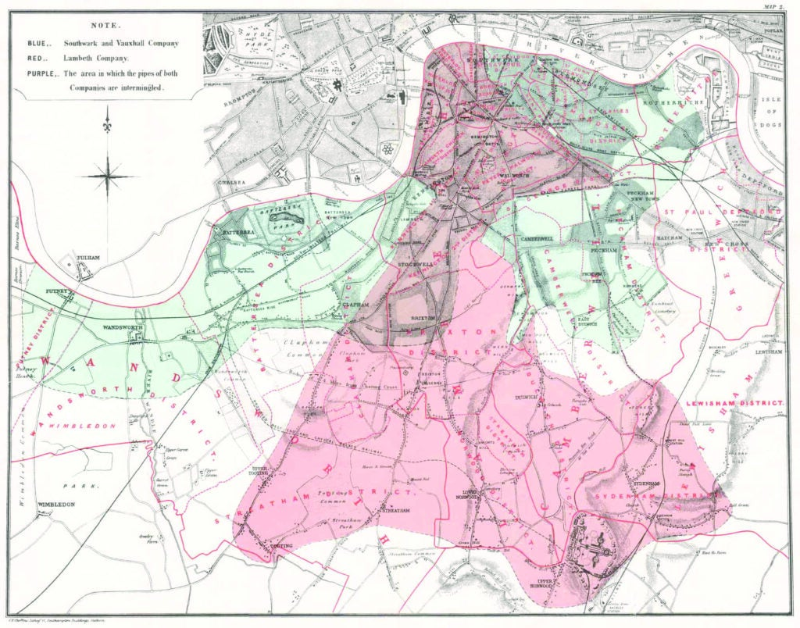
</figure>
]

---

class: middle

.pull-left[
.box-1.medium[**1849**]

.box-1[Cholera deaths per 100,000]

.box-inv-1[Southwark & Vauxhall: **1,349**]

.box-inv-1[Lambeth: **847**]

]

.pull-right[
.box-1.medium[**1854**]

.box-1[Cholera deaths per 100,000]

.box-inv-1[Southwark & Vauxhall: **1,466**]

.box-inv-1[Lambeth: **193**]
]

---

.center[
<figure>
  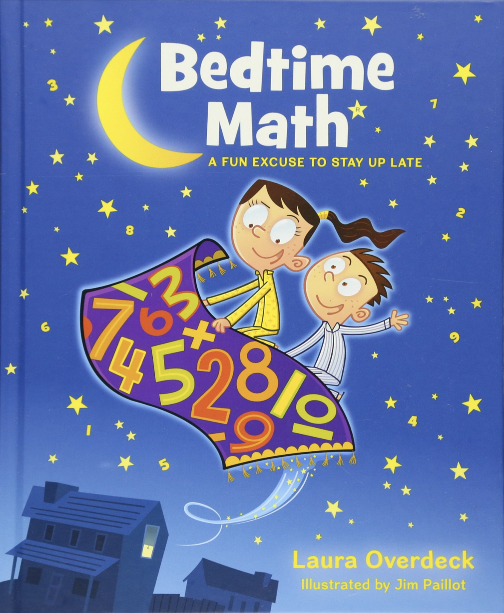
</figure>
]

---

.center[
<figure>
  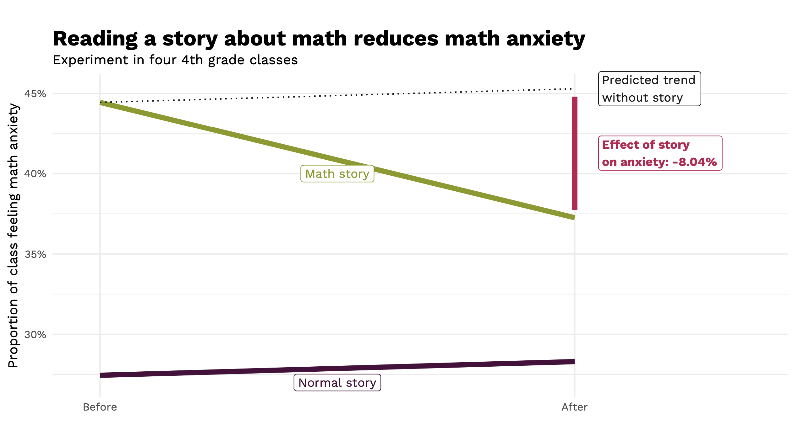
</figure>
]

---

layout: true
class: middle

---

.box-1.medium[When doing your subtracting to get<br>your differences in the matrix, is it better <br>to do the vertical or horizontal subtractions?]

.box-1.medium[Are there situations where<br>one is preferable to the other?]

---

.box-1.medium[Why are we learning<br>two ways to do diff-in-diff?<br>(2x2 matrix vs. `lm()`)]

---

.box-1.large[What happened to confounding??]

.box-1.large[Now we're only looking<br>at just two "confounders"?]

???

The parallel trends assumption takes care of that

---

.box-1.less-medium[What group level is best for comparison? For example, if we are looking at policy change in NJ, is it best to compare with just one or two similar states? How similar do the populations need to be?]

.box-1.medium.sp-after[Wouldn't matching be better?]

.box-1.less-medium[Do we have to think about balance when dealing with observational data in diff in diff?]

.box-inv-1[[Two-way fixed effects (TWFE)](https://www.andrewheiss.com/blog/2021/08/25/twfe-diagnostics/)]

???

- Multiple states/groups are possible - that's TWFE
- Wouldn't matching be better? Sure, if you're doing state-level stuff. But their data was restaurant level

- Balance: Maybe. With just two states/villages/countries/whatever, yes. With lots, the state/year fixed effects pick up those trends for you

---

.box-1.large[Minimum legal drinking age]

---

.center[
<figure>
  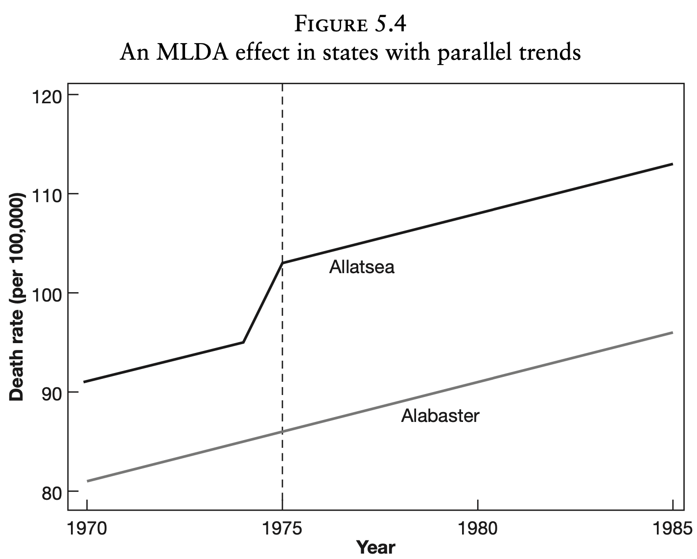
</figure>
]

---

.center[
<figure>
  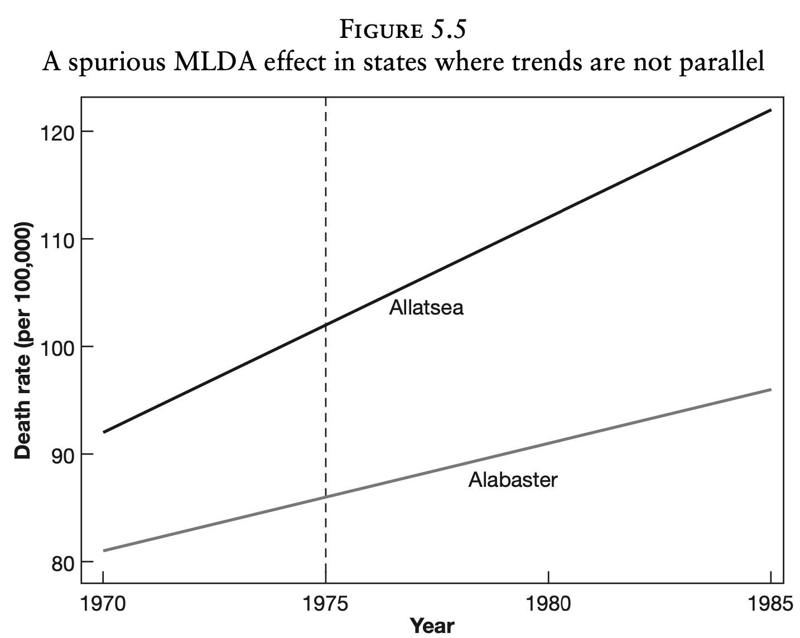
</figure>
]

---

.center[
<figure>
  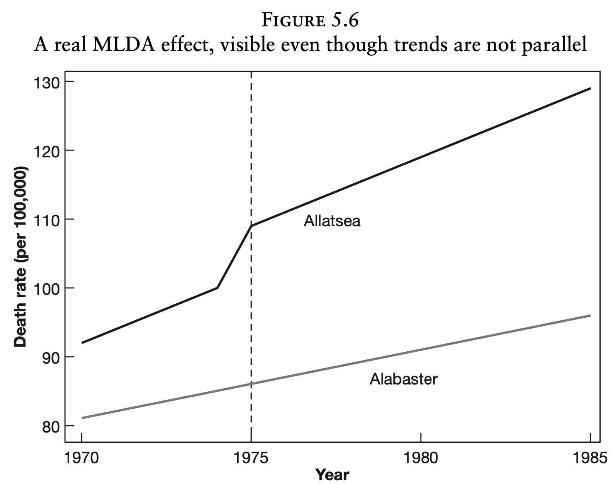
</figure>
]

---

.box-inv-1.medium[MLDA reduction]

.box-1.medium[Two states: Alabama vs. Arkansas]

$$\begin{aligned}
\text{Mortality}\ =&\ \beta_0 + \beta_1\ \text{Alabama} + \beta_2\ \text{After 1975}\ + \\
&\ \beta_3\ (\text{Alabama} \times \text{After 1975})
\end{aligned}$$

---

.box-inv-1.medium[Organ donations]

.box-1.medium[Two states: California vs. New Jersey]

$$\begin{aligned}
\text{Donation rate}\ =&\ \beta_0 + \beta_1\ \text{California} + \beta_2\ \text{After Q22011}\ + \\
&\ \beta_3\ (\text{California} \times \text{After Q22011})
\end{aligned}$$

---

layout: false
name: twfe
class: center middle section-title section-title-6 animated fadeIn

# Two-way fixed effects<br>(TWFE)

---

layout: true
class: middle

---

.box-6.medium[Two states: Alabama vs. Arkansas]

$$\begin{aligned}
\text{Mortality}\ =&\ \beta_0 + \beta_1\ \text{Alabama} + \beta_2\ \text{After 1975}\ + \\
&\ \beta_3\ (\text{Alabama} \times \text{After 1975})
\end{aligned}$$

---

.box-6.medium[All states: `Treatment == 1`<br>if legal for 18-20-year-olds to drink]

$$\text{Mortality}\ =\ \beta_0 + \beta_1\ \text{Treatment} + \beta_2\ \text{State} + \beta_3\ \text{Year}$$

---

$$\begin{aligned}
\text{Mortality}\ =&\ \beta_0 + \beta_1\ \text{Alabama} + \beta_2\ \text{After 1975}\ + \\
&\ \color{red}{\beta_3}\ (\text{Alabama} \times \text{After 1975})
\end{aligned}$$

.center[vs.]

$$\text{Mortality}\ =\ \beta_0 + \color{red}{\beta_1}\ \text{Treatment} + \beta_2\ \text{State} + \beta_3\ \text{Year}$$

---

$$\begin{aligned}
\text{Mortality}\ =&\ \beta_0 + \beta_1\ \text{Alabama} + \beta_2\ \text{After 1975}\ + \\
&\ \color{red}{\beta_3}\ (\text{Alabama} \times \text{After 1975})
\end{aligned}$$

.center[vs.]

$$\text{Mortality}\ =\ \beta_0 + \color{red}{\beta_1}\ \text{Treatment} + \beta_2\ \text{State} + \beta_3\ \text{Year}$$

.center[vs.]

$$\begin{aligned}
\text{Mortality}\ =\ & \beta_0 + \color{red}{\beta_1}\ \text{Treatment} + \beta_2\ \text{State} + \beta_3\ \text{Year}\ +\\
&\beta_4\ (\text{State} \times \text{Year})
\end{aligned}$$

---

.center[
<figure>
  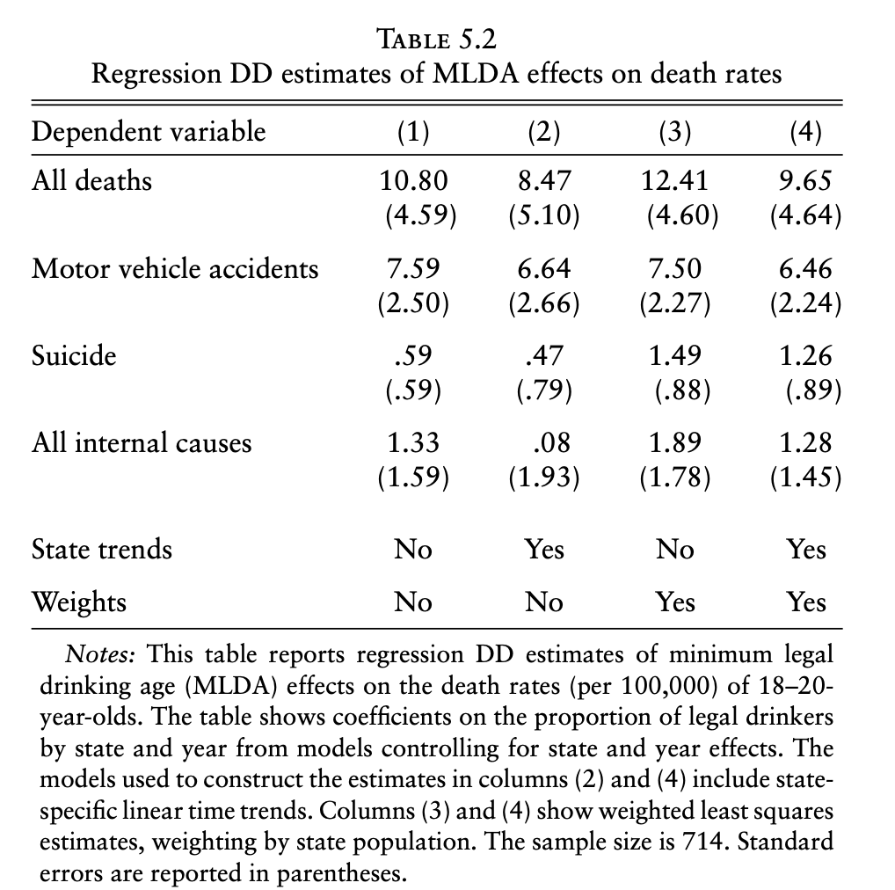
</figure>
]

---

$$\begin{aligned}
\text{Donation rate}\ =&\ \beta_0 + \beta_1\ \text{California} + \beta_2\ \text{After Q22011}\ + \\
&\ \beta_3\ (\text{California} \times \text{After Q22011})
\end{aligned}$$

.center[vs.]

$$
\begin{aligned}
\text{Donation rate}\ =\ & \beta_0 + \color{red}{\beta_1}\ \text{Treatment}\ + \\
& \beta_2\ \text{State} + \beta_3\ \text{Quarter}
\end{aligned}
$$

---

.box-6.large[What about this<br>staggered treatment stuff?]

.box-inv-6[[See this](https://www.andrewheiss.com/blog/2021/08/25/twfe-diagnostics/)]

???

This is good for ethical reasons!

Blog post

---

layout: false
name: sensitivity
class: center middle section-title section-title-2 animated fadeIn

# Sensitivity analysis

---

layout: true
class: middle

---

.box-2.medium.sp-after[How do we know when we've got<br>the right confounders in our DAG?]

.box-2.medium[How do we solve the fact that<br>we have so many unknowns in our DAG?]

---

.center[
<figure>
  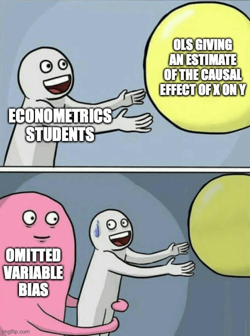
</figure>
]

???

https://owenozier.github.io/teaching/2020-2021-memes
