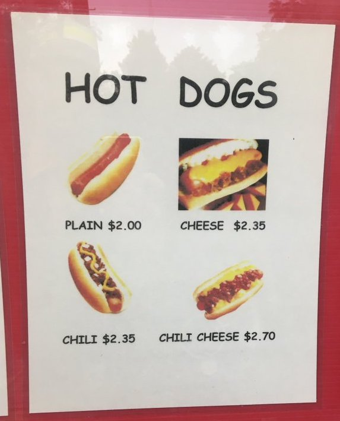
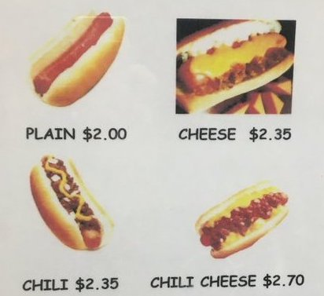
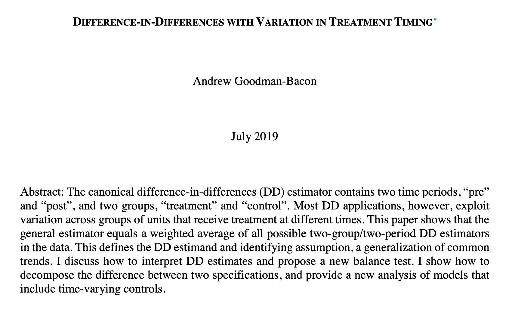

```{r setup, include=FALSE}
knitr::opts_chunk$set(warning = FALSE, message = FALSE, 
                      fig.retina = 3, fig.align = "center")
```

```{r packages-data, include=FALSE}
library(tidyverse)
library(flair)
library(broom)
library(ggdag)
library(kableExtra)
library(scales)
library(patchwork)

world_happiness <- read_csv("data/world_happiness.csv") %>% 
  mutate(latin_america = region == "Latin America & Caribbean") %>% 
  mutate(latin_america = factor(latin_america, labels = c("Not Latin America", "Latin America")))
```

```{r xaringanExtra, echo=FALSE}
xaringanExtra::use_xaringan_extra(c("tile_view"))
```

class: center middle main-title section-title-7

# Diff-in-diff I & II

.class-info[

**Sessions 8–9**

.light[PMAP 8521: Program evaluation<br>
Andrew Young School of Policy Studies
]

]

---

name: outline
class: title title-inv-8

# Plan for today

--

.box-6.medium.sp-after-half[Quasi-experiments]

--

.box-2.medium.sp-after-half[Interactions & regression]

--

.box-5.medium.sp-after-half[Two wrongs make a right]

--

.box-3.medium.sp-after-half[Diff-in-diff assumptions]

---

name: quasi-experiments
class: center middle section-title section-title-6 animated fadeIn

# Quasi-experiments

---

&nbsp;

.box-6.large.sp-after[RCTs are great!]

--

.box-6.large[Super impractical to do<br>all the time though!]

---

layout: true
class: title title-6

---

# Quasi-experiments

--

.box-inv-6.medium[You can't always randomly<br>assign people to do things]

--

.box-inv-6.medium[So let other people (or the government,<br>or nature, or something else) do it for you]

---

# Quasi-experiments

.box-inv-6.medium.sp-after[**Quasi-experiment**<br>A situation where you, as researcher,<br>did not assign people to treatment/control]

--

.center.float-left.sp-after[
.box-6[External validity 👍]&ensp;.box-6[Selection 👎]
]

--

.box-inv-6.medium[Assignment to treatment is "as if" random]

???

Good bc of external validity; bad bc of selection

---

# Quasi-experiments vs. DAG adjustment

--

.box-inv-6[We did a lot of work with DAGs!<br>You're good at closing backdoors with matching and IPW]

--

.box-inv-6.sp-after[DAGs can work for any kind of observational data,<br>even without a quasi-experimentalish situation]

--

.box-6[Quasi-experiments are a little different:<br>the **context** isolates pathway between treatment and outcome]

--

.box-6.smaller[They're wildly popular in social sciences (especially economics!),<br>maybe more credible (?) there than just making DAG adjustments]

--

.box-6.smaller[You can still draw a DAG for a quasi-experiment though!]

---

# Analyzing quasi-experiments

--

.box-inv-6.medium[Difference-in-differences]

.box-6.small.sp-after[DiD; DD; diff-in-diff]

--

.box-inv-6.medium[Regression discontinuity]

.box-6.small.sp-after[RD; RDD]

--

.box-inv-6.medium[Instrumental variables]

.box-6.small[IV]
 
---

layout: false
name: interactions-regression
class: center middle section-title section-title-2 animated fadeIn

# Interactions & regression

---

layout: true
class: title title-2

---

# Sliders and switches

.center[
<figure>
  
</figure>
]

---

layout: false

.smaller[
$$
\widehat{\text{Happiness}} = \beta_0 + \beta_1 \text{Life expectancy} + \beta_2 \text{Latin America} + \varepsilon
$$
]

--

.small-code[
```{r model-happiness-indicator}
model1 <- lm(happiness_score ~ life_expectancy + latin_america, 
             data = world_happiness)
tidy(model1)
```
]

--

.pull-left[
.box-inv-2.small[Life expectancy = continuous / slider]

.box-2.smaller["For every 1-year increase in life expectancy,<br>happiness is associated with a β<sub>1</sub> increase"]
]

--

.pull-right[
.box-inv-2.small[Latin America = categorical / switch]

.box-2.smaller["Being in Latin America is associated<br>with a β<sub>2</sub> increase in happiness"]
]

---

class: title title-2

# Indicators and interactions

.box-inv-2.medium[Indicators .tiny[(dummies)]]

--

.box-2.sp-after[Change in <span style="color: #F6D645;">intercept</span> for specific group]

---

layout: false

```{r plot-indicator-1, echo=FALSE, fig.width=12, fig.height=5.5, out.width="100%"}
ggplot(world_happiness, aes(x = life_expectancy, y = happiness_score)) +
  geom_point(aes(fill = latin_america), size = 5, pch = 21, color = "white", alpha = 0.7) +
  scale_fill_manual(values = c("grey70", "#B10DC9"), name = NULL) +
  labs(x = "Life expectancy", y = "Happiness score") +
  theme_bw(base_size = 21, base_family = "Fira Sans Condensed")
```

---

```{r plot-indicator-2, echo=FALSE, fig.width=12, fig.height=5.5, out.width="100%"}
model1_coefs <- tidy(model1)
la_shift <- filter(model1_coefs, term == "latin_americaLatin America")$estimate %>% round(2)
world_slope <- filter(model1_coefs, term == "life_expectancy")$estimate

ggplot(world_happiness, aes(x = life_expectancy, y = happiness_score)) +
  geom_point(aes(fill = latin_america), size = 5, pch = 21, color = "white", alpha = 0.7) +
  geom_abline(slope = filter(model1_coefs, term == "life_expectancy")$estimate, 
              intercept = filter(model1_coefs, term == "(Intercept)")$estimate, 
              color = "#0074D9", size = 2) +
  scale_fill_manual(values = c("grey70", "#B10DC9"), name = NULL) +
  labs(x = "Life expectancy", y = "Happiness score") +
  theme_bw(base_size = 21, base_family = "Fira Sans Condensed")
```

.box-2.small[World slope = `r round(world_slope, 3)`]

---

```{r plot-indicator-3, echo=FALSE, fig.width=12, fig.height=5.5, out.width="100%"}
ggplot(world_happiness, aes(x = life_expectancy, y = happiness_score)) +
  geom_point(aes(fill = latin_america), size = 5, pch = 21, color = "white", alpha = 0.7) +
  geom_abline(slope = filter(model1_coefs, term == "life_expectancy")$estimate, 
              intercept = filter(model1_coefs, term == "(Intercept)")$estimate, 
              color = "#0074D9", size = 2) +
  geom_abline(slope = filter(model1_coefs, term == "life_expectancy")$estimate, 
              intercept = filter(model1_coefs, term == "(Intercept)")$estimate +
                filter(model1_coefs, term == "latin_americaLatin America")$estimate, 
              color = colorspace::darken("#B10DC9", 0.3), size = 2) +
  scale_fill_manual(values = c("grey70", "#B10DC9"), name = NULL) +
  labs(x = "Life expectancy", y = "Happiness score") +
  theme_bw(base_size = 21, base_family = "Fira Sans Condensed")
```

.box-2.small[Latin America intercept shifted up `r round(la_shift, 3)`; line has same slope as world (`r round(world_slope, 3)`)]

---

.smaller[
$$
\begin{aligned}
\widehat{\text{Happiness}} = &\beta_0 + \beta_1 \text{Life expectancy} + \beta_2 \text{Latin America} + \\
&\beta_3 (\text{Life expectancy} \times \text{Latin America}) + \varepsilon
\end{aligned}
$$
]

--

.small-code[
```{r model-happiness-interaction}
model2 <- lm(happiness_score ~ life_expectancy + latin_america + 
               (life_expectancy * latin_america), data = world_happiness)
tidy(model2)
```
]

--

.box-2.small["In Latin America, for every 1-year increase in life expectancy,<br>happiness is associated with a <span style="color: #F6D645;">β<sub>1</sub> + β<sub>3</sub></span> increase *and* the intercept is β<sub>2</sub> lower"]

---

class: title title-2

# Indicators and interactions

.box-inv-2.medium[Indicators .tiny[(dummies)]]

.box-2.sp-after[Change in <span style="color: #F6D645;">intercept</span> for specific group]

.box-inv-2.medium.sp-before[Interactions]

--

.box-2[Change in <span style="color: #F6D645;">slope</span> for specific group]

---

```{r plot-interaction-1, echo=FALSE, fig.width=12, fig.height=5.5, out.width="100%"}
model2_coefs <- tidy(model2)
la_slope_shift <- filter(model2_coefs, term == "life_expectancy:latin_americaLatin America")$estimate
la_actual_slope <- filter(model2_coefs, term == "life_expectancy")$estimate + la_slope_shift

ggplot(world_happiness, aes(x = life_expectancy, y = happiness_score)) +
  geom_point(aes(fill = latin_america), size = 5, pch = 21, color = "white", alpha = 0.7) +
  geom_abline(slope = filter(model2_coefs, term == "life_expectancy")$estimate, 
              intercept = filter(model2_coefs, term == "(Intercept)")$estimate, 
              color = "#0074D9", size = 2) +
  geom_abline(slope = filter(model2_coefs, term == "life_expectancy")$estimate +
                filter(model2_coefs, term == "life_expectancy:latin_americaLatin America")$estimate, 
              intercept = filter(model2_coefs, term == "(Intercept)")$estimate +
                filter(model2_coefs, term == "latin_americaLatin America")$estimate, 
              color = colorspace::darken("#B10DC9", 0.3), size = 2) +
  scale_fill_manual(values = c("grey70", "#B10DC9"), name = NULL) +
  labs(x = "Life expectancy", y = "Happiness score") +
  theme_bw(base_size = 21, base_family = "Fira Sans Condensed")
```

.box-2.small[Latin America slope is `r round(la_slope_shift, 3)` + `r round(world_slope, 3)` = <span style="color: #F6D645;">`r round(la_actual_slope, 3)`</span>; different from rest of the world]

---

class: title title-2

# Interactions

.box-inv-2[What would happen if you ran this?]

.small-code[
```{r model-happiness-interaction-1}
model3 <- lm(happiness_score ~ (life_expectancy * latin_america), 
             data = world_happiness)
```
]

--

.small-code[
```{r show-model-happiness-interaction-1, echo=FALSE}
tidy(model3)
```
]

--

.box-2.small[**It still works!**<br>Both terms have to be in the model; R will add them for you if you leave them out]

---

class: title title-2

# Interactions

.box-inv-2[What would happen if you ran this?]

.small-code[
```{r model-happiness-interaction-2}
model4 <- lm(happiness_score ~ life_expectancy * region, # region has multiple categories
             data = world_happiness)
```
]

--

.pull-left-wide[
.small-code.smaller[
```{r show-model-happiness-interaction-2, echo=FALSE}
tidy(model4)
```
]
]

--

.pull-right-narrow[
.box-2.small[Changes in<br>slopes and intercepts<br>for each region]
]

---

class: title title-2

# General idea of interactions

.box-inv-2.medium[The *additional* change that happens when<br>combining two explanatory variables]

--

.box-2[Life expectancy effect]

--

.box-2[Latin America effect]

--

.box-2[Additional life expectancy effect in Latin America]


---

.pull-left[
.box-2[Is there a discount when combining cheese and chili?]

&nbsp;

.box-inv-2[What is the cheese effect?]

.box-inv-2[What is the chili effect?]

.box-inv-2[What is the<br>chili × cheese effect?]
]

.pull-right.center[
<figure>
  
</figure>
]

???

- Cheese effect: 0.35
- Chili effect: 0.35
- Chili × cheese effect: 0

https://twitter.com/kevin_stange/status/1186056025897684992

---

layout: false
name: two-wrongs
class: center middle section-title section-title-5 animated fadeIn

# Two wrongs make a right

---

class: bg-full
background-image: url("img/08/federalism.png")

???

https://twitter.com/causalinf/status/1021392181209255938

---

layout: true
class: title title-5

---

# Raising the minimum wage

.box-inv-5.medium.sp-after-half[What happens if you raise the minimum wage?]

--

.box-5.sp-after[Economic theory says there<br>should be fewer jobs]

--

.box-inv-5.medium[New Jersey in 1992]

.box-inv-5.medium[$4.25 → $5.05]

---

# Before vs. after

.box-inv-5.medium.sp-after-half[Average # of jobs per fast food restaurant in NJ]

--

.box-5[New Jersey<sub>Before change</sub> = 20.44]

--

.box-5[New Jersey<sub>After change</sub> = 21.03]

--

.box-5.sp-after[∆ = 0.59]

--

.box-inv-5.medium[Is this the causal effect?]

???

No! Not possible because maybe other things happened in NJ to cause that – there's no control state to compare with NJ

---

# Treatment vs. control

.box-inv-5.medium.sp-after-half[Average # of jobs per fast food restaurant]

--

.box-5[Pennsylvania<sub>After change</sub> = 21.17]

--

.box-5[New Jersey<sub>After change</sub> = 21.03]

--

.box-5.sp-after[∆ = −0.14]

--

.box-inv-5.medium[Is this the causal effect?]

???

No! There's no pre-level to compare with. Maybe both states went up, maybe both went down. Can't tell.

---

# Problems

--

.box-inv-5.medium[Comparing only before/after]

--

.box-5.small[You're only looking at the treatment group!]

--

.box-5.small.sp-after[Impossible to know if change happened because of treatment or just naturally]

--

.box-inv-5.medium.sp-before[Comparing only treatment/control]

--

.box-5.small[You're only looking at post-treatment values]

--

.box-5.small[Impossible to know if change happened because of natural growth]

---

layout: false

```{r min-wage-dag, echo=FALSE, fig.width=12, fig.height=6, out.width="100%"}
node_details <- tribble(
  ~name, ~label, ~x, ~y,
  "treatment", "Minimum wage", 1, 2,
  "outcome", "Jobs", 3, 2,
  "time", "Time (year)", 2, 3,
  "nj", "Being in New Jersey", 2, 1
)

node_labels <- node_details$label
names(node_labels) <- node_details$name

my_dag <- dagify(outcome ~ treatment + time + nj,
                 treatment ~ time + nj,
                 exposure = "treatment",
                 outcome = "outcome",
                 coords = node_details,
                 labels = node_labels) %>% 
  tidy_dagitty() %>%
  node_status()   # Add column for exposure/outcome/latent

status_colors <- c(exposure = "#0074D9", outcome = "#FF851B", latent = "grey50")

# Fancier graph
set.seed(1234)
ggplot(my_dag, aes(x = x, y = y, xend = xend, yend = yend)) +
  geom_dag_edges(start_cap = ggraph::circle(3, "lines"),
                 end_cap = ggraph::circle(3, "lines"),
                 edge_width = 1.5, 
                 arrow_directed = grid::arrow(length = grid::unit(0.75, "lines"), type = "closed")) +
  geom_dag_point(aes(color = status), size = 30) +
  geom_dag_label_repel(aes(label = label, fill = status), seed = 1234,
                       color = "white", fontface = "bold", size = 10,
                       label.padding = grid::unit(0.75, "lines"),
                       box.padding = grid::unit(2.5, "lines"),
                       direction = "y") +
  scale_color_manual(values = status_colors, na.value = "grey20") +
  scale_fill_manual(values = status_colors, na.value = "grey20") +
  guides(color = FALSE, fill = FALSE) + 
  theme_dag(base_size = 20, base_family = "Fira Sans Condensed")
```

---

```{r dd-table-basic, echo=FALSE}
dd <- tribble(
  ~` `, ~`Pre mean`, ~`Post mean`, ~`<span class='color-light-5'>∆ <span class='smaller'>(post − pre)</span></span>`,
  "Control", "<b>A</b><br><span class='small'>(never treated)</small>", "<b>B</b><br><span class='small'>(never treated)</small>", "<b>B − A</b>",
  "Treatment", "<b>C</b><br><span class='small'>(not yet treated)</small>", "<b>D</b><br><span class='small'>(treated)</small>", "<b>D − C</b>",
  "∆<br><span class='smaller'>(treatment − control)</span>", "<b>C − A</b>", "<b>D − B</b>", "<span class=''><b>(B − A) − (D − C)</b></span> <i>or</i><br><span class=''><b>(B − D) − (A − C)</b></span>"
)

dd %>% 
  kbl(escape = FALSE, align = "cccc") %>% 
  kable_styling(bootstrap_options = "none") %>% 
  row_spec(1:2, background = "#FFFFFF") %>% 
  column_spec(4, background = "#DDDDDD") %>% 
  row_spec(0, bold = TRUE, background = "#FFC6C6", color = "#CF4446") %>% 
  column_spec(1, bold = TRUE, background = "#FFC6C6", color = "#CF4446") %>% 
  column_spec(4, background = "#FFFFFF", color = "#FFFFFF") %>% 
  row_spec(3, background = "#FFFFFF", color = "#FFFFFF")
```

---

```{r dd-table-growth, echo=FALSE}
dd <- tribble(
  ~` `, ~`Pre mean`, ~`Post mean`, ~`∆ <span class='smaller'>(post − pre)</span>`,
  "Control", "<b>A</b><br><span class='small'>(never treated)</small>", "<b>B</b><br><span class='small'>(never treated)</small>", "<b>B − A</b>",
  "Treatment", "<b>C</b><br><span class='small'>(not yet treated)</small>", "<b>D</b><br><span class='small'>(treated)</small>", "<b>D − C</b>",
  "∆<br><span class='smaller'>(treatment − control)</span>", "<b>A − C</b>", "<b>B − D</b>", "<span class=''><b>(B − A) − (D − C)</b></span> <i>or</i><br><span class=''><b>(B − D) − (A − C)</b></span>"
)

dd %>% 
  kbl(escape = FALSE, align = "cccc") %>% 
  kable_styling(bootstrap_options = "none") %>% 
  row_spec(1:2, background = "#FFFFFF") %>% 
  column_spec(4, background = "#DDDDDD") %>% 
  row_spec(0, bold = TRUE, background = "#FFC6C6", color = "#CF4446") %>% 
  column_spec(1, bold = TRUE, background = "#FFC6C6", color = "#CF4446") %>% 
  row_spec(3, background = "#FFFFFF", color = "#FFFFFF")
```

.box-5[∆ (post − pre) = **within-unit growth**]

---

```{r dd-table-within, echo=FALSE}
dd <- tribble(
  ~` `, ~`Pre mean`, ~`Post mean`, ~`<span class='color-light-5'>∆ <span class='smaller'>(post − pre)</span></span>`,
  "Control", "<b>A</b><br><span class='small'>(never treated)</small>", "<b>B</b><br><span class='small'>(never treated)</small>", "<b>B − A</b>",
  "Treatment", "<b>C</b><br><span class='small'>(not yet treated)</small>", "<b>D</b><br><span class='small'>(treated)</small>", "<b>D − C</b>",
  "∆<br><span class='smaller'>(treatment − control)</span>", "<b>C − A</b>", "<b>D − B</b>", "<span class=''><b>(B − A) − (D − C)</b></span> <i>or</i><br><span class=''><b>(B − D) − (A − C)</b></span>"
)

dd %>% 
  kbl(escape = FALSE, align = "cccc") %>% 
  kable_styling(bootstrap_options = "none") %>% 
  row_spec(1:2, background = "#FFFFFF") %>% 
  row_spec(3, background = "#DDDDDD") %>% 
  row_spec(0, bold = TRUE, background = "#FFC6C6", color = "#CF4446") %>% 
  column_spec(1, bold = TRUE, background = "#FFC6C6", color = "#CF4446") %>% 
  column_spec(4, background = "#FFFFFF", color = "#FFFFFF")
```

.box-5[∆ (treatment − control) = **across-group growth**]

---

```{r dd-table-full, echo=FALSE}
dd <- tribble(
  ~` `, ~`Pre mean`, ~`Post mean`, ~`∆ <span class='smaller'>(post − pre)</span>`,
  "Control", "<b>A</b><br><span class='small'>(never treated)</small>", "<b>B</b><br><span class='small'>(never treated)</small>", "<b>B − A</b>",
  "Treatment", "<b>C</b><br><span class='small'>(not yet treated)</small>", "<b>D</b><br><span class='small'>(treated)</small>", "<b>D − C</b>",
  "∆<br><span class='smaller'>(treatment − control)</span>", "<b>C − A</b>", "<b>D − B</b>", "<span class='color-5'><b>(D − C) − (B − A)</b></span> <i>or</i><br><span class='color-5'><b>(D − B) − (C − A)</b></span>"
)

dd %>% 
  kbl(escape = FALSE, align = "cccc") %>% 
  kable_styling(bootstrap_options = "none") %>% 
  row_spec(1:2, background = "#FFFFFF") %>% 
  row_spec(3, background = "#DDDDDD") %>% 
  column_spec(4, background = "#DDDDDD") %>% 
  row_spec(0, bold = TRUE, background = "#FFC6C6", color = "#CF4446") %>% 
  column_spec(1, bold = TRUE, background = "#FFC6C6", color = "#CF4446")
```

.box-5[∆<sub>within units</sub> − ∆<sub>within groups</sub> =<br>Difference-in-differences =<br>causal effect!]

---

class: middle

.medium[
$$\begin{aligned}
\text{DD}\ =\ &(\bar{x}_\text{treatment, post} - \bar{x}_\text{treatment, pre}) \\
&- (\bar{x}_\text{control, post} - \bar{x}_\text{control, pre})
\end{aligned}$$
]

---

```{r dd-table-numbers, echo=FALSE}
dd <- tribble(
  ~` `, ~`Pre mean`, ~`Post mean`, ~`∆ <span class='smaller'>(post − pre)</span>`,
  "Pennsylvania", "<b>23.33</b><br><span class='small'>A</small>", "<b>21.17</b><br><span class='small'>B</small>", "<b>-2.16</b><br><span class='small'>B − A</small>",
  "New Jersey", "<b>20.44</b><br><span class='small'>C</small>", "<b>21.03</b><br><span class='small'>D</small>", "<b>0.59</b><br><span class='small'>D − C</small>",
  "∆<br><span class='smaller'>(NJ − PA)</span>", "<b>-2.89</b><br><span class='small'>C − A</small>", "<b>-0.14</b><br><span class='small'>D − B</small>", "<b>(0.59) − (−2.16) = <br><span class='color-5'>2.76</span></b>"
)

dd %>% 
  kbl(escape = FALSE, align = "cccc") %>% 
  kable_styling(bootstrap_options = "none") %>% 
  row_spec(1:2, background = "#FFFFFF") %>% 
  row_spec(3, background = "#DDDDDD") %>% 
  column_spec(4, background = "#DDDDDD") %>% 
  row_spec(0, bold = TRUE, background = "#FFC6C6", color = "#CF4446") %>% 
  column_spec(1, bold = TRUE, background = "#FFC6C6", color = "#CF4446")
```

---

```{r dd-graph, echo=FALSE, fig.width=12, fig.height=6, out.width="100%"}
dd_labels <- tribble(
  ~Group, ~Time, ~label,
  "Treatment", "Before", "A",
  "Treatment", "After", "B",
  "Control", "Before", "C",
  "Control", "After", "D"
)

dd_data <- tribble(
  ~Group, ~Before, ~Intervention, ~After,
  "Treatment", 30, 35, 50,
  "Control",   20, 25, 30
) %>% 
  pivot_longer(cols = !Group, names_to = "Time", values_to = "avg") %>% 
  left_join(dd_labels, by = c("Group", "Time")) %>% 
  mutate(across(c(Group, Time), ~fct_inorder(.)))

ggplot(dd_data, aes(x = Time, y = avg, color = Group, group = Group)) +
  geom_vline(xintercept = "Intervention") +
  geom_line(size = 3,
            key_glyph = draw_key_point) +
  annotate(geom = "segment", x = "Intervention", xend = "After",
           y = 35, yend = 40, color = "#0074D9", size = 2, linetype = "22") +
  annotate(geom = "segment", x = "After", xend = "After",
           y = 40, yend = 50, color = "#FF4136", size = 2) +
  annotate(geom = "label", x = "After", y = 45, label = "Causal\neffect",
           family = "Fira Sans Condensed Bold", fontface = "plain", 
           size = 5, fill = "#FF4136", color = "white") +
  geom_point(data = filter(dd_data, !is.na(label)), size = 15) +
  geom_text(aes(label = label), family = "Fira Sans Condensed Bold", 
            fontface = "plain", size = 10, color = "white") +
  scale_color_manual(values = c("#0074D9", "#3D9970")) +
  labs(x = NULL, y = "Outcome") +
  coord_cartesian(ylim = c(15, 55)) +
  theme_bw(base_size = 24, base_family = "Fira Sans Condensed")
```

---

class: title title-5

# An easier way?

--

.box-inv-5.medium[Finding all the group<br>means is tedious!]

--

.box-inv-5.medium.sp-after[What if there are other<br>backdoors to worry about?]

--

.box-5.medium[Regression to the rescue!]

---

`)

---

$$\begin{aligned}
\color{#2ECC40}{Y_{it}}\ =\ &\alpha + \beta\ \color{#0074D9}{\text{Group}_i} + \gamma\ \color{#39CCCC}{\text{Time}_t} + \\
&\delta\ \color{#FF4136}{(\text{Group}_i \times \text{Time}_t)} + \varepsilon_{it}
\end{aligned}$$

--

.center.sp-after[
```{r dd-example-code, echo=FALSE, tidy=FALSE}
decorate('
model <- lm(outcome ~ group + time + (group * time))
', eval = FALSE) %>% 
  flair("outcome", color = "#2ECC40", before = "<b>", after = "</b>") %>% 
  flair(" group ", color = "#0074D9", before = "<b>", after = "</b>") %>% 
  flair(" time ", color = "#39CCCC", before = "<b>", after = "</b>") %>% 
  flair("(group * time)", color = "#FF4136", before = "<b>", after = "</b>")
```
]

--

&nbsp;

<span class="box-5", style="background-color: #0074D9">Group = 1 or TRUE if treatment</span>

--

<span class="box-5", style="background-color: #39CCCC">Time = 1 or TRUE if after</span>

---

$$\begin{aligned}
\color{#2ECC40}{Y_{it}}\ =\ &\color{#666666}{\alpha} + \color{#0074D9}{\beta\ \text{Group}_i} + \color{#39CCCC}{\gamma\ \text{Time}_t} + \\
&\color{#FF4136}{\delta\ (\text{Group}_i \times \text{Time}_t)} + \varepsilon_{it}
\end{aligned}$$

.center.sp-after[
```{r dd-example-code-again, echo=FALSE, tidy=FALSE}
decorate('
model <- lm(outcome ~ group + time + (group * time))
', eval = FALSE) %>% 
  flair("outcome", color = "#2ECC40", before = "<b>", after = "</b>") %>% 
  flair(" group ", color = "#0074D9", before = "<b>", after = "</b>") %>% 
  flair(" time ", color = "#39CCCC", before = "<b>", after = "</b>") %>% 
  flair("(group * time)", color = "#FF4136", before = "<b>", after = "</b>")
```
]

--

<span class="box-5", style="background-color: #666666">α = Mean of control, pre-treatment</span>

--

<span class="box-5", style="background-color: #0074D9">β = Increase in outcome across groups</span>

--

<span class="box-5", style="background-color: #39CCCC">γ = Increase in outcome over time within units</span>

--

<span class="box-5", style="background-color: #FF4136">δ = Difference in differences!</span>

---

$$\begin{aligned}
\color{#2ECC40}{Y_{it}}\ =\ &\color{#666666}{\alpha} + \color{#0074D9}{\beta\ \text{Group}_i} + \color{#39CCCC}{\gamma\ \text{Time}_t} + \\
&\color{#FF4136}{\delta\ (\text{Group}_i \times \text{Time}_t)} + \varepsilon_{it}
\end{aligned}$$

```{r dd-table-coefs, echo=FALSE}
dd <- tribble(
  ~` `, ~`&ensp;Pre mean&ensp;`, ~`&ensp;Post mean&ensp;`, ~`&ensp;∆ <span class='smaller'>(post − pre)</span>&ensp;`,
  "Control", "<b><span style='color: #666666;'>α</span></b>", "<b><span style='color: #666666;'>α</span> + <span style='color: #39CCCC;'>γ</span></b>", "<b><span style='color: #39CCCC;'>γ</span></b>",
  "Treatment", "<b><span style='color: #666666;'>α</span> + <span style='color: #0074D9;'>β</span></b>", "<b><span style='color: #666666;'>α</span> + <span style='color: #0074D9;'>β</span> + <span style='color: #39CCCC;'>γ</span> + <span style='color: #FF4136'>δ</span></b>", "<b><span style='color: #39CCCC;'>γ</span> + <span style='color: #FF4136'>δ</span></b>",
  "&ensp;∆ <span class='smaller'>(trtmt − ctrl)</span>&ensp;", "<b><span style='color: #0074D9;'>β</span></b>", "<b><span style='color: #0074D9;'>β</span> + <span style='color: #FF4136'>δ</span></b>", "<b><span style='color: #FF4136'>δ</span></b>"
)

dd %>% 
  kbl(escape = FALSE, align = "cccc") %>% 
  kable_styling(bootstrap_options = "none") %>% 
  row_spec(1:2, background = "#FFFFFF") %>% 
  row_spec(3, background = "#EEEEEE") %>% 
  column_spec(4, background = "#EEEEEE") %>% 
  row_spec(0, bold = TRUE, background = "#FFC6C6", color = "#CF4446") %>% 
  column_spec(1, bold = TRUE, background = "#FFC6C6", color = "#CF4446")
```

---

.pull-left[

.center[
<figure>
  
</figure>
]

.small-code[
```{r hotdogs-data, echo=FALSE}
hotdogs <- tribble(
  ~price, ~cheese, ~chili,
  2.00,   FALSE,   FALSE,
  2.35,   TRUE,    FALSE,
  2.35,   FALSE,   TRUE,
  2.70,   TRUE,    TRUE
)
```

```{r show-hotdogs-data}
hotdogs
```
]
]

--

.pull-right.small-code[
```{r hotdogs-diff-diff}
model_hotdogs <- 
  lm(price ~ cheese + chili + 
       cheese * chili, 
     data = hotdogs)
```

```{r show-hotdogs-diff-diff-fake, eval=FALSE}
tidy(model_hotdogs)
```

```{r show-hotdogs-diff-diff, echo=FALSE}
tidy(model_hotdogs) %>% 
  select(term, estimate) %>% 
  mutate(estimate = round(estimate, 2))
```
]

---

class: bg-full
background-image: url("img/08/pokemon1.png")

???

https://doi.org/10.1136/bmj.i6270

---

class: bg-full
background-image: url("img/08/pokemon2.png")

???

https://doi.org/10.1136/bmj.i6270

---

class: bg-full
background-image: url("img/08/pokemon3.png")

???

https://doi.org/10.1136/bmj.i6270

---

layout: false
name: diff-diff-assumptions
class: center middle section-title section-title-3 animated fadeIn

# Diff-in-diff assumptions

---

class: title title-3

# Assumptions

.box-inv-3.medium[Parallel trends]

--

.box-3[Treatment and control groups might have different values<br>at first, but we assume that the treatment group would<br>have changed like the control group in the absence of treatment]

---

```{r plot-trends-1, echo=FALSE, fig.width=12, fig.height=6, out.width="100%"}
trends <- expand_grid(state = c("A", "B"), month = 1:6) %>% 
  mutate(income_parallel = case_when(
    state == "A" ~ 100 + 125 * month,
    state == "B" & month <= 3 ~ 100 + 125 * month + 200,
    state == "B" & month > 3 ~ 100 + 125 * month + 400
  )) %>% 
  mutate(income_flat = case_when(
    state == "A" ~ 100 + 125 * month,
    state == "B" & month <= 3 ~ 675,
    state == "B" & month > 3 ~ 100 + 125 * month + 400
  )) %>% 
  mutate(income_down = case_when(
    state == "A" ~ 100 + 125 * month,
    state == "B" & month <= 3 ~ 800 - 100 * month + 200,
    state == "B" & month > 3 ~ 100 + 125 * month + 400
  )) %>% 
  mutate(state = paste0("State ", state))

hypothetical_end <- lm(income_parallel ~ month, 
                       data = filter(trends, state == "State B", month <= 3)) %>% 
  augment(newdata = tibble(month = 6)) %>% 
  pull(.fitted)

actual_end <- filter(trends, state == "State B", month == 6) %>% 
  pull(income_parallel)

dd_trends_1 <- ggplot(trends, aes(x = as.factor(month), y = income_parallel, color = state, group = state)) +
  geom_smooth(data = filter(trends, state == "State B", month <= 3), 
              method = "lm", fullrange = TRUE, 
              color = "#0074D9", size = 1, linetype = "22") +
  geom_vline(xintercept = 3.5, size = 1) +
  geom_line(size = 3) +
  geom_segment(aes(x = 6, xend = 6, 
                   y = actual_end, yend = hypothetical_end),
               color = "#FF4136", size = 2) +
  scale_color_manual(values = c("#3D9970", "#FF851B"), name = NULL) +
  scale_y_continuous(labels = dollar) +
  labs(x = "Month", y = "Income") +
  theme_bw(base_size = 21, base_family = "Fira Sans Condensed")
dd_trends_1
```

---

```{r plot-trends-2, echo=FALSE, fig.width=12, fig.height=6, out.width="100%"}
hypothetical_end <- lm(income_flat ~ month, 
                       data = filter(trends, state == "State B", month <= 3)) %>% 
  augment(newdata = tibble(month = 6)) %>% 
  pull(.fitted)

actual_end <- filter(trends, state == "State B", month == 6) %>% 
  pull(income_flat)

dd_trends_2 <- ggplot(trends, aes(x = as.factor(month), y = income_flat, color = state, group = state)) +
  geom_smooth(data = filter(trends, state == "State B", month <= 3), 
              method = "lm", fullrange = TRUE, 
              color = "#0074D9", size = 1, linetype = "22") +
  geom_vline(xintercept = 3.5, size = 1) +
  geom_line(size = 3) +
  geom_segment(aes(x = 6, xend = 6, 
                   y = actual_end, yend = hypothetical_end),
               color = "#FF4136", size = 2) +
  scale_color_manual(values = c("#3D9970", "#FF851B"), name = NULL) +
  scale_y_continuous(labels = dollar) +
  labs(x = "Month", y = "Income") +
  theme_bw(base_size = 21, base_family = "Fira Sans Condensed")
dd_trends_2
```

---

```{r plot-trends-3, echo=FALSE, fig.width=12, fig.height=6, out.width="100%"}
hypothetical_end <- lm(income_down ~ month, 
                       data = filter(trends, state == "State B", month <= 3)) %>% 
  augment(newdata = tibble(month = 6)) %>% 
  pull(.fitted)

actual_end <- filter(trends, state == "State B", month == 6) %>% 
  pull(income_down)

dd_trends_3 <- ggplot(trends, aes(x = as.factor(month), y = income_down, color = state, group = state)) +
  geom_smooth(data = filter(trends, state == "State B", month <= 3), 
              method = "lm", fullrange = TRUE, 
              color = "#0074D9", size = 1, linetype = "22") +
  geom_vline(xintercept = 3.5, size = 1) +
  geom_line(size = 3) +
  geom_segment(aes(x = 6, xend = 6, 
                   y = actual_end, yend = hypothetical_end),
               color = "#FF4136", size = 2) +
  scale_color_manual(values = c("#3D9970", "#FF851B"), name = NULL) +
  scale_y_continuous(labels = dollar) +
  labs(x = "Month", y = "Income") +
  theme_bw(base_size = 21, base_family = "Fira Sans Condensed")
dd_trends_3
```

---

class: title title-3

# Assumptions

.box-inv-3.medium[Parallel trends]

--

.box-3[Check by pretending the treatment happened earlier;<br>if there's an effect, there's likely an underlying trend]

---

```{r plot-trends-2-back, echo=FALSE, fig.width=12, fig.height=6, out.width="100%"}
state_a_start <- filter(trends, state == "State A", month == 1)$income_flat
state_b_end <- filter(trends, state == "State B", month == 3)$income_flat
hypothetical_start <- filter(trends, state == "State B", month == 2)$income_flat
diff_states <-  filter(trends, state == "State B", month == 1)$income_flat - state_a_start
hypothetical_end <- filter(trends, state == "State A", month == 2)$income_flat + diff_states

ggplot(filter(trends, month <= 6),
       aes(x = month, y = income_flat, color = state, group = state)) +
  geom_ribbon(data = filter(trends, state == "State B", month <= 3),
              aes(x = month, ymin = -Inf, ymax = Inf, color = NULL), 
              fill = "#7FDBFF", alpha = 0.2) +
  annotate(geom = "segment", x = 2, xend = 3,
                   y = hypothetical_start, yend = hypothetical_end,
               color = "#0074D9", size = 1, linetype = "22") +
  geom_vline(xintercept = 2, size = 1) +
  geom_line(size = 3) +
  geom_segment(aes(x = 3, xend = 3,
                   y = state_b_end, yend = hypothetical_end),
               color = "#FF4136", size = 2, inherit.aes = FALSE) +
  scale_color_manual(values = c("#3D9970", "#FF851B"), name = NULL) +
  scale_x_continuous(breaks = 1:6) +
  scale_y_continuous(labels = dollar) +
  labs(x = "Month", y = "Income") +
  theme_bw(base_size = 21, base_family = "Fira Sans Condensed")
```

---

```{r plot-trends-3-back, echo=FALSE, fig.width=12, fig.height=6, out.width="100%"}
state_a_start <- filter(trends, state == "State A", month == 1)$income_down
state_b_end <- filter(trends, state == "State B", month == 3)$income_down
hypothetical_start <- filter(trends, state == "State B", month == 2)$income_down
diff_states <-  filter(trends, state == "State B", month == 1)$income_down - state_a_start
hypothetical_end <- filter(trends, state == "State A", month == 1)$income_down + diff_states

ggplot(filter(trends, month <= 6),
       aes(x = month, y = income_down, color = state, group = state)) +
  geom_ribbon(data = filter(trends, state == "State B", month <= 3),
              aes(x = month, ymin = -Inf, ymax = Inf, color = NULL), 
              fill = "#7FDBFF", alpha = 0.2) +
  annotate(geom = "segment", x = 2, xend = 3,
                   y = hypothetical_start, yend = hypothetical_end,
               color = "#0074D9", size = 1, linetype = "22") +
  geom_vline(xintercept = 2, size = 1) +
  geom_line(size = 3) +
  geom_segment(aes(x = 3, xend = 3,
                   y = state_b_end, yend = hypothetical_end),
               color = "#FF4136", size = 2, inherit.aes = FALSE) +
  scale_color_manual(values = c("#3D9970", "#FF851B"), name = NULL) +
  scale_x_continuous(breaks = 1:6) +
  scale_y_continuous(labels = dollar) +
  labs(x = "Month", y = "Income") +
  theme_bw(base_size = 21, base_family = "Fira Sans Condensed")
```

---

```{r plot-trends-1-back, echo=FALSE, fig.width=12, fig.height=6, out.width="100%"}
hypothetical_start <- filter(trends, state == "State B", month == 2)$income_parallel
hypothetical_end <- filter(trends, state == "State B", month == 3)$income_parallel

ggplot(filter(trends, month <= 6),
       aes(x = month, y = income_parallel, color = state, group = state)) +
  geom_ribbon(data = filter(trends, state == "State B", month <= 3),
              aes(x = month, ymin = -Inf, ymax = Inf, color = NULL), 
              fill = "#7FDBFF", alpha = 0.2) +
  geom_vline(xintercept = 2, size = 1) +
  geom_line(size = 3) +
  annotate(geom = "segment", x = 2, xend = 3,
                   y = hypothetical_start, yend = hypothetical_end,
               color = "#0074D9", size = 1, linetype = "22") +
  scale_color_manual(values = c("#3D9970", "#FF851B"), name = NULL) +
  scale_x_continuous(breaks = 1:6) +
  scale_y_continuous(labels = dollar) +
  labs(x = "Month", y = "Income") +
  theme_bw(base_size = 21, base_family = "Fira Sans Condensed")
```

---

class: title title-3

# Assumptions

.box-inv-3.medium[Treatment timing]

--

.box-3[Units often receive treatment at different times,<br>which can distort your estimate!]

---

```{r gb-trends-1, echo=FALSE, fig.width=12, fig.height=6, out.width="100%"}
gb_trends <- expand_grid(type = c("Early", "Late"), month = 1:12) %>% 
  mutate(income = case_when(
    type == "Late" & month <= 8 ~ 100 + 75 * month,
    type == "Late" & month > 8 ~ 100 + 75 * month + 200,
    type == "Early" & month <= 4 ~ 100 + 75 * month + 200,
    type == "Early" & month > 4 ~ 100 + 75 * month + 400
  )) %>% 
  mutate(month_f = fct_inorder(factor(month)))

ggplot(gb_trends, aes(x = month, y = income, color = type)) +
  geom_smooth(data = filter(gb_trends, type == "Early", month <= 4),
              aes(x = month, y = income), inherit.aes = FALSE,
              method = "lm", fullrange = TRUE, se = FALSE,
              color = "#B10DC9", size = 1, linetype = "22") +
   geom_smooth(data = filter(gb_trends, type == "Late", month <= 7),
              aes(x = month, y = income), inherit.aes = FALSE,
              method = "lm", fullrange = TRUE, se = FALSE,
              color = "#001f3f", size = 1, linetype = "22") +
  geom_vline(xintercept = c(4.5, 8.5), size = 1) +
  geom_line(size = 3) +
  scale_color_manual(values = c("#B10DC9", "#001f3f"), name = NULL) +
  scale_x_continuous(breaks = 1:12) +
  scale_y_continuous(labels = dollar) +
  labs(x = "Month", y = "Income") +
  theme_bw(base_size = 21, base_family = "Fira Sans Condensed") +
  theme(panel.grid.major.x = element_blank())
```

---

```{r gb-trends-2, echo=FALSE, fig.width=12, fig.height=6, out.width="100%"}
plot_early <- ggplot(gb_trends, aes(x = month, y = income, color = type)) +
  geom_ribbon(data = filter(gb_trends, type == "Early", month <= 6),
              aes(x = month, ymin = -Inf, ymax = Inf, color = NULL), 
              fill = "grey20", alpha = 0.2) +
  geom_smooth(data = filter(gb_trends, type == "Early", month <= 4),
              aes(x = month, y = income), inherit.aes = FALSE,
              method = "lm", fullrange = TRUE, se = FALSE,
              color = "#B10DC9", size = 1, linetype = "22") +
   geom_smooth(data = filter(gb_trends, type == "Late", month <= 7),
              aes(x = month, y = income), inherit.aes = FALSE,
              method = "lm", fullrange = TRUE, se = FALSE,
              color = "#001f3f", size = 1, linetype = "22") +
  geom_vline(xintercept = c(4.5, 8.5), size = 1) +
  geom_line(size = 3) +
  scale_color_manual(values = c("#B10DC9", "#001f3f"), name = NULL) +
  scale_x_continuous(breaks = 1:12) +
  scale_y_continuous(labels = dollar) +
  labs(x = "Month", y = "Income", 
       subtitle = "Positive effect for early group") +
  guides(color = FALSE) +
  theme_bw(base_size = 21, base_family = "Fira Sans Condensed") +
  theme(panel.grid.major.x = element_blank())

plot_late <- ggplot(gb_trends, aes(x = month, y = income, color = type)) +
  geom_ribbon(data = filter(gb_trends, type == "Early", month >= 7),
              aes(x = month, ymin = -Inf, ymax = Inf, color = NULL), 
              fill = "grey20", alpha = 0.2) +
  geom_smooth(data = filter(gb_trends, type == "Early", month <= 4),
              aes(x = month, y = income), inherit.aes = FALSE,
              method = "lm", fullrange = TRUE, se = FALSE,
              color = "#B10DC9", size = 1, linetype = "22") +
   geom_smooth(data = filter(gb_trends, type == "Late", month <= 7),
              aes(x = month, y = income), inherit.aes = FALSE,
              method = "lm", fullrange = TRUE, se = FALSE,
              color = "#001f3f", size = 1, linetype = "22") +
  geom_vline(xintercept = c(4.5, 8.5), size = 1) +
  geom_line(size = 3) +
  scale_color_manual(values = c("#B10DC9", "#001f3f"), name = NULL) +
  scale_x_continuous(breaks = 1:12) +
  scale_y_continuous(labels = dollar) +
  labs(x = "Month", y = NULL,
       subtitle = "Negative effect for early group!") +
  theme_bw(base_size = 21, base_family = "Fira Sans Condensed") +
  theme(panel.grid.major.x = element_blank())

plot_early + plot_late
```

---

class: title title-3

# Assumptions

.box-3[You can check how big of an issue this is<br>with Goodman-Bacon decomposition]

--

.box-inv-3[R package: `bacondecomp`]

.center[
<figure>
  
</figure>
]

???

https://www.nber.org/papers/w25018.pdf
