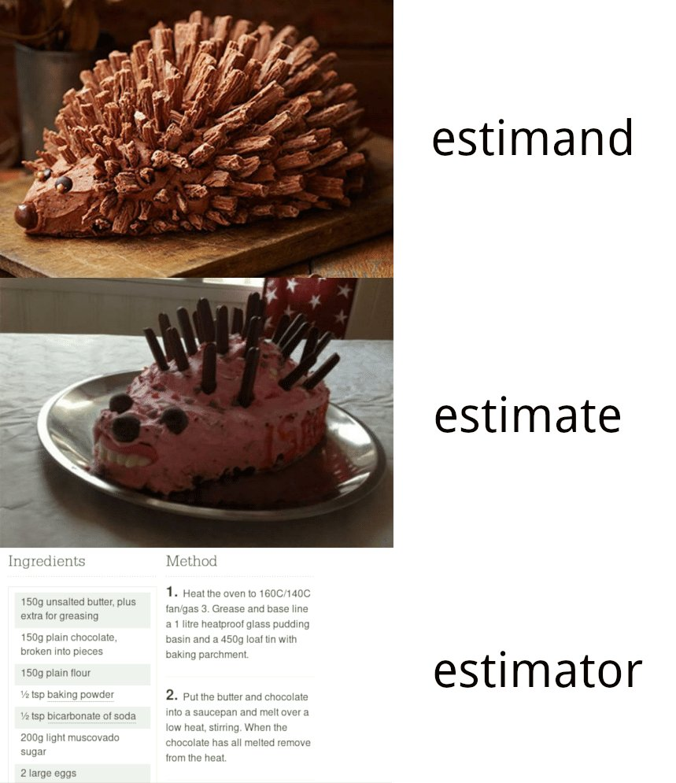
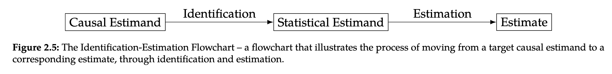
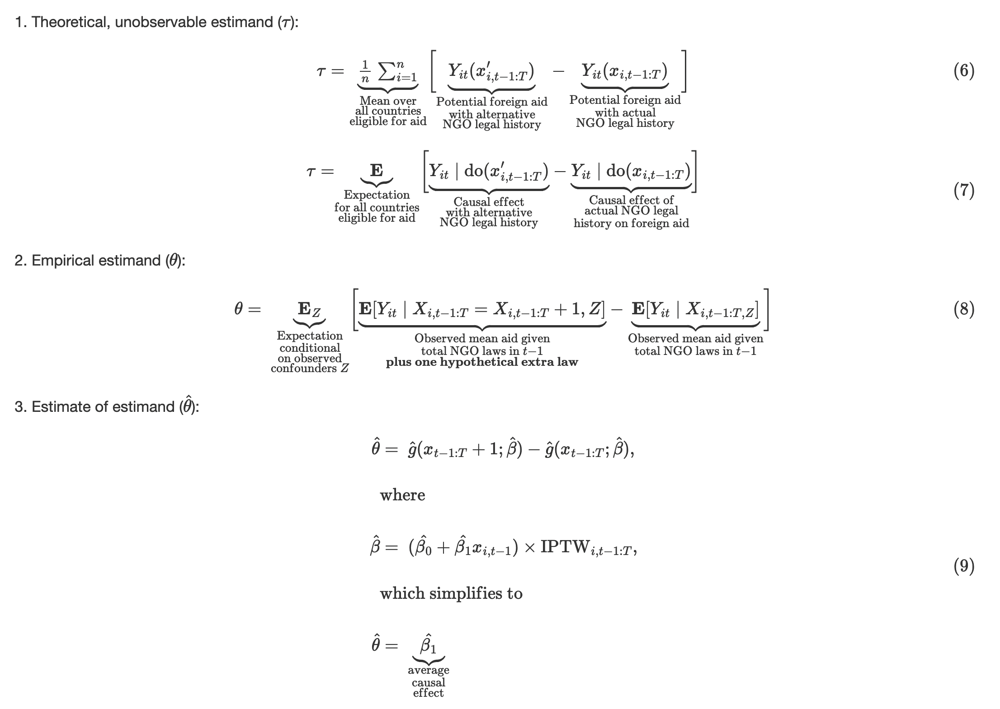

```{r setup, include=FALSE}
knitr::opts_chunk$set(warning = FALSE, message = FALSE, 
                      fig.retina = 3, fig.align = "center")
```

```{r packages-data, include=FALSE}
library(tidyverse)
library(ggdag)
library(palmerpenguins)
library(modelsummary)
```

```{r xaringanExtra, echo=FALSE}
xaringanExtra::use_xaringan_extra(c("tile_view"))
```

class: center middle main-title section-title-3

# In-person<br>session 9

.class-info[

**October 17, 2022**

.light[PMAP 8521: Program evaluation<br>
Andrew Young School of Policy Studies
]

]

---

name: outline
class: title title-inv-8

# Plan for today

--

.box-3.medium[General questions]

--

.box-7.medium[Final project]

--

.box-1.medium[Simple diff-in-diff]

--

.box-6.medium[Two-way fixed effects]

--

.box-2.medium[Clusters and sensitivity]

---

layout: false
name: general-questions
class: center middle section-title section-title-3 animated fadeIn

# General questions

---

class: middle

.box-3.large[Should we control for variables<br>to close as many backdoors as<br>possible in our diff-in-diff model?]

---

class: title title-3

# Design-based identification

.box-inv-3[Use a special situation to isolate arrow]

.pull-left[
.box-3[RCTs]

.box-inv-3.small[Use randomization<br>to remove confounding]

.center[
<figure>
  
</figure>
]
]

--

.pull-right[
.box-3[Difference-in-differences]

.box-inv-3.small[Use before/after & treatment/control<br>differences to remove confounding]

.center[
<figure>
  
</figure>
]
]

---

layout: true
class: middle

---

.box-3.large[How does moving time back<br>let us check for parallel trends?]

---

.center[
<figure>
  
</figure>
]

---

.box-3.large[Can you conduct diff-in-diff<br>with a binary outcome?]

???

- <https://www.andrewheiss.com/blog/2021/11/08/beta-regression-guide/#1-linear-probability-models>
- <https://bayesf22-notebook.classes.andrewheiss.com/bayes-rules/13-chapter.html#prelude-ii-how-to-interpret-logistic-regression-coefficients>

---

.box-3.large[I keep reading about estimates, estimands, and estimators.]

.box-3.large[What are these and<br>are they the same thing?]

---

layout: false
class: title title-3

# Estima(and|or|ate)s

--

.box-inv-3.less-medium[Estimand]

.box-3.sp-after[Theoretical thing you want to know (β)]

--

.box-inv-3.less-medium[Estimator]

.box-3.sp-after[Process for guessing the thing .small[(e.g., diff-in-diff with interaction term)]]

--

.box-inv-3.less-medium[Estimate]

.box-3[The guess (β-hat)]

---

class: middle

.center[
<figure>
  
</figure>
]

???

<https://twitter.com/WomenInStat/status/1449068312873287682>

---

class: middle

.center[
<figure>
  
</figure>
]

---

class: middle

.center[
<figure>
  
</figure>
]

---

layout: false
name: final-project
class: center middle section-title section-title-7 animated fadeIn

# Final project

---

class: middle

.box-7.large[Tell us more about<br>the final project!]

---

layout: false
name: diff-in-diff
class: center middle section-title section-title-1 animated fadeIn

# Simple diff-in-diff

---

layout: true
class: middle

---

.box-1.large[Minimum legal drinking age]

---

.box-inv-1.medium[MLDA reduction]

.box-1.medium[Two states: Alabama vs. Arkansas]

$$\begin{aligned}
\text{Mortality}\ =&\ \beta_0 + \beta_1\ \text{Alabama} + \beta_2\ \text{After 1975}\ + \\
&\ \beta_3\ (\text{Alabama} \times \text{After 1975})
\end{aligned}$$

---

.box-inv-1.medium[Organ donations]

.box-1.medium[Two states: California vs. New Jersey]

$$\begin{aligned}
\text{Donation rate}\ =&\ \beta_0 + \beta_1\ \text{California} + \beta_2\ \text{After Q22011}\ + \\
&\ \beta_3\ (\text{California} \times \text{After Q22011})
\end{aligned}$$

---

layout: false
name: twfe
class: center middle section-title section-title-6 animated fadeIn

# Two-way fixed effects<br>(TWFE)

---

layout: true
class: middle

---

.box-6.medium[Two states: Alabama vs. Arkansas]

$$\begin{aligned}
\text{Mortality}\ =&\ \beta_0 + \beta_1\ \text{Alabama} + \beta_2\ \text{After 1975}\ + \\
&\ \beta_3\ (\text{Alabama} \times \text{After 1975})
\end{aligned}$$

---

.box-6.medium[All states: `Treatment == 1`<br>if legal for 18-20-year-olds to drink]

$$\text{Mortality}\ =\ \beta_0 + \beta_1\ \text{Treatment} + \beta_2\ \text{State} + \beta_3\ \text{Year}$$

---

$$\begin{aligned}
\text{Mortality}\ =&\ \beta_0 + \beta_1\ \text{Alabama} + \beta_2\ \text{After 1975}\ + \\
&\ \color{red}{\beta_3}\ (\text{Alabama} \times \text{After 1975})
\end{aligned}$$

.center[vs.]

$$\text{Mortality}\ =\ \beta_0 + \color{red}{\beta_1}\ \text{Treatment} + \beta_2\ \text{State} + \beta_3\ \text{Year}$$

---

$$\begin{aligned}
\text{Mortality}\ =&\ \beta_0 + \beta_1\ \text{Alabama} + \beta_2\ \text{After 1975}\ + \\
&\ \color{red}{\beta_3}\ (\text{Alabama} \times \text{After 1975})
\end{aligned}$$

.center[vs.]

$$\text{Mortality}\ =\ \beta_0 + \color{red}{\beta_1}\ \text{Treatment} + \beta_2\ \text{State} + \beta_3\ \text{Year}$$

.center[vs.]

$$\begin{aligned}
\text{Mortality}\ =\ & \beta_0 + \color{red}{\beta_1}\ \text{Treatment} + \beta_2\ \text{State} + \beta_3\ \text{Year}\ +\\
&\beta_4\ (\text{State} \times \text{Year})
\end{aligned}$$

---

.center[
<figure>
  
</figure>
]

---

$$\begin{aligned}
\text{Donation rate}\ =&\ \beta_0 + \beta_1\ \text{California} + \beta_2\ \text{After Q22011}\ + \\
&\ \color{red}{\beta_3}\ (\text{California} \times \text{After Q22011})
\end{aligned}$$

.center[vs.]

$$
\begin{aligned}
\text{Donation rate}\ =\ & \beta_0 + \color{red}{\beta_1}\ \text{Treatment}\ + \\
& \beta_2\ \text{State} + \beta_3\ \text{Quarter}
\end{aligned}
$$

---

.box-6.large[What about this<br>staggered treatment stuff?]

.box-inv-6[[See this](https://www.andrewheiss.com/blog/2021/08/25/twfe-diagnostics/)]

???

This is good for ethical reasons!

Blog post

---

.box-6.large[What are random effects?]

.box-inv-6[[See this](https://www.andrewheiss.com/blog/2021/12/01/multilevel-models-panel-data-guide/)]

---

layout: false
name: sensitivity
class: center middle section-title section-title-2 animated fadeIn

# Clusters<br>and sensitivity

---

layout: true
class: middle

---

.box-2.medium.sp-after[What are robust standard errors?]

.box-2.medium.sp-after[What are clustered standard errors?]

---

.box-2.medium.sp-after[How do we know when we've got<br>the right confounders in our DAG?]

.box-2.medium[How do we solve the fact that<br>we have so many unknowns in our DAG?]

---

.center[
<figure>
  
</figure>
]

???

https://owenozier.github.io/teaching/2020-2021-memes
