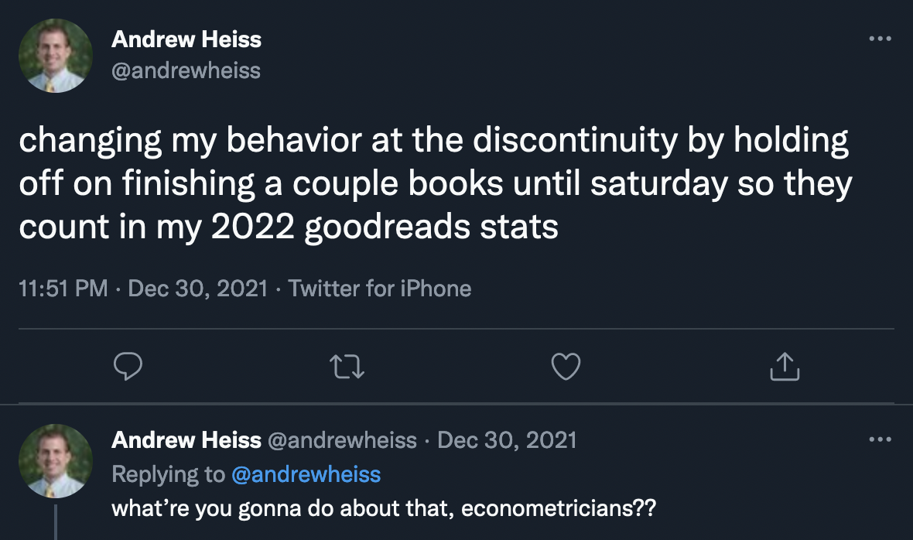
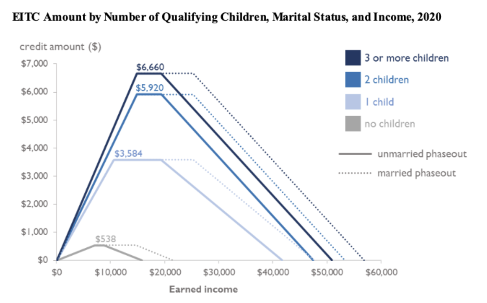
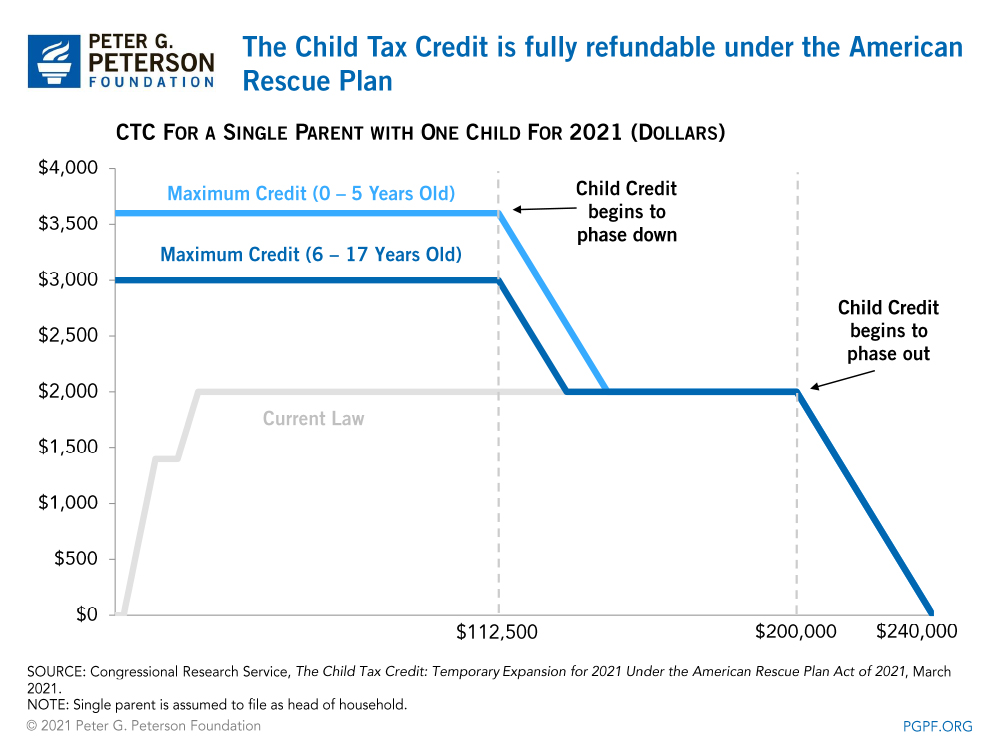
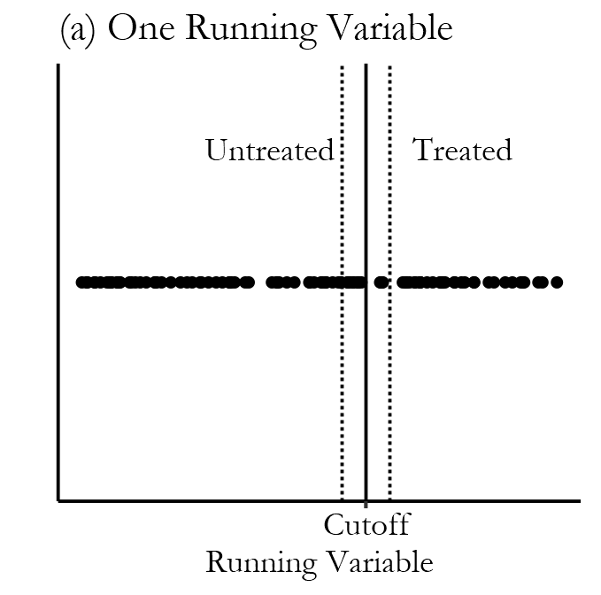
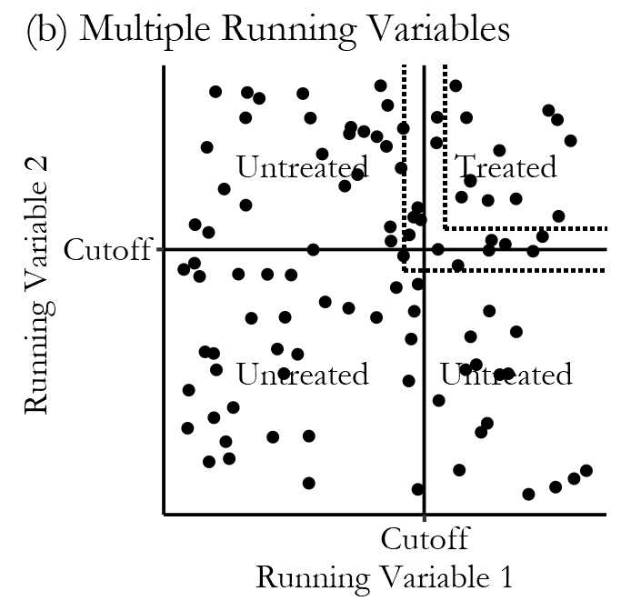

```{r setup, include=FALSE}
knitr::opts_chunk$set(warning = FALSE, message = FALSE, 
                      fig.retina = 3, fig.align = "center")
```

```{r packages-data, include=FALSE}
library(tidyverse)
library(kableExtra)
library(scales)
```

```{r xaringanExtra, echo=FALSE}
xaringanExtra::use_xaringan_extra(c("tile_view"))
```

class: center middle main-title section-title-3

# In-person<br>session 10

.class-info[

**October 24, 2022**

.light[PMAP 8521: Program evaluation<br>
Andrew Young School of Policy Studies
]

]

---

name: outline
class: title title-inv-8

# Plan for today

--

.box-2.medium.sp-after-half[Diff-in-diff effect sizes]

--

.box-5.medium.sp-after-half[Miscellaneous R stuff]

--

.box-6.medium.sp-after-half[RDD fun times]

---

layout: false
name: ps5
class: center middle section-title section-title-2 animated fadeIn

# Diff-in-diff effect sizes

---

layout: true
class: middle

---

.box-2.large[What the heck is happening at<br>the end of problem set 5?!]

---

layout: false
name: r-stuff
class: center middle section-title section-title-5 animated fadeIn

# Miscellaneous R stuff

---

layout: true
class: middle

---

.box-5.large[Searching past code]

???

Use Quarto search thing; use GitHub

---

.box-5.large[Learning with<br>the example pages]

???

Copy and paste! Work through the example yourself! Don't just read it.

Like what I do in <https://bayesf22-notebook.classes.andrewheiss.com/>

---

.box-5.large[Lines across categories]

???

```r
library(tidyverse)

mpg

avg_hwy_by_class <- mpg %>% 
  filter(cyl != 5) %>% 
  mutate(cyl = factor(cyl)) %>% 
  group_by(class, cyl) %>% 
  summarize(avg = mean(hwy))

ggplot(avg_hwy_by_class, aes(x = class, y = avg, color = cyl, group = cyl)) +
  geom_point() +
  geom_line()

```

```r
terror_trends <- terror %>% 
  group_by(month, same_block_factor) %>% 
  summarize(avg_robberies = mean(car_theft))

ggplot(terror_trends, aes(x = month, y = avg_robberies, 
                          color = same_block_factor, group = same_block_factor)) +
  geom_vline(xintercept = "7") +
  geom_line(size = 2) +
  theme_bw() +
  theme(legend.position = "bottom")
```

---

layout: false
name: rdd
class: center middle section-title section-title-6 animated fadeIn

# RDD fun times

---

layout: true
class: middle

---

.box-6.medium[With RDD we rely on "the rule" to<br>determine treatment and control groups]

.box-6[How do you decide on the rule?<br>You mentioned that it's arbitrary—<br>we can choose whatever rule we want?]

---

.box-6.medium[Can we use RDD to evaluate a program<br>that doesn't have a rule for participation?]

---

.box-6.medium[Is there a rule of thumb to determine which<br>quasi-experimental method we should use?]

.box-6.medium[How do we know which method applies<br>to which circumstance? Does the data tell us?]

---

.pull-left-narrow[
<figure>
  
</figure>
]

.pull-right-wide.small[
> Teachers in North Carolina Public schools earn a bonus of $750 if the students in their school meet a standard called "expected growth." A summary statistic called "average growth" is computed for each school; the expected growth standard is met when this summary measure exceeds zero.

> Does getting a bonus in year $t$ cause improved student performance in year $t + 1$?
]

---

.box-6.large[How common are these kinds of rules<br>in the real world?]

???

- Anything income-based or means-tested - sliding scale community health clinics, school truancy programs
- Anything with a test: SAT/ACT, AIG programs
- Elections - causal effect of candidates
- Grades - 89.49 vs. 89.51
- Poverty, EITC

---

.center[
<figure>
  
</figure>
]

---

.box-6.medium[Where do these eligibility thresholds come from? Do policy makers research them first and reexamine them later?]

---

layout: true
class: title title-6

---

# Discontinuities everywhere!

.pull-left-wide.small[
```{r poverty-table, echo=FALSE}
poverty_line <- tibble::tribble(
  ~Size, ~Annual, ~Monthly, ~`138%`, ~`150%`, ~`200%`,
  1,     12760,   1063,     17609,   19140,   25520,  
  2,     17240,   1437,     23791,   25860,   34480,  
  3,     21720,   1810,     29974,   32580,   43440,  
  4,     26200,   2183,     36156,   39300,   52400,  
  5,     30680,   2557,     42338,   46020,   61360,  
  6,     35160,   2930,     48521,   52740,   70320,  
  7,     39640,   3303,     54703,   59460,   79280,  
  8,     44120,   3677,     60886,   66180,   88240
)

poverty_line %>% 
  mutate(across(-Size, dollar)) %>% 
  kbl(align = "c")
```
]

.pull-right-narrow[
.box-inv-6.smaller[**Medicaid**<br>138%*]

.box-inv-6.smaller[**ACA subsidies**<br>138–400%*]

.box-inv-6.smaller[**CHIP**<br>200%]

.box-inv-6.smaller[**SNAP/Free lunch**<br>130%]

.box-inv-6.smaller[**Reduced lunch**<br>130–185%]
]

---

# The US's official poverty measure

.pull-left.center[
<figure>
  
  <figcaption>Mollie Orshansky</figcaption>
</figure>
]

.pull-right[
.box-inv-6[Formula created in 1963]

.box-inv-6[Based solely on food expenses from a survey of household budgets in 1955]]

???

- <https://www.census.gov/topics/income-poverty/poverty/about/history-of-the-poverty-measure.html>
- <https://www.ssa.gov/policy/docs/ssb/v68n3/v68n3p79.html>

---

# The US's official poverty measure

.box-inv-6[Official formula:]

--

.box-6.medium[**1955 annual food budget × 3**]

--

.box-inv-6[That's all!]

<br>

--

.box-inv-6[In 1963 poverty line was 50% of median income;<br>in 2005 it was 28%; 18% today]

---

layout: true
class: middle

---

.box-6[Why don't we change it?]

.center[
<iframe width="800" height="450" src="https://www.youtube.com/embed/q9EehZlw-zk" frameborder="0" allow="accelerometer; autoplay; encrypted-media; gyroscope; picture-in-picture" allowfullscreen></iframe>
]

---

.center[
<figure>
  
</figure>
]

---

.center[
<figure>
  
</figure>
]

---

.box-6.medium[Why does the cutoff need<br>to be unique to the<br>program of interest?]

???

In theory, to take care of confounding. If the same cutoff is used for two different programs, and you're evaluating one, and the other isn't automatic, peoples' use of the second program would influence their outcomes in the first one.

---

.box-6.medium[What if there are multiple cutoffs?]

.box-inv-6[College admission is based on GPA *and* test scores…]

.box-inv-6[WIC/SNAP/Medicaid are based on income *and* family size…]

---

.pull-left[
<figure>
  
</figure>
]

--

.pull-left[
<figure>
  
</figure>
]

---

.box-6.large[Why do we center<br>the running variable?]

---

.box-6.large[Regression is just fancy averages!]

---

```{r tutoring-plot, echo=FALSE, fig.width=8, fig.height=4.25, out.width="100%"}
library(tidyverse)
library(broom)

tutoring <- read_csv("data/tutoring_program.csv")

ggplot(tutoring, aes(x = entrance_exam, y = exit_exam)) +
  geom_point(size = 1, alpha = 0.5) +
  # x
  geom_smooth(data = filter(tutoring, entrance_exam <= 70, entrance_exam >= 60),
              method = "lm", se = FALSE, size = 2) +
  geom_smooth(data = filter(tutoring, entrance_exam > 70, entrance_exam <= 80),
              method = "lm", se = FALSE, size = 2) +
  coord_cartesian(xlim = c(60, 80)) +
  geom_vline(xintercept = 70) +
  labs(x = "Entrance exam score", y = "Exit exam score", color = "Used tutoring")
```

---

```{r}
lm(exit_exam ~ entrance_exam + tutoring,
   data = filter(tutoring, entrance_exam <= 80, 
                 entrance_exam >= 60)) %>% 
  tidy()
```

---

```{r}
tutoring_centered <- tutoring %>%
  mutate(entrance_centered = entrance_exam - 70)

lm(exit_exam ~ entrance_centered + tutoring,
   data = filter(tutoring_centered, entrance_exam <= 80, 
                 entrance_exam >= 60)) %>% 
  tidy()
```

---

```{r tutoring-plot-3, echo=FALSE, fig.width=8, fig.height=4.25, out.width="100%"}
ggplot(tutoring, aes(x = entrance_exam, y = exit_exam)) +
  geom_point(size = 1, alpha = 0.5) +
  # x
  geom_smooth(data = filter(tutoring, entrance_exam <= 70, entrance_exam >= 60),
              method = "lm", se = FALSE, size = 2, aes(color = "x")) +
  geom_smooth(data = filter(tutoring, entrance_exam > 70, entrance_exam <= 80),
              method = "lm", se = FALSE, size = 2, aes(color = "x")) +
  # x^3
  geom_smooth(data = filter(tutoring, entrance_exam <= 70, entrance_exam >= 60),
              method = "lm", formula = y ~ poly(x, 3),
              se = FALSE, size = 2, aes(color = "x^3")) +
  geom_smooth(data = filter(tutoring, entrance_exam > 70, entrance_exam <= 80),
              method = "lm", formula = y ~ poly(x, 3),
              se = FALSE, size = 2, aes(color = "x^3")) +
  coord_cartesian(xlim = c(60, 80)) +
  geom_vline(xintercept = 70) +
  labs(x = "Entrance exam score", y = "Exit exam score", color = "Used tutoring")
```

---

.box-6.large[What's the difference between weighting with kernels and inverse probability weighting?]

???

- <https://evalsp22.classes.andrewheiss.com/slides/07-slides.html#122>
- <https://evalsp22.classes.andrewheiss.com/slides/10-slides.html#87>
- <https://evalsp22.classes.andrewheiss.com/slides/10-slides.html#95>

---

.box-6.medium[There must be some math behind for the non-parametric lines. Should we care about that or should we just trust in R?]

???

- <https://evalsp22.classes.andrewheiss.com/slides/10-slides.html#75>

---

.box-6.medium[Should we control for confounders?]

---

.box-6.medium[How do we decide on the right model?]

.center[
- Parametric with $y = x$?
- With $y = x^2 + x$? 
- With $y = x^\text{whatever} + x^\text{whatever} + x$? 
- Nonparametric? 
- `rdrobust()` or just `lm()`? 
- Controls or no controls?
]

---

.box-6.medium[How do you justify a bandwidth?]

.box-6.medium[Does the bandwidth need to be<br>the same on both sides?]

---

.box-6.less-medium[How should we think about the impact of the program on people who score really high or low on the running variable?]

.box-6.less-medium[If we're throwing most of the data away and only looking at a narrow bandwidth of people, what does this say about generalizability?]

---

.box-6.medium[What do we do about noncompliance<br>and manipulation?]

.box-6.medium[What is fuzzy regression discontinuity?]

---

.box-6.huge[RD play time!]
