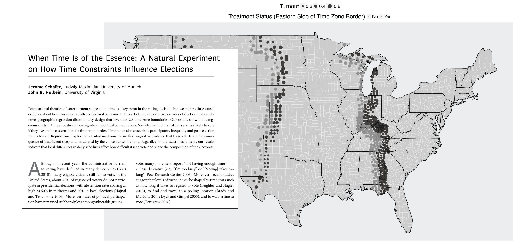
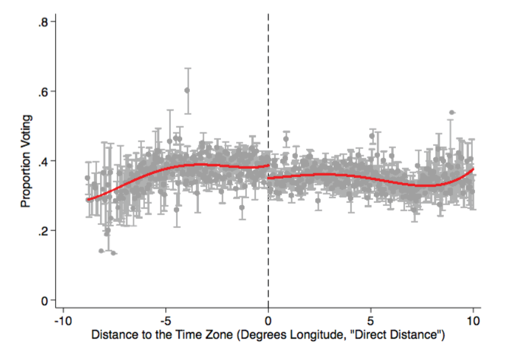
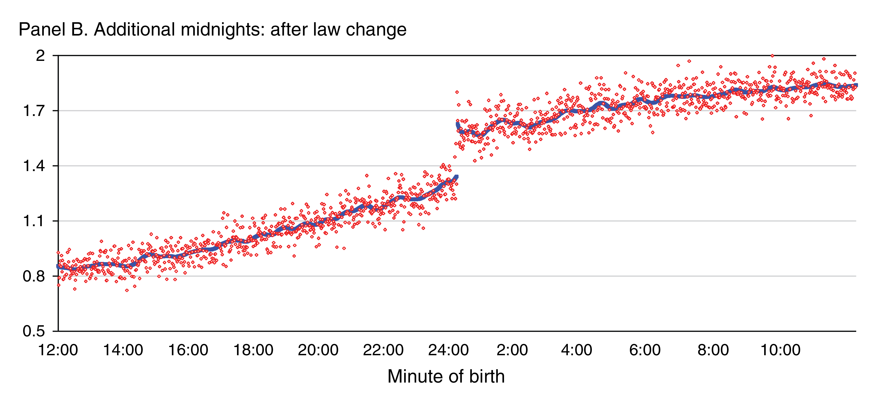
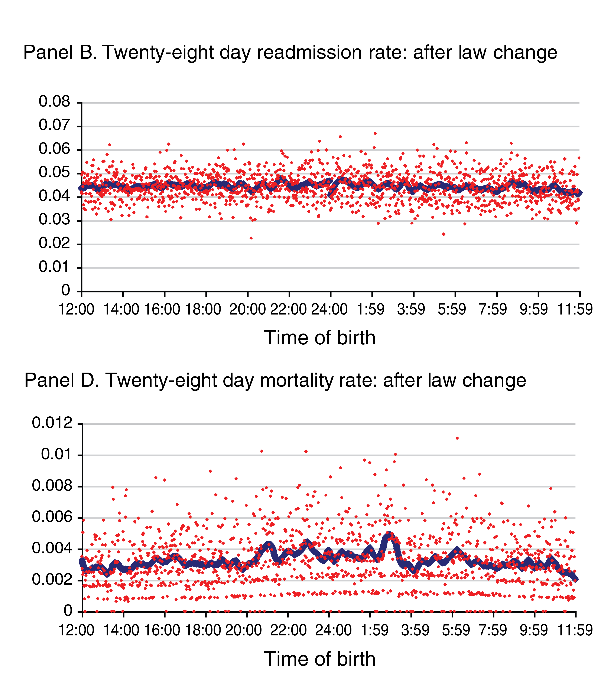
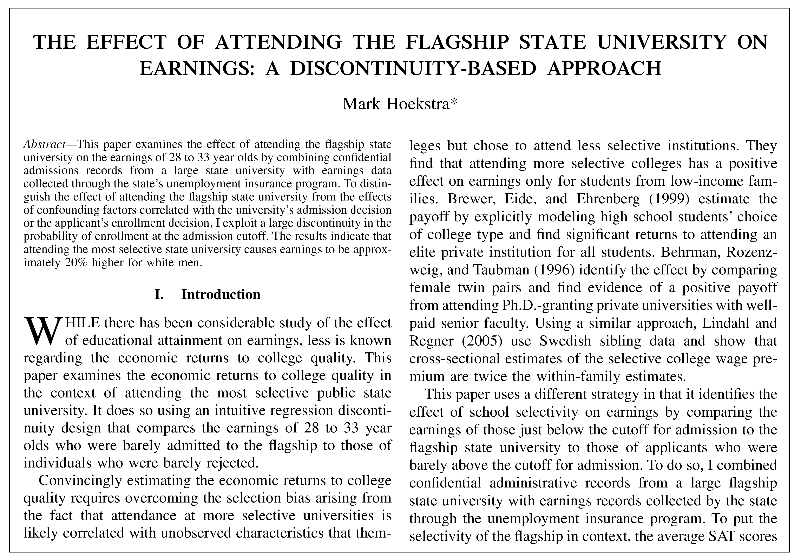
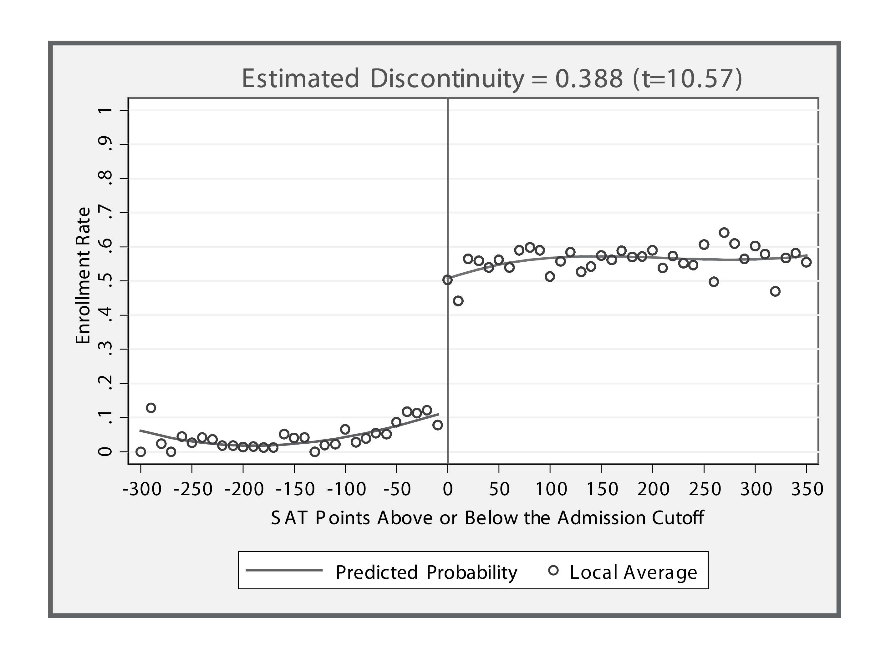
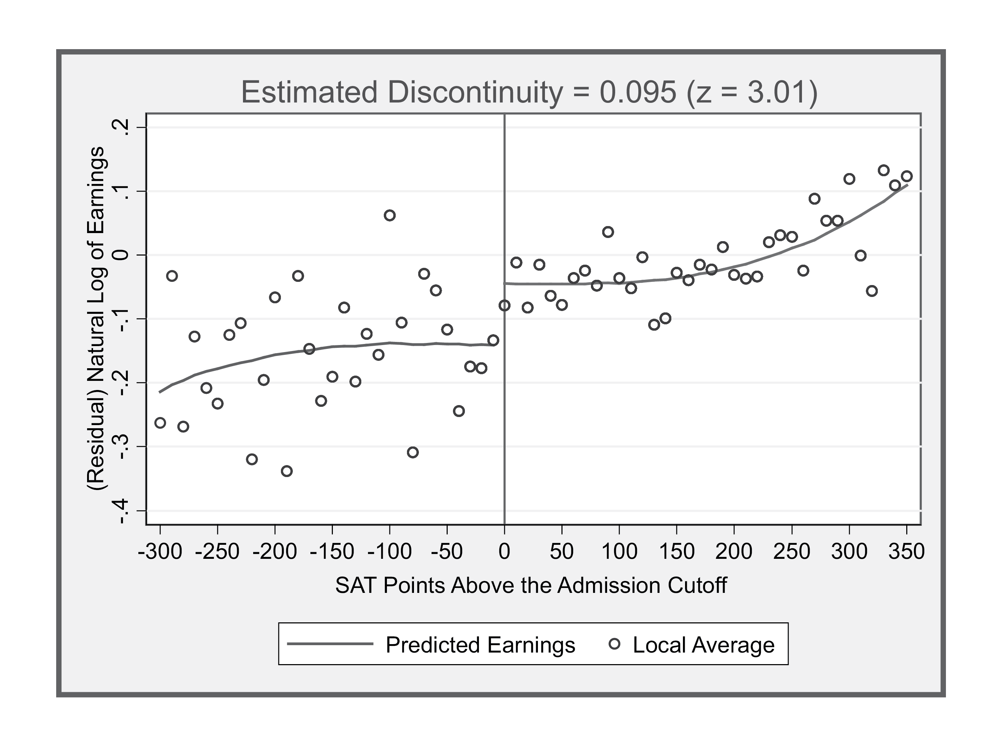
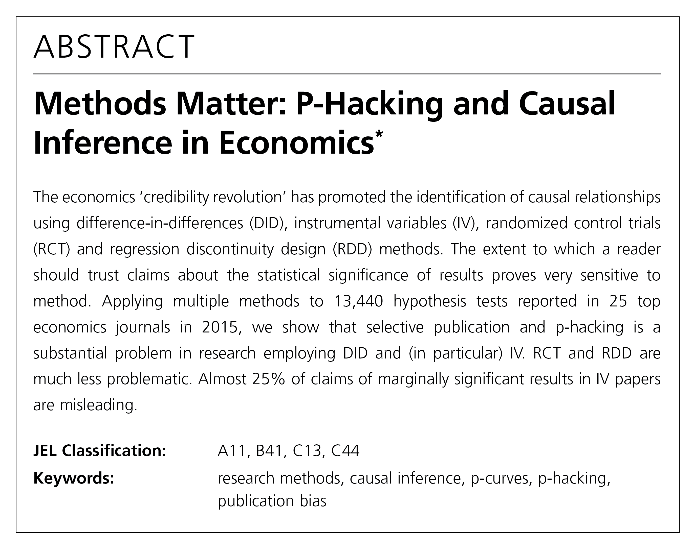
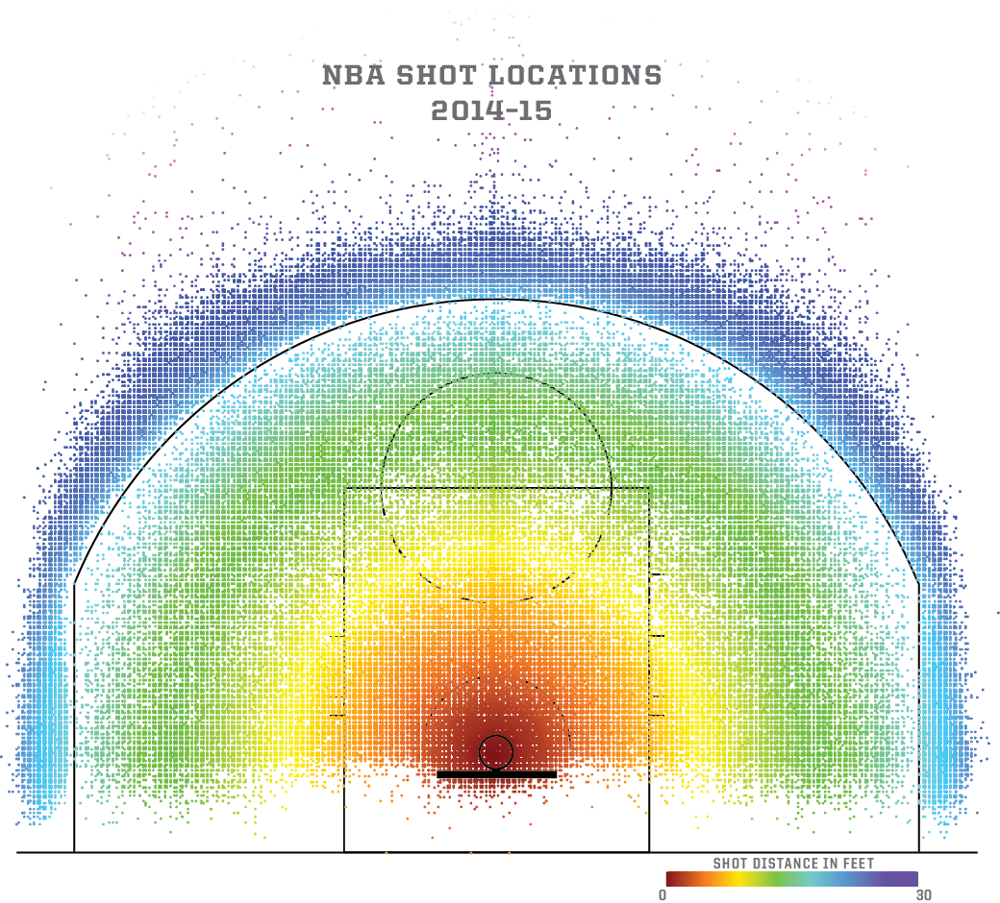

```{r setup, include=FALSE}
knitr::opts_chunk$set(warning = FALSE, message = FALSE, 
                      fig.retina = 3, fig.align = "center")
```

```{r packages-data, include=FALSE}
library(tidyverse)
library(broom)
library(ggdag)
library(kableExtra)
library(scales)
library(patchwork)
library(latex2exp)
library(rdrobust)
library(rddensity)

# Fake program data
set.seed(1234)
num_students <- 1000
tutoring <- tibble(
  id = 1:num_students,
  entrance_exam = rbeta(num_students, shape1 = 7, shape2 = 2),
  exit_exam = rbeta(num_students, shape1 = 5, shape2 = 3)
) %>% 
  mutate(entrance_exam = entrance_exam * 100,
         tutoring = entrance_exam <= 70) %>% 
  mutate(exit_exam = exit_exam * 40 + 10 * tutoring + entrance_exam / 2) %>% 
  mutate(tutoring_fuzzy = ifelse(entrance_exam > 60 & entrance_exam < 80,
                                 sample(c(TRUE, FALSE), n(), replace = TRUE),
                                 tutoring)) %>% 
  mutate(tutoring_text = factor(tutoring, levels = c(FALSE, TRUE),
                                labels = c("No tutor", "Tutor")),
         tutoring_fuzzy_text = factor(tutoring_fuzzy, levels = c(FALSE, TRUE),
                                      labels = c("No tutor", "Tutor"))) %>% 
  mutate(entrance_centered = entrance_exam - 70)
```

```{r xaringanExtra, echo=FALSE}
xaringanExtra::use_xaringan_extra(c("tile_view"))
```

class: center middle main-title section-title-7

# Regression discontinuity I

.class-info[

**Session 10**

.light[PMAP 8521: Program evaluation<br>
Andrew Young School of Policy Studies
]

]

---

name: outline
class: title title-inv-8

# Plan for today

--

.box-2.medium.sp-after-half[Arbitrary cutoffs and causal inference]

--

.box-4.medium.sp-after-half[Drawing lines and measuring gaps]

--

.box-6.medium.sp-after-half[Main RDD concerns]

---

name: arbitrary-cutoffs
class: center middle section-title section-title-2 animated fadeIn

# Arbitrary cutoffs<br>and causal inference

---

layout: true
class: title title-2

---

# Quasi-experiments again

--

.box-inv-2.sp-after[Instead of using carefully adjusted DAGs,<br>we can use *context* to isolate/identify the pathway between<br>treatment and outcome in observational data]

--

.box-inv-2[Diff-in-diff was one kind of quasi-experiment]

.box-2.sp-after[Treatment/control + before/after]

--

.box-inv-2[Regression discontinuity designs (RDD) are another]

.box-2[Arbitrary rules determine access to programs]

---

# Rules to access programs

.box-inv-2.medium[Lots of policies and programs are<br>based on arbitrary rules and thresholds]

--

.box-2[If you're above the threshold, you're in the program;<br>if you're below, you're not (or vice versa)]

---

# Key terms

--

.box-inv-2.medium[Running / forcing variable]

.box-2.sp-after[Index or measure that determines eligibility]

--

.box-inv-2.medium[Cutoff / cutpoint / threshold]

.box-2[Number that formally assigns access to program]

---

layout: false

```{r rd-dag, echo=FALSE, fig.width=12, fig.height=6, out.width="100%"}
node_details <- tribble(
  ~name, ~label, ~x, ~y,
  "treatment", "Program", 1, 1,
  "outcome", "Outcome", 4, 1,
  "cutoff", "Above cutoff", 2, 1.75,
  "running", "Running variable", 3, 2
)

node_labels <- node_details$label
names(node_labels) <- node_details$name

rdd_dag <- dagify(outcome ~ treatment + running,
                  treatment ~ cutoff,
                  cutoff ~ running,
                  exposure = c("treatment", "cutoff"),
                  outcome = "outcome",
                  coords = node_details,
                  labels = node_labels) %>% 
  tidy_dagitty() %>%
  node_status()

status_colors <- c(exposure = "#0074D9", outcome = "#FF851B", latent = "grey50")

set.seed(1234)
ggplot(rdd_dag, aes(x = x, y = y, xend = xend, yend = yend)) +
  geom_dag_edges(start_cap = ggraph::circle(3, "lines"),
                 end_cap = ggraph::circle(3, "lines"),
                 edge_width = 1.5, 
                 arrow_directed = grid::arrow(length = grid::unit(0.75, "lines"), type = "closed")) +
  geom_dag_point(aes(color = status), size = 30) +
  geom_dag_label_repel(aes(label = label, fill = status), seed = 1234,
                       color = "white", fontface = "bold", size = 10,
                       label.padding = grid::unit(0.75, "lines"),
                       box.padding = grid::unit(2.5, "lines"),
                       direction = "y") +
  scale_color_manual(values = status_colors, na.value = "grey20") +
  scale_fill_manual(values = status_colors, na.value = "grey20") +
  guides(color = FALSE, fill = FALSE) + 
  theme_dag(base_size = 20, base_family = "Fira Sans Condensed")
```

---

layout: true
class: title title-2

---

# Discontinuities everywhere!

.pull-left-wide.small[
```{r poverty-table, echo=FALSE}
poverty_line <- tibble::tribble(
  ~Size, ~Annual, ~Monthly, ~`138%`, ~`150%`, ~`200%`,
  1,     12760,   1063,     17609,   19140,   25520,  
  2,     17240,   1437,     23791,   25860,   34480,  
  3,     21720,   1810,     29974,   32580,   43440,  
  4,     26200,   2183,     36156,   39300,   52400,  
  5,     30680,   2557,     42338,   46020,   61360,  
  6,     35160,   2930,     48521,   52740,   70320,  
  7,     39640,   3303,     54703,   59460,   79280,  
  8,     44120,   3677,     60886,   66180,   88240
)

poverty_line %>% 
  mutate(across(-Size, dollar)) %>% 
  kbl(align = "c")
```
]

.pull-right-narrow[
.box-inv-2.smaller[**Medicaid**<br>138%*]

.box-inv-2.smaller[**ACA subsidies**<br>138–400%*]

.box-inv-2.smaller[**CHIP**<br>200%]

.box-inv-2.smaller[**SNAP/Free lunch**<br>130%]

.box-inv-2.smaller[**Reduced lunch**<br>130–185%]
]


---

# Hypothetical tutoring program

--

.box-inv-2.medium[Students take an entrance exam]

--

.box-inv-2.medium[Those who score 70 or lower<br>get a free tutor for the year]

--

.box-inv-2.medium[Students then take an exit exam<br>at the end of the year]

---

layout: false

```{r tutoring-running, echo=FALSE, fig.width=12, fig.height=6.5, out.width="100%"}
ggplot(tutoring, aes(x = entrance_exam, y = tutoring_text, fill = tutoring_text)) +
  geom_vline(xintercept = 70, size = 2, color = "#FFDC00") + 
  geom_point(size = 5, pch = 21, color = "white", alpha = 0.7,
             position = position_jitter(width = 0, height = 0.2, seed = 1234)) + 
  labs(x = "Entrance exam score", y = NULL) + 
  guides(fill = FALSE) +
  scale_fill_manual(values = c("#85144b", "#0074D9"), name = NULL) +
  theme_bw(base_size = 28, base_family = "Fira Sans Condensed")
```

---

class: title title-2

# Causal inference intuition

.box-inv-2.medium[The people right before and right after the threshold are essentially the same]

---

```{r tutoring-running-threshold, echo=FALSE, fig.width=12, fig.height=6.5, out.width="100%"}
ggplot(tutoring, aes(x = entrance_exam, y = tutoring_text, fill = tutoring_text)) +
  annotate(geom = "rect", fill = "grey50", alpha = 0.25, ymin = -Inf, ymax = Inf,
           xmin = 70 - 5,  xmax = 70 + 5) +
  annotate(geom = "rect", fill = "grey50", alpha = 0.5, ymin = -Inf, ymax = Inf,
           xmin = 70 - 2,  xmax = 70 + 2) +
  geom_vline(xintercept = 70, size = 2, color = "#FFDC00") + 
  geom_point(size = 5, pch = 21, color = "white", alpha = 0.7,
             position = position_jitter(width = 0, height = 0.2, seed = 1234)) + 
  labs(x = "Entrance exam score", y = NULL) + 
  guides(fill = FALSE) +
  scale_fill_manual(values = c("#85144b", "#0074D9"), name = NULL) +
  theme_bw(base_size = 28, base_family = "Fira Sans Condensed")
```

---

```{r tutoring-running-threshold-zoomed, echo=FALSE, fig.width=12, fig.height=6.5, out.width="100%"}
ggplot(tutoring, aes(x = entrance_exam, y = tutoring_text, fill = tutoring_text)) +
  annotate(geom = "rect", fill = "grey50", alpha = 0.25, ymin = -Inf, ymax = Inf,
           xmin = 70 - 5,  xmax = 70 + 5) +
  annotate(geom = "rect", fill = "grey50", alpha = 0.5, ymin = -Inf, ymax = Inf,
           xmin = 70 - 2,  xmax = 70 + 2) +
  geom_vline(xintercept = 70, size = 2, color = "#FFDC00") + 
  geom_point(size = 5, pch = 21, color = "white", alpha = 0.7,
             position = position_jitter(width = 0, height = 0.2, seed = 1234)) + 
  labs(x = "Entrance exam score", y = NULL) + 
  guides(fill = FALSE) +
  scale_fill_manual(values = c("#85144b", "#0074D9"), name = NULL) +
  coord_cartesian(xlim = c(70 - 6, 70 + 6)) +
  theme_bw(base_size = 28, base_family = "Fira Sans Condensed")
```

---

class: title title-2

# Causal inference intuition

--

.box-inv-2.medium[The people right before and right after the threshold are essentially the same]

--

.box-2.medium[Pseudo treatment and control groups!]

--

.box-inv-2.medium[Compare outcomes for those<br>right before/after, calculate difference]

---

```{r tutoring-outcome, echo=FALSE, fig.width=12, fig.height=6.5, out.width="100%"}
ggplot(tutoring, aes(x = entrance_exam, y = exit_exam, fill = tutoring_text)) +
  geom_point(size = 4, pch = 21, color = "white", alpha = 1) + 
  geom_vline(xintercept = 70, size = 2, color = "#FFDC00") + 
  labs(x = "Entrance exam score", y = "Exit exam score") + 
  scale_fill_manual(values = c("#85144b", "#0074D9"), name = NULL) +
  guides(fill = guide_legend(reverse = TRUE)) +
  theme_bw(base_size = 28, base_family = "Fira Sans Condensed")
```

---

```{r tutoring-outcome-lines, echo=FALSE, fig.width=12, fig.height=6.5, out.width="100%"}
ggplot(tutoring, aes(x = entrance_exam, y = exit_exam, fill = tutoring_text, color = tutoring_text)) +
  geom_point(size = 4, pch = 21, color = "white", alpha = 0.25) + 
  geom_vline(xintercept = 70, size = 2, color = "#FFDC00") + 
  geom_smooth(data = filter(tutoring, entrance_exam <= 70),
              method = "lm", size = 2, show.legend = FALSE) +
  geom_smooth(data = filter(tutoring, entrance_exam > 70),
              method = "lm", size = 2, show.legend = FALSE) +
  labs(x = "Entrance exam score", y = "Exit exam score") + 
  scale_fill_manual(values = c("#85144b", "#0074D9"), name = NULL) +
  scale_color_manual(values = c("#85144b", "#0074D9")) +
  guides(fill = guide_legend(reverse = TRUE, override.aes = list(alpha = 1)), color = FALSE) +
  theme_bw(base_size = 28, base_family = "Fira Sans Condensed")
```

---

```{r tutoring-outcome-delta, echo=FALSE, fig.width=12, fig.height=6.5, out.width="100%"}
rdd_tutoring <- lm(exit_exam ~ entrance_centered + tutoring, data = tutoring) %>% 
  tidy()

effect_control <- filter(rdd_tutoring, term == "(Intercept)")$estimate
late <- filter(rdd_tutoring, term == "tutoringTRUE")$estimate
effect_treatment <- effect_control + late

ggplot(tutoring, aes(x = entrance_exam, y = exit_exam, fill = tutoring_text, color = tutoring_text)) +
  geom_point(size = 4, pch = 21, color = "white", alpha = 0.25) + 
  geom_vline(xintercept = 70, size = 2, color = "#FFDC00") + 
  geom_smooth(data = filter(tutoring, entrance_exam <= 70),
              method = "lm", size = 2, show.legend = FALSE) +
  geom_smooth(data = filter(tutoring, entrance_exam > 70),
              method = "lm", size = 2, show.legend = FALSE) +
  annotate(geom = "segment", x = 70, xend = 70, 
           y = effect_control, yend = effect_treatment,
           size = 4, color = "#FF4136") +
  annotate(geom = "label", x = 82, y = effect_treatment - (late / 2),
           label = "δ\n(causal effect)", family = "Fira Sans Condensed", fontface = "bold",
           color = "white", fill = "#FF4136", size = 7, label.padding = unit(0.75, "lines")) +
  labs(x = "Entrance exam score", y = "Exit exam score") + 
  scale_fill_manual(values = c("#85144b", "#0074D9"), name = NULL) +
  scale_color_manual(values = c("#85144b", "#0074D9")) +
  guides(fill = guide_legend(reverse = TRUE, override.aes = list(alpha = 1)), color = FALSE) +
  theme_bw(base_size = 28, base_family = "Fira Sans Condensed")
```

---

```{r tutoring-outcome-delta-zoomed, echo=FALSE, fig.width=12, fig.height=6.5, out.width="100%"}
ggplot(tutoring, aes(x = entrance_exam, y = exit_exam, fill = tutoring_text, color = tutoring_text)) +
  geom_point(size = 4, pch = 21, color = "white", alpha = 0.25) + 
  geom_vline(xintercept = 70, size = 2, color = "#FFDC00") + 
  geom_smooth(data = filter(tutoring, entrance_exam <= 70),
              method = "lm", size = 2, show.legend = FALSE) +
  geom_smooth(data = filter(tutoring, entrance_exam > 70),
              method = "lm", size = 2, show.legend = FALSE) +
  annotate(geom = "segment", x = 70, xend = 70, 
           y = effect_control, yend = effect_treatment,
           size = 4, color = "#FF4136") +
  labs(x = "Entrance exam score", y = "Exit exam score") + 
  scale_fill_manual(values = c("#85144b", "#0074D9"), name = NULL) +
  scale_color_manual(values = c("#85144b", "#0074D9")) +
  guides(fill = guide_legend(reverse = TRUE, override.aes = list(alpha = 1)), color = FALSE) +
  coord_cartesian(xlim = c(70 - 6, 70 + 6)) +
  theme_bw(base_size = 28, base_family = "Fira Sans Condensed")
```

---

layout: true
class: title title-2

---

# Geographic discontinuities

.center[
<figure>
  
</figure>
]

---

# Geographic discontinuities

.pull-left-wide.center[
<figure>
  
</figure>
]

.pull-right-narrow[
.box-inv-2[Lower turnout in counties on the eastern side of the boundary]

.box-inv-2[Election schedules cause fluctuations in turnout]
]

---

# Time discontinuities

.pull-left-wide.center[
<figure>
  
</figure>
]

.pull-right-narrow[
.box-inv-2[California requires that insurance cover two days of post-partum hospitalization]

.box-inv-2[Does extra time in the hospital improve health outcomes?]
]

---

# Time discontinuities

.center[
<figure>
  
</figure>
]

.box-inv-2[Delivering at 12:01 AM makes you stay longer in the hospital…]

---


# Time discontinuities

.pull-left-wide.center[
<figure>
  
</figure>
]

.pull-right-narrow[
&nbsp;

.box-inv-2[…but delivering at 12:01 AM has no effect on readmission rates or mortality rates]
]

---

# Test score discontinuities

.pull-left-wide.center[
<figure>
  
</figure>
]

.pull-right-narrow[
.box-inv-2[Does going to the main state university (e.g. UGA) make you earn more money?]

.box-inv-2[SAT scores are an arbitrary cutoff for accessing the university]
]

---

# Test score discontinuities

.pull-left.center[
<figure>
  
</figure>

.box-inv-2[Cutoff seems rule-based]
]

--

.pull-right.center[
<figure>
  
</figure>

.box-inv-2[Earnings are slightly higher]
]

---

# RDDs are all the rage

.box-inv-2.medium[People love these things!]

--

.box-2[They're intuitive, compelling, and highly graphical]

--

.pull-left.center[
<figure>
  
</figure>
]

.pull-right[
.box-2[RDD less susceptible to p-hacking and selective publication than DID or IV]
]

---

layout: false
name: lines-gaps
class: center middle section-title section-title-4 animated fadeIn

# Drawing lines<br>and measuring gaps

---

class: title title-4

# Main goal of RD

--

.box-inv-4.medium[Measure the gap in outcome for<br>people on both sides of the cutpoint]

--

.box-inv-4.medium[Gap = **δ** =<br>local average treatment effect (LATE)]

---

`)

---

layout: true
class: title title-4

---

# Drawing lines

--

.box-inv-4.medium[The size of the gap depends on how<br>you draw the lines on each side of the cutoff]

--

.box-inv-4.medium.sp-after[The type of lines you choose can<br>change the estimate of δ—sometimes by a lot!]

--

.box-4.medium[There's no one right way to draw lines!]

---

# Line-drawing considerations

--

.box-inv-4.medium[Parametric vs. non-parametric lines]

--

.box-inv-4.medium[Measuring the gap]

--

.box-inv-4.medium[Bandwidths]

--

.box-inv-4.medium[Kernels]

---

# Parametric lines

.box-inv-4.medium[Formulas with *parameters*]

--

.medium[
$$y = mx + b$$

$$y = \beta_0 + \beta_1 x_1 + \beta_2 x_2$$
]

---

layout: false

```{r parameters-stuff, echo=FALSE}
line_colors_df <- tribble(
  ~name, ~color, ~formula,
  "Linear", "#0074D9", "y = β_1 x",
  "Squared", "#FF851B", "y = β_1 x + β_2 x^2",
  "Cubed", "#FF4136", "y = β_1 x + β_2 x^2 + β_3 x^3",
  "Trigonometric", "#2ECC40", "y = β_1 x + β_2 sin(x)",
  "Loess", "#B10DC9", "Loess"
)

line_colors <- line_colors_df$color %>% 
  set_names(line_colors_df$name)

fun_linear <- function(x) 10 + 4 * x
fun_squared <- function(x) 120 - 3 * x + 0.07 * x^2
fun_cubic <- function(x) 300 - 25 * x + 0.65 * x^2 - 0.004 * x^3
fun_trig <- function(x) 10 + 4 * x + 50 * sin(0.25 * x)
fun_trig_effect <- function(x) ifelse(x >= 75, fun_trig(x) + 200, fun_trig(x))
fun_loess <- function(x) 100 + 30 * sin(5 * x) + 0.2 * x^2 - 0.002 * x^3

set.seed(1234)
df_params <- tibble(id = 1:400) %>% 
  mutate(x_uniform = runif(n(), min = 0, max = 100)) %>% 
  mutate(y_linear = fun_linear(x_uniform) + rnorm(n(), 0, 50)) %>% 
  mutate(y_squared = fun_squared(x_uniform) + rnorm(n(), 0, 50)) %>% 
  mutate(y_cubed = fun_cubic(x_uniform) + rnorm(n(), 0, 50)) %>% 
  mutate(y_trig = fun_trig(x_uniform) + rnorm(n(), 0, 50)) %>% 
  mutate(y_loess = fun_loess(x_uniform) + rnorm(n(), 0, 50)) %>% 
  mutate_at(vars(starts_with("y_")),
            list(effect = ~ifelse(x_uniform >= 75, . + 200, .)))
```

.small[
$$y = 10 + 4x$$
]

```{r params-plot-linear, echo=FALSE, fig.width=12, fig.height=5.5, out.width="100%"}
ggplot(df_params, aes(x = x_uniform, y = y_linear)) +
  geom_point(size = 5, pch = 21, color = "white", fill = "black", alpha = 0.5) +
  geom_smooth(method = "lm", formula = y ~ x,
              se = FALSE, size = 3, aes(color = "Linear")) +
  scale_color_manual(values = line_colors, breaks = names(line_colors), 
                     labels = map(line_colors_df$formula, TeX), name = NULL) +
  labs(x = NULL, y = NULL) +
  theme_bw(base_size = 28, base_family = "Fira Sans Condensed") +
  theme(legend.position = "bottom") +
  theme(legend.box.spacing = unit(0.5, "lines"),
        legend.margin = margin(t = 0, b = 0))
```

---

class: title title-4

# Parametric lines

.box-inv-4.medium[Not just for straight lines!<br>Make curvy with exponents or trigonometry]

--

.medium[
$$y = \beta_0 + \beta_1 x + \beta_2 x^2 + \beta_3 x^7$$

$$y = \beta_0 + \beta_1 x + \beta_2 \sin(x)$$
]

---

.small[
$$y = 120 - 3x + 0.07x^2$$
]

```{r params-plot-square, echo=FALSE, fig.width=12, fig.height=5.5, out.width="100%"}
ggplot(df_params, aes(x = x_uniform, y = y_squared)) +
  geom_point(size = 5, pch = 21, color = "white", fill = "black", alpha = 0.5) +
  geom_smooth(method = "lm", formula = y ~ poly(x, 2),
              se = FALSE, size = 3, aes(color = "Squared")) +
  scale_color_manual(values = line_colors, breaks = names(line_colors), 
                     labels = map(line_colors_df$formula, TeX), name = NULL) +
  labs(x = NULL, y = NULL)  +
  theme_bw(base_size = 28, base_family = "Fira Sans Condensed") +
  theme(legend.position = "bottom") +
  theme(legend.box.spacing = unit(0.5, "lines"),
        legend.margin = margin(t = 0, b = 0))
```

---

.small[
$$y = 300 - 25x + 0.65x^2 - 0.004x^3$$
]

```{r params-plot-poly, echo=FALSE, fig.width=12, fig.height=5.5, out.width="100%"}
ggplot(df_params, aes(x = x_uniform, y = y_cubed)) +
  geom_point(size = 5, pch = 21, color = "white", fill = "black", alpha = 0.5) +
  geom_smooth(method = "lm", formula = y ~ poly(x, 3),
              se = FALSE, size = 3, aes(color = "Cubed")) +
  scale_color_manual(values = line_colors, breaks = names(line_colors), 
                     labels = map(line_colors_df$formula, TeX), name = NULL) +
  labs(x = NULL, y = NULL) +
  theme_bw(base_size = 28, base_family = "Fira Sans Condensed") +
  theme(legend.position = "bottom") +
  theme(legend.box.spacing = unit(0.5, "lines"),
        legend.margin = margin(t = 0, b = 0))
```

---

.small[
$$y = 10 + 4x + 50 \times \sin (\frac{x}{4})$$
]

```{r params-plot-trig, echo=FALSE, fig.width=12, fig.height=5.25, out.width="100%"}
ggplot(df_params, aes(x = x_uniform, y = y_trig)) +
  geom_point(size = 5, pch = 21, color = "white", fill = "black", alpha = 0.5) +
  stat_function(fun = fun_trig, size = 3, aes(color = "Trigonometric")) +
  scale_color_manual(values = line_colors, breaks = names(line_colors), 
                     labels = map(line_colors_df$formula, TeX), name = NULL) +
  labs(x = NULL, y = NULL) +
  theme_bw(base_size = 28, base_family = "Fira Sans Condensed") +
  theme(legend.position = "bottom") +
  theme(legend.box.spacing = unit(0.5, "lines"),
        legend.margin = margin(t = 0, b = 0))
```

---

class: title title-4

# Parametric lines

&nbsp;

--

.box-inv-4.medium.sp-after[It's important to get the parameters right!]

--

.box-inv-4.medium[Line should fit the data pretty well]

---

```{r params-plot-linear-squared, echo=FALSE, fig.width=12, fig.height=6.5, out.width="100%"}
ggplot(df_params, aes(x = x_uniform, y = y_squared)) +
  geom_point(size = 5, pch = 21, color = "white", fill = "black", alpha = 0.5) +
  geom_smooth(method = "lm", formula = y ~ x,
              se = FALSE, size = 3, aes(color = "Linear")) +
  geom_smooth(method = "lm", formula = y ~ poly(x, 2),
              se = FALSE, size = 3, aes(color = "Squared")) +
  scale_color_manual(values = line_colors, breaks = names(line_colors), 
                     labels = map(line_colors_df$formula, TeX), name = NULL) +
  labs(x = NULL, y = NULL)  +
  theme_bw(base_size = 28, base_family = "Fira Sans Condensed") +
  theme(legend.position = "bottom") +
  theme(legend.box.spacing = unit(0.5, "lines"),
        legend.margin = margin(t = 0, b = 0))
```

---

```{r params-plot-linear-poly, echo=FALSE, fig.width=12, fig.height=6.5, out.width="100%"}
ggplot(df_params, aes(x = x_uniform, y = y_cubed)) +
  geom_point(size = 5, pch = 21, color = "white", fill = "black", alpha = 0.5) +
  geom_smooth(method = "lm", formula = y ~ x,
              se = FALSE, size = 3, aes(color = "Linear")) +
  geom_smooth(method = "lm", formula = y ~ poly(x, 2),
              se = FALSE, size = 3, aes(color = "Squared")) +
  geom_smooth(method = "lm", formula = y ~ poly(x, 3),
              se = FALSE, size = 3, aes(color = "Cubed")) +
  scale_color_manual(values = line_colors, breaks = names(line_colors), 
                     labels = map(line_colors_df$formula, TeX), name = NULL) +
  labs(x = NULL, y = NULL)  +
  theme_bw(base_size = 28, base_family = "Fira Sans Condensed") +
  theme(legend.position = "bottom") +
  theme(legend.box.spacing = unit(0.5, "lines"),
        legend.margin = margin(t = 0, b = 0))
```

---

class: title title-4

# Nonparametric lines

--

.box-inv-4.medium[Lines without parameters]

--

.box-4[Use the data to find the best line,<br>often with windows and moving averages]

--

.box-4[<span style="color: #F6D645;">Lo</span>cally <span style="color: #F6D645;">e</span>stimated/<span style="color: #F6D645;">we</span>ighted <span style="color: #F6D645;">s</span>catterplot <span style="color: #F6D645;">s</span>moothing (LOESS/LOWESS)<br>is a common method (but not the only one!)]

---

.small[
$$y = \text{who knows?}$$
]

```{r params-plot-loess, echo=FALSE, fig.width=12, fig.height=5.5, out.width="100%"}
ggplot(df_params, aes(x = x_uniform, y = y_loess)) +
  geom_point(size = 5, pch = 21, color = "white", fill = "black", alpha = 0.5) +
  geom_smooth(method = "loess", formula = y ~ x, aes(color = "Loess"), 
              se = FALSE, size = 3) +
  scale_color_manual(values = line_colors, breaks = names(line_colors), 
                     labels = map(line_colors_df$formula, TeX), name = NULL) +
  labs(x = NULL, y = NULL) +
  theme_bw(base_size = 28, base_family = "Fira Sans Condensed") +
  theme(legend.position = "bottom") +
  theme(legend.box.spacing = unit(0.5, "lines"),
        legend.margin = margin(t = 0, b = 0))
```

---

.center[
<video controls>
  <source src="img/10/loess_window.mp4" type="video/mp4">
</video>
]

---

```{r params-plot-loess-lines, echo=FALSE, fig.width=12, fig.height=6.5, out.width="100%"}
ggplot(df_params, aes(x = x_uniform, y = y_loess)) +
  geom_point(size = 5, pch = 21, color = "white", fill = "black", alpha = 0.5) +
  geom_smooth(method = "loess", formula = y ~ x, aes(color = "Loess"), 
              se = FALSE, size = 3) +
  geom_smooth(method = "lm", formula = y ~ x,
              se = FALSE, size = 3, aes(color = "Linear")) +
  geom_smooth(method = "lm", formula = y ~ poly(x, 2),
              se = FALSE, size = 3, aes(color = "Squared")) +
  scale_color_manual(values = line_colors, breaks = names(line_colors), 
                     labels = map(line_colors_df$formula, TeX), name = NULL) +
  labs(x = NULL, y = NULL) +
  theme_bw(base_size = 28, base_family = "Fira Sans Condensed") +
  theme(legend.position = "bottom") +
  theme(legend.box.spacing = unit(0.5, "lines"),
        legend.margin = margin(t = 0, b = 0))
```

---

layout: true
class: title title-4

---

# Measuring gap with parametric lines

.center[
<figure>
  
</figure>
]

---

# Measuring gap with parametric lines

.box-inv-4[Easiest way: center the running variable around the threshold]

.small[
```{r center-running-var, echo=FALSE}
tutoring %>% 
  select(id, exit_exam, entrance_exam, entrance_centered, tutoring) %>% 
  mutate(across(c(exit_exam, entrance_exam, entrance_centered), ~round(., 0))) %>% 
  head(5) %>% 
  kbl(align = "c")
```
]

.small[
$$y = \beta_0 + \beta_1 \text{Running variable (centered)} + \beta_2 \text{Indicator for treatment}$$
]

---

# Measuring gap with parametric lines

.center[
<figure>
  
</figure>
]

.left-code[
```{r simple-model}
program_data <- tutoring %>% 
  mutate(entrance_centered = 
           entrance_exam - 70)

model1 <- lm(exit_exam ~ 
               entrance_centered + tutoring,
             data = program_data)
```
]

.right-code[
```{r show-simple-model-fake, eval=FALSE}
tidy(model1)
```

```{r show-simple-model-real, echo=FALSE}
tidy(model1) %>% select(term, estimate, std.error)
```
]

---

# Measuring gap with nonparametric lines

.center[
```{r tutoring-outcome-loess, echo=FALSE, fig.width=12, fig.height=5.5, out.width="80%"}
ggplot(tutoring, aes(x = entrance_exam, y = exit_exam, fill = tutoring_text, color = tutoring_text)) +
  geom_point(size = 4, pch = 21, color = "white", alpha = 0.25) + 
  geom_vline(xintercept = 70, size = 2, color = "#FFDC00") + 
  geom_smooth(data = filter(tutoring, entrance_exam <= 70),
              method = "loess", size = 2, show.legend = FALSE) +
  geom_smooth(data = filter(tutoring, entrance_exam > 70),
              method = "loess", size = 2, show.legend = FALSE) +
  labs(x = "Entrance exam score", y = "Exit exam score") + 
  scale_fill_manual(values = c("#85144b", "#0074D9"), name = NULL) +
  scale_color_manual(values = c("#85144b", "#0074D9")) +
  guides(fill = guide_legend(reverse = TRUE, override.aes = list(alpha = 1)), color = FALSE) +
  theme_bw(base_size = 28, base_family = "Fira Sans Condensed")
```
]

.box-inv-4[Can't use regression; use `rdrobust` R package]

---

# Measuring gap with nonparametric lines

.center[
<figure>
  
</figure>
]

.small-code[
```{r rdrobust, eval=FALSE}
rdrobust(y = tutoring$exit_exam, x = tutoring$entrance_exam, c = 70)
```
]

.small-code[
```{r calculate-rdrobust, echo=FALSE, results="hide"}
rd_out <- rdrobust(y = tutoring$exit_exam,
                   x = tutoring$entrance_exam,
                   c = 70)

x <- capture.output(summary(rd_out))
```

```{r show-rdrobust, echo=FALSE}
cat(x[17:22], sep = "\n")
```
]

---

# Bandwidths

--

.box-inv-4.medium[All you really care about is the<br>area right around the cutoff]

.box-4.sp-after[Observations far away don't matter<br>because they're not comparable]

--

.box-inv-4.medium[Bandwidth = window around cutoff]

---

layout: false

```{r bandwidth-plot-data, echo=FALSE}
bw_line_colors_df <- tribble(
  ~name, ~color,
  "Linear", "#0074D9",
  "Linear (bw = 5)", colorspace::darken("#0074D9", 0.5),
  "Linear (bw = 2.5)", colorspace::darken("#0074D9", 1), 
  "Loess", "#B10DC9"
)

bw_line_colors <- bw_line_colors_df$color %>% 
  set_names(bw_line_colors_df$name)

set.seed(1234)
df_bandwidths <- tibble(x = seq(0, 20, by = 0.01),
                        y_squiggly = 500 + 0.4 * (x - 10)^3) %>%
  mutate(y_squiggly = y_squiggly + rnorm(n(), 10, 80)) %>% 
  mutate(y_shifted = ifelse(x >= 10, y_squiggly + 300, y_squiggly)) %>% 
  mutate(bw5 = x < 10 + 5 & x > 10 - 5,
         bw2_5 = x < 10 + 2.5 & x > 10 - 2.5)
```

```{r bandwidth-plots, echo=FALSE, fig.width=12, fig.height=6.5, out.width="100%"}
plot_bw5 <- ggplot(df_bandwidths, aes(x = x, y = y_shifted)) + 
  annotate(geom = "rect", fill = "grey70", alpha = 0.25, ymin = -Inf, ymax = Inf,
           xmin = 10 - 5,  xmax = 10 + 5) +
  geom_point(aes(fill = bw5), size = 3, pch = 21, alpha = 0.5, color = "white") + 
  geom_vline(xintercept = 10) +
  scale_fill_manual(values = c("grey40", "#FF851B"), guide = FALSE) +
  labs(x = NULL, y = NULL, title = "Bandwidth = 5") + 
  theme_bw(base_size = 28, base_family = "Fira Sans Condensed") +
  theme(plot.title = element_text(face = "bold"))

plot_bw25 <- ggplot(df_bandwidths, aes(x = x, y = y_shifted)) + 
  annotate(geom = "rect", fill = "grey70", alpha = 0.25, ymin = -Inf, ymax = Inf,
           xmin = 10 - 2.5,  xmax = 10 + 2.5) +
  geom_point(aes(fill = bw2_5), size = 3, pch = 21, alpha = 0.5, color = "white") + 
  geom_vline(xintercept = 10) +
  scale_fill_manual(values = c("grey40", "#FF851B"), guide = FALSE) +
  labs(x = NULL, y = NULL, title = "Bandwidth = 2.5") + 
  theme_bw(base_size = 28, base_family = "Fira Sans Condensed") +
  theme(plot.title = element_text(face = "bold"))

plot_bw5 + plot_bw25
```


---

layout: true
class: title title-4

---

# Bandwidths

--

.box-inv-4.medium.sp-after[Algorithms exist to choose optimal width]

--

.box-inv-4.medium[Also use common sense]

.box-4.sp-after[Maybe ±5 for the entrance exam?]

--

.box-inv-4.medium[For robustness, check what happens<br>if you double and halve the bandwidth]

---

# Kernels

--

.box-inv-4.medium[Because we care the most about<br>observations right by the cutoff,<br>give more distant ones less weight]

--

.box-inv-4.medium[Kernel = method for assigning importance to<br>observations based on distance to the cutoff]

---

layout: false

```{r kernel-examples, echo=FALSE, fig.width=12, fig.height=6.5, out.width="100%"}
# Formulas from https://en.wikipedia.org/wiki/Kernel_(statistics)
rec <- function(x) (abs(x) <= 1) * 0.5
tri <- function(x) (abs(x) < 1) * (1 - abs(x))
epan <- function(x) (abs(x) < 1) * 0.75 * (1 - x^2)

ggplot(data = tibble(x = seq(-1.25, 1.25, 0.1)), aes(x = x)) + 
  geom_vline(xintercept = 0, size = 1, color = "grey40") +
  stat_function(fun = rec, aes(color = "Uniform"), size = 3) + 
  stat_function(fun = tri, aes(color = "Triangular"), size = 3) +
  stat_function(fun = epan, aes(color = "Epanechnikov"), size = 3) +
  scale_color_manual(values = c("Uniform" = "#FF851B", 
                                "Triangular" = "#0074D9", 
                                "Epanechnikov" = "#85144b"), 
                     breaks = c("Uniform", "Triangular", "Epanechnikov")) + 
  labs(x = "Distance from cutoff", y = "Weight", color = NULL) + 
  theme_bw(base_size = 28, base_family = "Fira Sans Condensed") +
  theme(legend.position = "bottom",
        panel.grid = element_blank()) +
  theme(legend.box.spacing = unit(0.5, "lines"),
        legend.margin = margin(t = 1, b = 0, unit = "lines"))
```

---

```{r kernel-weighted-points, echo=FALSE, fig.width=12, fig.height=6.5, out.width="100%"}
set.seed(1234)
df_kernels <- tibble(x = runif(100, -1, 1),
                     y = runif(100, 0, 100)) %>% 
  mutate(y = ifelse(x > 0, y + 50, y)) %>% 
  mutate(wt_rec = rec(x),
         wt_tri = tri(x),
         wt_epan = epan(x))

df_kernels_long <- df_kernels %>% 
  pivot_longer(cols = starts_with("wt_"), values_to = "weight") %>% 
  mutate(name = recode(name, wt_epan = "Epanechnikov", 
                       wt_tri = "Triangular", 
                       wt_rec = "Rectangular")) %>% 
  mutate(name = fct_inorder(name))

ggplot(df_kernels_long, aes(x = x, y = y)) + 
  geom_point(aes(size = weight, fill = weight), pch = 21, color = "white", alpha = 0.8) +
  geom_vline(xintercept = 0) +
  scale_size_continuous(range = c(2, 10)) +
  scale_fill_viridis_c(option = "plasma", name = "Weight   ", limits = c(0, 1)) +
  guides(size = FALSE, fill = guide_colorbar(barwidth = 20)) +
  facet_wrap(vars(name)) +
  labs(x = NULL, y = NULL) + 
  theme_bw(base_size = 28, base_family = "Fira Sans Condensed") +
  theme(legend.position = "bottom",
        panel.grid = element_blank(),
        axis.text = element_blank(),
        axis.ticks = element_blank()) +
  theme(legend.box.spacing = unit(0.5, "lines"),
        legend.margin = margin(t = 0.5, b = 0, unit = "lines"))
```


---

class: title title-4

# Try everything!

--

.box-inv-4.medium[Your estimate of δ depends on all these:]

--

.box-inv-4[Line type (parametric vs. nonparametric)]

.center[
.float-left[.box-inv-4[Bandwidth (wide vs. narrow)]&ensp;.box-inv-4[Kernel weighting]]
]

--

&nbsp;

.box-4.medium[Try lots of different combinations!]

---

```{r params-plot-parametric-effects, echo=FALSE, fig.width=12, fig.height=6.5, out.width="100%"}
ggplot(df_params, aes(x = x_uniform, y = y_cubed_effect)) +
  geom_vline(xintercept = 75, size = 1, linetype = "21") +
  geom_point(size = 5, pch = 21, color = "white", fill = "black", alpha = 0.5) +
  geom_smooth(data = filter(df_params, x_uniform < 75),
              method = "lm", formula = y ~ x,
              se = FALSE, size = 3, aes(color = "Linear")) +
  geom_smooth(data = filter(df_params, x_uniform >= 75),
              method = "lm", formula = y ~ x,
              se = FALSE, size = 3, aes(color = "Linear")) +
  geom_smooth(data = filter(df_params, x_uniform < 75),
              method = "lm", formula = y ~ poly(x, 2),
              se = FALSE, size = 3, aes(color = "Squared")) +
  geom_smooth(data = filter(df_params, x_uniform >= 75),
              method = "lm", formula = y ~ poly(x, 2),
              se = FALSE, size = 3, aes(color = "Squared")) +
  geom_smooth(data = filter(df_params, x_uniform < 75),
              method = "lm", formula = y ~ poly(x, 3),
              se = FALSE, size = 3, aes(color = "Cubed")) +
  geom_smooth(data = filter(df_params, x_uniform >= 75),
              method = "lm", formula = y ~ poly(x, 3),
              se = FALSE, size = 3, aes(color = "Cubed")) +
  scale_color_manual(values = line_colors, breaks = names(line_colors), 
                     labels = map(line_colors_df$formula, TeX), name = NULL)  +
  labs(x = NULL, y = NULL) +
  theme_bw(base_size = 28, base_family = "Fira Sans Condensed") +
  theme(legend.position = "bottom") +
  theme(legend.box.spacing = unit(0.5, "lines"),
        legend.margin = margin(t = 0, b = 0))
```

---

```{r params-plot-bw-effects, echo=FALSE, fig.width=12, fig.height=6.5, out.width="100%"}
ggplot(df_bandwidths, aes(x = x, y = y_shifted)) + 
  annotate(geom = "rect", fill = "grey70", alpha = 0.25, ymin = -Inf, ymax = Inf,
           xmin = 10 - 5,  xmax = 10 + 5) +
  geom_point(size = 3, pch = 21, alpha = 0.25, color = "white", fill = "black") + 
  geom_vline(xintercept = 10) +
  geom_smooth(data = filter(df_bandwidths, x < 10), 
              method = "lm", formula = y ~ x,
              size = 3, se = FALSE, aes(color = "Linear")) +
  geom_smooth(data = filter(df_bandwidths, x >= 10), 
              method = "lm", formula = y ~ x,
              size = 3, se = FALSE, aes(color = "Linear")) +
  geom_smooth(data = filter(df_bandwidths, x < 10 & x > 5),
              method = "lm", formula = y ~ x,
              size = 3, se = FALSE, aes(color = "Linear (bw = 5)")) +
  geom_smooth(data = filter(df_bandwidths, x >= 10 & x < 15), 
              method = "lm", formula = y ~ x,
              size = 3, se = FALSE, aes(color = "Linear (bw = 5)")) +
  scale_color_manual(values = bw_line_colors, breaks = names(bw_line_colors), name = NULL) +
  labs(x = NULL, y = NULL) +
  theme_bw(base_size = 28, base_family = "Fira Sans Condensed") +
  theme(legend.position = "bottom") +
  theme(legend.box.spacing = unit(0.5, "lines"),
        legend.margin = margin(t = 0, b = 0))
```

---

layout: false
name: main-concerns
class: center middle section-title section-title-6 animated fadeIn

# Main RDD concerns

---

layout: true
class: title title-6

---

# It's greedy!

.box-inv-6.medium[You need *lots* of data,<br>since you're throwing most of it away]

.center[
<figure>
  
</figure>
]

---

# It's limited in scope!

.box-inv-6.medium[You're only measuring the ATE<br>for people in the bandwidth]

--

.box-6.medium[Local Average Treatment Effect (LATE)]

---

# It's limited in scope!

.box-inv-6.medium[You can't make population-level<br>claims with a LATE]

--

.box-inv-6.smaller[*(But can you really do that with RCTs or diff-in-diff?)*]

--

.box-6.medium["The realistic conclusion to draw is that<br>all quantitative empirical results<br>that we encounter are 'local'"]

.box-6.small[Angrist and Pischke, *Mostly Harmless Econometrics*, pp. 23–24]

---

# Graphics are neat!

```{r too-graphical-data, echo=FALSE, include=FALSE, cache=TRUE}
set.seed(1234)
too_graphical <- tibble(id = 1:2000) %>% 
  mutate(score = runif(n(), -100, 100)) %>% 
  mutate(treatment_big = ifelse(score < 0, 0, 0.6)) %>% 
  mutate(outcome_big = treatment_big + rnorm(n())) %>% 
  mutate(treatment_medium = ifelse(score < 0, 0, 0.3)) %>% 
  mutate(outcome_medium = treatment_medium + rnorm(n())) %>% 
  mutate(treatment_small = ifelse(score < 0, 0, 0.155)) %>% 
  mutate(outcome_small = treatment_small + rnorm(n())) %>% 
  mutate(above = score >= 0) %>% 
  mutate_at(vars(starts_with("outcome_")), list(~. * 100))

model_big <- lm(outcome_big ~ above, data = too_graphical)
model_medium <- lm(outcome_medium ~ above, data = too_graphical)
model_small <- lm(outcome_small ~ above, data = too_graphical)

extract_t_p <- function(x) {
  tidied <- tidy(x) %>% 
    filter(term == "aboveTRUE")

  paste0("δ = ", round(tidied$estimate, 2), 
         "; t = ", round(tidied$statistic, 3),
         "; p = ", pvalue(tidied$p.value))
}

rd_binned_big <- rdplot(y = too_graphical$outcome_big, x = too_graphical$score, 
                        c = 0, p = 1, hide = TRUE)
rd_binned_medium <- rdplot(y = too_graphical$outcome_medium, x = too_graphical$score, 
                           c = 0, p = 1, hide = TRUE)
rd_binned_small <- rdplot(y = too_graphical$outcome_small, x = too_graphical$score, 
                          c = 0, p = 1, hide = TRUE)

rd_binned_all <- tribble(
  ~size, ~binned_data, ~poly_data, ~model,
  "Big", rd_binned_big$vars_bins, rd_binned_big$vars_poly, model_big,
  "Medium", rd_binned_medium$vars_bins, rd_binned_medium$vars_poly, model_medium,
  "Small", rd_binned_small$vars_bins, rd_binned_small$vars_poly, model_small
) %>% 
  mutate(letter = LETTERS[1:n()]) %>% 
  mutate(stats = map_chr(model, extract_t_p)) %>% 
  mutate_at(vars(size, stats, letter), list(fct_inorder))

plot_binned <- rd_binned_all %>% 
  unnest(binned_data)

plot_poly <- rd_binned_all %>% 
  unnest(poly_data)
```

```{r too-graphical-plot-1, echo=FALSE, fig.width=12, fig.height=5.5, out.width="100%"}
ggplot(plot_binned, aes(x = rdplot_mean_bin, y = rdplot_mean_y)) +
  geom_point(size = 5, pch = 21, color = "white", alpha = 0.7,
             aes(fill = rdplot_mean_bin <= 0)) +
  geom_vline(xintercept = 0, size = 1, linetype = "21") +
  scale_fill_manual(values = c("#0074D9", "#FF4136"), guide = FALSE) +
  labs(x = NULL, y = NULL) +
  facet_wrap(vars(letter), nrow = 1) +
  theme_bw(base_size = 28, base_family = "Fira Sans Condensed") +
  theme(axis.text.x = element_blank(),
        axis.ticks.x = element_blank(),
        panel.grid.major.x = element_blank(),
        panel.grid.minor.x = element_blank(),
        panel.grid.minor.y = element_blank())
```

---

# Which gaps are significant?

```{r too-graphical-plot-2, echo=FALSE, fig.width=12, fig.height=5.5, out.width="100%"}
ggplot(plot_binned, aes(x = rdplot_mean_bin, y = rdplot_mean_y)) +
  geom_point(size = 5, pch = 21, color = "white", alpha = 0.7,
             aes(fill = rdplot_mean_bin <= 0)) +
  geom_line(data = filter(plot_poly, rdplot_x < 0), 
            aes(x = rdplot_x, y = rdplot_y),
            color = "black", size = 3) +
  geom_line(data = filter(plot_poly, rdplot_x > 0), 
            aes(x = rdplot_x, y = rdplot_y),
            color = "black", size = 3) +
  geom_vline(xintercept = 0, size = 1, linetype = "21") +
  scale_fill_manual(values = c("#0074D9", "#FF4136"), guide = FALSE) +
  labs(x = NULL, y = NULL) +
  facet_wrap(vars(letter), nrow = 1) +
  theme_bw(base_size = 28, base_family = "Fira Sans Condensed") +
  theme(axis.text.x = element_blank(),
        axis.ticks.x = element_blank(),
        panel.grid.major.x = element_blank(),
        panel.grid.minor.x = element_blank(),
        panel.grid.minor.y = element_blank())
```

---

# All of them!

```{r too-graphical-plot-3, echo=FALSE, fig.width=12, fig.height=5.5, out.width="100%"}
ggplot(plot_binned, aes(x = rdplot_mean_bin, y = rdplot_mean_y)) +
  geom_point(size = 5, pch = 21, color = "white", alpha = 0.7,
             aes(fill = rdplot_mean_bin <= 0)) +
  geom_line(data = filter(plot_poly, rdplot_x < 0), 
            aes(x = rdplot_x, y = rdplot_y),
            color = "black", size = 3) +
  geom_line(data = filter(plot_poly, rdplot_x > 0), 
            aes(x = rdplot_x, y = rdplot_y),
            color = "black", size = 3) +
  geom_vline(xintercept = 0, size = 1, linetype = "21") +
  scale_fill_manual(values = c("#0074D9", "#FF4136"), guide = FALSE) +
  labs(x = NULL, y = NULL) +
  facet_wrap(vars(stats), nrow = 1) +
  theme_bw(base_size = 28, base_family = "Fira Sans Condensed") +
  theme(axis.text.x = element_blank(),
        axis.ticks.x = element_blank(),
        strip.text = element_text(size = 20),
        panel.grid.major.x = element_blank(),
        panel.grid.minor.x = element_blank(),
        panel.grid.minor.y = element_blank())
```

---

# Don't rely *only* on graphics

.pull-left[
.box-inv-6.medium[Super clear breaks are uncommon]

.box-inv-6.medium[Make graphs,<br>but also find the<br>actual δ value]
]

.pull-right[
```{r too-graphical-plot-3-single, echo=FALSE, fig.width=4, fig.height=3.6, out.width="100%"}
ggplot(filter(plot_binned, letter == "C"), 
       aes(x = rdplot_mean_bin, y = rdplot_mean_y)) +
  geom_point(size = 3, pch = 21, color = "white", alpha = 0.7,
             aes(fill = rdplot_mean_bin <= 0)) +
  geom_line(data = filter(plot_poly, rdplot_x < 0, letter == "C"), 
            aes(x = rdplot_x, y = rdplot_y),
            color = "black", size = 1.5) +
  geom_line(data = filter(plot_poly, rdplot_x > 0, letter == "C"), 
            aes(x = rdplot_x, y = rdplot_y),
            color = "black", size = 1.5) +
  geom_vline(xintercept = 0, size = 1, linetype = "21") +
  scale_fill_manual(values = c("#0074D9", "#FF4136"), guide = FALSE) +
  labs(x = NULL, y = NULL) +
  facet_wrap(vars(stats), nrow = 1) +
  theme_bw(base_size = 16, base_family = "Fira Sans Condensed") +
  theme(axis.text.x = element_blank(),
        axis.ticks.x = element_blank(),
        strip.text = element_text(size = 14),
        panel.grid.major.x = element_blank(),
        panel.grid.minor.x = element_blank(),
        panel.grid.minor.y = element_blank())
```
]

---

# Manipulation!

--

.box-inv-6.medium[People might know about the cutoff<br>and change their behavior]

--

.box-6[People might fudge numbers or work to<br>cross the threshold to get in/out of program]

--

.box-6[If so, those right next to the cutoff are<br>no longer comparable treatment/control groups]

---

layout: false
class: bg-full
background-image: url("img/10/marathons.png")

???

Data from <https://faculty.chicagobooth.edu/george.wu/research/marathon/data.htm> and <https://doi.org/10.1287/mnsc.2015.2417>

---

.center[
<figure>
  
</figure>
]

???

<https://fivethirtyeight.com/features/how-mapping-shots-in-the-nba-changed-it-forever/>

---

layout: true
class: title title-6

---

# Manipulation!

.box-inv-6.medium[Check with a McCrary density test]

.box-6.small[`rddensity::rdplotdensity()` in R]

```{r build-manipulation, echo=FALSE, include=FALSE, cache=TRUE}
set.seed(1234)
x <- rnorm(2000, mean = -0.5); x[x > 0] <- x[x > 0] * 2
x_good <- rnorm(2000, mean = -0.5)

plot1 <- rdplotdensity(rddensity(X = x), x, plotRange = c(-2, 2), plotN = 25)
plot2 <- rdplotdensity(rddensity(X = x_good), x_good, plotRange = c(-2, 2), plotN = 25)
```

```{r manipulation, echo=FALSE, fig.width=8, fig.height=2.6, out.width="100%"}
thing1 <- plot1$Estplot + 
  geom_vline(xintercept = 0) +
  labs(x = "Running variable", y = "Density",
       title = "Manipulation") + 
  guides(color = FALSE, linetype = FALSE) +
  theme_bw(base_size = 13, base_family = "Fira Sans Condensed") +
  theme(plot.title = element_text(face = "bold"),
        panel.grid = element_blank())

thing2 <- plot2$Estplot +
  geom_vline(xintercept = 0) +
  labs(x = "Running variable", y = "Density",
       title = "No manipulation") + 
  guides(color = FALSE, linetype = FALSE) +
  theme_bw(base_size = 13, base_family = "Fira Sans Condensed") + 
  theme(plot.title = element_text(face = "bold"),
        panel.grid = element_blank())

thing1 + thing2
```

---

# Noncompliance!

--

.box-inv-6.medium[People on the margin of the cutoff<br>might end up in/out of the program]

--

.box-6.sp-after[The ACA, subsidies, Medicaid, and 138% of the poverty line]

--

.box-inv-6.medium[Sharp vs. fuzzy discontinuities]

---

# Sharp discontinuity

.box-inv-6[Perfect compliance]

```{r tutoring-sharp, echo=FALSE, fig.width=12, fig.height=5.5, out.width="100%"}
ggplot(tutoring, aes(x = entrance_exam, y = tutoring_text, fill = entrance_exam <= 70)) +
  geom_vline(xintercept = 70, size = 2, color = "#FFDC00") + 
  geom_point(size = 5, pch = 21, color = "white", alpha = 0.7,
             position = position_jitter(width = 0, height = 0.2, seed = 1234)) + 
  labs(x = "Entrance exam score", y = NULL, fill = "Entrance exam ≥ 70") + 
  scale_fill_manual(values = c("#85144b", "#0074D9")) +
  guides(fill = guide_legend(reverse = TRUE)) +
  theme_bw(base_size = 22, base_family = "Fira Sans Condensed") +
  theme(legend.position = "bottom") +
  theme(legend.box.spacing = unit(0.5, "lines"),
        legend.margin = margin(t = 1, b = 0, unit = "lines"))
```

---

# Fuzzy discontinuity

.box-inv-6[Imperfect compliance]

```{r tutoring-fuzzy, echo=FALSE, fig.width=12, fig.height=5.5, out.width="100%"}
ggplot(tutoring, aes(x = entrance_exam, y = tutoring_fuzzy_text, fill = entrance_exam <= 70)) +
  geom_vline(xintercept = 70, size = 2, color = "#FFDC00") + 
  geom_point(size = 5, pch = 21, color = "white", alpha = 0.7,
             position = position_jitter(width = 0, height = 0.2, seed = 1234)) + 
  labs(x = "Entrance exam score", y = NULL, fill = "Entrance exam ≥ 70") + 
  scale_fill_manual(values = c("#85144b", "#0074D9")) +
  guides(fill = guide_legend(reverse = TRUE)) +
  theme_bw(base_size = 22, base_family = "Fira Sans Condensed") +
  theme(legend.position = "bottom") +
  theme(legend.box.spacing = unit(0.5, "lines"),
        legend.margin = margin(t = 1, b = 0, unit = "lines"))
```

---

# Fuzzy discontinuities

.box-inv-6.medium[Address noncompliance with<br>instrumental variables<br>(more on this later!)]

--

.box-6.sp-after[Use an instrument for which side<br>of the cutoff people should be on]

--

.box-inv-6[Effect is only for compliers near the cutoff<br>(complier LATE; doubly local effect)]
