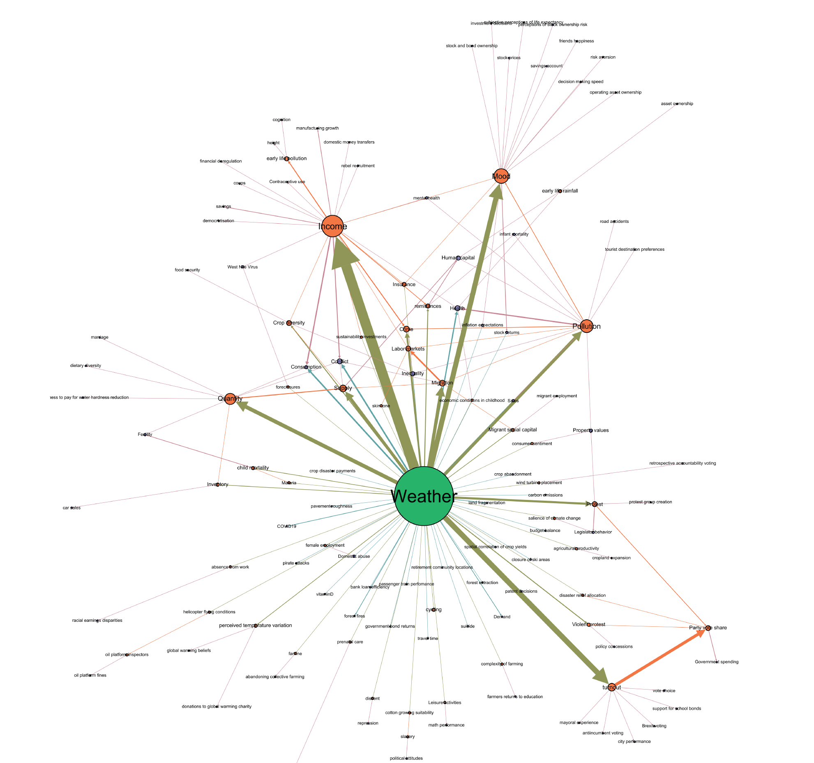

```{r setup, include=FALSE}
knitr::opts_chunk$set(warning = FALSE, message = FALSE, 
                      fig.retina = 3, fig.align = "center")
```

```{r packages-data, include=FALSE}
library(tidyverse)
library(broom)
library(ggdag)
library(kableExtra)
library(scales)
library(patchwork)
library(estimatr)
library(modelsummary)

set.seed(123456)

nrows <- 1000
father_education <- tibble(
  ability = rnorm(nrows, 35000, 10000),  # Ability
  fathereduc = rnorm(nrows, 15000, 20000),  # Father's education (IV)
  e_y = 0.43 * rnorm(nrows, 50000, 10000)  # Error for outcome
) %>% 
  mutate(educ = 3.7 + 0.52*fathereduc + 0.40*ability,  # Education (policy variable)
         wage = 5 + 0.23*educ + 0.5*ability - e_y) %>%  # Wage (outcome variable)
  mutate(wage = rescale(wage, to = c(7.75, 300)),  # Rescale from minimum wage to director wage (hourly)
         educ = rescale(educ, to = c(10, 23)),  # Rescale as years of school. Min 10 to max 23 (PhD)
         fathereduc = rescale(fathereduc, to = c(10, 23)),  # Rescale father's education
         ability = rescale(ability, to = c(0, 600))) %>%  # Rescale as Hypothetical test scores
  select(wage, educ, ability, fathereduc) %>% 
  mutate(across(everything(), ~round(., 2)))
```

```{r xaringanExtra, echo=FALSE}
xaringanExtra::use_xaringan_extra(c("tile_view"))
```

class: center middle main-title section-title-7

# Instrumental<br>variables I

.class-info[

**Session 11**

.light[PMAP 8521: Program evaluation<br>
Andrew Young School of Policy Studies
]

]

---

name: outline
class: title title-inv-8

# Plan for today

--

.box-5.medium.sp-after-half[Endogeneity and exogeneity]

--

.box-6.medium.sp-after-half[Instruments]

--

.box-3.medium.sp-after-half[Using instruments]

---

name: endo-exo
class: center middle section-title section-title-5 animated fadeIn

# Endogeneity<br>and exoegneity

---

layout: true
class: title title-5

---

# Does education cause higher earnings?

```{r iv-dag-simple, echo=FALSE, fig.width=7, fig.height=3, out.width="70%"}
status_colors <- c(exposure = "#0074D9", outcome = "#FF851B", latent = "grey50")
status_colors_backdoor <- c(exposure = "#0074D9", outcome = "#FF851B", latent = "#FF4136")

node_details <- tribble(
  ~plot1, ~plot2, ~plot3, ~name, ~label, ~x, ~y, ~generic, ~mathy,
  TRUE, TRUE, TRUE, "treatment", "Education", 1, 1, "Program/policy", "X",
  TRUE, TRUE, TRUE, "outcome", "Earnings", 3, 1, "Outcome", "Y",
  FALSE, TRUE, TRUE, "unmeasured", "Ability", 2, 2, "Unmeasured confounders", "U",
  FALSE, FALSE, TRUE, "instrument", "Father's education", 0, 1, "Instrument", "Z"
)

node_labels <- node_details$label %>% 
  set_names(node_details$name)

node_labels_generic <- node_details$generic %>% 
  set_names(node_details$name)

iv_dag1 <- dagify(outcome ~ treatment,
                  exposure = "treatment",
                  outcome = "outcome",
                  coords = filter(node_details, plot1),
                  labels =  node_labels) %>% 
  tidy_dagitty() %>% 
  node_status()

ggplot(iv_dag1, aes(x = x, y = y, xend = xend, yend = yend)) +
  geom_dag_edges(start_cap = ggraph::circle(3, "lines"),
                 end_cap = ggraph::circle(3, "lines"),
                 edge_width = 1.5, 
                 arrow_directed = grid::arrow(length = grid::unit(0.75, "lines"), type = "closed")) +
  geom_dag_point(aes(color = status), size = 20) +
  geom_dag_label_repel(aes(label = label, fill = status), seed = 1234,
                       color = "white", fontface = "bold", size = 7,
                       family = "Fira Sans Condensed",
                       label.padding = grid::unit(0.75, "lines"),
                       # box.padding = grid::unit(2.5, "lines"),
                       direction = "y") +
  scale_color_manual(values = status_colors, na.value = "grey20") +
  scale_fill_manual(values = status_colors, na.value = "grey20") +
  guides(color = FALSE, fill = FALSE) + 
  theme_dag(base_size = 20)
```

--

.medium[
$$\color{#FF851B}{\text{Earnings}_i} = \beta_0 + \beta_1 \color{#0074D9}{\text{Education}_i} + \varepsilon_i$$
]

---

layout: false

.box-inv-5.medium[If we ran this regression, would β<sub>1</sub><br>give us the causal effect of education?]

.medium[
$$\text{Earnings}_i = \beta_0 + \beta_1 \text{Education}_i + \varepsilon_i$$
]

--

.box-5.medium[No!]

--

.float-left.center[.box-inv-5[Omitted variable bias!]&ensp;.box-inv-5[Unclosed backdoors!]]

--

.box-inv-5[**Endogeneity!**]

---

layout: true
class: title title-5

---

# Exogeneity and endogeneity

.box-inv-5.medium[**Exogenous** variables]

--

.box-5[Value is not determined by<br>anything else in the model]

--

.box-5[In a DAG, a node that doesn't<br>have arrows coming into it]


---

# Exogeneity

.box-inv-5.medium[Education is exogenous: no arrows *into* it]

```{r show-iv-dag, echo=FALSE, out.width="100%"}
knitr::include_graphics(knitr::fig_chunk("iv-dag-simple", "png"))
```

---

# Exogeneity and endogeneity

.box-inv-5.medium[**Endogenous** variables]

--

.box-5[Value is determined by<br>something else in the model]

--

.box-5[In a DAG, a node that<br>has arrows coming into it]

---

# Endogeneity

.box-inv-5.medium[Education is endogenous: Ability → Education]

```{r iv-dag-endogenous, echo=FALSE, fig.width=7, fig.height=4, out.width="60%"}
iv_dag2 <- dagify(outcome ~ treatment + unmeasured,
                  treatment ~ unmeasured,
                  exposure = "treatment",
                  outcome = "outcome",
                  latent = "unmeasured",
                  coords = filter(node_details, plot2),
                  labels =  node_labels) %>% 
  tidy_dagitty() %>% 
  node_status() %>% 
  node_exogenous() %>% 
  node_dconnected() %>% 
  control_for("unmeasured")

ggplot(iv_dag2, aes(x = x, y = y, xend = xend, yend = yend)) +
  geom_dag_edges(start_cap = ggraph::circle(3, "lines"),
                 end_cap = ggraph::circle(3, "lines"),
                 edge_width = 1.5, 
                 arrow_directed = grid::arrow(length = grid::unit(0.75, "lines"), type = "closed")) +
  geom_dag_point(aes(color = status), size = 20) +
  geom_dag_label_repel(aes(label = label, fill = status), seed = 1234,
                       color = "white", fontface = "bold", size = 7,
                       family = "Fira Sans Condensed",
                       label.padding = grid::unit(0.75, "lines"),
                       box.padding = grid::unit(5, "lines"),
                       direction = "both") +
  scale_color_manual(values = status_colors, na.value = "grey20") +
  scale_fill_manual(values = status_colors, na.value = "grey20") +
  guides(color = FALSE, fill = FALSE) + 
  theme_dag(base_size = 20)
```

---

# Exgoeneity

.box-inv-5.medium[What would exogenous variation<br>in education look like?]

--

.box-5[Choices to get more education that are essentially random<br>(or at least uncorrelated with omitted variables)]

---

layout: false

.box-5.medium[We'd like education to be exogenous<br>.smaller[(an outside decision or intervention)], but it's not!]

```{r show-iv-dag-endo, echo=FALSE, out.width="45%"}
knitr::include_graphics(knitr::fig_chunk("iv-dag-endogenous", "png"))
```

--

.box-inv-5[Part of it is exogenous, but part of it is<br>caused by ability, which is in the DAG]

---

class: title title-5

# Fixing endogeneity with DAGs

```{r show-iv-dag-endo-again, echo=FALSE, out.width="45%"}
knitr::include_graphics(knitr::fig_chunk("iv-dag-endogenous", "png"))
```

--

.box-5[Close backdoor and adjust for ability]

--

.box-inv-5.smaller[Adjustment filters out the endogenous part of education and leaves us with just the endogenous part]

$$\text{Earnings}_i = \beta_0 + \beta_1 \text{Education}_i + \beta_2 \text{Ability}_i + \varepsilon_i$$

---

```{r calculate-effects, echo=FALSE}
# IPW with continuous treatment
# https://meghapsimatrix.com/post/continuous-r-rmarkdown/
# model_num <- lm(educ ~ 1, data = father_education)
# num <- dnorm(father_education$educ, 
#              predict(model_num),
#              sd(model_num$residuals))
# 
# model_den <- lm(educ ~ ability, data = father_education)
# den <- dnorm(father_education$educ, 
#              predict(model_den),
#              sd(model_den$residuals))

# Also works with ipw::ipwpoint
# weights_automatic <- ipw::ipwpoint(
#   exposure = educ,
#   family = "gaussian",
#   numerator = ~ 1,
#   denominator = ~ 1 + ability,
#   trunc = 0.05,
#   data = as.data.frame(father_education)
# )

# father_educ_ipw <- father_education %>% 
#   mutate(ipw = num / den)
# model3 <- lm(wage ~ educ, data = father_educ_ipw, weights = ipw)

model1 <- lm(wage ~ educ, data = father_education)
model2 <- lm(wage ~ educ + ability, data = father_education)
```

.pull-left-wide[
.small[
```{r show-table, echo=FALSE}
model_results <- modelsummary(list("Unadjusted" = model1, "Adjusted" = model2),
                              gof_omit = 'IC|Log|Adj', stars = TRUE)
model_results %>% 
  add_header_above(c(" " = 1, "Outome = wage" = 2)) %>% 
  row_spec(c(6, 9), extra_css = "border-bottom: 1px solid") %>% 
  row_spec(3, background = "#FFC6C6")
```
]
]

.pull-right-narrow[
.box-2[Unadjusted<br>is wrong!]

.box-5[Adjusted<br>is right!]

.box-inv-5.small[One year of education causes hourly wage to increase by $7.77]

.box-inv-5.smaller[(FAKE DATA)]
]
---

layout: true
class: title title-5

---

# But we can't measure ability!

```{r iv-dag-endogenous-confounding, echo=FALSE, fig.width=7, fig.height=4, out.width="40%"}
ggplot(iv_dag2, aes(x = x, y = y, xend = xend, yend = yend)) +
  geom_dag_edges(aes(edge_colour = adjusted),
                 start_cap = ggraph::circle(3, "lines"),
                 end_cap = ggraph::circle(3, "lines"),
                 edge_width = 1.5, 
                 arrow_directed = grid::arrow(length = grid::unit(0.75, "lines"), type = "closed")) +
  ggraph::scale_edge_colour_manual(values = c(unadjusted = "black", adjusted = "#FF4136")) +
  geom_dag_point(aes(color = status), size = 20) +
  geom_dag_label_repel(aes(label = label, fill = status), seed = 1234,
                       color = "white", fontface = "bold", size = 7,
                       family = "Fira Sans Condensed",
                       label.padding = grid::unit(0.75, "lines"),
                       box.padding = grid::unit(5, "lines"),
                       direction = "both") +
  scale_color_manual(values = status_colors_backdoor, na.value = "grey20") +
  scale_fill_manual(values = status_colors_backdoor, na.value = "grey20") +
  guides(color = FALSE, fill = FALSE, edge_colour = FALSE) + 
  theme_dag(base_size = 20)
```

$$\color{#FF851B}{\text{Earnings}_i} = \beta_0 + \beta_1 \color{#0074D9}{\text{Education}_i} + \beta_2 \color{#FF4136}{\text{Ability}_i} + \varepsilon_i$$

--

.box-inv-5.small[Unmeasurable ability node is in the error term (ε)]

$$\color{#FF851B}{\text{Earnings}_i} = \beta_0 + \beta_1 \color{#0074D9}{\text{Education}_i} + \color{#FF4136}{\varepsilon_i}$$

---

# Split exogeneity and endogeneity

.box-inv-5[What if we could somehow separate education<br>into its endogenous and exogenous parts?]

--

.SMALL[
$$
\begin{aligned}
\color{#FF851B}{\text{Earnings}_i} =& \beta_0 + \beta_1 \color{#B10DC9}{\text{Education}_i} + \varepsilon_i \\
& \beta_0 + \beta_1 (\color{#0074D9}{\text{Education}_i^\text{exog.}} + \color{#FF4136}{\text{Education}_i^\text{endog.}}) + \varepsilon_i \\
& \beta_0 + \beta_1 \color{#0074D9}{\text{Education}_i^\text{exog.}} + \underbrace{\beta_1 \color{#FF4136}{\text{Education}_i^{\text{endog.}}} + \varepsilon_i}_{\color{#AAAAAA}{\omega_i}} \\
& \beta_0 + \beta_1 \color{#0074D9}{\text{Education}_i^\text{exog.}} + \color{#AAAAAA}{\omega_i}
\end{aligned}
$$
]

---

# Find exogeneity with One Weird Trick™

.medium[
$$
\color{#FF851B}{\text{Earnings}_i} = \beta_0 + \beta_1 \color{#0074D9}{\text{Education}_i^\text{exog.}} + \color{#AAAAAA}{\omega_i}
$$
]

.box-inv-5.medium.sp-after[How do we find only Education<sup>exog.</sup>?]

--

.box-5.large[Use an instrument!]

---

layout: false
name: instruments
class: center middle section-title section-title-6 animated fadeIn

# Instruments

---

layout: true
class: title title-6

---

# What is an instrument?

--

.box-inv-6[Something that is correlated with the policy variable]

.box-6.small.sp-after[(Relevance)]

--

.box-inv-6[Something that does not directly cause the outcome]

.box-6.small.sp-after[(Exclusion)]

--

.box-inv-6[Something that is not correlated with the omitted variables]

.box-6.small[(Exogenity)]

---

layout: false

```{r iv-dag-general, echo=FALSE, fig.width=12, fig.height=6, out.width="100%"}
iv_dag4 <- dagify(outcome ~ treatment + unmeasured,
                  treatment ~ unmeasured + instrument,
                  exposure = "treatment",
                  outcome = "outcome",
                  latent = "unmeasured",
                  coords = filter(node_details, plot3),
                  labels =  node_labels_generic) %>% 
  tidy_dagitty() %>% 
  node_status() %>% 
  node_exogenous() %>% 
  node_dconnected() %>% 
  control_for("unmeasured")

ggplot(iv_dag4, aes(x = x, y = y, xend = xend, yend = yend)) +
  geom_dag_edges(aes(edge_colour = adjusted),
                 start_cap = ggraph::circle(3, "lines"),
                 end_cap = ggraph::circle(3, "lines"),
                 edge_width = 1.5, 
                 arrow_directed = grid::arrow(length = grid::unit(0.75, "lines"), type = "closed")) +
  geom_dag_point(aes(color = status), size = 30) +
  geom_dag_label_repel(aes(label = label, fill = status), seed = 1,
                       color = "white", fontface = "bold", size = 14,
                       family = "Fira Sans Condensed",
                       label.padding = grid::unit(0.75, "lines"),
                       box.padding = grid::unit(6, "lines"),
                       direction = "y") +
  scale_color_manual(values = status_colors_backdoor, na.value = "grey20") +
  ggraph::scale_edge_colour_manual(values = c(unadjusted = "black", adjusted = "#FF4136")) +
  scale_fill_manual(values = status_colors_backdoor, na.value = "grey20") +
  guides(color = FALSE, fill = FALSE, edge_colour = FALSE) +
  theme_dag(base_size = 28)
```

---

```{r iv-dag-example, echo=FALSE, fig.width=12, fig.height=6, out.width="100%"}
iv_dag3 <- dagify(outcome ~ treatment + unmeasured,
                  treatment ~ unmeasured + instrument,
                  exposure = "treatment",
                  outcome = "outcome",
                  latent = "unmeasured",
                  coords = filter(node_details, plot3),
                  labels =  node_labels) %>% 
  tidy_dagitty() %>% 
  node_status() %>% 
  node_exogenous() %>% 
  node_dconnected() %>% 
  control_for("unmeasured")

ggplot(iv_dag3, aes(x = x, y = y, xend = xend, yend = yend)) +
  geom_dag_edges(aes(edge_colour = adjusted),
                 start_cap = ggraph::circle(3, "lines"),
                 end_cap = ggraph::circle(3, "lines"),
                 edge_width = 1.5, 
                 arrow_directed = grid::arrow(length = grid::unit(0.75, "lines"), type = "closed")) +
  geom_dag_point(aes(color = status), size = 30) +
  geom_dag_label_repel(aes(label = label, fill = status), seed = 1234,
                       color = "white", fontface = "bold", size = 14,
                       family = "Fira Sans Condensed",
                       label.padding = grid::unit(0.75, "lines"),
                       box.padding = grid::unit(6, "lines"),
                       direction = "y") +
  scale_color_manual(values = status_colors_backdoor, na.value = "grey20") +
  ggraph::scale_edge_colour_manual(values = c(unadjusted = "black", adjusted = "#FF4136")) +
  scale_fill_manual(values = status_colors_backdoor, na.value = "grey20") +
  guides(color = FALSE, fill = FALSE, edge_colour = FALSE) +
  theme_dag(base_size = 28)
```

---

```{r iv-dag-letters, echo=FALSE, fig.width=12, fig.height=6, out.width="100%"}
mathy_coords <- node_details %>% 
  filter(plot3) %>% 
  select(name = mathy, x, y)

iv_dag_mathy <- dagify(Y ~ X + U,
                       X ~ U + Z,
                       exposure = "X",
                       outcome = "Y",
                       latent = "U",
                       coords = mathy_coords) %>% 
  tidy_dagitty() %>% 
  node_status() %>% 
  node_exogenous() %>% 
  node_dconnected()

ggplot(iv_dag_mathy, aes(x = x, y = y, xend = xend, yend = yend)) +
  geom_dag_edges(aes(edge_colour = adjusted),
                 start_cap = ggraph::circle(3, "lines"),
                 end_cap = ggraph::circle(3, "lines"),
                 edge_width = 1.5, 
                 arrow_directed = grid::arrow(length = grid::unit(0.75, "lines"), type = "closed")) +
  geom_dag_point(aes(color = status), size = 30) +
  geom_dag_text(aes(label = name),
                color = "white", fontface = "bold", size = 14,
                family = "Fira Sans Condensed") +
  scale_color_manual(values = status_colors_backdoor, na.value = "grey20") +
  ggraph::scale_edge_colour_manual(values = c(unadjusted = "black", adjusted = "#FF4136")) +
  scale_fill_manual(values = status_colors_backdoor, na.value = "grey20") +
  guides(color = FALSE, fill = FALSE, edge_colour = FALSE) +
  theme_dag(base_size = 28)
```

---

.pull-left[
.box-6.SMALL[**Relevance**<br>Correlated with policy]

.box-inv-6.smaller[Z → X &emsp; Cor(Z, X) ≠ 0]

.box-6.SMALL[**Excludability**<br>Correlated with outcome<br>*only through* policy]

.box-inv-6.smaller[Z → X → Y &emsp; Z &nrarr; Y &emsp; Cor(Z, Y | X) = 0]

.box-6.SMALL[**Exogeneity**<br>*Not* correlated<br>with omitted variables]

.box-inv-6.smaller[U &nrarr; Z &emsp; Cor(Z, U) = 0]

]

.pull-right[
&nbsp;

`)

.box-inv-6.smaller[**Relevance** testable with stats]

.box-inv-6.smaller[**Excludability** testable with stats + story]

.box-inv-6.smaller[**Exogeneity** requires story, no stats]
]

???

https://dlm-econometrics.blogspot.com/2020/08/horseshoes-and-hand-grenades.html

---

layout: true
class: title title-6

---

# Relevance

.box-6[Instrument causes change in policy]

.box-inv-6.smaller.sp-after[Z → X &emsp; Cor(Z, X) ≠ 0]

<hr>

--

.center.float-left.sp-after[.box-inv-6.sp-before[Social security number] .box-2.smaller[Probably not relevant (uncorrelated with education)]]

--

.center.float-left.sp-after[.box-inv-6.sp-before[3rd grade test scores] .box-5.smaller[Potentially relevant (early grades cause more education)]]

--

.center.float-left[.box-inv-6.sp-before[Father's education] .box-5.smaller[Relevant (Educated parents cause more education)]]

---

# Excludability

.box-6[Instrument causes outcome *only through* policy]

.box-inv-6.smaller.sp-after[Z → X → Y &emsp; Z &nrarr; Y &emsp; Cor(Z, Y | X) = 0]

<hr>

--

.center.float-left.sp-after[.box-inv-6.sp-before[Social security number] .box-5.smaller[Exclusive (SSN isn't correlated with hourly wages)]]

--

.center.float-left.sp-after[.box-inv-6.sp-before[3rd grade test scores] .box-5.smaller[Potentially exclusive (early grades probably don't cause wages)]]

--

.center.float-left[.box-inv-6.sp-before[Father's education] .box-5.smaller[Exclusive (Parent's education doesn't cause your wages (lol))]]

---

# Exogeneity

.box-6[Instrument not correlated with omitted variables]

.box-inv-6.smaller.sp-after[U &nrarr; Z &emsp; Cor(Z, U) = 0]

<hr>

--

.center.float-left.sp-after[.box-inv-6.sp-before[Social security number] .box-5.smaller[Exogenous (Unrelated to anything related to education)]]

--

.center.float-left.sp-after[.box-inv-6.sp-before[3rd grade test scores] .box-2.smaller[Not exogenous (Grades correlated with other education factors)]]

--

.center.float-left[.box-inv-6.sp-before[Father's education] .box-5.smaller[Exogenous (Birth to parents is random)]]

---

# The huh? factor

.box-inv-6.medium["A necessary but not a sufficient condition<br>for having an instrument that can satisfy<br>the exclusion restriction is <span style="color: #A52C60;">if people are<br>confused when you tell them about the<br>instrument's relationship to the outcome.</span>"]

.box-6.small[Scott Cunningham, *Causal Inference: The Mixtape*, p. 123]

---

layout: false

.small[
```{r instrument-examples, echo=FALSE}
instruments <- tribble(
  ~`Outcome`, ~`Policy`, ~`Unobserved stuff`, ~`Instrument`,
  "Income", "Education", "Ability", "Father's education",
  "Income", "Education", "Ability", "Distance to college",
  "Income", "Education", "Ability", "Military draft",
  "Health", "Smoking cigarettes", "Other negative health behaviors", "Tobacco taxes",
  "Crime rate", "Patrol hours", "# of criminals", "Election cycles",
  "Crime", "Incarceration rate", "Simultaneous causality", "Overcrowding litigations",
  "Labor market success", "Americanization", "Ability", "Scrabble score of name",
  "Conflicts", "Economic growth", "Simultaneous causality", "Rainfall"
)

instruments %>% 
  kbl(align = "l") %>% 
  row_spec(c(2:8), extra_css = "color: #ffffff; background-color: #ffffff;")
```
]

---

.small[
```{r echo=FALSE}
instruments %>% 
  kbl(align = "l") %>% 
  row_spec(3:8, extra_css = "color: #ffffff; background-color: #ffffff;")
```
]

---

.small[
```{r echo=FALSE}
instruments %>% 
  kbl(align = "l") %>% 
  row_spec(4:8, extra_css = "color: #ffffff; background-color: #ffffff;")
```
]

---

.small[
```{r echo=FALSE}
instruments %>% 
  kbl(align = "l") %>% 
  row_spec(5:8, extra_css = "color: #ffffff; background-color: #ffffff;")
```
]

---

.small[
```{r echo=FALSE}
instruments %>% 
  kbl(align = "l") %>% 
  row_spec(6:8, extra_css = "color: #ffffff; background-color: #ffffff;")
```
]

---

.small[
```{r echo=FALSE}
instruments %>% 
  kbl(align = "l") %>% 
  row_spec(7:8, extra_css = "color: #ffffff; background-color: #ffffff;")
```
]

---

.small[
```{r echo=FALSE}
instruments %>% 
  kbl(align = "l") %>% 
  row_spec(8, extra_css = "color: #ffffff; background-color: #ffffff;")
```
]

---

.small[
```{r echo=FALSE}
instruments %>% 
  kbl(align = "l")
```
]

---

layout: true
class: title title-6

---

# Instruments are hard to find!

.box-inv-6.medium[The trickiest thing to prove is<br>the exclusion restriction]

.box-6.sp-after[Instrument causes the outcome *only through* the policy]

--

.box-inv-6.medium[Most proposed instruments fail this!]

---

# Rainfall as an instrument

.box-inv-6[People love using weather as an instrument… buuuuut…]

--

.center[
<figure>
  
</figure>
]

???

<https://papers.ssrn.com/sol3/papers.cfm?abstract_id=3715610>

---

layout: false

.center[
<figure>
  
</figure>
]

---

layout: true
class: title title-6

---

# COVID-19 as an instrument

.box-inv-6.medium[A global pandemic is a huge<br>exogenous shock to<br>social systems everywhere]

.box-6[Maybe we can use it as an instrument!]

---

# COVID-19 as an instrument

.box-inv-6[What effect does closing schools have on<br>student performance or lifetime earnings?]

```{r covid-dag-1, echo=FALSE, fig.width=8, fig.height=4, out.width="70%"}
covid_nodes <- tribble(
  ~name, ~label, ~x, ~y,
  "treatment", "School attendance", 1, 1, 
  "outcome", "Grades (or earnings)", 3, 1, 
  "unmeasured", "Unmeasured confounders", 2, 3,
  "instrument", "COVID-19", 0, 2 
)

node_labels_covid <- covid_nodes$label %>% 
  set_names(covid_nodes$name)

covid_dag1 <- dagify(outcome ~ treatment + unmeasured,
                     treatment ~ unmeasured + instrument,
                     exposure = "treatment",
                     outcome = "outcome",
                     latent = "unmeasured",
                     coords = covid_nodes,
                     labels =  node_labels_covid) %>%
  tidy_dagitty() %>% 
  node_status() %>% 
  node_exogenous() %>% 
  node_dconnected() %>% 
  control_for("unmeasured")

ggplot(covid_dag1, aes(x = x, y = y, xend = xend, yend = yend)) +
  geom_dag_edges(aes(edge_colour = adjusted),
                 start_cap = ggraph::circle(3, "lines"),
                 end_cap = ggraph::circle(3, "lines"),
                 edge_width = 1.5, 
                 arrow_directed = grid::arrow(length = grid::unit(0.75, "lines"), type = "closed")) +
  geom_dag_point(aes(color = status), size = 20) +
  geom_dag_label_repel(aes(label = label, fill = status), seed = 1,
                       color = "white", fontface = "bold", size = 7,
                       family = "Fira Sans Condensed",
                       label.padding = grid::unit(0.5, "lines"),
                       box.padding = grid::unit(4, "lines"),
                       direction = "both") +
  scale_color_manual(values = status_colors_backdoor, na.value = "grey20") +
  ggraph::scale_edge_colour_manual(values = c(unadjusted = "black", adjusted = "#FF4136")) +
  scale_fill_manual(values = status_colors_backdoor, na.value = "grey20") +
  guides(color = FALSE, fill = FALSE, edge_colour = FALSE) +
  theme_dag(base_size = 20)
```

---

# lolnope

```{r covid-dag-2, echo=FALSE, fig.width=14, fig.height=6, out.width="100%"}
covid_nodes_2 <- tribble(
  ~name, ~label, ~x, ~y,
  "treatment", "School attendance", 1, 1, 
  "outcome", "Grades (or earnings)", 3, 1, 
  "unmeasured", "Unmeasured confounders", 2, 4,
  "instrument", "COVID-19", -2, 1,
  "deaths", "Deaths", 0, 6,
  "health", "Health", 0, 5,
  "jobs", "Job losses", 0, 4,
  "isolation", "Social isolation", 0, 3,
  "anxiety", "Anxiety", 0, 2
)

node_labels_covid_2 <- covid_nodes_2$label %>% 
  set_names(covid_nodes_2$name)

covid_dag2 <- dagify(outcome ~ treatment + unmeasured + deaths + health + jobs + isolation + anxiety,
                     treatment ~ unmeasured + instrument + deaths + health + jobs + isolation + anxiety,
                     deaths ~ instrument,
                     health ~ instrument,
                     jobs ~ instrument,
                     isolation ~ instrument,
                     anxiety ~ instrument,
                     exposure = "treatment",
                     outcome = "outcome",
                     latent = "unmeasured",
                     coords = covid_nodes_2,
                     labels =  node_labels_covid_2) %>%
  tidy_dagitty() %>% 
  node_status() %>% 
  node_exogenous() %>% 
  node_dconnected() %>% 
  control_for("unmeasured")

ggplot(covid_dag2, aes(x = x, y = y, xend = xend, yend = yend)) +
  geom_dag_edges(aes(edge_colour = adjusted),
                 start_cap = ggraph::circle(3, "lines"),
                 end_cap = ggraph::circle(3, "lines"),
                 edge_width = 1.5, 
                 arrow_directed = grid::arrow(length = grid::unit(0.75, "lines"), type = "closed")) +
  geom_dag_point(aes(color = status), size = 20) +
  geom_dag_label_repel(aes(label = label, fill = status), seed = 1234,
                       color = "white", fontface = "bold", size = 7,
                       family = "Fira Sans Condensed",
                       label.padding = grid::unit(0.75, "lines"),
                       box.padding = grid::unit(2.5, "lines"),
                       direction = "y", nudge_x = 0.5) +
  scale_color_manual(values = status_colors_backdoor, na.value = "grey20") +
  ggraph::scale_edge_colour_manual(values = c(unadjusted = "black", adjusted = "#FF4136")) +
  scale_fill_manual(values = status_colors_backdoor, na.value = "grey20") +
  guides(color = FALSE, fill = FALSE, edge_colour = FALSE) +
  theme_dag(base_size = 20)
```

???

https://twitter.com/joshuasgoodman/status/1238517897829310464

---

# Falsifying exclusion assumptions

.box-inv-6[Can you think of some other way that the instrument<br>can cause the outcome outside of the policy?]

--

.box-inv-6[If so, the instrument doesn't meet exclusion restriction]

--

.pull-left[
`)
]

.pull-right[
.box-6.small[Instrument → ?? → outcome?]

.box-6.small[Rainfall → ?? → civil war?]

.box-6.small[Tobacco taxes → ?? → health?]

.box-6.small[Scrabble score → ?? →<br>Labor market success?]
]

---

layout: false
name: using-instruments
class: center middle section-title section-title-3 animated fadeIn

# Using instruments

---

$$\text{Earnings}_i = \beta_0 + \beta_1 \text{Education}_i + \varepsilon_i$$

.smaller[
```{r show-table-again, echo=FALSE}
model_results <- modelsummary(list("Unadjusted" = model1, "Forbidden" = model2),
                              gof_omit = 'IC|Log|Adj', stars = TRUE)
model_results %>% 
  row_spec(c(6, 9), extra_css = "border-bottom: 1px solid") %>% 
  row_spec(3, background = "#F5ABEA")
```
]

---

&nbsp;

.SMALL[
$$
\begin{aligned}
\color{#FF851B}{\text{Earnings}_i} =& \beta_0 + \beta_1 \color{#B10DC9}{\text{Education}_i} + \varepsilon_i \\
& \beta_0 + \beta_1 (\color{#0074D9}{\text{Education}_i^\text{exog.}} + \color{#FF4136}{\text{Education}_i^\text{endog.}}) + \varepsilon_i \\
& \beta_0 + \beta_1 \color{#0074D9}{\text{Education}_i^\text{exog.}} + \underbrace{\beta_1 \color{#FF4136}{\text{Education}_i^{\text{endog.}}} + \varepsilon_i}_{\color{#AAAAAA}{\omega_i}} \\
& \beta_0 + \beta_1 \color{#0074D9}{\text{Education}_i^\text{exog.}} + \color{#AAAAAA}{\omega_i}
\end{aligned}
$$
]

---

```{r show-father-educ-dag, echo=FALSE, out.width="85%"}
knitr::include_graphics(knitr::fig_chunk("iv-dag-example", "png"))
```

.center.float-left[.box-3[Relevancy]&ensp;.box-3[Excludability]&ensp;.box-3[Exogeneity]]

---

layout: true
class: title title-3

---

# Relevancy

.box-inv-3[Program ~ instrument]

.pull-left-narrow[
```{r plot-first-stage, echo=FALSE}
ggplot(father_education, aes(y = educ, x = fathereduc)) +
  geom_point(size = 5, alpha = 0.5, color = "white", fill = "black", pch = 21) +
  geom_smooth(method = "lm", formula = y ~ x, size = 2, color = "#0074D9") +
  labs(y = "Years of education", x = "Years of father's education") +
  theme_bw(base_size = 30, base_family = "Fira Sans Condensed")
```

]

.pull-right-wide[
.small-code.smaller[
.box-3.small[Clear, significant effect = relevant!]

```{r check-relevancy}
first_stage <- lm(educ ~ fathereduc, data = father_education)
tidy(first_stage)
```
]

.small-code.smaller[
.box-3.small[First-stage model F-statistic (`statistic` here) > 104 = strong instrument]

```{r}
glance(first_stage)
```
]
]

???

<https://arxiv.org/abs/2010.05058>

---

# Exclusion

.box-inv-3[Does it meet exclusion assumption?]

.box-3.smaller[Father's education causes your wages *only through* your education?]

.box-3.smaller[Any other plausible node between father's education and earnings?]

.pull-left-narrow[
```{r plot-exclusion, echo=FALSE, out.width="80%"}
ggplot(father_education, aes(x = fathereduc, y = wage)) +
  geom_point(size = 5, alpha = 0.5, color = "white", fill = "black", pch = 21) +
  geom_smooth(method = "lm", formula = y ~ x, size = 2, color = "#85144b") +
  labs(y = "Years of father's education", x = "Wage (outcome; not for father)") +
  theme_bw(base_size = 30, base_family = "Fira Sans Condensed")
```
]

.pull-right-wide[
```{r echo=FALSE, out.width="80%"}
knitr::include_graphics(knitr::fig_chunk("iv-dag-example", "png"))
```
]

???

Most obvious is that father’s education causes father’s earnings, which then causes your earnings

---

# Exogeneity

.box-inv-3.medium[Is assignment to your parents random?]

--

.box-3.sp-after[Sure.]

--

.box-inv-3.medium[Is your parents' choice to<br>gain education random?]

--

.box-3[lolz.]

---

# Two-stage least squares (2SLS)

.box-inv-3.medium[Find exogenous part of policy variable based on instrument; use *that* to predict outcome]

--

.pull-left[
.box-3.small[First stage]

.small[
$$
\begin{aligned}
&\widehat{\text{Education}}_i = \\
&\quad \gamma_0 + \gamma_1 \text{Father's education}_i + \upsilon_i
\end{aligned}
$$
]

.box-inv-3.smaller["Education hat": fitted/predicted values; exogenous part of education]
]

--

.pull-right[
.box-3.small[Second stage]

.small[
$$
\begin{aligned}
&\text{Earnings}_i = \\
&\quad \beta_0 + \beta_1 \widehat{\text{Education}}_i + \varepsilon_i
\end{aligned}
$$
]
]

---

# Stage 1: Policy ~ instrument

```{r first-stage}
first_stage <- lm(educ ~ fathereduc, data = father_education)

tidy(first_stage)
```

---

# Stage 1: Check instrument strength

.box-inv-3[Model's F-statistic .smaller[(`statistic` here)] should be > 104<br>(though most books say > 10)]

```{r check-first-stage-fake, eval=FALSE}
glance(first_stage)
```

```{r check-first-stage-real, echo=FALSE}
glance(first_stage) %>% select(1:5)
```

---

# Stage 1: Use first stage to predict policy

.small[
$$
\widehat{\text{Education}}_i = 2.251 + (0.916 \times \text{Father's education}_i) + \upsilon_i
$$
]

.small-code[
```{r make-educ-hat-fake, eval=FALSE}
data_with_predictions <- augment_columns(first_stage, data = father_education) %>% 
  rename(educ_hat = .fitted)
head(data_with_predictions)
```
]

.pull-left.small-code[
```{r show-educ-hat-real, echo=FALSE}
data_with_predictions <- augment_columns(first_stage, data = father_education) %>% 
  rename(educ_hat = .fitted)

head(data_with_predictions) %>% select(1:5)
```
]

.pull-right[
&nbsp;

.box-3.smaller[educ_hat = 2.251 + (0.916 × **17.2**) = **18.0**]

.box-3.smaller[educ_hat = 2.251 + (0.916 × **15.5**) = **16.4**]
]

---

# Stage 2: Outcome ~ predicted policy

```{r second-stage}
second_stage <- lm(wage ~ educ_hat,
                   data = data_with_predictions)

tidy(second_stage)
```

---

layout: false

.pull-left-wide.smaller[
```{r show-table-again-2sls, echo=FALSE}
model_results <- modelsummary(list("Unadjusted" = model1, "Forbidden" = model2, "2SLS IV" = second_stage),
                              gof_omit = 'IC|Log|Adj', stars = TRUE)
model_results %>% 
  row_spec(c(8, 11), extra_css = "border-bottom: 1px solid") %>% 
  row_spec(c(3, 7), background = "#F5ABEA")
```
]

.pull-right-narrow[
.box-2[Unadjusted<br>is wrong!]

.box-5[Forbidden is right,<br>but not actually<br>measurable!]

.box-5[2SLS is close<br>*and* measurable!]

.box-inv-5.small[One year of education causes hourly wage to increase by $7.84]
]

---

layout: true
class: title title-3

---

# Multiple instruments

.box-inv-3[You can use multiple instruments to<br>explain more of the endogeneity in the policy node]

```{r multiple-ivs-dag, echo=FALSE, fig.width=10, fig.height=5, out.width="70%"}
node_details_multiple <- tribble(
  ~name, ~label, ~x, ~y, 
  "treatment", "Education", 3, 1, 
  "outcome", "Earnings", 1, 1, 
  "unmeasured", "Ability", 2, 1.6,
  "instrument1", "Father's education", 4, 1,
  "instrument2", "Mother's education", 4, 1.5
)

node_labels_multiple <- node_details_multiple$label %>% 
  set_names(node_details_multiple$name)

multiple_dag1 <- dagify(outcome ~ treatment + unmeasured,
                        treatment ~ unmeasured + instrument1 + instrument2,
                        exposure = "treatment",
                        outcome = "outcome",
                        latent = "unmeasured",
                        coords = node_details_multiple,
                        labels =  node_labels_multiple) %>% 
  tidy_dagitty() %>% 
  node_status() %>% 
  node_exogenous() %>% 
  node_dconnected() %>% 
  control_for("unmeasured")

ggplot(multiple_dag1, aes(x = x, y = y, xend = xend, yend = yend)) +
  geom_dag_edges(aes(edge_colour = adjusted),
                 start_cap = ggraph::circle(3, "lines"),
                 end_cap = ggraph::circle(3, "lines"),
                 edge_width = 1.5, 
                 arrow_directed = grid::arrow(length = grid::unit(0.75, "lines"), type = "closed")) +
  geom_dag_point(aes(color = status), size = 20) +
  geom_dag_label_repel(aes(label = label, fill = status), seed = 12,
                       color = "white", fontface = "bold", size = 7,
                       family = "Fira Sans Condensed",
                       label.padding = grid::unit(0.75, "lines"),
                       box.padding = grid::unit(2, "lines"),
                       direction = "y") +
  scale_color_manual(values = status_colors_backdoor, na.value = "grey20") +
  ggraph::scale_edge_colour_manual(values = c(unadjusted = "black", adjusted = "#FF4136")) +
  scale_fill_manual(values = status_colors_backdoor, na.value = "grey20") +
  guides(color = FALSE, fill = FALSE, edge_colour = FALSE) +
  theme_dag(base_size = 20)
```

---

# Multiple instruments

&nbsp;

$$
\begin{aligned}
\widehat{\text{Education}}_i =&\ \gamma_0 + \gamma_1 \text{Father's education}_i +\\
&\ \gamma_2 \text{Mother's education}_i + \upsilon_i\\
\\
\text{Earnings}_i =&\ \beta_0 + \beta_1 \widehat{\text{Education}}_i + \varepsilon_i
\end{aligned}
$$

---

# Other control variables

.box-inv-3[You can use control variables too!]

.box-inv-3[For mathy reasons,<br>all exogenous controls need to go in both stages]

.small[
$$
\begin{aligned}
\widehat{\text{Education}}_i =&\ \gamma_0 + \gamma_1 \text{Father's education}_i + \gamma_2 \text{Mother's education}_i +\\
&\ \gamma_3 \text{SES}_i + \gamma_4 \text{State}_i + \gamma_5 \text{Year}_i + \upsilon_i\\
\\
\text{Earnings}_i =&\ \beta_0 + \beta_1 \widehat{\text{Education}}_i +\\
&\ \beta_2 \text{SES}_i + \beta_3 \text{State}_i + \beta_4 \text{Year}_i + \varepsilon_i
\end{aligned}
$$
]

???

Control variables and other backdoors (exogenous ones go in both stages, even if they’re not used as instruments in the first stage – first stage is supposed to take out all the endogenous variation in all variables, so if you don’t include 2nd stage controls, they’ll still have some mathematical endogeneity)

- https://raw.githack.com/edrubin/EC421W19/master/LectureNotes/11InstrumentalVariables/11_instrumental_variables.html#147
- https://twitter.com/grant_mcdermott/status/1194348199743377408
- https://stats.stackexchange.com/questions/177747/why-do-you-put-all-the-exogenous-variables-into-the-first-and-second-stage-of-2s

---

# Faster, more accurate ways to run 2SLS

.box-inv-3[Running the first stage, calculating policy-hat,<br>then running second stage is neat, but time consuming!]

.code-small.smaller[
```{r eval=FALSE}
first_stage <- lm(educ ~ fathereduc, data = father_education)

data_with_predictions <- augment_columns(first_stage, data = father_education) %>% 
  rename(educ_hat = .fitted)

second_stage <- lm(wage ~ educ_hat, data = data_with_predictions)
```
]

--

.box-inv-3[Your standard errors will be wrong unless<br>you adjust them with fancy math by hand]

--

.box-3[Use R packages that do all that work for you instead!]

???

https://raw.githack.com/uo-ec607/lectures/master/08-regression/08-regression.html#Instrumental_variables

---

# Faster, more accurate ways to run 2SLS

.box-inv-3[`ivreg()` from the **ivreg** package]

.box-3[Outcome ~ 2nd stage stuff | 1st stage stuff]

.pull-left.code-small.tiny[
```{r iv-ivreg}
library(ivreg)
model_ivreg <- ivreg(wage ~ educ | fathereduc,
                     data = father_education)
tidy(model_ivreg)
```
]

.pull-right.code-small.tiny[
```{r eval=FALSE}
summary(model_ivreg)
```

```{r echo=FALSE}
x <- capture.output(summary(model_ivreg))
cat(x[9:17], sep = "\n")
```
]

???

https://raw.githack.com/uo-ec607/lectures/master/08-regression/08-regression.html#Option_1:_AER::ivreg()

---

# Faster, more accurate ways to run 2SLS

.box-inv-3[`iv_robust()` from the **estimatr** package]

.box-3[Outcome ~ 2nd stage stuff | 1st stage stuff]

.code-small.smaller[
```{r iv-robust}
library(estimatr)
model_iv_robust <- iv_robust(wage ~ educ | fathereduc,
                             data = father_education)
tidy(model_iv_robust)
```
]

.box-inv-3.small[(See also `lfe()` from the **felm** package for IV with fancy fixed effects)]

???

https://raw.githack.com/uo-ec607/lectures/master/08-regression/08-regression.html#Option_3:_felm::lfe()

---

layout: false

.smaller[
```{r show-table-final-2sls, echo=FALSE}
gm <- modelsummary::gof_map %>% 
  mutate(omit = !(raw %in% c("nobs", "r.squared", "adj.r.squared")))

modelsummary(list("Unadjusted" = model1, "Forbidden" = model2, 
                  "2SLS IV (by hand)" = second_stage,
                  "2SLS IV (ivreg())" = model_ivreg, 
                  "2SLS IV (iv_robust())" = model_iv_robust),
             gof_map = gm, gof_omit = "p\\.value|statistic|se_type", stars = TRUE) %>% 
  row_spec(c(8, 11), extra_css = "border-bottom: 1px solid") %>% 
  row_spec(c(3, 7), background = "#F5ABEA") %>% 
  row_spec(10, background = "#FFE2D0")
```
]

---

class: title title-3

# General IV process

--

.box-inv-3[**1: Is the instrument relevant?**<br>.smaller[Instrument correlated with policy/program; F-statistic in 1st stage > 104]]

--

.box-inv-3[**2: Does the instrument meet exclusion assumption?**<br>.smaller[Instrument causes outcome *only through* policy/program. **Good luck.**]]

--

.box-inv-3[**3: Is the instrument exogenous?**<br>.smaller[No arrows going into instrument node in DAG]]

--

.box-inv-3[**4: 2-stage least squares (2SLS)**<br>.smaller[program ~ instrument; outcome ~ program_hat&emsp;**OR**&emsp;`iv_robust()`]]
