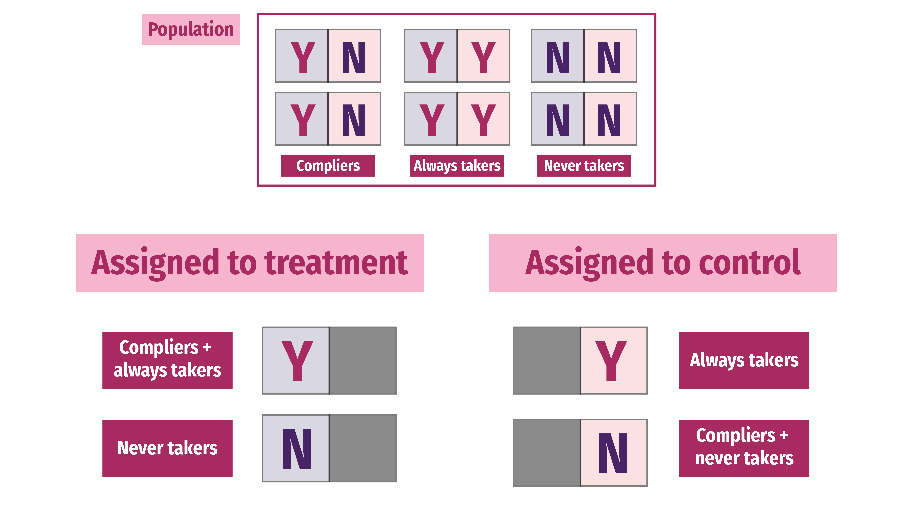
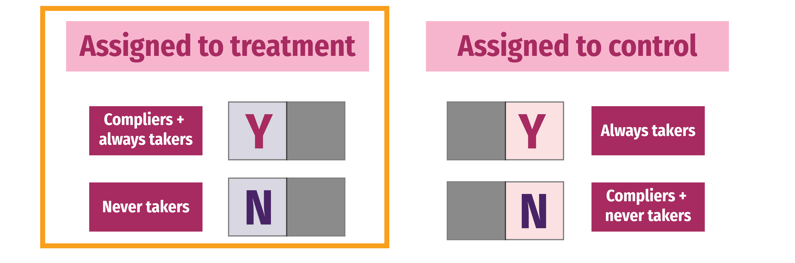
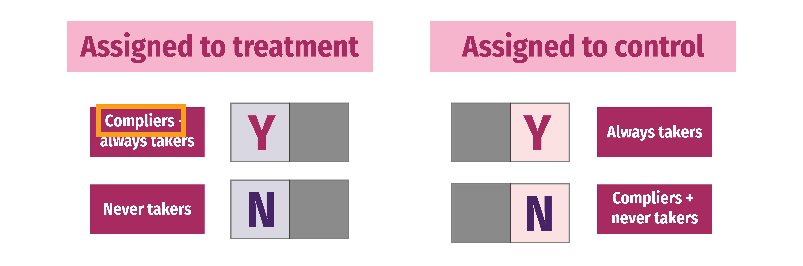

```{r setup, include=FALSE}
knitr::opts_chunk$set(warning = FALSE, message = FALSE, 
                      fig.retina = 3, fig.align = "center")
```

```{r packages-data, include=FALSE}
library(tidyverse)
library(broom)
library(ggdag)
library(kableExtra)
library(scales)
library(patchwork)
library(estimatr)
library(rdrobust)

# Fake program data
set.seed(1234)
num_students <- 1000
tutoring <- tibble(
  id = 1:num_students,
  entrance_exam = rbeta(num_students, shape1 = 7, shape2 = 2),
  exit_exam_base = rbeta(num_students, shape1 = 5, shape2 = 3)
) %>% 
  mutate(entrance_exam = entrance_exam * 100) %>% 
  mutate(tutoring_sharp = entrance_exam <= 70) %>%
  mutate(tutoring_fuzzy = case_when(
    entrance_exam >= 50 & entrance_exam <= 70 ~ sample(c(TRUE, FALSE), n(), replace = TRUE, prob = c(0.8, 0.2)),
    entrance_exam > 70 & entrance_exam <= 90 ~ sample(c(TRUE, FALSE), n(), replace = TRUE, prob = c(0.2, 0.8)),
    entrance_exam < 50 ~ TRUE,
    entrance_exam > 90 ~ FALSE
  )) %>% 
  mutate(tutoring_text = factor(tutoring_sharp, levels = c(FALSE, TRUE),
                                labels = c("No tutor", "Tutor")),
         tutoring_fuzzy_text = factor(tutoring_fuzzy, levels = c(FALSE, TRUE),
                                      labels = c("No tutor", "Tutor"))) %>% 
  mutate(exit_exam = exit_exam_base * 40 + 10 * tutoring_sharp + entrance_exam / 2) %>% 
  mutate(exit_exam_fuzzy = exit_exam_base * 40 + 10 * tutoring_fuzzy + entrance_exam / 2) %>% 
  mutate(entrance_centered = entrance_exam - 70) %>% 
  mutate(below_cutoff = entrance_exam <= 70)

tutoring <- tutoring %>% 
  select(id, entrance_exam, tutoring = tutoring_fuzzy, 
         tutoring_text = tutoring_fuzzy_text, exit_exam = exit_exam_fuzzy)
```

```{r xaringanExtra, echo=FALSE}
xaringanExtra::use_xaringan_extra(c("tile_view"))
```

class: center middle main-title section-title-7

# IV II &<br>RDD II

.class-info[

**Session 12**

.light[PMAP 8521: Program evaluation<br>
Andrew Young School of Policy Studies
]

]

---

name: outline
class: title title-inv-8

# Plan for today

--

.box-4.medium.sp-after-half[Treatment effects and compliance]

--

.box-1.medium.sp-after-half[Randomized promotion]

--

.box-6.medium.sp-after-half[Fuzzy regression discontinuity]

---

layout: false
name: treatment-effects
class: center middle section-title section-title-4 animated fadeIn

# Treatment effects<br>and compliance

---

layout: true
class: title title-4

---

# Potential outcomes

.medium[
$$
\delta = (Y |\ P = 1) - (Y |\ P = 0)
$$
]

--

.box-inv-4[δ (delta) = causal effect]

--

.box-inv-4[P = Program]

--

.box-inv-4[Y = Outcome]

--

.medium[
$$
\delta = Y_1 - Y_0
$$
]

---

layout: false

.box-4.medium[Fundamental problem<br>of causal inference]

--

.less-medium[
$$
\delta_i = Y_i^1 - Y_i^0 \quad \text{in real life is} \quad \delta_i = Y_i^1 - ???
$$
]

--

.box-inv-4.medium[Individual-level effects are<br>impossible to observe!]

---

layout: true
class: title title-4

---

# Average treatment effect

.box-inv-4[Difference between average/expected value when<br>program is on vs. expected value when program is off]

.less-medium[
$$
\text{ATE} = E(Y_1 - Y_0) = E(Y_1) - E(Y_0)
$$
]

--

.box-inv-4[Can be found for a whole population, on average]

.less-medium[
$$
\delta = (\bar{Y}\ |\ P = 1) - (\bar{Y}\ |\ P = 0)
$$
]

---

layout: false

.box-4.medium[Every individual has a<br>treatment/causal effect]

--

.box-inv-4.medium[ATE = average of all<br>unit-level causal effects]

--

.box-inv-4.medium[ATE = Average effect<br>for the whole population]

---

layout: true
class: title title-4

---

# Other versions of causal effects

.box-inv-4.medium[Average treatment on the treated]

.box-4.sp-after[ATT/TOT]

--

.box-inv-4.medium.sp-before[Conditional average treatment effect]

.box-4[CATE]

---

# Local effects

```{r echo=FALSE, out.width="80%"}
knitr::include_graphics("10-slides_files/figure-html/bandwidth-plots-1.png")
```

---

# LATE

.box-inv-4.medium[Local average treatment effect (LATE) =<br>weighted ATE]

.box-4.sp-after[Narrower effect; only applies to some of the population]

--

.box-inv-4.medium[You can't make population-level<br>claims with LATE]

--

.box-4.small[(But that can be okay!)]

---

# LATE

&nbsp;

--

.box-inv-4.medium.sp-after[In RDD, LATE = people in the bandwidth]

--

.box-inv-4.medium[In RCTs and IVs, LATE = **compliers**]

---

# Compliance

.pull-left[
.box-inv-4.less-medium[Complier]

.box-4.small.sp-after[Treatment<br>follows assignment]

.box-inv-4.less-medium[Always taker]

.box-4.small[Gets treatment<br>regardless of assignment]
]

--

.pull-right[
.box-inv-4.less-medium[Never taker]

.box-4.small.sp-after[Rejects treatment<br>regardless of assignment]

.box-inv-4.less-medium[Defier]

.box-4.small[Does the opposite<br>of assignment]
]

---

layout: false

<figure>
  
</figure>

---

layout: true
class: title title-4

---

# Ignoring defiers

--

.box-inv-4.medium[We can generally assume<br>that defiers don't exist]

--

.box-4.small[In drug trials this makes sense; you can't get access<br>to medicine without being in treatment group]

--

.box-4.small[In development it can make sense; in a bed net RCT,<br> a defier assigned to treatment would have to<br>tear down all existing bed nets out of spite]

---

# Ignoring defiers

&nbsp;

--

.box-inv-4.medium[Monotonicity assumption]

--

.box-4.small[Assignment to treatment only<br>has an effect in one direction]

--

.box-4.small[Assignment to treatment can only<br>increase—not decrease—your actual chance of treatment]

---

layout: false

<figure>
  
</figure>

---

layout: true
class: title title-4

---

# More causal effects

.box-inv-4.medium[Intent to treat (ITT)]

.box-4.small.sp-after[Effect of assignment (not actual treatment!)]

--

.center[
<figure>
  
</figure>
]

---

# More causal effects

.box-inv-4.medium[Complier Average Causal Effect (CACE)]

.box-4.small.sp-after[LATE for the compliers]

--

.center[
<figure>
  
</figure>
]

---

```{r itt-cace-stuff, include=FALSE}
set.seed(1234)

N <- 2000
df <- tibble(
  status = sample(c("Always taker", "Never taker", "Complier"), N, 
                  replace = TRUE, prob = c(0.2, 0.4, 0.4)),
  treatment = sample(c("Treatment", "Control"), N, replace = TRUE, prob = c(0.5, 0.5))
) %>% 
  mutate(bed_net_0 = (status == "Always taker") * 1,
         bed_net_1 = (status != "Never taker") * 1) %>% 
  mutate(health_0 = case_when(
    status == "Always taker" ~ rnorm(N, 1, 0.5),
    status == "Never taker"  ~ rnorm(N, 0, 0.6),
    status == "Complier"     ~ rnorm(N, 0.1, 0.4),
  )) %>% 
  mutate(health_1 = case_when(
    status == "Always taker" ~ rnorm(N, 1, 0.5),
    status == "Never taker"  ~ rnorm(N, 0, 0.6),
    status == "Complier"     ~ rnorm(N, 0.9, 0.7),
  )) %>% 
  mutate(bed_net = case_when(
    treatment == "Treatment" ~ bed_net_1,
    treatment == "Control"   ~ bed_net_0
  )) %>% 
  mutate(health = case_when(
    bed_net == 0 ~ health_0,
    bed_net == 1 ~ health_1
  )) %>% 
  mutate(bed_net = factor(bed_net, labels = c("No bed net", "Bed net")))

min_health <- min(df$health_0, df$health_1)
max_health <- max(df$health_0, df$health_1)

df <- df %>% 
  mutate(across(starts_with("health"), 
                ~rescale(., to = c(0, 100), 
                         from = c(min_health, max_health))))

df_real <- df %>% 
  select(treatment, bed_net, health)

bed_nets_time_machine <- df %>% 
  mutate(bed_net = fct_relevel(bed_net, "No bed net"),
         status = fct_relevel(status, "Complier"))
bed_nets <- df_real %>% 
  mutate(bed_net = fct_relevel(bed_net, "No bed net"))

# write_csv(df, here::here("static", "data", "bed_nets_time_machine.csv"))
# write_csv(df_real, here::here("static", "data", "bed_nets_observed.csv"))

viridisLite::viridis(n = 3, option = "plasma", end = 0.85)
```

# Hypothetical bed net program

.box-inv-4[An NGO distributes mosquito bed nets to help<br>improve health by reducing malaria infection rate]

--

.box-inv-4[We can read everyone's minds and we know if<br>people are always takers, never takers, or compliers]

---

# Mind reading

```{r bed-nets-mind-reading, echo=FALSE, fig.width=9, fig.height=4, out.width="100%"}
set.seed(1234)
ggplot(bed_nets_time_machine, aes(y = health, x = treatment)) + 
  geom_point(aes(shape = bed_net, color = status), 
             position = position_jitter(height = NULL, width = 0.25)) + 
  facet_wrap(vars(status)) + 
  labs(color = "Type of person", shape = "Compliance",
       x = NULL, y = "Health status") +
  scale_color_viridis_d(option = "plasma", end = 0.85) +
  theme_bw(base_size = 16, base_family = "Fira Sans Condensed")
```

---

# Actual data

.box-inv-4[But we can't read minds! This is what we actually see:]

```{r bed-nets-actual, echo=FALSE, fig.width=9, fig.height=3.5, out.width="100%"}
set.seed(1234)
ggplot(bed_nets_time_machine, aes(y = health, x = bed_net)) + 
  geom_point(aes(shape = bed_net, color = status), 
             position = position_jitter(height = NULL, width = 0.25)) + 
  facet_wrap(vars(treatment)) + 
  labs(color = "Type of person", shape = "Compliance",
       x = NULL, y = "Health status") +
  scale_color_viridis_d(option = "plasma", end = 0.85) +
  theme_bw(base_size = 16, base_family = "Fira Sans Condensed")
```

---

# Actual data

.box-inv-4[(Actually *this* is what we see)]

```{r bed-nets-actual-no-color, echo=FALSE, fig.width=9, fig.height=3.5, out.width="100%"}
set.seed(1234)
ggplot(bed_nets_time_machine, aes(y = health, x = bed_net)) + 
  geom_point(aes(shape = bed_net, color = status), 
             position = position_jitter(height = NULL, width = 0.25)) + 
  facet_wrap(vars(treatment)) + 
  labs(color = "Type of person", shape = "Compliance",
       x = NULL, y = "Health status") +
  scale_color_manual(values = c("black", "black", "black")) +
  theme_bw(base_size = 16, base_family = "Fira Sans Condensed")
```

---

layout: false

```{r bed-nets-actual-smaller, echo=FALSE, fig.width=9, fig.height=3.5, out.width="70%"}
set.seed(1234)
ggplot(bed_nets_time_machine, aes(y = health, x = bed_net)) + 
  geom_point(aes(shape = bed_net, color = status), 
             position = position_jitter(height = NULL, width = 0.25)) + 
  facet_wrap(vars(treatment)) + 
  labs(color = "Type of person", shape = "Compliance",
       x = NULL, y = "Health status") +
  scale_color_viridis_d(option = "plasma", end = 0.85) +
  theme_bw(base_size = 16, base_family = "Fira Sans Condensed")
```

.center[
<figure>
  
</figure>
]

---

```{r echo=FALSE, out.width="50%"}
knitr::include_graphics(knitr::fig_chunk("bed-nets-mind-reading", "png"))
```

$$
\begin{aligned}
\text{ITT}\ =\ & \color{#0D0887}{\pi_\text{compliers} \times (\text{T} - \text{C})_\text{compliers}} + \\
&\color{#B7318A}{\pi_\text{always takers} \times (\text{T} - \text{C})_\text{always takers}} + \\
&\color{#FEBA2C}{\pi_\text{never takers} \times (\text{T} - \text{C})_\text{never takers}}\\[6pt]
\text{ITT}\ =\ & \color{#0D0887}{\pi_\text{C} \text{CACE}} + \color{#B7318A}{\pi_\text{A} \text{ATACE}} + \color{#FEBA2C}{\pi_\text{N} \text{NTACE}}
\end{aligned}
$$

---

```{r echo=FALSE, out.width="50%"}
knitr::include_graphics(knitr::fig_chunk("bed-nets-mind-reading", "png"))
```

$$\text{ITT}\ =\ \color{#0D0887}{\pi_\text{C} \text{CACE}} + \color{#B7318A}{\pi_\text{A} \text{ATACE}} + \color{#FEBA2C}{\pi_\text{N} \text{NTACE}}$$
--

.box-4[Treatment received is same regardless of assignment!<br>Being assigned to treatment doesn't influence ATs and NTs]

--

$$\text{ITT}\ =\ \color{#0D0887}{\pi_\text{C} \text{CACE}} + \color{#B7318A}{\pi_\text{A} \times 0} + \color{#FEBA2C}{\pi_\text{N} \times 0}$$

---

$$
\begin{aligned}
\text{ITT}\ =\ & \color{#0D0887}{\pi_\text{C} \text{CACE}} + \color{#B7318A}{\pi_\text{A} \text{ATACE}} + \color{#FEBA2C}{\pi_\text{N} \text{NTACE}} \\[6pt]
=\ & \color{#0D0887}{\pi_\text{C} \text{CACE}} + \color{#B7318A}{\pi_\text{A} \times 0} + \color{#FEBA2C}{\pi_\text{N} \times 0}\\[6pt]
\text{ITT}\ =\ &\color{#0D0887}{\pi_\text{C} \text{CACE}}
\end{aligned}
$$

--

.medium[
$$
\color{#0D0887}{\text{CACE}} = \frac{\text{ITT}}{\color{#0D0887}{\pi_\text{C}}}
$$
]

--

.box-4[ITT and π<sub>C</sub> are both findable!]

---

layout: true
class: title title-4

---

# Finding the ITT

.box-inv-4[ITT = effect of assignment to treatment on outcome]

$$\text{ITT} = (\bar{y}\ |\ \text{Treatment}) - (\bar{y}\ |\ \text{Control)}$$

--

.pull-left.small-code[
```{r}
bed_nets %>% 
  group_by(treatment) %>% 
  summarize(avg = mean(health))
```
]

--

.pull-right.small-code[
```{r eval=FALSE}
itt_model <- lm(health ~ treatment, 
                data = bed_nets)
tidy(itt_model)
```

```{r echo=FALSE}
itt_model <- lm(health ~ treatment, 
                data = bed_nets)
tidy(itt_model) %>% select(term, estimate)
```
]

---

# Finding the π<sub>C</sub>

.box-inv-4.smaller[People in treatment group who complied are a combination of Always Takers and Compliers]

```{r echo=FALSE, out.width="50%"}
knitr::include_graphics(knitr::fig_chunk("bed-nets-actual-smaller", "png"))
```

$$
\begin{aligned}
\pi_\text{A} + \pi_\text{C} =& \text{% yes in treatment; or} \\
\pi_\text{C} =& \text{% yes in treatment} - \pi_\text{A}
\end{aligned}
$$

---

# Can we know π<sub>A</sub>?

$$\pi_\text{C} = \text{% yes in treatment} - \pi_\text{A}$$

```{r echo=FALSE, out.width="50%"}
knitr::include_graphics(knitr::fig_chunk("bed-nets-actual-smaller", "png"))
```

--

.box-inv-4.small[We can assume that the proportion of Always Takers<br>is the same across treatment and control]

--

.box-inv-4.small[We know how many people were in control but still used nets—that's π<sub>A</sub>!]

---

# Isolating π<sub>C</sub>

.small[
$$
\begin{aligned}
\pi_\text{C} =& \text{% yes in treatment} - \pi_\text{A} \\
=& \text{% yes in treatment} - \text{% yes in control}
\end{aligned}
$$
]

.pull-left.small-code.small[
```{r}
bed_nets %>% 
  group_by(treatment, bed_net) %>% 
  summarize(n = n()) %>% 
  mutate(prop = n / sum(n))
```
]

--

.pull-right.small-code[
```{r}
# pi_c = prop yes in treatment - 
#        prop yes in control
pi_c <- 0.6104418 - 0.1952191
pi_c
```

.box-inv-4[41.5% compliers!]
]


---

# Finding the CACE, finally!

$$\text{CACE} = \frac{\text{ITT}}{{\pi_\text{C}}}$$

--

.pull-left.small-code.small[
```{r}
ITT <- tidy(itt_model) %>% 
  filter(term == "treatmentTreatment") %>% 
  pull(estimate)
ITT

pi_c
```
]

--

.pull-right.small-code[
```{r}
CACE <- ITT / pi_c
CACE
```

.box-inv-4.small[Bed nets *cause* 14.4 point<br>increase in health for compliers]
]

---

layout: false

.medium[
$$
\text{CACE} = \frac{\color{#FF4136}{\text{ITT}}}{\color{#B10DC9}{\pi_\text{C}}}
$$

$$
\color{#FF4136}{\text{ITT}} = (\bar{y}\ |\ \text{Treatment}) - (\bar{y}\ |\ \text{Control)}
$$

$$
\begin{aligned}
\color{#B10DC9}{\pi_\text{C}}\ =\ & \text{% yes in treatment} - \\
& \text{% yes in control}
\end{aligned}
$$
]

---

class: title title-4

# A faster way with 2SLS

.box-inv-4.medium[LATE for the compliers]

--

.box-4[If you use assignment to treatment as an instrument,<br>you can find the causal effect for just compliers]

--

.box-4[Instrumental variables in general give you the CACE]

---

class: title title-4

# CACE with 2SLS

.code-small[
```{r eval=FALSE}
model_2sls <- iv_robust(health ~ bed_net | treatment, 
                        data = bed_nets)
tidy(model_2sls)
```

```{r echo=FALSE}
model_2sls <- iv_robust(health ~ bed_net | treatment, 
                        data = bed_nets)
tidy(model_2sls) %>% select(1:5)
```
]

.box-inv-4[Same 14.421 effect!]

---

layout: false
name: encouragement
class: center middle section-title section-title-1 animated fadeIn

# Promotion<br>as an instrument

---

layout: true
class: title title-1

---

# Universal programs

.box-inv-1.medium[What if you have a program<br>that anyone can opt in to?]

--

.box-1[ACA, voting, employer retirement matching]

--

.pull-left[
.box-inv-1.small[You can't just look at outcomes<br>of participants vs. non-participants!]

.box-1.small[Selection bias!]
]

--

.pull-right[
.box-inv-1.small[You can't randomly<br>assign people to it either]

.box-1.small[Ethics!]
]

---

# Randomized promotion

.box-inv-1.medium.sp-after[What if you *encourage*<br>some people to participate?]

--

.box-inv-1.medium[What if the encouragement is randomized?]

--

.box-1.medium[Valid treatment/control groups?]

--

.box-1[Not really…]

---

# Randomized promotion

--

.box-1.medium.sp-after[…but also, kind of!]

--

.box-inv-1.medium[Encouragement/promotion =<br> an instrument!]

---

# Not something weird? Does that work!?

--

.pull-left[
.box-inv-1.less-medium[Relevant?]

.box-inv-1.tiny.sp-after[Z → X &emsp; Cor(Z, X) ≠ 0]

.box-1.small[Promotion causes people<br>to use the program. Yep.]
]

--

.pull-right.sp-after-half[
.box-inv-1.less-medium[Exclusive?]

.box-inv-1.tiny.sp-after[Z → X → Y &emsp; Z &nrarr; Y &emsp; Cor(Z, Y | X) = 0]

.box-1.small[Promotion causes outcome<br>*only through* program? Yep.]
]

--

.box-inv-1.less-medium[Exogenous?]

.box-inv-1.tiny.sp-after[U &nrarr; Z &emsp; Cor(Z, U) = 0]

.box-1.small[Unobserved things that influence outcome don't also influence promotion?<br>Yep.]

---

# Program compliance

.pull-left[
.box-inv-1.medium[Always Takers]

.box-1.small[People who will always<br>enroll in program]
]

--

.pull-right.sp-after[
.box-inv-1.medium[Never Takers]

.box-1.small[People who will never<br>enroll in program]
]

--

.box-inv-1.medium[Compliers / Enrollers-if-Promoted]

.box-1.small[People who will enroll in the program if encouraged to]

---

# LATE for compliers

.tiny[
```{r echo=FALSE}
tribble(
  ~id, ~outcome, ~program, ~promotion,
  1, 45, TRUE, TRUE,
  2, 55, TRUE, FALSE,
  3, 52, FALSE, FALSE,
  4, 39, FALSE, TRUE
) %>% 
  kbl(align = "c")
```
]

--

.code-small.center[
```{r eval=FALSE}
iv_robust(outcome ~ program | promotion)
```
]

--

.box-inv-1.medium[This will show the LATE for promoted-ees!]

--

.box-1.small[Says nothing about the effect of the program on Always Takers or Never Takers]

---

layout: false
name: fuzzy-rdd
class: center middle section-title section-title-6 animated fadeIn

# Fuzzy RDD

---

layout: true
class: title title-6

---

# Fuzzy discontinuities

```{r tutoring-fuzzy, echo=FALSE, fig.width=12, fig.height=5.5, out.width="100%"}
ggplot(tutoring, aes(x = entrance_exam, y = tutoring_text, fill = entrance_exam <= 70)) +
  geom_vline(xintercept = 70, size = 2, color = "#FFDC00") + 
  geom_point(size = 5, pch = 21, color = "white", alpha = 0.7,
             position = position_jitter(width = 0, height = 0.2, seed = 1234)) + 
  labs(x = "Entrance exam score", y = NULL, fill = "Entrance exam ≤ 70") + 
  scale_fill_manual(values = c("#85144b", "#0074D9")) +
  guides(fill = guide_legend(reverse = TRUE)) +
  theme_bw(base_size = 22, base_family = "Fira Sans Condensed") +
  theme(legend.position = "bottom") +
  theme(legend.box.spacing = unit(0.5, "lines"),
        legend.margin = margin(t = 1, b = 0, unit = "lines"))
```

---

# Fuzzy discontinuities

.box-inv-6.medium.sp-after[Fuzzy discontinuities imply noncompliance]

--

.box-inv-6.medium[Address noncompliance with<br>instrumental variables]

---

# What do we use as instrument?


.box-inv-6.medium[Instrument = above/below cutoff]

.box-6.small.sp-after[i.e. what they were supposed to do]

&nbsp;

--

.box-6.medium.sp-before[(This is just like the CACE we just did!)]

---

# Not something weird? Does that work!?

--

.pull-left[
.box-inv-6.less-medium[Relevant?]

.box-inv-6.tiny.sp-after[Z → X &emsp; Cor(Z, X) ≠ 0]

.box-6.small[Cutoff causes program? Yep.]
]

--

.pull-right.sp-after-half[
.box-inv-6.less-medium[Exclusive?]

.box-inv-6.tiny.sp-after[Z → X → Y &emsp; Z &nrarr; Y &emsp; Cor(Z, Y | X) = 0]

.box-6.small[Cutoff causes outcome<br>*only through* program? Yep.]
]

--

.box-inv-6.less-medium[Exogenous?]

.box-inv-6.tiny.sp-after[U &nrarr; Z &emsp; Cor(Z, U) = 0]

.box-6.small[Unobserved things that influence outcome don't also influence cutoff?<br>It's an arbitrary cutoff, so sure.]

---

# Doubly local LATE

.box-inv-6.medium[Effect is only for<br>(1) compliers (2) near the cutoff]

.box-6[Be specific when talking about effects;<br>definitely don't make population-level claims]

---

# Parametric fuzzy RD

.box-inv-6[Step 1: Center running variable + make threshold variable]

```{r include=FALSE}
tutoring <- tutoring %>% 
  select(-tutoring_text)
```

.small-code[
```{r}
tutoring_centered <- tutoring %>% 
  mutate(entrance_centered = entrance_exam - 70,
         below_cutoff = entrance_exam <= 70)
head(tutoring_centered, 6)
```
]

---

# Parametric fuzzy RD

.box-inv-6[Step 2: Use cutoff as instrument in 2SLS model]

.small-code[
```{r eval=FALSE}
# Bandwidth ± 10
fuzzy1 <- iv_robust(
  exit_exam ~ entrance_centered + tutoring | entrance_centered + below_cutoff,
  data = filter(tutoring_centered, entrance_centered >= -10 & entrance_centered <= 10)
)

tidy(fuzzy1)
```

```{r echo=FALSE}
# Bandwidth ± 10
fuzzy1 <- iv_robust(
  exit_exam ~ entrance_centered + tutoring | entrance_centered + below_cutoff,
  data = filter(tutoring_centered, entrance_centered >= -10 & entrance_centered <= 10)
)

tidy(fuzzy1) %>% select(1:5)
```
]

---

# Nonparametric fuzzy RD

.box-inv-6[Use the `fuzzy` argument in `rdrobust()`]

.box-6.small[Important! Specify actual treatment status,<br>*not* the instrument of above/below the cutoff]

.small-code[
```{r eval=FALSE}
rdrobust(y = tutoring$exit_exam, x = tutoring$entrance_exam, 
         c = 70, fuzzy = tutoring$tutoring) %>% 
  summary()
```

```{r echo=FALSE, results="hide"}
rd_out <- rdrobust(y = tutoring$exit_exam, x = tutoring$entrance_exam, 
                   c = 70, fuzzy = tutoring$tutoring)

x <- capture.output(summary(rd_out))
```

```{r show-rdrobust, echo=FALSE}
cat(x[17:22], sep = "\n")
```
]
