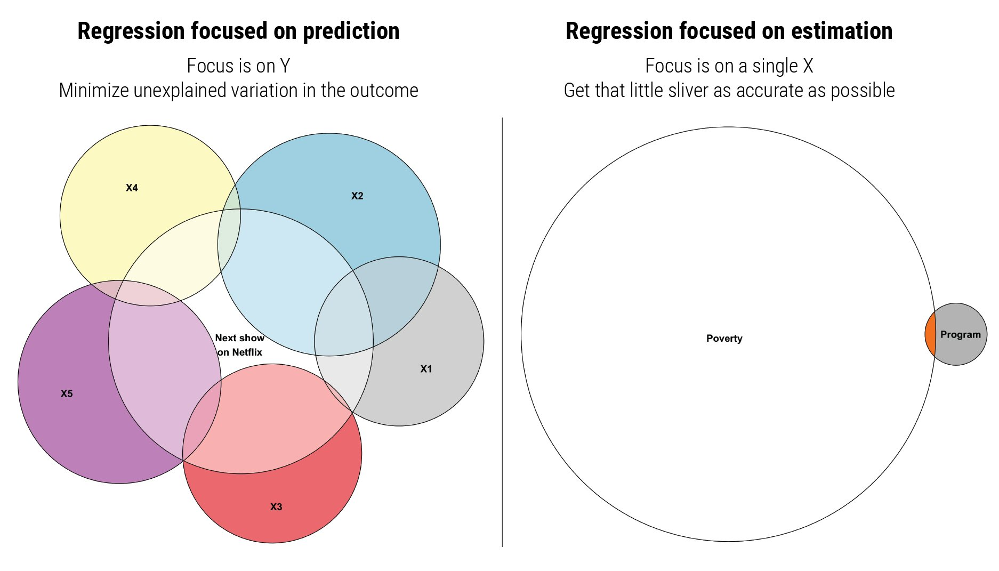
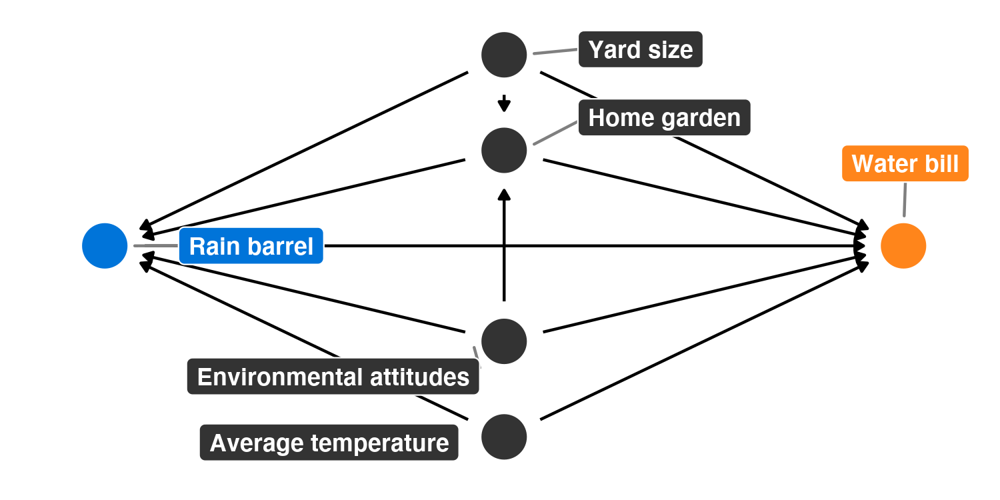
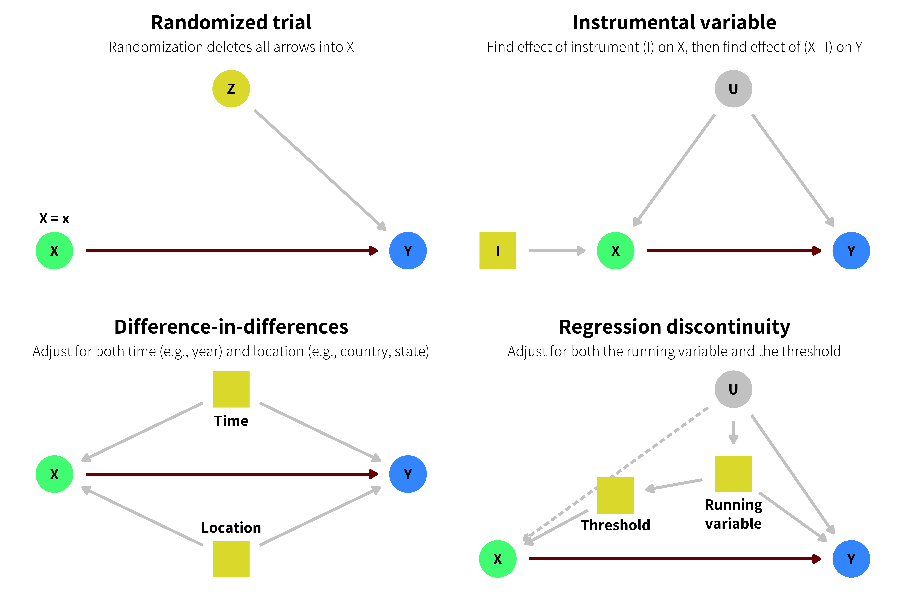
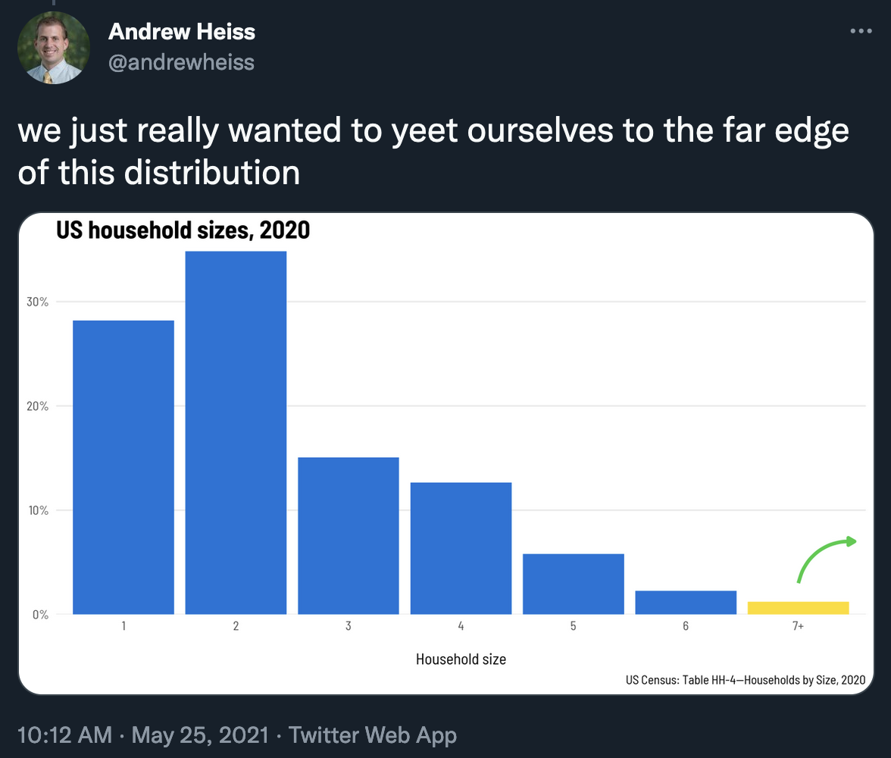

```{r setup, include=FALSE}
knitr::opts_chunk$set(warning = FALSE, message = FALSE, 
                      fig.retina = 3, fig.align = "center")
```

```{r packages-data, include=FALSE}
library(tidyverse)
library(kableExtra)
library(scales)
```

```{r xaringanExtra, echo=FALSE}
xaringanExtra::use_xaringan_extra(c("tile_view"))
```

class: center middle main-title section-title-3

# In-person<br>session 13

.class-info[

**November 14, 2022**

.light[PMAP 8521: Program evaluation<br>
Andrew Young School of Policy Studies
]

]

---

name: outline
class: title title-inv-8

# Plan for today

--

.box-5.medium[Control variables and confounding]

--

.box-3.medium[Ethics + pre-analysis plans]

--

.box-2.medium[Sharing your stuff]

--

.box-6.medium[Simulating data]

---

layout: false
name: controls-confounding
class: center middle section-title section-title-5 animated fadeIn

# Control variables<br>and confounding

---

layout: true
class: middle

---

.box-5.large[Do we really not need to<br>interpret every coefficient?!]

---

.box-5.less-medium[Is there any harm in<br>interpreting the coefficients anyway?]

.box-5.less-medium[Should they be significant at least?<br>Or have the expected ± sign?]

???

Signs can reverse!

---

.box-5.large[Table 2 fallacy]

<br>

.small[

Daniel Westreich and Sander Greenland, "The Table 2 Fallacy: Presenting and Interpreting Confounder and Modifier Coefficients," *American Journal of Epidemiology* 177, no. 4 (February 2013): 292--98, <https://doi.org/10.1093/aje/kws412>.

Luke Keele, Randolph T. Stevenson, and Felix Elwert, "The Causal Interpretation of Estimated Associations in Regression Models," *Political Science Research and Methods* 8, no. 1 (January 2020): 1--13, <https://doi.org/10.1017/psrm.2019.31>.

]

---

.center[
<figure>
  
</figure>
]

???

You can't interpret coefficients when focused on causal inference because the focus is on the X, not the Y. In prediction world, where you want to look at the overall variance of Y, you can interpret each of the Xs while holding the others constant. When you care more about the X itself, though, the other covariates only serve to get that X as accurate as possible, not to explain the overall variation in Y

---

.center[
<figure>
  
</figure>
]

???

<https://www.flickr.com/photos/afagen/8583949203>

---

.center[
<figure>
  
</figure>
]

---

.box-5.less-medium[Why do we teach stats with the idea of throwing<br>in a bunch of control variables if that's<br>really not the best way to evaluate impact?]

.box-5.less-medium[What is the point of using control variables<br>if they aren't going to be interpreted?]

.box-5.less-medium[How do we know which coefficients we<br>need to ultimately worry about and interpret?]

---

.box-5.large[Why did we control for things<br>in the RCT section of problem set 8?]

---

.box-5.large[How can you NOT have unobserved confounders unless you're doing a laboratory study where you can control everything?]

---

.box-5.less-medium[Design-based inference seems easier since<br>there's no unobserved confounding?<br><br>Why don't we just do that all the time?]

.box-5.less-medium[Model-based inference seems easier since<br>there's no need for a special situation?<br><br>Why don't we just do that all the time?]

???

Yeah, but you have to discover weird situations. Like WWII submarine thing!

- https://braddelong.substack.com/p/podcast-hexapodia-is-e-key-insight-331
-  Matthew Suandi, "Promoting to Opportunity: Evidence and Implications from the U.S. Submarine Service" - https://are.berkeley.edu/sites/are.berkeley.edu/files/job-candidates/paper/MatthewSuandi_JMP_Nov_21_Berkeley.pdf

---

.box-5.less-medium[You said that choosing between<br>model-based inference versus design-based<br>inference is based on the situation that we are in.<br><br>Which one of the approaches do you think<br>will be used the most in the real world?]

---

.box-5.large[Do we not need to use a DAG<br>if we use one of<br>the design-based methods?]

---

.center[
<figure>
  
</figure>
]

---

layout: false
name: ethics
class: center middle section-title section-title-3 animated fadeIn

# Ethics +<br>pre-analysis plans

---

layout: true
class: middle

---

.box-3.medium[Where can one publish their assumptions before running the numbers in research?]

.center.float-left[[OSF.io](https://www.cos.io/initiatives/prereg) &ensp; [AsPredicted.org](https://aspredicted.org/)]

---

.box-3[Do people really provide all their code and analysis in advance?<br>What if you realize you made a mistake<br>or want to explore something later?]

.box-3[What if we have additional variables to investigate that we missed out during our simulation of fake data and pre-registration/pre-analysis stage? Can we add them once they have been registered?]

.box-3[Does pre-registering include interactions<br>or quadratics you want to test?]

---

.center[[Standard operating procedures](https://github.com/acoppock/Green-Lab-SOP)]

.center[—]

.center[[Departures from preregistered plan](https://osf.io/x5w7h/wiki/02%20Departures%20from%20Preregistered%20Plan/)]

.center[—]

.center[[Example](https://www.andrewheiss.com/research/articles/chaudhry-heiss-ngos-philanthropy/)]

---

.box-3.medium[Should you share the synthetic data<br>as part of a preanalysis plan?]

---

.box-3.medium[Does pre-registration kill<br>creativity and "ah-ha" moments?]

.center[[Example of confirmatory vs.<br>exploratory preregistration](https://osf.io/hsbyd)]

---

layout: false
name: sharing
class: center middle section-title section-title-2 animated fadeIn

# Sharing your stuff

---

class: middle

.box-2.large[What can we put<br>on our resumes now?]

---

class: middle

.box-2.large[Can I really just post R stuff<br>on a website or on Twitter?]

.box-2.large[It seems like that's what<br>the experts do, not me!]

.center.small[[(Public work)](https://evalsp22.classes.andrewheiss.com/slides/14-slides.html#133)]

---

class: title title-2

# Websites for sharing R stuff

.box-inv-2[Super easiest (but least flexible): [RPubs](https://rpubs.com/)]

--

.box-inv-2[Easiest (but less flexible): [R Markdown websites](https://rmarkdown.rstudio.com/lesson-13.html)]

.center.small[[Example](https://stats.andrewheiss.com/who-cares-about-crackdowns/); [example](https://talks.andrewheiss.com/2021-seacen/)]

--

.box-inv-2.sp-before[What all the cool kids are starting to use: [Quarto websites](https://quarto.org/docs/websites/)]

.center.small[[Example](https://evalf22.classes.andrewheiss.com/); [example](https://bayesf22-notebook.classes.andrewheiss.com/); [example](https://stats.andrewheiss.com/mountainous-mackerel/)]

--

.box-inv-2.sp-before[Hardest (but most flexible): [Blogdown](https://pkgs.rstudio.com/blogdown/)]

.center.small[[Example](https://evalsp22.classes.andrewheiss.com/); [example](https://www.andrewheiss.com/)]

---

class: middle

.box-2.large[Quarto<br>.small[(R Markdown 2.0)]]

.center[[Quarto](https://quarto.org/)]

.center.small[[Example PDF and Word templates](https://github.com/andrewheiss/hikmah-academic-quarto)]

---

layout: false
name: fake-data
class: center middle section-title section-title-6 animated fadeIn

# Simulating data

---

class: title title-6

# Poisson in real life

.center[
<figure>
  
</figure>
]

???

https://twitter.com/andrewheiss/status/1397193876830576643

---

class: title title-6

# Basic process

.box-inv-6.less-medium[1: Draw a DAG]

.box-inv-6.less-medium[2: Create standalone exogenous columns]

.box-inv-6.less-medium[3: Connect endogenous columns<br>.small[Baseline + effect]]

.box-inv-6.less-medium[4: Polish columns]

--

.box-6.large.sp-before-half[Iterate. Iterate so so much.]
