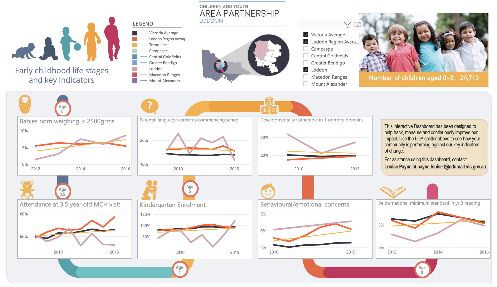
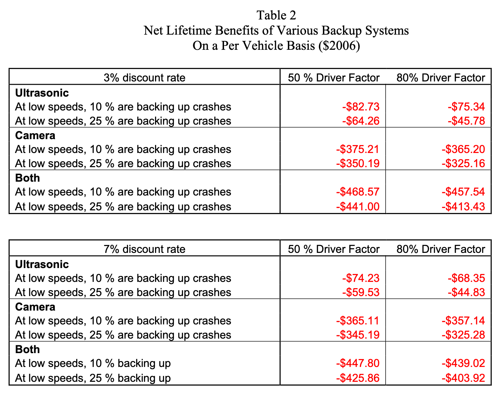
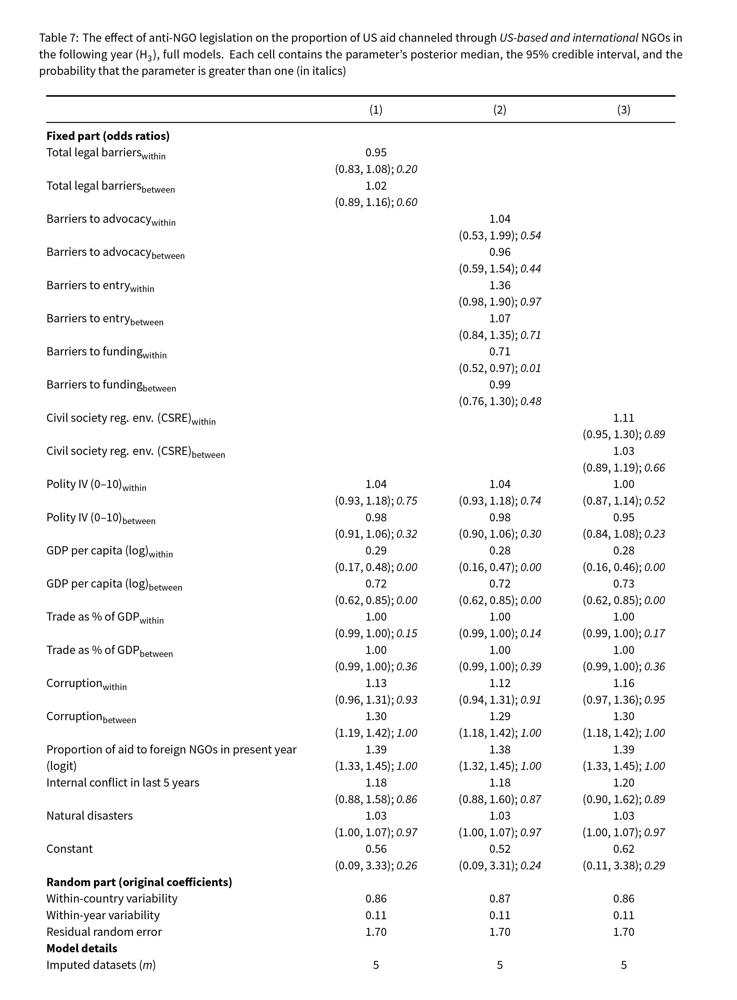
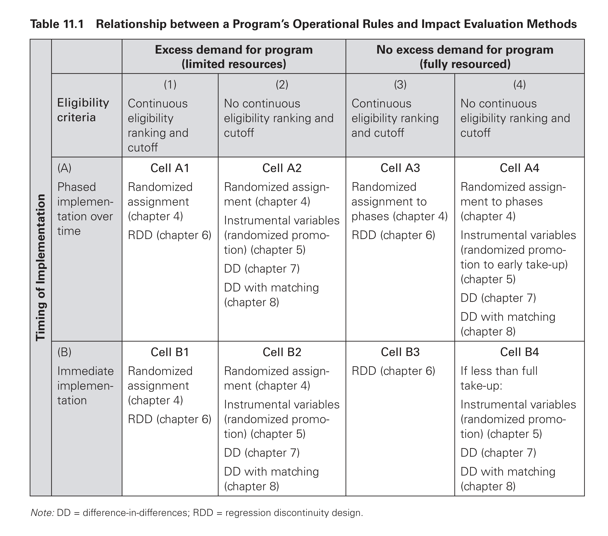
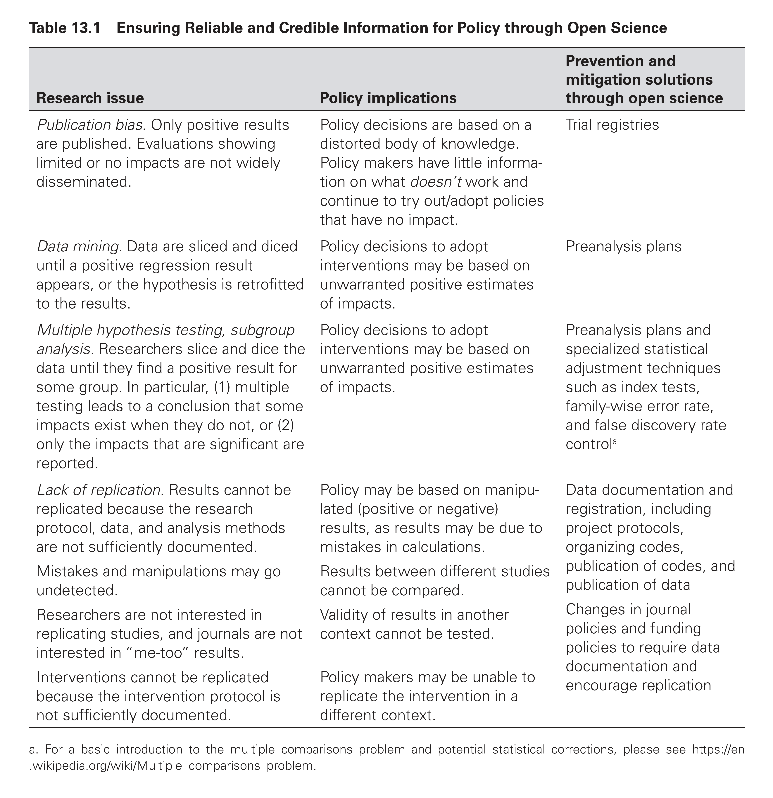

```{r setup, include=FALSE}
knitr::opts_chunk$set(warning = FALSE, message = FALSE, 
                      fig.retina = 3, fig.align = "center")
```

```{r packages-data, include=FALSE}
library(tidyverse)
library(modelsummary)
```

```{r xaringanExtra, echo=FALSE}
xaringanExtra::use_xaringan_extra(c("tile_view"))
```

class: center middle main-title section-title-7

# Choosing and planning<br>ethical evaluations

.class-info[

**Session 13**

.light[PMAP 8521: Program evaluation<br>
Andrew Young School of Policy Studies
]

]

---

name: outline
class: title title-inv-8

# Plan for today

--

.box-4.medium.sp-after-half[Types of evaluations]

--

.box-1.medium.sp-after-half[Model- and design-based inference]

--

.box-6.medium.sp-after-half[Ethics and open science]

---

layout: false
name: types-evaluations
class: center middle section-title section-title-4 animated fadeIn

# Types of evaluations

---

class: title title-4

# Types of evaluation

.box-inv-4.sp-after[In this class we've focused on one type of evaluation]

--

.box-4.medium[Impact evaluation]

.box-4.small.sp-after[Checking to see if the program causes outcomes]

--

.box-inv-4[There are lots of others!]

--

.box-inv-4[Each type focuses on a specific part of a logic model]

---

.center[
<figure>
  
</figure>
]

---

layout: true
class: title title-4

---

# Needs assessment

.box-inv-4.medium[Formative evaluation / needs assessment]

--

.box-inv-4.sp-after[Is the program needed?<br>What inputs and activities does it need?<br>What outcomes does it need to cause?]

--

.box-4[Use interviews, surveys, focus groups with target population]

--

.box-4[Do *before* starting the program or when considering changes]

---

# Process evaluation and monitoring

.box-inv-4.medium[Process evaluation / program monitoring]

--

.box-inv-4.sp-after[Are inputs going to the right places?<br>Are the activities working correctly?<br>Are activities producing right levels of outputs?]

--

.box-4[Use monitoring systems, benchmarks,<br>regular reports from within the program itself]

--

.box-4[Do *during* the program]

---

# Process evaluation and monitoring

.center[
<figure>
  
</figure>
]

???

Loddon Region Children and Youth Area Dashboard Partnership

<https://www.betterevaluation.org/en/evaluation-options/data_dashboard>

---

# Outcome evaluation

.box-inv-4.medium[Outcome evaluation]

--

.box-inv-4.sp-after[Are activities and outputs leading to *initial* outcomes?<br>(basically a short-term impact evaluation)]

--

.box-4[Use surveys, interviews, etc. with target population]

--

.box-4[Do *during* the program]

---

# Cost-benefit analysis

.box-inv-4.medium[Economic evaluation / cost-benefit analysis]

--

.box-inv-4.sp-after[Is the program worth it?<br>Do the benefits of helping the target population<br>outweigh the costs of running the program?]

--

.box-4.SMALL[Monetize all program costs and benefits, apply a discount factor, convert all costs to net present value, subtract NPV of costs from NPV of benefits]

--

.box-4[Do *during* or at the end of the program]

---

# Cost-benefit analysis

.center[
<figure>
  
</figure>
]

???

<https://www.nhtsa.gov/sites/nhtsa.dot.gov/files/nhtsa-2006-25579-0002.pdf>

---

# Impact evaluation

.box-inv-4.medium[Impact evaluation]

--

.box-inv-4.sp-after[Does the program cause lasting change?<br>(What we did this semester)]

--

.box-4[Use causal inference tools]

--

.box-4[Do *during* or at the end of the program]

---

# Impact evaluation

<figure>
  
</figure>

---

# Types of evaluation

.box-inv-4[Needs assessment]

.box-inv-4[Process evaluation and monitoring]

.box-inv-4[Outcome evaluation]

.box-inv-4[Cost-benefit analysis]

.box-inv-4.sp-after[Impact evaluation]

--

.box-4.medium[You can take entire classes for just one type!]

---

layout: false
name: model-design-inference
class: center middle section-title section-title-1 animated fadeIn

# Model- and<br>design-based<br>inference

---

layout: true
class: title title-1

---

# Choosing a method

--

.box-inv-1[We just learned a *ton* of different methods for causal inference!]

--

.float-left.center[.box-1[DAGs] .box-1[Matching] .box-1[Inverse probability weighting]]

--

.float-left.center[.box-1[Randomized controlled trials] .box-1[Difference-in-differences]]

--

.float-left.center[.box-1[Regression discontinuity] .box-1[Instrumental variables]]

--

.box-inv-1.medium.sp-before[How do you know<br>which one to use and when?]

---

# Identification strategies

.box-inv-1.small.sp-after[The goal of *all* these methods is to isolate<br>(or **identify**) the arrow between treatment → outcome]

--

.box-inv-1.less-medium[Model-based identification]

.float-left.center[.box-1[DAGs] .box-1[Matching] .box-1[Inverse probability weighting]]

--

.box-inv-1.less-medium.sp-before[Design-based identification]

.float-left.center[.box-1[Randomized controlled trials] .box-1[Difference-in-differences]]

.float-left.center[.box-1[Regression discontinuity] .box-1[Instrumental variables]]

---

# Model-based identification

.box-inv-1[Use a DAG and *do*-calculus to isolate arrow]

.pull-left[
<figure>
  
</figure>
]

.pull-right[
.box-1[Core assumption:<br>selection on observables]

.box-inv-1.small[Everything that needs to<br>be adjusted is measurable;<br>no unobserved confounding]

.box-inv-1.small[**Big assumption!**]

.box-inv-1.tiny[This is why lots of people don't like DAG-based adjustment]
]

---

# Design-based identification

.box-inv-1[Use a special situation to isolate arrow]

.pull-left[
.box-1[RCTs]

.box-inv-1.small[Use randomization<br>to remove confounding]

.center[
<figure>
  
</figure>
]
]

--

.pull-right[
.box-1[Difference-in-differences]

.box-inv-1.small[Use before/after & treatment/control<br>differences to remove confounding]

.center[
<figure>
  
</figure>
]
]

---

# Design-based identification

.box-inv-1[Use a special situation to isolate arrow]

.pull-left[
.box-1[Regression discontinuity]

.box-inv-1.small[Use cutoff<br>to remove confounding]

.center[
<figure>
  
</figure>
]
]

--

.pull-right[
.box-1[Instrumental variables]

.box-inv-1.small[Use instrument<br>to remove confounding]

.center[
<figure>
  
</figure>
]
]

---

# Which kind is better?

.pull-left[
.box-inv-1.SMALL[Model-based advantages]

.box-1.small[You don't need to wait for<br>a special circumstance to emerge!]

.box-1.small[Use existing datasets]

<hr>

.box-inv-1.SMALL[Model-based disadvantages]

.box-1.small[The DAG has to be super correct]

.box-1.small[You can't adjust your way<br>out of unobserved confounding]
]

--

.pull-right[
.box-inv-1.SMALL[Design-based advantages]

.box-1.small[Unobserved confounding<br>is less of a problem!]

<hr>

.box-inv-1.SMALL[Design-based disadvantages]

.box-1.small[You need a specific situation]

.box-1.small[You need randomization,<br>treatment/control+before/after,<br>some arbitrary cutoff,<br>or some obscure instrument]
]

---

# Controlling for stuff

.pull-left[
.box-inv-1.SMALL[It's *super* tempting to<br>throw a bunch of control<br>variables in a model]

.box-1.smaller.sp-after[This is likely what you did in past stats classes!]

.box-inv-1.SMALL.sp-after[It's *super* tempting to interpret<br>each of those coefficients]

.box-1.medium[Don't!]
]

.pull-right.center[

<figure>
  
</figure>

]

---

# Controlling for stuff

--

.box-inv-1[When focusing on isolating the treatment → outcome arrow,<br>arrows between/from other nodes are less meaningful]

--

.box-inv-1.sp-after[You also don't pick up their full effects!]

--

.box-1["[E]ven valid controls are often correlated with<br>other unobserved factors, which renders their marginal<br>effects uninterpretable from a causal inference perspective"<br>.small[(Hünermund and Louw 2020, p. 2)]]

---

# Controlling for stuff

<table>
  <tr>
    <th class="cell-left">Method</th>
    <th>Controls</th>
    <th>Minimum model</th>
  </tr>
  <tr>
    <td class="cell-left">Matching/IPW</td>
    <td class="cell-center" style="font-size: 0.7em;">Use for matching,<br>propensity scores</td>
    <td class="cell-left"><code style="font-size: 0.5em;">outcome ~ treatment, matched_data<br>outcome ~ treatment, weights</code></td>
  </tr>
  <tr>
    <td class="cell-left">RCTs</td>
    <td class="cell-center" style="font-size: 0.7em;">Not really necessary</td>
    <td class="cell-left"><code style="font-size: 0.5em;">outcome ~ treatment</code></td>
  </tr>
  <tr>
    <td class="cell-left">Diff-in-diff</td>
    <td class="cell-center" style="font-size: 0.7em;">Not really necessary,<br>use if DAG says to</td>
    <td class="cell-left"><code style="font-size: 0.5em;">outcome ~ treatment + after + treatment*after</code></td>
  </tr>
  <tr>
    <td class="cell-left">RDD</td>
    <td class="cell-center" style="font-size: 0.7em;">Not really necessary</td>
    <td class="cell-left"><code style="font-size: 0.5em;">outcome ~ running_var + cutoff</code></td>
  </tr>
  <tr>
    <td class="cell-left">IV</td>
    <td class="cell-center" style="font-size: 0.7em;">Not really necessary,<br>use if DAG says to</td>
    <td class="cell-left"><code style="font-size: 0.5em;">treatment_hat ~ instrument<br>outcome ~ treatment_hat</code></td>
  </tr>
</table>

---

# Guidelines

.box-inv-1.SMALL[Your choice of method depends on the situation + the available data]

.center[
<figure>
  
  <figcaption>Table 11.1 from <em>Impact Evaluation in Practice</em>, p. 191</figcaption>
</figure>
]

???

Table 11.1 on p. 191

Focus on recipients/beneficiaries - depends on resources. If everyone can use it (fully resourced), let people access it. Randomize in phases, use a cutoff, randomly promote, diff-in-diff. If not everyone can use it, use a lottery, or randomly promote, or use a cutoff

---

layout: false
name: ethics-open-science
class: center middle section-title section-title-6 animated fadeIn

# Ethics and open science

---

layout: true
class: title title-6

---

# Ethics of evaluating programs

.box-inv-6[Social programs are designed to help people]

--

.box-inv-6[In order to evaluate them, you need<br>some people to **not use the program**]

--

.box-inv-6.sp-after[Control groups are essential for causal inference!]

--

.box-6["Groups should not be excluded from an intervention that<br>is known to be beneficial solely for the purpose of an evaluation"<br>.small[(*Impact Evaluation in Practice*, p. 233)]]

---

# Ethical control groups

.center[
<figure>
  
  <figcaption>Table 11.1 from <em>Impact Evaluation in Practice</em>, p. 191</figcaption>
</figure>
]

---

# Ethical evaluation practices

.box-inv-6.medium[Follow IRB guidelines]

.center.float-left.small.sp-after[.box-6[Respect for persons] .box-6[Beneficence] .box-6[Justice]]

--

.box-inv-6.medium.sp-after[Make sure participants give informed consent]

--

.box-inv-6.medium[Maintain privacy]

.box-6.small[Any published data needs to be be de-identified]

???

- Respect = informed consent, autonomy
- Beneficence = no harm; maximize potential benefits, minimize potential harm
- Justice = benefits and burdens of research are fairly and equitably shared

---

# Ethical open science practices

.pull-left[
.box-inv-6.less-medium[Preregistration]

.box-6.small.sp-after[Prevents file drawer problem +<br>p-hacking]

.box-inv-6.less-medium[Preanalysis plan]

.box-6.small[Prevents p-hacking, data mining,<br>multiple hypothesis testing]
]

--

.pull-right[
.box-inv-6.less-medium[Replication]

.box-6.small.sp-after[Ensures that others can find<br>same results with your data]

.box-inv-6.less-medium[Documentation]

.box-6.small[Ensures that others know<br>what you're measuring]
]

---

layout: false

.center[
<figure>
  
  <figcaption>Table 13.1 from <em>Impact Evaluation in Practice</em>, p. 238</figcaption>
</figure>
]

---

class: title title-6

# Synthetic data

.box-inv-6[It feels weird to say that making fake data<br>helps with good open science practices!]

--

.box-6.sp-after[But it does!]

--

.box-inv-6[Make your pre-analysis plan based on simulated data]

--

.box-inv-6[Do whatever statistical shenanigans<br>you want with the fake data]
